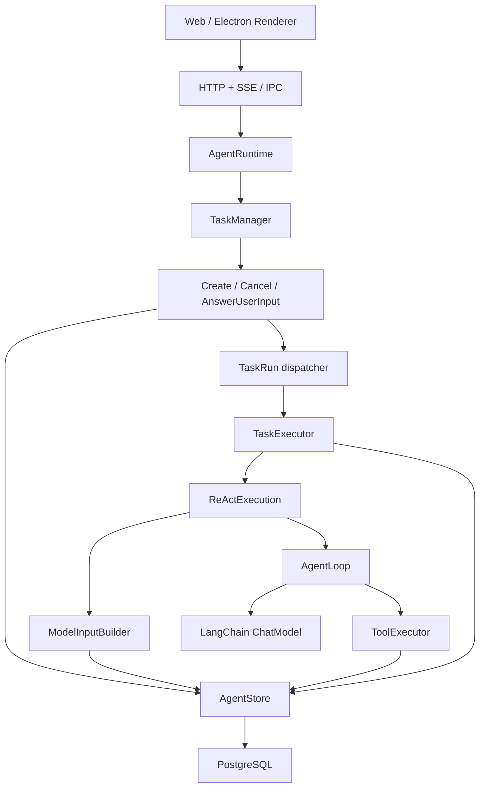

# 核心模型与架构

## 1. 设计目标

Runtime 采用最少的耐久实体表达事实，并让每一层只承担一种职责：

- Orchestration 只接收命令、调度链路和发布结果，不拼装模型上下文。
- Execution Worker 是“处理单条 TaskRun 命令”的可复制消费者，只负责取得执行权、续租、调用 ReAct 并上报结果。
- ReAct/Loop 只推进模型与工具协议，不直接承担业务恢复策略。
- Context 统一负责消息筛选、ToolCall/ToolMessage 配对、压缩和模型输入审计。
- Store 只执行明确的数据库查询与原子状态变更，不决定下一步业务动作。
- 数据库 fence 保证正确性，`AbortSignal` 只负责尽快停止本地执行。

正常执行只有一个业务驱动源：用户新消息创建新 Task。系统不提供 Task Retry、Continue-as-new 或通用 Resume；只有 HITL 回答可以继续同一个 Task。

```text
Session
  └─ Task
      ├─ TaskRun
      ├─ RuntimeMessage
      ├─ ToolCall
      ├─ UserInputRequest
      └─ ActivePlan
```

## 2. 依赖架构



`src/server/runtime/agent-application.factory.ts` 是唯一装配根：它创建数据库适配器、模型、工具、Context、执行器、编排器和事件总线。业务类只依赖端口，不自行寻找配置或构造基础设施。

## 3. 各实体的唯一职责

### Session

长期对话与共享工作区边界。一个 Session 最多有一个活动 Task、一个 ActivePlan 和一个 ContextCompaction。

### Task

一次用户目标。保存目标消息、业务状态和错误，不保存 worker、租约或重试来源。Task 失败或取消后，需要用户再发送一条消息创建新 Task，由模型根据上下文决定下一步。

### TaskRun

一次获得执行权的物理运行窗口。当前只有两种 trigger：首次执行的 `initial`，以及 HITL 回答后的 `user_input_answered`。运行中的 TaskRun 独占 `ownerId` 和 `ownershipExpiresAtMs`，承担租约与数据库 fence。

### RuntimeMessage

完整保存 Human、AI、Tool 和 System 消息。Tool 的可信结果只保存在 ToolMessage 中；ToolCall 通过 `resultMessageId` 关联结果消息。

### ToolCall

模型发出的一次工具意图，同时承载这次意图唯一一次真实执行的状态。`startedAtMs` 是“真实执行已经开始”的耐久证据；`sideEffectLevel` 决定中断后能否安全判断结果。系统不会为同一个 ToolCall 创建第二次执行尝试，模型若要再次调用工具，必须产生新的 ToolCall。

### UserInputRequest

模型通过 `request_user_input` 明确发起的暂停/继续协议。回答会写入 ToolMessage，并在全部请求完成时创建新的 TaskRun 继续同一个 Task。Runtime 不会自行创建 UserInputRequest。

### ActivePlan

Session 级单例，但由当前 Task 拥有。它只包含标题和 `step/status` 数组，通过 `update_plan` 更新；不进入消息时间线，Task 完成、失败或取消时与 Task 状态在同一事务中删除。

## 4. 事实来源

| 信息 | 唯一事实来源 |
|---|---|
| 用户目标与模型回复 | `agent_messages` |
| 工具最终结果或 HITL 回答 | `agent_messages` 中的 ToolMessage |
| Task 当前业务状态 | `agent_tasks` |
| 每次执行窗口、租约与 fence | `agent_task_runs` |
| 工具意图与唯一执行状态 | `agent_tool_calls` |
| 待回答的人机交互 | `agent_user_input_requests` |
| 当前计划 | `agent_active_plans` |
| 模型实际输入 | `agent_model_calls.input_messages` |
| 历史压缩缓存 | `agent_context_compactions` |

原始 Message 不因压缩或中断而修改或删除。数据库只保存已经发生的事实；“下一步做什么”由用户消息、HITL 回答和模型共同决定。
