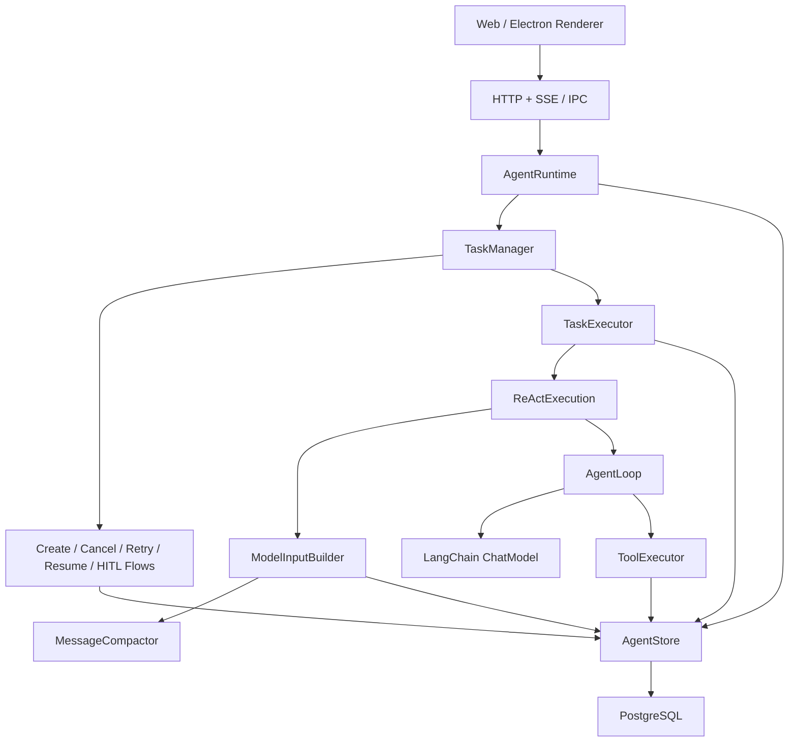

# 核心模型与架构

## 1. 设计目标

Runtime 需要同时满足流式 ReAct、工具调用、人工输入、崩溃恢复、上下文压缩、审计和刷新后一致性。实现采用“逻辑对象 + 物理运行记录 + 消息事实”的分层：业务状态不承载执行权，执行历史不重复保存消息结果。

```text
Session
  └─ Task
      ├─ TaskRun
      ├─ RuntimeMessage
      ├─ ToolCall
      │   └─ ToolRun
      └─ ActivePlan
```

## 2. 依赖架构



`src/server/runtime/agent-application.factory.ts` 是唯一装配根：它创建数据库适配器、模型、工具、Context、执行器、编排器和事件总线。业务类只依赖端口，不负责寻找配置或构造基础设施。

## 3. 各实体的唯一职责

### Session

长期对话与共享工作区边界。一个 Session 最多存在一个活动 Task、一个 ActivePlan 和一个 ContextCompaction。

### Task

一次用户目标。保存目标消息、业务状态、错误和重试来源，不保存执行进程的 owner 或过期时间。Retry 会创建新 Task，并通过 `retryOfTaskId` 形成来源链。

### TaskRun

一次获得执行权的物理运行窗口。首次执行、HITL 回答后继续、输入过期后继续、人工恢复都会创建新 TaskRun。`ownerId` 和 `ownershipExpiresAtMs` 只存在于运行中的 TaskRun。

### RuntimeMessage

完整保存 LangChain 语义的 Human、AI、Tool 和 System 消息。Tool 的最终输出只保存在 ToolMessage 中；ToolCall 仅通过 `resultMessageId` 关联它。

### ToolCall / ToolRun

ToolCall 是模型发出的一次逻辑意图，跨恢复保持身份不变。ToolRun 是某个 TaskRun 中的一次物理执行。可安全重放的调用会产生新 ToolRun；有副作用且结果未知的调用进入 `outcome_unknown`，不会自动执行第二次。

### ActivePlan

Session 级单例，但由当前 Task 拥有。它只包含标题和 `step/status` 数组，通过 `update_plan` 更新；不进入消息时间线，Task 完成、失败或取消时与 Task 状态在同一事务中删除。

## 4. 事实来源

| 信息 | 唯一事实来源 |
|---|---|
| 用户目标与模型回复 | `agent_messages` |
| 工具最终结果 | `agent_messages` 中的 ToolMessage |
| Task 当前业务状态 | `agent_tasks` |
| 每次执行窗口与执行权 | `agent_task_runs` |
| 模型逻辑工具意图 | `agent_tool_calls` |
| 每次物理工具执行 | `agent_tool_runs` |
| 当前计划 | `agent_active_plans` |
| 模型实际输入 | `agent_model_calls.input_messages` |
| 历史压缩缓存 | `agent_context_compactions` |

原始 Message 不因压缩、重试或恢复而修改或删除。

