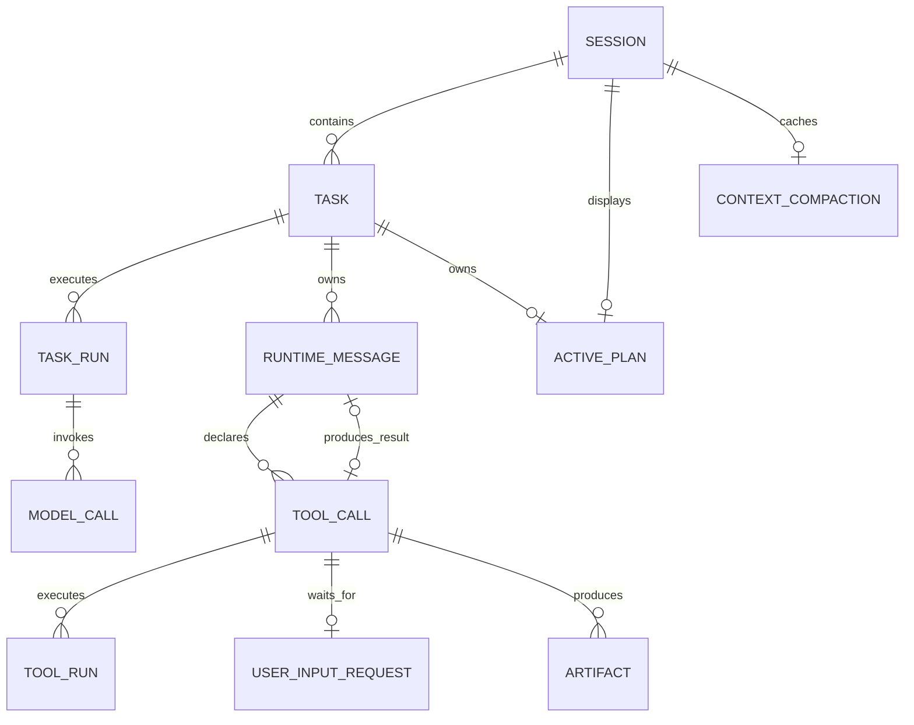
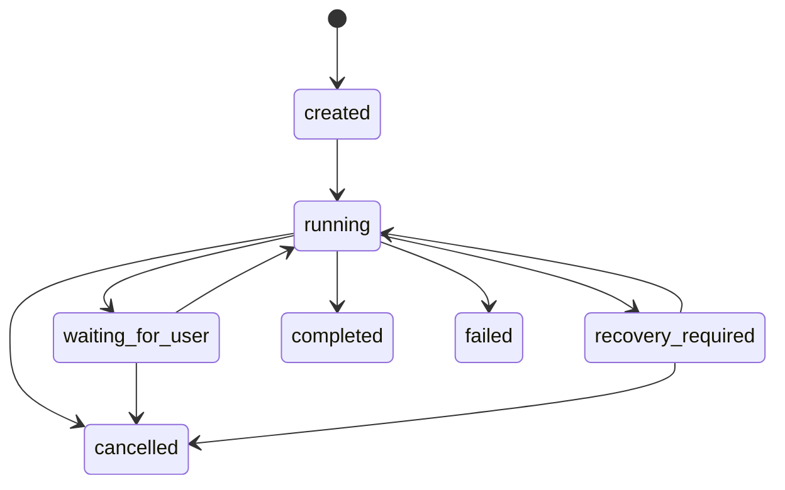
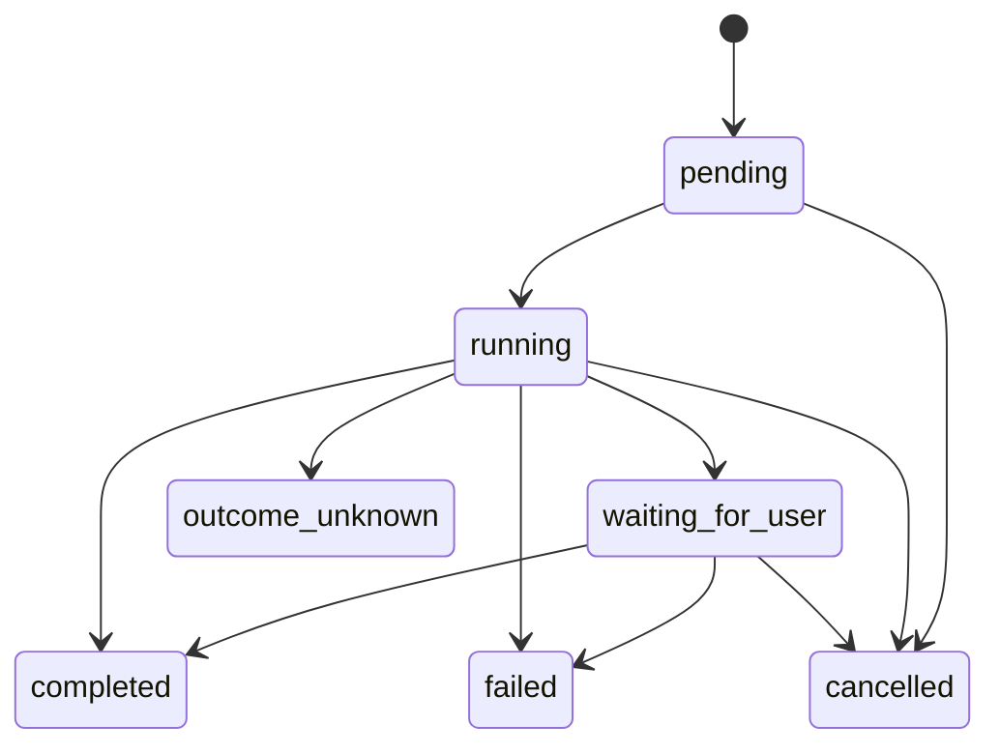

# 数据库与状态机

## 1. 关系模型

数据库没有增量 migration 链。`src/storage/postgres/schema.ts` 是唯一 schema；重建命令会删除当前 schema 下所有 `agent_*` 表后一次性创建目标表。

## 2. 表职责

| 表 | 主键/关键约束 | 作用 |
|---|---|---|
| `agent_sessions` | `id` | 对话与工作区 |
| `agent_tasks` | `id`；每 Session 仅一个活动 Task | 用户目标与业务终态 |
| `agent_task_runs` | `id`；`unique(task_id, run_no)` | 物理执行窗口与执行权 |
| `agent_messages` | `row_id` 顺序；`id` 唯一 | LangChain 消息事实 |
| `agent_task_checkpoints` | `unique(task_id, sequence_no)` | ReAct 恢复位置 |
| `agent_tool_calls` | `unique(task_id, model_tool_call_id)` | 逻辑工具调用 |
| `agent_tool_runs` | `unique(tool_call_id, run_no)` | 物理工具执行历史 |
| `agent_active_plans` | `session_id` 主键；`task_id` 唯一 | 当前临时计划 |
| `agent_artifacts` | 逻辑路径 + revision | 工具生成的资源索引 |
| `agent_user_input_requests` | `tool_call_id` 唯一 | 等待用户输入 |
| `agent_context_compactions` | `session_id` 主键 | 单调推进的摘要缓存 |
| `agent_model_calls` | `unique(task_run_id, logical_call_key)` | 模型输入输出审计 |
| `agent_model_usage_stats` | `session_id` 主键 | 聚合 Token 用量 |

## 3. Task 状态机

活动状态是 `created/running/waiting_for_user/recovery_required`。数据库部分唯一索引保证同一 Session 不会并发推进两个活动 Task。Task 没有“正在恢复”状态：恢复原因属于新 TaskRun 的 trigger。

## 4. TaskRun 状态机

TaskRun trigger：

- `initial`：Task 首次启动。
- `user_input_answered`：最后一个待回答请求被回答。
- `input_expired`：最后一个待回答请求过期。
- `manual_resume`：用户确认从中断点恢复。

TaskRun 状态：`running/paused/completed/failed/interrupted/cancelled`。只有 `running` 可携带 owner 和 ownership 到期时间；终态必须清空执行权并写入 `endedAtMs`。

## 5. ToolCall 与 ToolRun

每次从 `pending` 开始执行会插入 ToolRun(`running`)；随后 ToolRun 和 ToolCall 一起进入对应终态。`completed/failed` 的 ToolCall 必须关联 ToolMessage；`outcome_unknown` 表示外部副作用可能已发生但没有可信结果，必须人工处理。

