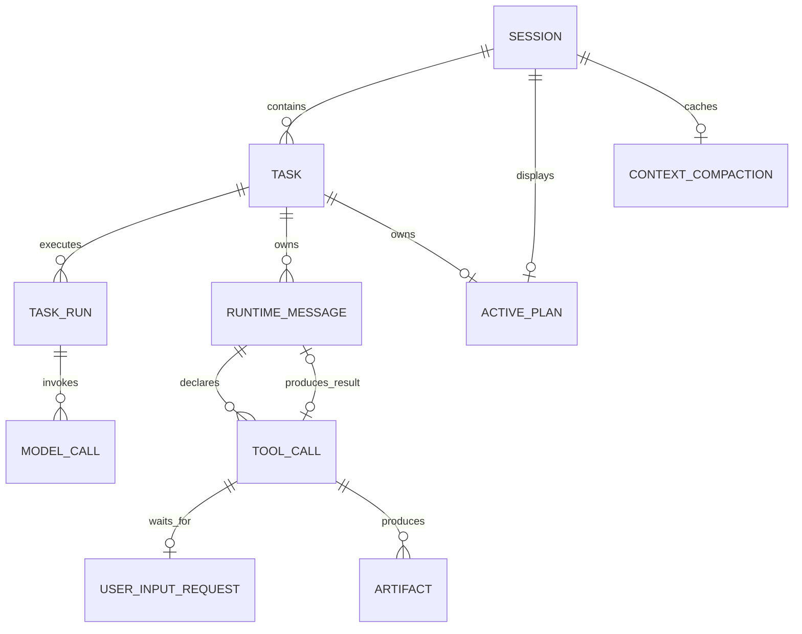
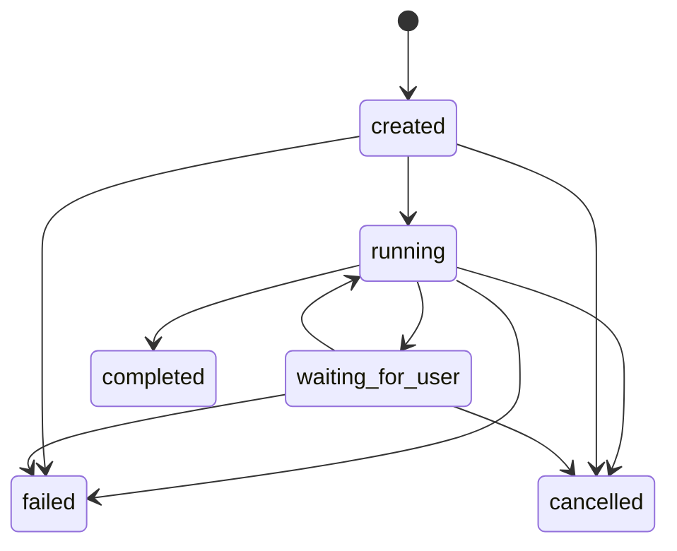
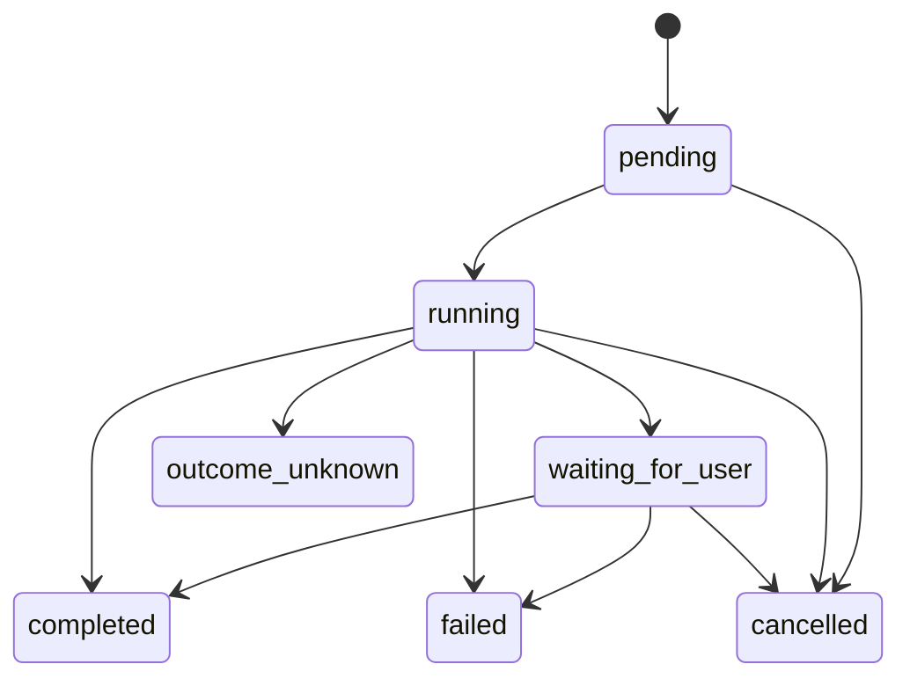

# 数据库与状态机

## 1. 关系模型

数据库没有增量 migration 链。`src/storage/postgres/schema.ts` 是唯一 schema；重建命令会删除当前 schema 下所有 `agent_*` 表后一次性创建目标表。

## 2. 表职责

| 表 | 主键/关键约束 | 作用 |
|---|---|---|
| `agent_sessions` | `id` | 对话与工作区 |
| `agent_tasks` | `id`；每 Session 仅一个活动 Task | 用户目标与业务终态 |
| `agent_task_runs` | `id`；`unique(task_id, run_no)` | 执行窗口、租约与 fence |
| `agent_messages` | `row_id` 顺序；`id` 唯一 | LangChain 消息事实 |
| `agent_tool_calls` | `unique(task_id, model_tool_call_id)` | 工具意图与唯一执行状态 |
| `agent_active_plans` | `session_id` 主键；`task_id` 唯一 | 当前临时计划 |
| `agent_artifacts` | 逻辑路径 + revision | ToolCall 结果生成的资源索引 |
| `agent_user_input_requests` | `tool_call_id` 唯一 | HITL 请求与答案状态 |
| `agent_context_compactions` | `session_id` 主键 | 单调推进的摘要缓存 |
| `agent_model_calls` | `unique(task_run_id, logical_call_key)` | 模型输入输出审计 |
| `agent_model_usage_stats` | `session_id` 主键 | 聚合 Token 用量 |

重复保存父级 ID 的表使用组合外键校验完整归属链：Task 必须属于同一 Session；TaskRun、Message 和 ToolCall 必须属于同一 Task；Artifact 必须同时匹配 ToolCall 与结果 Message。命令层校验负责给出业务错误，数据库约束是最终防线。

数据库不保存独立 Checkpoint。Task/TaskRun/ToolCall/UserInputRequest 已经表达状态边界；Task 级模型调用额度和工具调用额度分别从 `agent_model_calls(call_type='task.react')` 与 `agent_tool_calls` 精确统计，避免维护一份会漂移的重复进度。

## 3. Task 状态机

活动状态只有 `created/running/waiting_for_user`。数据库部分唯一索引保证同一 Session 不会并发推进两个活动 Task。`failed/cancelled` 不会自动回到 `running`；继续工作需要新的用户消息，HITL 回答除外。

## 4. TaskRun 状态机

TaskRun trigger：

- `initial`：用户消息创建的 Task 首次启动。
- `user_input_answered`：最后一个待回答请求被回答。

TaskRun 状态为 `running/paused/completed/failed/interrupted/cancelled`。只有 `running` 可携带 owner 和租约到期时间；其他状态必须清空执行权并写入 `endedAtMs`。`paused` 只表示正在等待 HITL，不是通用恢复入口。

## 5. ToolCall 状态机

`pending -> running` 只允许发生一次。开始和完成都必须在事务中校验当前 TaskRun 的 owner 与未过期租约；失去所有权的旧 Worker 无法提交结果。

`completed` 必须关联 ToolMessage。正常的 `failed` 也会写失败 ToolMessage；服务崩溃时可能只有 `startedAtMs` 而没有原始结果，重启对账会将只读/幂等 ToolCall 标为 `failed`，Context 排除不完整的 ToolCall/ToolMessage 配对。

已开始的 `side_effecting` ToolCall 若没有可信结果则进入 `outcome_unknown`，创建 `side_effect_confirmation`，不自动重放。Artifact 只关联 ToolCall 与产生它的结果 Message，不再存在额外的工具执行尝试实体。
