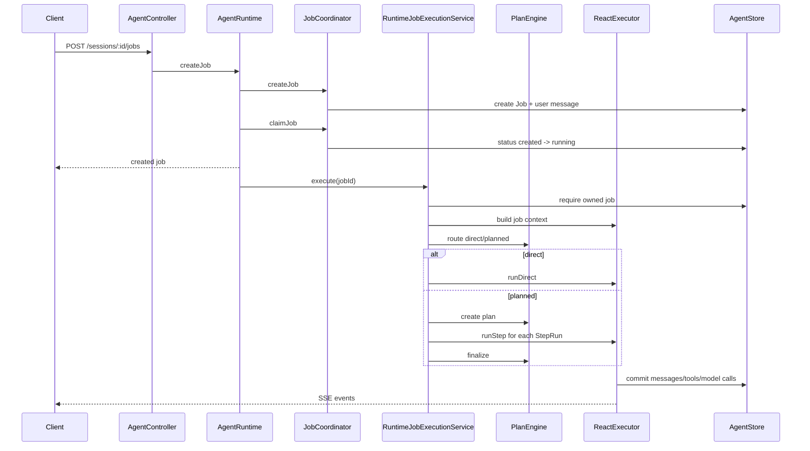

# 01. 整体架构设计

## 目标

本项目要提供一个可恢复、可审计、可调试的 Agent Runtime。它不是只负责调用一次模型，而是负责完整生命周期：

1. 接收用户目标。
2. 创建并持久化 Job。
3. 判断 direct 或 planned 执行策略。
4. 构建模型 Context。
5. 调用模型和工具。
6. 处理 HITL 输入等待。
7. 输出前端可消费的 SessionView。
8. 支持事后查看每次模型调用的 Context。

## 核心领域对象

| 对象 | 作用 | 用户可见性 |
| --- | --- | --- |
| Session | 会话容器，聚合多个 Job 和消息 | 可见 |
| Job | 一次用户目标或重试目标 | 可见 |
| Plan | planned Job 的执行计划 | 可见 |
| PlanStep | 计划中的步骤定义 | 可见 |
| StepRun | 某个步骤的一次实际执行 | 可见 |
| Message | 用户、助手、工具、系统消息事实源 | 部分可见 |
| ToolInvocation | 工具调用状态、幂等键、结果 | 可见 |
| UserInputRequest | 等待用户输入或审批 | 可见 |
| ModelCall | 每次模型调用的审计记录 | Debug 可见 |
| ContextSummary | 长会话压缩摘要 | Debug 可见 |

## 模块职责

### `AgentRuntime`

位置：`src/orchestration/agent-runtime.ts`

`AgentRuntime` 是 API 层面对业务的 facade。它负责：

- 创建 Session。
- 创建 Job 并追加用户消息。
- cancel / retry Job。
- 接收用户输入回答。
- 加载 SessionView。
- 删除 Session 并清理 sandbox。
- 发布 `job.upserted`、`message.upserted`、`user_input.upserted` 等事件。

它不直接执行模型循环。创建 Job 后，它只负责 claim Job，然后调度 `JobExecutionService.execute(jobId)`。

### `JobCoordinator`

位置：`src/runtime/job-coordinator.ts`

`JobCoordinator` 是 Job 状态变更的统一门面。它把幂等、lease、version、重试、用户输入恢复等存储操作封装成运行时语义。

关键职责：

- `createJob`：写入用户消息和 Job。
- `claimJob`：把 Job 从 `created` 变为 `running`，绑定 `workerId` 和 `attemptId`。
- `renewJobLease`：执行期间续约。
- `cancelJob`：按 expectedVersion 取消。
- `retryJob`：基于失败 Job 创建重试 Job。
- `answerInput`：回答 HITL 请求，并在需要时 claim resume。

### `RuntimeJobExecutionService`

位置：`src/server/runtime/job-execution.service.ts`

它是真正的执行入口。一次 Job 执行分成：

1. 检查当前 worker 是否拥有 Job lease。
2. 读取原始用户目标。
3. 构建 job execution context。
4. 让 Planner 决定 `direct` 或 `planned`。
5. `direct` 进入 `DirectJobExecutor`。
6. `planned` 进入 `PlanExecutor`，逐个 StepRun 执行。
7. 通过 heartbeat 续租，异常时只在仍持有 lease 时写失败状态。

### Planner / Direct / Planned 执行

`PlanEngine` 负责三类模型调用：

- `planner.route`：判断是否需要计划。
- `planner.create`：生成 Plan 和 PlanStep。
- `plan.finalize`：汇总计划执行结果。

`DirectJobExecutor` 执行普通 ReAct Job。

`PlanExecutor` 执行 planned Job 的步骤循环：

- 查找 active StepRun。
- 如果没有 active StepRun，则创建下一个 StepRun。
- 调用 `StepExecutor` 执行当前步骤。
- 如果等待用户输入，退出循环。
- 如果步骤失败且不重试，退出循环。
- 如果所有步骤完成，进入 finalizing。

### `ReactExecutor`

位置：`src/runtime/executors/react-executor.ts`

`ReactExecutor` 把 Context、模型、工具和事件写入器组装起来：

- `runDirect`：构建 job context，启动 `AgentRunner`。
- `runStep`：构建 step context，启动 `StepRunner`。
- `buildContext`：调用 `ContextBuildService`，必要时触发压缩后重建。
- `createAuditedModel`：包装 LangChain model，保存 `agent_model_calls` 审计。

### `AgentLoop`

位置：`src/agent-loop/agent-loop.ts`

`AgentLoop` 是模型交互循环。它不关心 Postgres，也不直接处理 Job 状态；它产生标准 LoopEvent：

- streaming delta。
- model output completed。
- tool result completed / failed。
- tool input required。

这些事件由 `RuntimeEventWriter` 持久化并发布。

## 一次 Job 的完整生命周期

## 状态边界

Job 状态：

- `created`：已创建但未 claim。
- `running`：worker 正在执行。
- `waiting_user_input`：等待用户输入，释放执行循环。
- `resuming`：用户已回答，等待恢复执行。
- `completed`：最终输出完成。
- `failed`：运行时失败。
- `cancelled`：用户取消。

Job stage：

- `routing`：还未确定执行策略。
- `direct_execution`：直接 ReAct 执行。
- `planning`：创建计划。
- `step_execution`：执行 PlanStep。
- `finalizing`：汇总 planned Job。

设计约束：

- 同一 Session 同一时间只能有一个 active Job。
- active Job 必须有 lease owner 和 lease expiry。
- terminal Job 必须有 `completed_at_ms`。
- 写状态必须带 expectedVersion，避免并发覆盖。

## 错误和恢复原则

1. API 层只做参数校验和异常映射。
2. Runtime 写入必须经过 Store 的事务方法。
3. worker 失联后，lease 到期的 Job 可以被恢复流程接管。
4. ToolInvocation 使用 `job_id + tool_call_id` 和 `job_id + idempotency_key` 防重。
5. ModelCall 如果停留在 `started`，服务启动时通过 `abandonStartedModelCalls` 标记为非活跃状态。
6. 前端实时事件不是事实源，断线后重新拉 `SessionView` 即可恢复。

