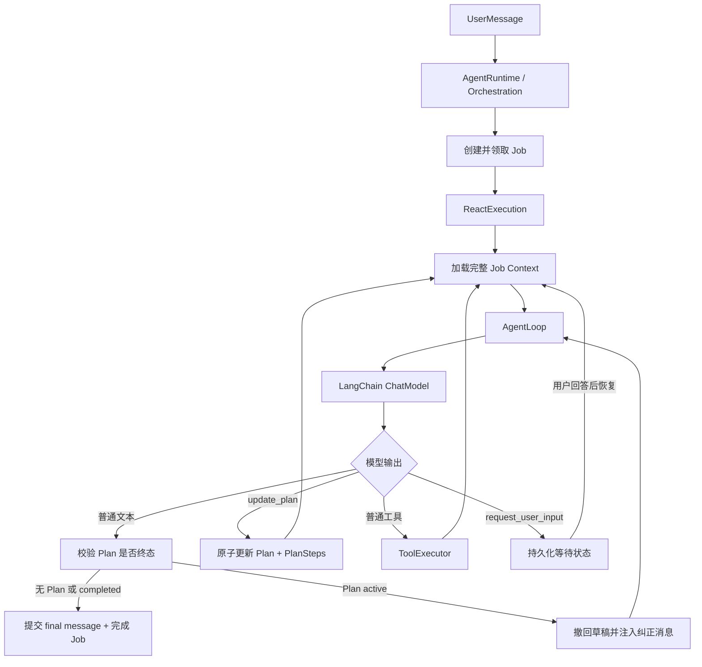
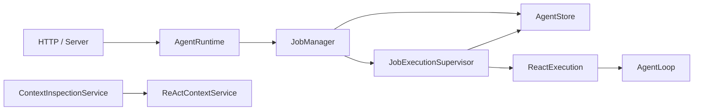

# 统一 ReAct Runtime

## 1. 核心决定

一个用户轮次创建一个 `Job`，一个 Job 只运行一个 ReAct 循环。简单任务直接回答；复杂任务由同一个模型调用 `update_plan` 建立或更新持久化 Plan，然后继续调用普通工具。Plan 是执行过程中的业务事实，不是第二套嵌套执行器。



## 2. 职责边界

### Orchestration

`src/orchestration` 只负责跨组件生命周期：

- `AgentRuntime` 是 HTTP 使用的应用入口，处理 Session，并将 Job 命令委托给 `JobManager`。
- `JobManager` 组织创建、取消、Retry、Resume、HITL 和对应 SSE，不管理进程内执行。
- `JobExecutionSupervisor` 管理恢复扫描、活动执行、AbortController、所有权续期，并组合 Runtime。
- `AgentStore` 提供 Job 状态迁移所需的原子持久化命令；编排层不实现 SQL。
- `ContextInspectionService` 是独立的只读调试查询，不参与正式 Job 执行。

依赖方向固定为：



`runtime` 不依赖 `orchestration`。`ReactExecution` 只通过
`JobExecutionStatePort` 请求查询、失败和取消 Job，具体实现由编排层注入。

Server 是 composition root：它创建 `JobExecutionSupervisor`，再将其交给
`JobManager`，最后只把 `JobManager` 注入 `AgentRuntime`。Job 状态事务由
`AgentStore` 保证，调度状态不会混入持久化层。

### Runtime

`src/runtime` 负责一次 Job 的执行机制：

- `ReactExecution` 装配模型、工具、审计、Context 和 AgentLoop。
- `executeDurableAgentLoop` 消费 LoopEvent，并保证事件先持久化再继续执行。
- `RuntimeEventWriter` 提交消息、工具结果、HITL 和 final，再发布 SSE。
- `AuditedChatModel` 包装 LangChain Runnable，记录每次真实模型输入和结果。

### AgentLoop

`src/agent-loop` 只负责 ReAct 协议：

- LangChain 流式响应与 tool call assembly。
- 工具调用上限、迭代上限、deadline 和 abort。
- exclusive tool 协议。
- final 候选校验和可恢复纠正。
- 通过事件把所有持久化工作交给 RuntimeEventWriter。

### Storage

Storage 负责并发、版本和业务不变量。模型不能传数据库版本号；`update_plan` 工具读取当前 Plan version，再调用原子事务。

## 3. Plan 工具协议

`update_plan` 是 LangChain `DynamicStructuredTool`，并标记为 `exclusive` 和 `idempotent`。

每次调用必须发送完整 Plan：

```ts
interface UpdatePlanInput {
  title: string;
  explanation?: string;
  steps: Array<{
    key: string;
    title: string;
    description?: string;
    status: 'pending' | 'in_progress' | 'completed' | 'failed' | 'skipped';
    result?: {
      summary?: string;
      evidenceMessageIds?: string[];
      artifactIds?: string[];
    };
  }>;
}
```

不变量：

1. Step `key` 创建后保持稳定。
2. 只要还有非终态步骤，必须恰好一个 `in_progress`。
3. 首次调用若全部为 `pending`，工具自动把第一个 pending 规范化为 `in_progress`。
4. 已存在步骤不能从完整 Plan 中消失；不再需要时标记 `skipped`。
5. `completed`、`failed`、`skipped` 步骤不可回退或改写。
6. 所有步骤为 `completed/skipped` 时 Plan 为 `completed`。
7. 所有步骤终态且至少一个 `failed` 时 Plan 为 `failed`。
8. 同一 tool call 通过 `lastToolCallId` 幂等重放，不重复推进 version。

## 4. 模型偏差的恢复

模型输出不是可信状态转换指令，Runtime 必须校验。

### 未完成 Plan 时提前 final

1. 文本 delta 可以先通过 SSE 展示为草稿。
2. final 候选提交前读取持久化 Plan。
3. Plan 仍 active 时发布 `message.discarded`，前端移除对应 delta。
4. Runtime 向下一次模型调用追加“上次输出被拒绝”的 AI/Human 纠正消息。
5. 模型必须先单独调用 `update_plan` 收口，再次输出 final。

### update_plan 与其他工具混合调用

整批调用不落库、不执行，发布 `message.discarded` 后要求模型重发。它属于可恢复的协议偏差；只有持续偏离并耗尽 `maxIterations` 才导致 Job 失败。

### Plan 失败或取消

失败/取消 Plan 不允许提交成功 final。Runtime 返回 `invalid_plan_state`，Job 进入对应终态；不会伪装成成功回答。

## 5. HITL

`request_user_input` 仍是普通 ReAct 工具：

1. Assistant tool-call message 和 ToolInvocation 先持久化。
2. Tool 返回 `requires_user_input`。
3. Runtime 原子创建 UserInputRequest，并将 Job 标为 `waiting_user_input`。
4. 用户回答生成 ToolMessage 语义的消息；同一 Job 重新领取 lease 并恢复 ReAct。
5. 下一次 Context 从数据库重建，所以进程重启不丢失等待点。

## 6. Retry

Retry 创建新的 Job，并通过 `retryOfJobId` 归入同一 turn bundle。没有新的用户说明时不复制旧 HumanMessage；有补充说明时才追加一条新 HumanMessage。旧 Job 的消息保持不可变，新 Job 获得新的 attempt、ModelCall 和工具调用事实。

## 7. LangChain 边界

- 消息使用 `SystemMessage`、`HumanMessage`、`AIMessage`、`ToolMessage`。
- 模型通过 LangChain `BaseChatModel` / `Runnable` 调用。
- 工具使用 LangChain `StructuredToolInterface`。
- Runtime 自己实现 durable lifecycle、审计与投影，不复制 LangChain 的消息和工具协议。
