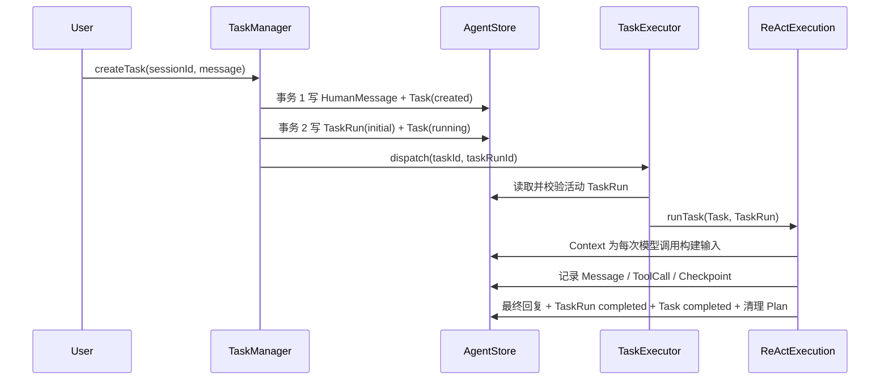

# 执行、中断对账与 HITL

## 1. 首次执行

创建事实与取得执行权是两个独立事务。若事务 1 已提交而事务 2 失败，客户端以同一 `clientRequestId` 再次提交时会解析出既有 Task；只有仍为 `created` 的 Task 才会再次尝试首次启动，不会重复写用户消息。

TaskExecutor 处理一条明确的 `(taskId, taskRunId)` 命令。它重新读取数据库状态，执行租约续期，并调用 ReActExecution；它只按 `taskRunId` 去重，不比较、替换或调度不同 TaskRun。将来扩展多进程时，由消息队列投递同一种 TaskRun 命令，消费者本身保持可复制。

## 2. 租约、fence 与本地停止

运行中的 TaskRun 保存 `ownerId + ownershipExpiresAtMs`。所有会产生耐久副作用的关键写入，例如开始 ToolCall、提交工具结果、等待输入和完成 Task，都在事务中重新校验：

1. Task 仍为 `running`。
2. TaskRun 仍为该 Task 的活动运行。
3. owner 与当前 Worker 一致。
4. 租约尚未过期。

续租避免活着的 Worker 被错误接管；数据库 fence 阻止失去所有权的旧 Worker 继续提交副作用。`AbortSignal` 只用于尽快停止本地模型或工具调用，不能替代数据库正确性，也不能撤销已经发生的外部副作用。

明确的 `TASK_OWNERSHIP_LOST` 会立即中止本地 loop。暂时性存储错误只在最后一次确认的租约仍有效时容忍；超过租约仍无法续期时，Worker 必须自我停止。

## 3. Checkpoint 的边界

Checkpoint 记录 `sequenceNo/phase/callMessageId/iterationNo/executedToolCalls`。主要 phase：

- `tool_batch`：Assistant tool-call 消息已经持久化。
- `waiting_for_user`：Task 正在等待 HITL。
- `ready_for_model`：HITL 回答完成，下一步重新调用模型。
- `completed/failed/cancelled`：Task 的终态边界。

Checkpoint 是 ReAct 内部的耐久游标，不是通用 Task Resume API。它不复制消息，也不能恢复进程内存或未知工具结果；Context 始终从 Message、ToolCall、Plan 和压缩记录重建模型输入。HITL 创建新 TaskRun 后只延续 `iterationNo/executedToolCalls` 配额计数，不从 Checkpoint 重放待执行 ToolCall。

Task 进入终态时，Store 在一个事务中收口 Task、TaskRun、活动 ToolCall、待处理 UserInputRequest、ActivePlan 和终态 Checkpoint。完成路径若仍存在活动子状态会拒绝提交，避免 Task=`completed` 但工具仍在运行。

## 4. 服务启动后的中断对账

服务启动时执行一次有界扫描，不持续轮询整个数据库。扫描只把不一致事实收敛到安全状态，不自动调度新 TaskRun：

- 长时间停在 `created` 的 Task：标记 `failed/execution_interrupted`。
- 租约过期的 TaskRun：标记 `interrupted` 并清空 owner。
- 已开始的 `read_only/idempotent` ToolCall：标记 `failed/execution_interrupted`，Task 失败，不自动重跑。
- 已开始且结果未知的 `side_effecting` ToolCall：标记 `outcome_unknown`，创建 `side_effect_confirmation`，Task 进入 `waiting_for_user`。
- 尚未开始的兄弟 ToolCall：取消。

只读工具的原始结果并不存在，因此系统不会伪造 ToolMessage。Context 会排除不完整的 Assistant ToolCall/ToolMessage 组。用户下一条消息是正常继续工作的唯一驱动，模型再根据当前上下文决定是否重新查询。

## 5. 普通 HITL

`request_user_input` 产生 kind=`tool_input` 的 UserInputRequest，一个 ToolCall 最多一个 Request。

触发时：

1. Assistant ToolCall Message 与 ToolCall 已落库。
2. ToolCall=`waiting_for_user`，Request=`pending`。
3. 当前 TaskRun=`paused`，Task=`waiting_for_user`，Checkpoint=`waiting_for_user`。

回答时：

1. 校验 Request version、`clientAnswerId` 和持久化 input schema。
2. Request=`answered`，答案写为 ToolMessage。
3. ToolCall=`completed` 并关联 `resultMessageId`。
4. 最后一个 pending Request 结束后，原子创建 TaskRun(`user_input_answered`)。
5. Task=`running`，追加 `ready_for_model` Checkpoint，再投递 TaskRun 命令。

输入过期时会写失败 ToolMessage，将 ToolCall、TaskRun 和 Task 收敛为失败，不创建新的 TaskRun，也不让模型自动继续。

## 6. 未知副作用确认

`side_effect_confirmation` 只询问事实，不承诺恢复原始 ToolResult。用户有三个选项：

- `confirmed_succeeded`：写入“用户确认已成功”的 ToolMessage，ToolCall=`completed`，创建新的 TaskRun，让模型自行判断是否需要读取当前状态。
- `confirmed_not_applied`：写入明确失败的 ToolMessage，ToolCall=`failed`，创建新的 TaskRun，让模型决定是否产生一个新的 ToolCall。
- `cannot_confirm_and_stop`：ToolCall 与 Task 失败，不再执行。

确认超时与“无法确认”一样安全停止。确认消息会明确标记 `originalToolResultUnavailable=true`；如果后续操作依赖原始返回值，模型必须重新使用读取类工具获取当前事实，不能从确认结果中猜测数据。

这套闭环不提供同一 ToolCall 的自动重放：新的真实工具执行必须来自模型新产生的 ToolCall。

## 7. Session 删除

Session 删除采用可重试的两阶段生命周期：

1. 在数据库事务中将 Session 标为 `archived`，取消活动 Task，并先提交数据库 fence。
2. fence 提交后才通过 `AbortSignal` 中止本进程执行，并等待有限宽限期。
3. 幂等停止 managed processes、删除 Session workspace。
4. 以上步骤成功后删除 archived Session，由外键级联清理记录。

任一步失败都会保留 tombstone，重复 DELETE 可继续清理。事件流只在整个删除流程成功后关闭。
