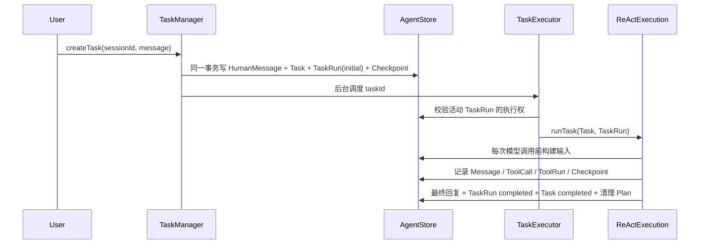

# 执行、恢复与 HITL

## 1. 首次执行

TaskExecutor 只接收 taskId。它重新读取数据库中的 Task、活动 TaskRun 和目标 Message，避免后台闭包携带陈旧状态。

进程内执行按 `(taskId, taskRunId)` 判定身份：同一 TaskRun 的重复 dispatch 复用已有 completion；恢复创建了更新的 TaskRun 时，新运行立即替换旧 Map 项并用 `task_run_superseded` 中止旧 loop。旧 finally 只有在 Map 仍指向自身时才能清理，不能删除新运行。

租约刷新不是无条件 best-effort。明确的 `TASK_OWNERSHIP_LOST` 会立即以 `ownership_lost` abort 当前 loop；暂时性存储错误只在最后一次确认的 lease 尚未到期时容忍，到期后仍无法续期也必须自我 fencing。该 abort 只提供协作式停止，外部工具仍须依赖 ToolRun/operation id 判断真实结果。

## 2. Checkpoint

Checkpoint 记录 `sequenceNo/phase/callMessageId/iterationNo/executedToolCalls`。主要 phase：

- `ready_for_model`：下一步调用模型。
- `tool_batch`：一个 Assistant tool_call 消息已经持久化，工具尚未全部结束。
- `waiting_for_user`：存在请求用户输入的 ToolCall。
- `completed/failed/cancelled`：Task 的最终恢复边界。

Checkpoint 不复制完整消息；恢复输入从 Message、ToolCall 和 ToolRun 重建。

Task 进入终态时使用一个事务收口 Task、TaskRun、所有活动 ToolCall/ToolRun、待处理 UserInputRequest、ActivePlan，以及已有 TaskRun 时的终态 Checkpoint。失败或取消会把未开始/可中断工具标为 `cancelled`；有已开始证据的 `side_effecting` 工具仍标为 `outcome_unknown`。事务返回全部变化 projection，Runtime 随后按 ToolCall、ToolRun、UserInputRequest、TaskRun、Task、Plan 的完整批次发布事件。完成路径若仍存在活动子状态会拒绝提交，避免出现 Task=`completed` 但工具仍在运行的矛盾状态。

## 3. 中断发现与人工恢复

TaskExecutor 周期扫描 `running` 且 `ownershipExpiresAtMs <= now` 的 TaskRun：

1. 旧 TaskRun 标记 `interrupted` 并清空 owner。
2. Task 标记 `recovery_required`。
3. 前端显示“继续任务”，不会自动执行。
4. 用户调用 Resume API。
5. 创建 TaskRun(`manual_resume`) 并恢复 Task=`running`。
6. 处理未完成 ToolCall 后从最新 Checkpoint 继续 ReAct。

恢复工具规则：

- `read_only/idempotent`：旧 ToolRun 进入 `interrupted`，ToolCall 回到 `pending`，允许创建新 ToolRun。
- `side_effecting`：ToolRun 与 ToolCall 进入 `outcome_unknown`，不自动重放。
- 已完成 ToolCall：从 `resultMessageId` 读取既有 ToolMessage，不再次调用工具。

同一规则也适用于进程仍存活时的失败与取消：参数校验、工具查找等确认发生在实际调用前的失败仍记为 `failed`；`side_effecting` 工具一旦开始调用，随后异常、非零退出或取消都进入 `outcome_unknown`。该转换与 Task=`recovery_required`、TaskRun=`interrupted` 在同一事务提交，当前 ReAct 立即停止，不能继续调用模型或兄弟工具。

## 4. Retry

Retry 创建新的 Task，并设置 `retryOfTaskId`。新 Task 直接复用原始不可变 HumanMessage 的 `goalMessageId`，不会重复写一条用户消息；旧 Task、TaskRun、ToolCall、ToolRun 和 Message 保持不变。UI 只显示重试链最末端未被后续 Task 替代的失败/取消卡片。

## 5. HITL

`request_user_input` 是 UserInputRequest 的唯一生产者，一个 ToolCall 最多一个 Request。

触发：

1. Assistant ToolCall Message 与 ToolCall 已落库。
2. 工具创建 Request，ToolCall=`waiting_for_user`。
3. 当前 TaskRun=`paused`，Task=`waiting_for_user`，Checkpoint=`waiting_for_user`。

回答：

1. Request=`answered`。
2. 回答写为 ToolMessage，并由 ToolCall.resultMessageId 关联。
3. ToolCall=`completed`。
4. 所有待回答 Request 都结束后创建 TaskRun(`user_input_answered`)。
5. Task=`running`，追加 `ready_for_model` Checkpoint，继续 ReAct。

过期：

1. Request=`expired`。
2. 写入错误码为 `user_input_expired` 的失败 ToolMessage。
3. ToolCall=`failed`。
4. 所有待回答 Request 都结束后创建 TaskRun(`input_expired`)。
5. 模型读取失败 ToolMessage，自行决定重新询问或结束。

输入请求不承担危险操作审批语义；未来审批应使用独立业务实体。
