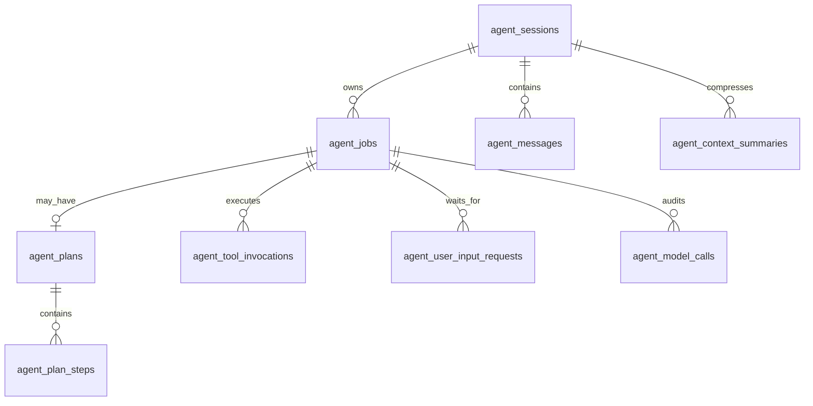
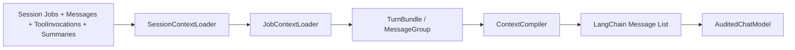

# 持久化、Context 与 View

## 1. 业务表



### 主要职责

| 表 | 持久化事实 |
|---|---|
| `agent_sessions` | 会话与共享 workspace 生命周期 |
| `agent_jobs` | 一个用户轮次的 durable lease、attempt、终态和错误 |
| `agent_messages` | 用户、Assistant tool call、Tool result、最终回答的不可变时序 |
| `agent_plans` | 当前 Job 的可见计划标题、目标、状态和版本 |
| `agent_plan_steps` | 稳定 key、顺序、状态和结果摘要 |
| `agent_tool_invocations` | 参数校验和、幂等键、执行状态、结果与耗时 |
| `agent_user_input_requests` | HITL 问题、回答模式、版本和回答状态 |
| `agent_model_calls` | 每次 provider 调用的精确输入、manifest、usage 与结果 |
| `agent_context_summaries` | 已压缩历史的结构化摘要及覆盖范围 |

没有 `agent_step_runs`。PlanStep 是进度事实，不是独立执行/重试边界。

## 2. 消息时序

每个稳定事实先写数据库再发布 SSE。正常工具回路为：

```text
HumanMessage
AIMessage(tool_calls)
ToolMessage(result)
AIMessage(tool_calls)
ToolMessage(result)
AIMessage(final)
```

Plan 也使用同一普通工具消息序列：

```text
AIMessage(tool_call=update_plan)
ToolMessage(content={ planId, version, status, steps })
```

因此 Context 不需要额外插入可变的“当前 Plan 快照”。最新 Plan 状态由最新 durable tool result 表示，历史 ModelCall 也不会因为 Plan 原位更新而改变语义。

## 3. Job Context 构建

每次模型迭代都重新构建，而不是只在 Job 开始时构建一次：



拼接原则：

1. 固定前缀：系统提示和稳定 workspace 环境信息。
2. 历史摘要：只覆盖明确的 bundle 范围。
3. 完整历史：按 `row_id` 和 turn bundle 保持用户轮次边界。
4. 当前 Job bundle：整体 `mustKeep`，包含本轮所有计划、工具和 HITL 消息。
5. 工具调用与结果必须成组；缺失结果的调用被标记为 blocked，不产生非法 LangChain 序列。
6. 预算不足时先使用已有摘要和截断大型 tool result，不拆散当前 Job bundle。

Context purpose 只保留：

- `conversation`：下一轮会话预览或构建。
- `job_execution`：当前 Job 的 ReAct 执行。

## 4. 精确 ModelCall 快照

只保存 Context manifest 不足以重建历史调用，因为运行时纠正消息、截断结果和未来规则变化都可能改变最终 LangChain 输入。因此 `agent_model_calls` 同时保存：

- `input_manifest`：选择了哪些 bundle/group/summary，以及规则版本。
- `input_messages`：实际传给 LangChain provider 的 `StoredMessage[]`。
- `input_checksum`：对递归排序对象键后的 canonical JSON 做 SHA-256。

PostgreSQL `jsonb` 会规范化对象键顺序，所以 checksum 不能直接依赖普通 `JSON.stringify` 的键序。数组顺序不变，消息顺序仍受严格校验。

`GET /model-calls/:id/context` 会：

1. 根据 manifest 检查引用的持久化材料仍存在。
2. 检查规则版本和选择结果。
3. 对持久化 `input_messages` 做 canonical checksum。
4. 返回精确 LangChain Message List，标记 `verification.status = exact`。

## 5. SessionView

SessionView 是数据库事实的确定性投影，不保存第二份前端专用状态：

```ts
interface AgentSessionView {
  schemaVersion: 2;
  session: AgentSession;
  jobs: AgentJob[];
  messages: AgentMessage[];
  plans: AgentPlan[];
  planSteps: AgentPlanStep[];
  toolInvocations: AgentToolInvocation[];
  userInputRequests: AgentUserInputRequest[];
  modelUsage?: AgentModelUsageStats;
  timeline: { flat: FlatTimelineItem[] };
}
```

Plan card 锚定在第一次 `update_plan` 工具交换的真实 `row_id`；后续 update_plan 调用更新同一张 Plan 卡，普通工具继续按数据库消息顺序平铺。

## 6. SSE 与刷新一致性

SSE 只传事实增量：

- `message.delta`
- `message.discarded`
- `message.upserted`
- `job.upserted`
- `plan.upserted`
- `plan_step.upserted`
- `tool_invocation.upserted`
- `user_input.upserted`
- `model_usage.updated`

前端 reducer 的规则：

1. `message.delta` 只形成临时 streaming draft。
2. `message.discarded` 按 `messageId/outputId` 删除被 Runtime 拒绝的 draft。
3. `message.upserted` 用持久化消息替换对应 draft。
4. versioned entity 只接受同版本或更高版本。
5. 断线或刷新直接重新加载 SessionView；`normalize(view)` 与 SSE reducer 使用同一 flat timeline 规则。

最终一致性的唯一来源是 SessionView，SSE 丢失不会破坏业务事实。
