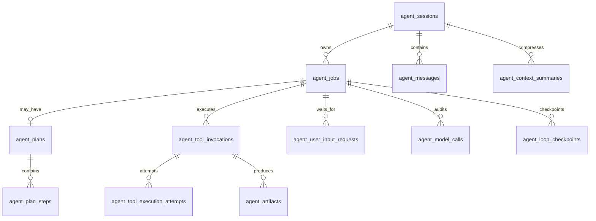
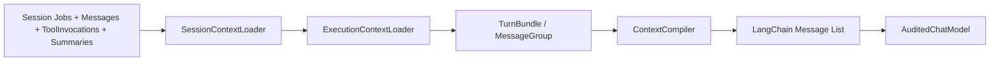

# 持久化、Context 与 View

## 1. 业务表



### 主要职责

| 表 | 持久化事实 |
|---|---|
| `agent_sessions` | 会话与共享 workspace 生命周期 |
| `agent_jobs` | 一个用户轮次的 durable lease、attempt、终态和错误 |
| `agent_messages` | 用户、Assistant tool call、Tool result、最终回答的不可变时序 |
| `agent_plans` | 当前 Job 的可见计划标题、目标、状态和版本 |
| `agent_plan_steps` | 稳定 key、顺序、状态和结果摘要 |
| `agent_tool_invocations` | 参数校验和、幂等键、执行状态、结果与耗时 |
| `agent_user_input_requests` | HITL 问题、回答模式、版本和回答状态 |
| `agent_model_calls` | 每次 provider 调用的精确输入、manifest、usage 与结果 |
| `agent_context_summaries` | 已压缩历史的结构化摘要及覆盖范围 |
| `agent_loop_checkpoints` | ReAct 最新稳定阶段、模型迭代数与工具调用计数 |
| `agent_tool_execution_attempts` | ToolInvocation 每次真实执行的 worker、Job attempt 与终态 |
| `agent_artifacts` | 文件逻辑路径、不可变 revision、checksum 与 ToolInvocation 来源 |

没有 `agent_step_runs`。PlanStep 是进度事实，不是独立执行/重试边界。

常驻开发服务也没有业务表。`start_process` 的 ToolInvocation/ToolResult 保留完整审计；PID、进程组、端口和 liveness 来自本机 OS。每个进程在 Session workspace 内有权限受限的本地 spec 和日志，Runtime 用命令行身份标记 + ownershipToken 发现并验证存活 supervisor。它们是本地运行资源，不是可跨机器恢复的业务事实。

## 2. 消息时序

每个稳定事实先写数据库再发布 SSE。正常工具回路为：

```text
HumanMessage
AIMessage(tool_calls)
ToolMessage(result)
AIMessage(tool_calls)
ToolMessage(result)
AIMessage(final)
```

Plan 也使用同一普通工具消息序列：

```text
AIMessage(tool_call=update_plan)
ToolMessage(content={ planId, version, status, steps })
```

历史语义仍由 `update_plan` ToolCall/ToolMessage 表达。除此之外，每轮还会从业务表生成只读 Durable Runtime State，提供当前 Plan/Step、最新 Artifact revision 和待处理 HITL；它是本次调用的权威状态快照，不回写历史消息。

## 3. Job Context 构建

每次模型迭代都重新构建，而不是只在 Job 开始时构建一次：



拼接原则：

1. 固定前缀：系统提示和稳定 workspace 环境信息。
2. Context Memory：只覆盖明确的稳定 `MessageGroup.id`，Row 范围仅用于审计。
3. 完整历史：按 `row_id` 保持时序，以 MessageGroup 保持协议，以 TurnBundle 保持轮次/Retry 连续性。
4. 当前 Job bundle 在选择阶段整体 `mustKeep`；压缩阶段仍可覆盖其中离开 Protected Window 的稳定旧 Group。
5. 工具调用与结果必须成组；缺失结果的调用被标记为 blocked，不产生非法 LangChain 序列。
6. 预算不足时先使用已有 Memory、压缩较旧稳定 Group、截断大型 ToolResult，并保留当前 goal 与最近原文尾部。

Context purpose 只保留：

- `conversation`：下一轮会话预览或构建。
- `job_execution`：当前 Job 的 ReAct 执行。

## 4. 精确 ModelCall 快照

只保存 Context manifest 不足以重建历史调用，因为运行时纠正消息、截断结果和未来规则变化都可能改变最终 LangChain 输入。因此 `agent_model_calls` 同时保存：

- `input_manifest`：选择了哪些 bundle/group/summary，以及规则版本。
- `input_messages`：实际传给 LangChain provider 的 `StoredMessage[]`。
- `input_checksum`：对递归排序对象键后的 canonical JSON 做 SHA-256。

PostgreSQL `jsonb` 会规范化对象键顺序，所以 checksum 不能直接依赖普通 `JSON.stringify` 的键序。数组顺序不变，消息顺序仍受严格校验。

`GET /model-calls/:id/context` 会：

1. 根据 manifest 检查引用的持久化材料仍存在。
   Summary 使用 manifest 的 ID 直接读取，包含已经被新 Memory supersede 的历史版本，而不是只查询 active Summary。
2. 检查规则版本和选择结果。
3. 对持久化 `input_messages` 做 canonical checksum。
4. 返回精确 LangChain Message List，标记 `verification.status = exact`。

## 5. SessionView

SessionView 是数据库业务事实的确定性投影，并在读取时合并本机实时进程 overlay；它不保存第二份前端专用状态：

```ts
interface AgentSessionView {
  schemaVersion: 4;
  session: AgentSession;
  jobs: AgentJob[];
  messages: AgentMessage[];
  plans: AgentPlan[];
  planSteps: AgentPlanStep[];
  toolInvocations: AgentToolInvocation[];
  artifacts: AgentArtifact[];
  managedProcesses: AgentManagedProcess[];
  userInputRequests: AgentUserInputRequest[];
  modelUsage?: AgentModelUsageStats;
  timeline: { flat: FlatTimelineItem[] };
}
```

Plan card 锚定在第一次 `update_plan` 工具交换的真实 `row_id`；后续 update_plan 调用更新同一张 Plan 卡，普通工具继续按数据库消息顺序平铺。

## 6. SSE 与刷新一致性

SSE 只传事实增量：

- `message.delta`
- `message.discarded`
- `message.upserted`
- `job.upserted`
- `plan.upserted`
- `plan_step.upserted`
- `tool_invocation.upserted`
- `user_input.upserted`
- `model_usage.updated`
- `artifact.upserted`
- `managed_process.upserted`

前端 reducer 的规则：

1. `message.delta` 只形成临时 streaming draft。
2. `message.discarded` 按 `messageId/outputId` 删除被 Runtime 拒绝的 draft。
3. `message.upserted` 用持久化消息替换对应 draft。
4. versioned entity 只接受同版本或更高版本。
5. 断线或刷新直接重新加载 SessionView；`normalize(view)` 与 SSE reducer 使用同一 flat timeline 规则。

前端的权威重载入口是 SessionView。它组合 PostgreSQL 业务事实与本机实时 `managedProcesses[]` overlay；SSE 丢失不会破坏业务事实，进程 overlay 也会在下一次 OS 扫描或刷新时纠正。
