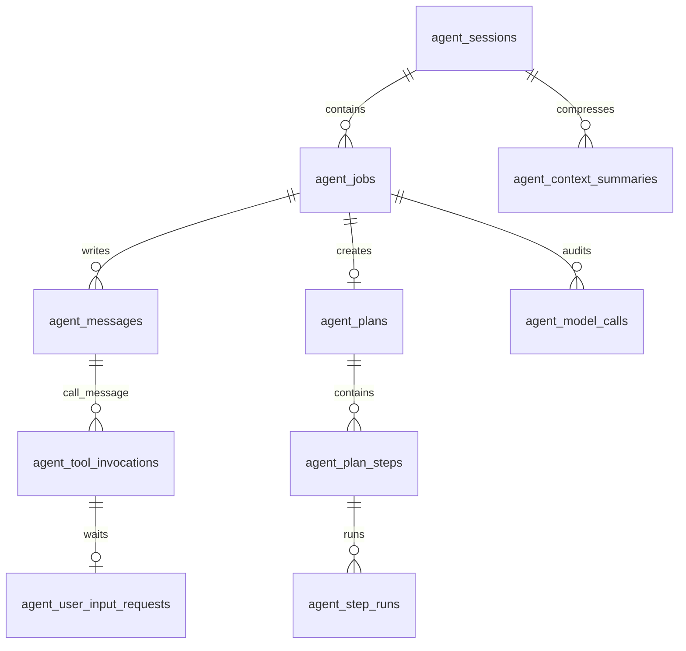

# 02. 存储方案设计

## 目标

存储层要解决四件事：

1. 保存用户可见时间线。
2. 保存运行时恢复所需状态。
3. 保存模型调用和 Context 审计信息。
4. 提供前端 View 和 Debug Context 的统一事实源。

当前存储接口是 `AgentStore`，Postgres 实现在 `src/storage/postgres/postgres-agent-store.ts`，Schema 定义在 `src/storage/postgres/schema-v1.ts`。

## 表结构总览

## 核心表职责

### `agent_sessions`

Session 是用户对话容器。

关键字段：

- `id`：Session ID。
- `title`：可选标题。
- `status`：`active` 或 `archived`。
- `version`：并发控制。
- `created_at_ms` / `updated_at_ms`：排序和列表展示。

删除 Session 使用 cascade 删除其 Job、Message、Plan、ContextSummary 等，同时 Runtime 会清理 session sandbox。

### `agent_jobs`

Job 是一次用户目标的执行边界。

关键字段：

- `session_id`：归属 Session。
- `retry_of_job_id`：重试来源。
- `client_request_id`：客户端幂等键。
- `strategy`：`direct` 或 `planned`。
- `stage`：`routing`、`direct_execution`、`planning`、`step_execution`、`finalizing`。
- `status`：运行状态。
- `current_attempt_id`、`attempt_no`：执行尝试。
- `lease_owner`、`lease_expires_at_ms`：worker 租约。
- `version`：乐观锁。
- `metadata`：存储 `goalMessageId` 等运行时补充信息。

关键索引和约束：

- `uniq_agent_jobs_active_session`：同一 Session 只能有一个 active Job。
- `uniq_agent_jobs_client_request`：同一 Session 内 client request 幂等。
- `idx_agent_jobs_recovery`：恢复扫描运行中或恢复中的过期 Job。

### `agent_messages`

Message 是时间线、模型上下文和 tool exchange 的事实源。

关键字段：

- `row_id`：全局递增游标，Context 和 View 都按它排序。
- `id`：业务 ID。
- `session_id` / `job_id` / `plan_id` / `step_id` / `step_run_id`：归属关系。
- `role`：`system`、`user`、`assistant`、`tool`。
- `message_type`：用户消息、助手消息、tool call、tool result、plan、step output 等。
- `visibility`：`ui` 或 `internal`。
- `channel`：`normal`、`progress`、`final`。
- `tool_calls`、`tool_call_id`、`tool_name`、`tool_result`：工具消息配对数据。

设计重点：

- `row_id` 是 Context 和 UI 的稳定排序依据。
- `system_prompt` 和 `step_instruction` 必须是 internal。
- tool call 必须是 assistant role 且有 tool_calls。
- tool result 必须是 tool role 且有 tool_call_id、tool_name、tool_result。

### `agent_tool_invocations`

ToolInvocation 是工具执行状态机。

关键字段：

- `call_message_id`：对应 tool call message。
- `result_message_id`：对应 tool result message。
- `tool_call_id`：模型生成的 tool call ID。
- `tool_name`、`arguments`、`arguments_checksum`。
- `side_effect_level`：`read_only`、`idempotent`、`side_effecting`。
- `idempotency_key`：工具执行幂等键。
- `status`：`pending`、`running`、`waiting_user_input`、`completed`、`failed`、`unknown`、`cancelled`。

关键约束：

- `unique (job_id, tool_call_id)` 防止同一模型输出重复写入。
- `unique (job_id, idempotency_key)` 防止副作用工具重复执行。
- completed / failed 必须有 result message 和 completed time。

### `agent_user_input_requests`

HITL 请求独立建模，避免把普通用户消息、工具输入等待、恢复确认混在一起。

关键字段：

- `source`：`tool`、`agent`、`planner`、`recovery`。
- `answer_mode`：`as_tool_result` 或 `as_user_message`。
- `tool_invocation_id`：如果来自工具等待，必须关联 ToolInvocation。
- `input_schema`：text、single_choice、multi_choice、approval。
- `answer`、`answer_message_id`、`client_answer_id`。
- `metadata.sensitiveAnswer`：用于前端投影脱敏。

设计约束：

- `source = tool` 时必须是 `answer_mode = as_tool_result`。
- 回答请求时，`client_answer_id` 做幂等。
- 如果是敏感回答，SessionView 中隐藏 answer 和 tool result payload。

### `agent_plans`、`agent_plan_steps`、`agent_step_runs`

planned Job 使用三层结构：

- `agent_plans`：一个 Job 一个 Plan。
- `agent_plan_steps`：计划步骤定义，按 `position` 排序。
- `agent_step_runs`：步骤的具体运行实例，支持单步重跑。

关键约束：

- `agent_plans.job_id` unique。
- `agent_plan_steps(plan_id, position)` unique。
- `agent_step_runs(step_id, run_no)` unique。
- 同一 Step 和同一 Job 只能有一个 active StepRun。

### `agent_context_summaries`

ContextSummary 保存压缩后的历史上下文。

关键字段：

- `owner_type`：`session`、`job`、`step_run`。
- `purpose`：`conversation`、`job_execution`、`step_execution`、`plan_final`、`code_execution`。
- `context_rules_version`：Context 规则版本。
- `summary_type`：rolling、job、tool_history、workspace_invariants、workspace_index、working_set。
- `source_row_id_start` / `source_row_id_end`：摘要覆盖的消息范围。
- `parent_summary_id` / `replaces_summary_id`：摘要演进关系。
- `checksum`：摘要内容校验。

关键约束：

- 同一 owner + purpose + rules version + summary type 只能有一个 active summary。
- owner 必须和 session/job/step_run 外键关系一致。

### `agent_model_calls`

ModelCall 是模型调用审计表。

关键字段：

- `logical_call_key`：如 `planner.route`、`job.react`、`step.react:<stepRunId>`。
- `call_attempt_no`：同一 logical call 的尝试次数。
- `call_type`：planner、job、step、repair、finalize、context.compress。
- `provider`、`model`。
- `context_rules_version`。
- `input_manifest`：本次 Context 选择了哪些 message group、summary、bundle。
- `input_checksum`：实际消息序列 checksum。
- token 预算与实际 usage。
- `result_payload`、`tool_names`、错误字段。

用途：

- 统计模型 token 使用。
- Debug 复原某次模型调用 Context。
- 排查不同 context rules version 的行为差异。

## 事务边界

`AgentStore` 提供的写方法应保持“一个业务动作一个事务”：

- 创建 Job + 用户消息。
- claim / renew / cancel / fail Job。
- commit model tool calls。
- claim tool invocation。
- commit tool result。
- complete final message。
- create input requests and mark waiting。
- answer input and claim resume。
- route job。
- create plan。
- create step run。
- commit step output。
- fail step run。
- start / complete model call。
- replace context summary。

这样可以保证前端看到的 View 不会出现半提交状态。

## 并发控制

1. Job、Plan、PlanStep、StepRun、UserInputRequest 都带 `version`。
2. API 对 cancel、answer 等用户动作要求传 `expectedVersion`。
3. worker 执行必须持有 lease owner 和 current attempt。
4. 关键写入使用当前 attempt 校验，防止旧 worker 抢写。
5. 实时事件丢失不影响正确性，`SessionView` 是恢复事实源。

## 删除策略

删除 Session 时：

1. API 调用 `DELETE /sessions/:sessionId`。
2. Runtime 调用 `store.deleteSession(sessionId)`。
3. Postgres cascade 删除会话下数据。
4. Runtime 调用 `removeSessionWorkspace` 清理 sandbox。
5. SSE subject 关闭。

不建议软删除 Job 或 Message，因为 Context 和调试依赖完整事实链。用户层面的隐藏应由 View 投影处理。

