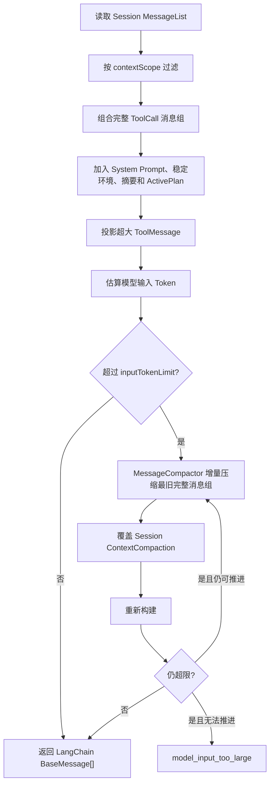

# Context、Plan、View 与事件

## 1. ModelInputBuilder

每次模型调用前只通过 `ModelInputBuilder.prepareTaskRunContext(Task, TaskRun)` 取得消息和审计 manifest；真正的筛选、拼装与压缩都封装在 Context 内：



过滤规则：

- `conversation`：后续 Task 可见。
- `task`：仅所属 Task 可见。
- `none`：永不进入模型输入。
- `progress` 消息永不进入输入。
- 当前目标消息始终保留。
- AssistantMessage(tool_calls) 与其全部 ToolMessage 作为不可拆分消息组。
- 缺少任意 ToolMessage 的不完整工具批次整体排除，不在 Context 层伪造结果。
- ToolCall/ToolMessage 按 `taskId + modelToolCallId` 配对，并校验先后顺序、工具名和唯一性；被排除的调用消息 ID 写入模型输入 manifest 供审计。
- `update_plan` 的调用与结果使用 `task` scope，下一 Task 不会看到。

Context 仅有三个策略参数：

```json
{
  "keepRecentInputTokens": 24000,
  "maxToolResultTokens": 8000,
  "summaryMaxTokens": 4000
}
```

## 2. MessageCompactor

只有完整的旧 `conversation` 消息组可被压缩；当前 Task 目标和 Task scope 消息不压缩。一次 Context 构建可以进行多个有上限的增量压缩 pass，每个 pass 都必须让 `throughMessageRowId` 单调前进：

```text
旧摘要 + 新增的最旧历史段 -> 新摘要
```

`agent_context_compactions` 每 Session 一行，`throughMessageRowId` 只能前进。原始 Message 永远保留。摘要只是构建输入的缓存；系统当前没有 Memory 模块，也不把摘要称为 Memory。

## 3. ActivePlan

`update_plan` 原子更新 `agent_active_plans`。Plan 是 SessionView 的顶层字段，不是 TimelineItem。它只存：

```json
{
  "sessionId": "session_...",
  "taskId": "task_...",
  "title": "实现功能",
  "steps": [
    { "step": "读取代码", "status": "completed" },
    { "step": "修改实现", "status": "in_progress" },
    { "step": "运行验证", "status": "pending" }
  ],
  "version": 3
}
```

Plan 不作为 Task 能否结束的门禁。Task 进入 `completed/failed/cancelled` 时，在同一数据库事务中删除；事件层再发 `plan.cleared`。

## 4. View 与事件一致性

刷新时 `SessionView` 从数据库构建权威快照：Task、TaskRun、ActivePlan、Message、ToolCall、Artifact、UserInputRequest 和 Token 聚合。全部耐久 projection 使用同一连接上的只读 `REPEATABLE READ` 事务读取，不能混入多个提交时点；managed process 属于操作系统实时状态，在事务外单独采样。ToolMessage 不单独铺在时间线中，而是依据 ToolCall.resultMessageId 合并到对应 tool exchange。

流式期间前端 reducer 按相同规则维护本地 View：

- `message.delta`：按 `taskId/messageId/outputId` 累加草稿。
- `message.upserted`：提交消息并移除对应草稿。
- `task.upserted` / `task_run.upserted`：按版本更新状态。
- `tool_call.upserted`：更新工具意图及其唯一执行状态。
- `plan.updated`：按 version 替换 `activePlan`。
- `plan.cleared`：清除 `activePlan`。
- 收到对应 Task 终态时也清除 Plan，抵抗事件乱序。

Web 使用 SSE；Electron 使用 Utility Process + MessagePort IPC。二者消费相同 `AgentRealtimeEvent`，刷新后都以 SessionView 为准。
