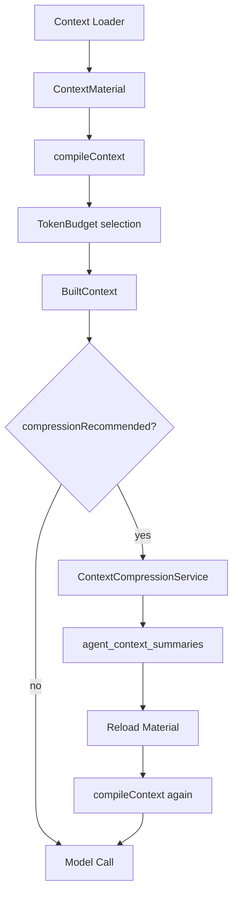

# 03. Context 策略设计

## 目标

Context 策略要同时满足：

1. 当前模型调用拿到足够上下文。
2. tool call / tool result 成对保留，避免模型收到断裂工具链。
3. 长会话可压缩，且压缩过程可审计。
4. planned Job 的 step 只执行当前步骤，不越权执行后续步骤。
5. Debug 能复原下一轮和历史 ModelCall 的 Context。

当前规则版本是 `job-step-run-context-v6`，定义在 `src/runtime/context/context-compiler.ts`。

## 构建流程

## ContextMaterial

`ContextMaterial` 是构建模型输入前的中间表示，包含：

- `fixedMessages`：必须保留的系统消息，如 runtime system prompt。
- `trailingMessages`：尾部必须保留的系统消息，如当前 step instruction。
- `fixedPrefix`：用于 checksum 的固定前缀元数据。
- `groups`：按 message group 组织的历史消息。
- `legacyGroups`：兼容旧规则复原。
- `bundles`：按 turn 聚合的 v6 上下文单元。
- `summaries`：已存在的 context summary。
- `toolSchemas`：当前可用工具 schema。
- `model`：provider、model、max context、reserved output。
- `audit`：purpose、context rules version、system prompt version。
- `blockedDiagnostics`：不完整 tool exchange 诊断。
- `compression`：压缩开关、候选消息和阈值。

## Loader 分工

### `SessionContextLoader`

位置：`src/runtime/loaders/session-context-loader.ts`

它读取 Session 级事实：

- jobs
- messages
- plans
- plan steps
- step runs
- tool invocations
- active session summaries

然后用 `MessageGroupBuilder` 建立 message group，用 `TurnBundleBuilder` 建立 turn bundle。

它会过滤掉：

- `visibility = internal` 的消息。
- `message_type = progress` 的消息。

同时保留 blocked group 诊断，用于发现 tool call/result 不完整的情况。

### `DirectJobContextLoader`

位置：`src/runtime/loaders/direct-job-context-loader.ts`

Direct Job 的 Context 由以下部分组成：

1. system prompt。
2. 可选 stable context。
3. 当前 Job 的原始 goal。
4. 历史 session turn bundle。
5. active session summary。
6. 工具 schema。

当前 Job 或 retry lineage 对应的 bundle 必须保留，历史 bundle 按优先级和 token budget 选择。

### `PlanContextLoader`

位置：`src/runtime/loaders/plan-context-loader.ts`

PlanContextLoader 不直接产出模型消息，而是为 StepContextLoader 提供 planned Job 的上下文事实：

- 原始用户目标。
- Plan 和 PlanStep。
- StepRun 列表。
- session baseline。
- current plan groups。
- step outputs。

它明确区分：

- 原始目标之前的 session baseline。
- 当前 plan 执行过程中新增的 plan/step 消息。

### `StepContextLoader`

位置：`src/runtime/loaders/step-context-loader.ts`

Step Context 的目标是让模型只执行当前步骤。

固定消息包含：

- step system prompt。
- stable context。
- 当前 execution plan JSON。
- trailing current step instruction。

策略：

- 原始用户目标必须保留。
- current plan groups 必须保留。
- 当前 StepRun 的相关消息必须保留。
- 当前 plan 的 `plan_created` 在 v6 bundle 中会被投影掉，避免 step 模型把计划定义重复当作执行内容。
- `candidateMessageIds` 限定压缩候选，优先压缩 step output 和当前 step 相关消息。

### `ModelCallContextLoader`

位置：`src/runtime/loaders/model-call-context-loader.ts`

用于 Debug 复原历史模型调用。

它读取 `agent_model_calls.input_manifest`，再用当前存储事实重新构建 Context，并校验：

- fixed prefix checksum。
- tool schema checksum。
- message group ids。
- summary ids。
- selected bundle ids。
- truncated tool result ids。
- 最终 messages checksum。

如果缺失 group 或 summary，会抛出 `ContextSnapshotUnreconstructableError`。

## Message Group 策略

MessageGroup 是 Context 的基本保留单位，目的是避免消息断裂。

必须作为一个 group 处理的内容：

- 一条普通用户消息。
- 一条普通 assistant 消息。
- 一个 tool call message + 其 result messages。
- plan definition。
- step output。

如果 tool call 缺少对应 result，Context 不应静默拼接，而是进入 blocked diagnostics。执行期对当前 Job 的 blocked group 会直接报错，Debug Preview 则展示诊断信息。

## Turn Bundle 策略

v6 引入 TurnBundle，把一次用户目标及其 retry lineage 聚成一个 `turn:<rootJobId>`。

Bundle 字段：

- `type`：`direct_turn` 或 `planned_turn`。
- `rootJobId`：原始 Job。
- `jobIds`：原始 Job 和重试 Job。
- `planId`：planned turn 的 Plan。
- `terminal`：该 lineage 是否都结束。
- `sourceRowIdStart` / `sourceRowIdEnd`。
- `groups`：属于该 turn 的 message groups。

好处：

1. 历史轮次按完整 turn 选择，不容易只保留半段。
2. retry 的上下文和原始 Job 绑定，避免重复或错位。
3. summary 可以记录 `sourceBundleIds`，Debug 能解释哪些 turn 被摘要覆盖。

## Token Budget 策略

`compileContext` 把所有候选内容变成 `TokenBudgetItem`：

- system message：must keep，priority 1000。
- tool schemas：must keep，priority 1000。
- summaries：priority 60。
- current job / current plan / current step：高优先级。
- session history：较低优先级。
- trailing instruction：must keep，最后出现。

选择规则：

- 如果存在 bundles，使用 contiguous tail selection，保证近期 turn 连续。
- 如果没有 bundles，按 group 选择。
- reserved output tokens 从模型总上下文中扣除。
- `estimatedBreakdown` 写入 manifest，便于 Debug 展示。

## 压缩策略

触发条件：

- 候选 token 超过 safe input limit 的 70%。
- 或新增可压缩消息数超过 `compressionMessageThreshold`，默认 50。

压缩写入：

- session 历史压缩写 `owner_type = session`、`purpose = conversation`。
- job / step 压缩写对应 owner。
- 每个 active summary 通过唯一索引替换旧 summary。
- summary 记录 source row range、source count、token count、model、prompt version、checksum。

原则：

1. 当前目标和当前步骤不能被压缩丢失。
2. tool exchange 不完整时不能作为普通历史拼接。
3. 压缩后必须重新 load material 并再次 compile。
4. ModelCall 记录压缩调用本身，`call_type = context.compress`。

## Context Manifest

每次模型调用保存 `AgentContextInputManifest`：

- `purpose`
- `contextRulesVersion`
- `systemPromptVersion`
- `messageGroupIds`
- `summaryIds`
- `selectedBundleIds`
- `summarizedBundleIds`
- `truncatedToolResultMessageIds`
- `includedRowIdStart` / `includedRowIdEnd`
- `toolSchemaChecksum`
- `fixedPrefixChecksum`
- `estimatedBreakdown`

Manifest 是 Debug 复原能力的核心。它不保存完整 prompt 文本，但保存足够的引用和 checksum，支持从事实源重建并校验。

## Context 安全边界

- UI 只显示 `visibility = ui` 的消息。
- 模型 Context 过滤 progress 和 internal 消息。
- system prompt、step instruction、stable context 不进入 UI View。
- sensitive HITL answer 在 SessionView 中脱敏。
- Debug Context 是 debug-only，应只开放给受信任用户或开发环境。

