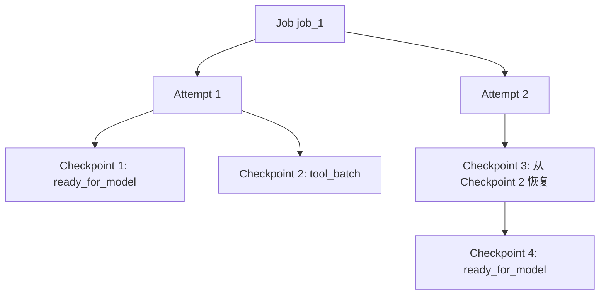
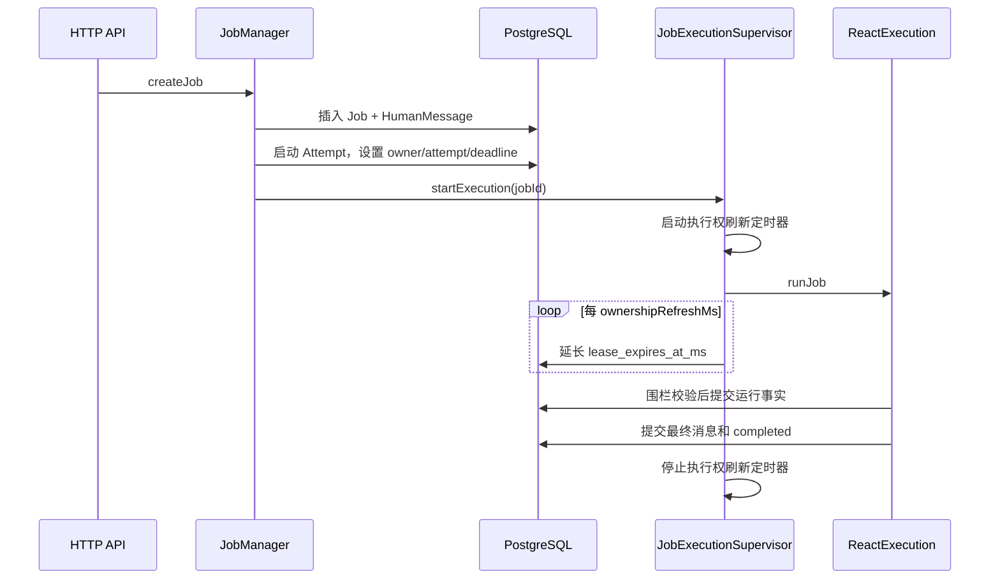
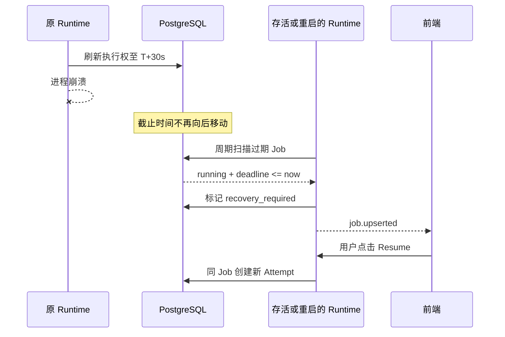

# Job 执行所有权、写入围栏与故障恢复

本文专项说明 Agent Runtime v2 如何判断一个 Job 是否仍然有人执行、如何阻止失去执行权的旧进程继续写入，以及服务崩溃后如何把 Job 安全地交给用户恢复。

文中的“执行权有效期”对应当前代码中的 `lease`；“执行权刷新”对应当前代码中的 `heartbeat`。后两个名字是基础设施术语，理解业务流程时优先使用前两个名字。

## 1. 设计目标

Runtime 需要同时满足以下目标：

1. 模型调用、Shell 和浏览器工具可以运行数分钟，不能因为长时间没有 Job 状态变化就被误判为死亡。
2. Node.js 进程被强杀后，即使没有机会写入最终状态，系统也能识别遗留的 `running` Job。
3. 旧进程、重启后的新进程或多个 Runtime 实例不能同时提交同一个 Job 的结果。
4. 服务恢复后不自动重放未知副作用，而是把 Job 变成 `recovery_required`，由用户决定是否继续。
5. Resume 继续同一个 Job 和同一条 ReAct 历史；Retry 创建新 Job，两者语义不能混淆。
6. 执行权刷新属于内部运行信息，不增加 Job version，不写入用户时间线，也不发送前端心跳事件。

它不解决以下问题：

- 它不能让已经崩溃的 JavaScript 调用栈复活。
- 它不能撤销已经发生的文件写入、Shell 命令或外部 API 副作用。
- 当所有 Runtime 实例都离线时，它不会在数据库内部自动推进状态。
- 它不等同于操作系统 PID 探测，也不通过 `ps` 判断 Job 执行者。

## 2. 核心问题：进程崩溃时没有最后一次写入

数据库可以立即执行 SQL，但它无法知道应用进程是否还活着。

正常完成时，Runtime 会主动提交：

```sql
update agent_jobs
set status = 'completed';
```

进程被强杀时，这条 SQL 根本不会发送：

```text
Job 仍然是 running
Node.js 进程已经不存在
数据库没有收到进程死亡通知
```

数据库无法从“暂时没有新 SQL”区分以下情况：

- 模型正在生成长回答；
- Shell 正在安装依赖；
- Node.js 事件循环卡死；
- 网络出现分区；
- Runtime 已经崩溃。

因此 Runtime 使用一个有截止时间的执行权：活着的执行者定期推迟截止时间；停止刷新后，截止时间最终过期。

## 3. 核心概念

| 概念 | 当前字段或对象 | 含义 |
| --- | --- | --- |
| Job | `agent_jobs.id` | 一次用户目标对应的持久化 ReAct 工作流 |
| Worker | `lease_owner` | 当前负责执行 Job 的 Runtime 实例 |
| Attempt | `current_attempt_id`、`attempt_no` | 同一个 Job 的一次执行尝试 |
| 执行权截止时间 | `lease_expires_at_ms` | 当前 Attempt 在何时失去执行资格 |
| 执行权刷新 | `renewJobExecutionLease` | 把截止时间更新为 `now + ownershipTimeoutMs` |
| 写入围栏 | `assertJobLease` 及条件 SQL | 拒绝旧 Worker、旧 Attempt 或过期执行者写入 |
| Loop Checkpoint | `agent_loop_checkpoints` | ReAct 能够继续的持久化逻辑位置 |
| Recovery Scanner | `JobExecutionSupervisor` | 发现过期 Job 并标记 `recovery_required` |

Job、Attempt 和 Checkpoint 的关系是：



Resume 会创建新的 Attempt，但不会创建新 Job；Retry 才会创建新 Job。

## 4. 数据库事实与不变量

`agent_jobs` 中与执行所有权相关的字段包括：

```text
status
version
attempt_no
current_attempt_id
lease_owner
lease_expires_at_ms
```

关键不变量：

1. `running` 或 `resuming` Job 必须同时具有 owner、attemptId 和有效截止时间。
2. 一个 Job 同一时刻只能有一个当前 Attempt。
3. 执行侧写入必须同时匹配 Job、Worker、Attempt 和未过期截止时间。
4. 执行权过期后不能通过迟到的刷新重新复活。
5. 终态 Job 不能被旧执行者再次写回运行态。
6. Checkpoint 只追加、不覆盖，恢复历史必须可审计。
7. 执行权刷新只更新 `lease_expires_at_ms`，不增加 Job version。

启动 Attempt 的核心状态变化为：

```sql
update agent_jobs
set status = 'running',
    lease_owner = :workerId,
    lease_expires_at_ms = :now + :ownershipTimeout,
    current_attempt_id = :attemptId,
    attempt_no = attempt_no + 1,
    version = version + 1
where id = :jobId
  and version = :expectedVersion
  and status in ('created', 'recovery_required');
```

首次运行和 Resume 当前共用这条事务命令。首次运行追加初始 Checkpoint；Resume 继承最新 Checkpoint 的 phase、callMessageId 和计数器，并把新 Checkpoint 关联到新的 Attempt。

## 5. 组件职责

### 5.1 JobManager

`src/orchestration/job-manager.ts`

负责用户命令：

- 创建 Job；
- Cancel；
- Retry 为新 Job；
- Resume 原 Job；
- 回答 HITL 请求。

它决定“是否应该启动一次执行”，但不负责维护执行权定时器。

### 5.2 JobExecutionSupervisor

`src/orchestration/job-execution-supervisor.ts`

负责进程内执行监督：

- 保存当前进程的 `activeExecutions`；
- 启动和停止 ReAct 执行；
- 维护每个活跃 Job 的执行权有效期；
- Runtime shutdown 时发送 AbortSignal；
- 周期扫描遗留 Job；
- 将过期 Job 标记为 `recovery_required`。

### 5.3 ReactExecution

`src/runtime/execution/react-execution.ts`

负责一个 Job 的持久化 ReAct 循环：

- 加载最新 Loop Checkpoint；
- 恢复迭代次数和工具调用计数；
- 加载未完成工具批次；
- 调用模型和工具；
- 通过存储事务提交消息、ToolInvocation、ToolResult 和终态。

它不创建执行权刷新定时器；执行所有权是 Orchestration 的职责。

### 5.4 Postgres Transaction Commands

`src/storage/postgres/transaction-commands.ts`

负责原子事实写入和写入围栏：

- 启动 Attempt；
- 刷新执行权；
- 校验 Worker、Attempt 和截止时间；
- 提交工具和模型事实；
- 标记 `recovery_required`；
- 准备工具恢复。

## 6. 正常执行链路



当前默认配置：

```json
{
  "ownershipTimeoutMs": 30000,
  "ownershipRefreshMs": 10000,
  "recoveryScanIntervalMs": 5000
}
```

示例时间线：

```text
16:00:00  Attempt 启动，有效到 16:00:30
16:00:10  刷新，有效到 16:00:40
16:00:20  刷新，有效到 16:00:50
16:00:30  刷新，有效到 16:01:00
```

刷新间隔必须短于超时时间。当前构造函数显式检查：

```text
ownershipRefreshMs < ownershipTimeoutMs
```

## 7. 写入围栏

执行权刷新本身不能阻止旧进程写入。真正保证安全的是每次关键写入前的 fence。

逻辑条件为：

```ts
job.status === 'running' || job.status === 'resuming'
job.leaseOwner === workerId
job.currentAttemptId === attemptId
job.leaseExpiresAtMs > nowMs
```

数据库条件等价于：

```sql
and status in ('running', 'resuming')
and lease_owner = :workerId
and current_attempt_id = :attemptId
and lease_expires_at_ms > :nowMs
```

围栏覆盖执行产生的关键事实，包括：

- 模型调用状态；
- ToolCall Message；
- ToolInvocation 开始和完成；
- ToolResult；
- Loop Checkpoint；
- 最终 AssistantMessage；
- Job completed/failed。

Cancel 等用户控制命令不需要持有执行权，它们通过 Job status 和 version CAS 与执行线程竞争。Cancel 先提交终态，再 Abort 当前 I/O；旧执行后续写入会被终态和 Attempt fence 拒绝。

### 7.1 过期后发生什么

过期执行者的写入会得到：

```text
AgentStoreError: JOB_LEASE_LOST
→ RuntimeError: lease_lost
```

当前事务回滚，`runJobWithLease` 不会再尝试把 Job 标记为 failed，因为该执行者已经没有修改 Job 的资格。

刷新 SQL 本身也要求旧截止时间仍晚于当前时间，因此迟到的定时器不能复活已过期 Attempt：

```sql
and lease_expires_at_ms > :nowMs
```

## 8. 服务崩溃与无人执行



如果所有 Runtime 都离线，数据库行不会自行变化。它会保持 `running` 和一个已经过期的截止时间，直到某个 Runtime 再次启动并执行扫描。

扫描器不会自动 Resume。它只进行状态归档：

```text
status = recovery_required
current_attempt_id = null
lease_owner = null
lease_expires_at_ms = null
version = version + 1
```

前端由 SSE 或刷新后的 SessionView 获得 `recovery_required`，向用户展示“继续任务”。

## 9. ModelCall 恢复语义

模型 HTTP 流不能从中间字节恢复。Recovery Scanner 会先查找失去有效执行权的 `started` ModelCall，并将其标记为：

```text
status = failed
usage_source = unavailable
error_code = model_call_abandoned
```

已经持久化的完整消息仍然保留；尚未形成完整提交的模型输出不会伪装成最终消息。Resume 后 ReAct 根据持久化 Context 再发起新的模型调用。

## 10. ToolInvocation 恢复语义

用户点击 Resume 后，Runtime 根据最新 `tool_batch` Checkpoint 和 `call_message_id` 加载中断批次。

| 原工具状态 | Resume 处理 | 原因 |
| --- | --- | --- |
| completed | 保留并复用 | 结果已经持久化 |
| failed | 保留失败事实 | ReAct 应看到真实失败结果 |
| pending | 关联新 Attempt，保持 pending | 尚未开始，可以执行 |
| running + 非副作用工具 | 上次 attempt 记为 interrupted，Invocation 重置 pending | 读操作可以安全重试 |
| running + 副作用工具 | 标记 unknown，并阻止自动恢复 | 外部结果无法由数据库证明 |

副作用未知示例：

```text
write_file 已经修改文件
→ Node.js 在提交 ToolResult 前崩溃
→ 数据库只知道 Invocation 曾经 running
→ 无法证明文件写成功、失败或部分写入
→ 标记 side_effect_status_unknown
```

当前 `JobManager.resumeJob` 在发现 `blockedInvocations` 后，会把 Job 标记为 `unsafe_tool_recovery` 失败，而不是自动执行第二次写入。

## 11. Checkpoint 与执行权的关系

执行权回答：

> 谁现在有资格推进这个 Job？

Checkpoint 回答：

> 取得资格后，ReAct 应从哪个逻辑位置继续？

两者不能互相替代。

```text
只有 Checkpoint，没有执行权
→ 两个 Runtime 可能同时从同一点恢复

只有执行权，没有 Checkpoint
→ 新 Runtime 知道自己可以执行，但不知道从哪里继续
```

Resume 时，新 Attempt 会追加一条 Attempt 起点 Checkpoint：

```text
phase
callMessageId
iterationNo
executedToolCalls
resumedFromCheckpointId
resumedFromAttemptId
```

它不恢复 JavaScript 栈，而是根据数据库事实重新构建 ReAct 输入。

## 12. 并发场景

### 12.1 旧 Worker 晚到

```text
Worker A 执行权过期
Worker B 在用户 Resume 后获得新 attemptId
Worker A 的工具终于返回
Worker A 提交 ToolResult
```

提交失败，因为 `current_attempt_id` 已经属于 Worker B。即使 Job ID 相同，Attempt fence 仍然阻止旧结果覆盖新执行。

### 12.2 Cancel 与工具完成竞争

```text
用户 Cancel
工具同时完成
```

Cancel 先提交终态时，工具结果写入因 Job 不再是 `running/resuming` 而失败；工具结果先提交时，Cancel 基于最新 version 再完成终态转换。事务和 CAS 决定唯一顺序。

### 12.3 心跳与普通 Job 更新竞争

刷新操作先读取最新 Job，再携带 expectedVersion、workerId 和 attemptId 更新截止时间。刷新本身不增加 version，因此不会制造用户可见的 Job 更新噪声。

### 12.4 续期请求迟到

如果请求发送前执行权已经过期，SQL 的 `lease_expires_at_ms > nowMs` 会拒绝续期。过期所有权不可复活。

## 13. 为什么不使用本地内存或 PID

`activeExecutions: Map<jobId, Promise>` 只能阻止同一个 Node.js 进程重复启动 Job：

- 进程崩溃后 Map 消失；
- 其他 Runtime 实例看不到它；
- 它不能作为 durable recovery 的事实来源。

PID 也不适合作为 Job 执行权：

- PID 会复用；
- 容器和多机器上的 PID 没有全局意义；
- Node 卡死时 PID 仍然存在；
- 数据库无法根据 PID 原子地围栏写入。

因此本地 Map 用于进程内去重，数据库执行权用于跨进程协调。

## 14. 为什么不长期占用数据库连接

可以用 PostgreSQL advisory lock 和专用连接表达执行权，但代价包括：

- 每个长 Job 长期占用连接池连接；
- Job 生命周期与 TCP 连接强绑定；
- 应用仍需持久化 Attempt、Checkpoint 和用户可见恢复状态；
- 网络分区和事件循环卡死的语义仍需定义。

当前有截止时间的数据库执行权更适合长时间模型和工具任务，也更容易在 SessionView 中解释和审计。

## 15. 当前实现的已知改进点

### 15.1 命名仍然混用基础设施术语

当前代码同时存在外部配置的 `ownership*` 和内部的 `lease/heartbeat`：

```text
runJobWithLease                 → runOwnedJobExecution
startLeaseHeartbeat            → startExecutionOwnershipRefresh
renewExecutionLease            → refreshExecutionOwnership
jobLeaseMs                     → executionOwnershipTimeoutMs
jobHeartbeatMs                 → executionOwnershipRefreshMs
```

这属于可读性治理，不应改变数据库或恢复语义。

### 15.2 续期失败不会立即 Abort

当前定时器吞掉续期异常，等待下一次受围栏保护的数据库写入发现 `lease_lost`。因此长时间 Shell 或模型 I/O 可能继续运行到返回，但最终无法提交结果。

建议区分：

- 明确的 `JOB_LEASE_LOST`：立即触发当前 Job 的 AbortController；
- 暂时性数据库错误：在截止时间前有限重试；
- 无法确认：停止产生新副作用，并在下一次存储 fence 终止。

### 15.3 时间来自应用进程

当前比较基于应用提供的 `Date.now()`。多机器部署时需要保证时钟同步，或者改为以 PostgreSQL `clock_timestamp()` 为权威，避免 Worker 时钟漂移影响过期判断。

### 15.4 每个 Job 一个定时器

当前每个活跃 Job 创建一个 `setInterval`。规模较大时可以改成进程级集中刷新器，批量刷新本 Worker 的活跃 Attempt，减少定时器和 SQL 数量。

### 15.5 首次启动与 Resume 事务命令混合

当前 `startJobExecutionCommand` 同时接受 `created` 和 `recovery_required`，导致首次启动也查询最新 Checkpoint。

建议明确拆为：

```text
startNewJobExecutionCommand
resumeJobExecutionCommand
```

两者可共享私有的 Attempt 字段更新逻辑，但对外语义应一眼可见。

### 15.6 Checkpoint append 存在重复查询

部分调用方先读取最新 Checkpoint，`appendLoopCheckpoint` 又为计算 sequenceNo 再查一次。可以收口成一个原子辅助函数：读取一次上一条记录、构造下一条、计算序号并追加。

## 16. 验收与故障测试矩阵

| 场景 | 操作 | 预期结果 |
| --- | --- | --- |
| 正常长模型调用 | 超过 ownershipTimeout 仍持续生成 | 执行权持续刷新，不进入 recovery_required |
| 正常长 Shell | 运行数分钟 | Job 保持 running，完成后可提交结果 |
| 服务强杀 | `kill -9` Runtime | 截止时间后由存活/重启实例标记 recovery_required |
| 服务不重启 | 强杀唯一 Runtime | DB 保持过期 running，不会凭空自动变化 |
| 用户 Resume | 点击继续 | 同 Job、新 Attempt，从最新 Checkpoint 恢复 |
| 旧 Worker 晚到 | 新 Attempt 启动后旧工具返回 | ToolResult 提交被 JOB_LEASE_LOST 拒绝 |
| 读工具中断 | running 的 read/list/search 工具崩溃 | Resume 后允许回到 pending 重试 |
| 写工具中断 | running 的副作用工具崩溃 | 标记 unknown，禁止自动重试 |
| Cancel 竞争 | 工具完成同时 Cancel | 只能有一个事务顺序，终态不可被旧写入覆盖 |
| 续期迟到 | 暂停事件循环超过 timeout | 续期失败，旧 Attempt 不可复活 |
| 多实例竞争 | 两实例尝试推进同一 Job | version/owner/attempt fence 只允许一个成功 |
| SSE 中断 | 标记 recovery_required 时前端断线 | 刷新 SessionView 后仍显示正确状态 |

## 17. 阅读代码的推荐顺序

1. `src/orchestration/job-manager.ts`：用户命令如何触发启动、取消、Retry 和 Resume。
2. `src/orchestration/job-execution-supervisor.ts`：执行监督、执行权刷新与恢复扫描。
3. `src/orchestration/helpers/job-persistence.helper.ts`：Orchestration 到 Store 的持久化语义。
4. `src/storage/postgres/transaction-commands.ts`：真正的状态转换和写入围栏。
5. `src/runtime/execution/react-execution.ts`：获得执行权后如何恢复并运行 ReAct。
6. `src/runtime/loop/agent-loop.ts`：单次模型/工具迭代。
7. `src/storage/postgres/schema-v1.ts` 与 `schema-v2.ts`：Job 所有权字段和 Loop Checkpoint 表。

## 18. 一句话总结

执行权刷新不是为了让崩溃后的服务继续工作，而是让“停止刷新”成为可持久识别的失联证据；写入围栏再利用这份证据阻止旧执行者污染新 Attempt，Checkpoint 则让合法的新执行者知道从哪里继续。
