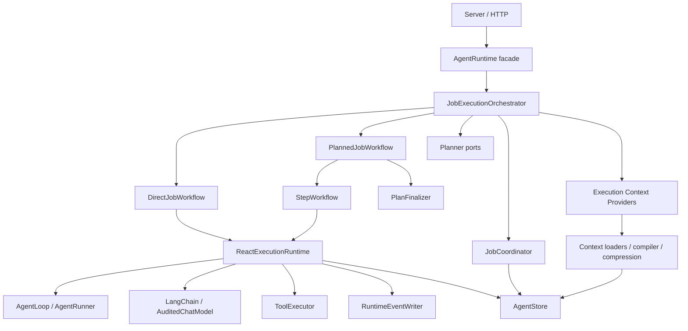
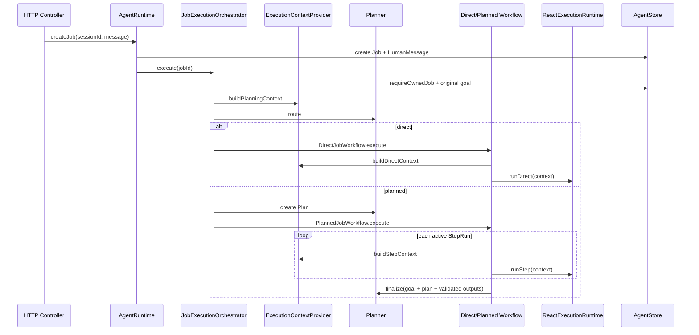

# 07. Orchestration 与 Runtime 职责边界

## 1. 结论

当前系统的执行行为基本正确，但源码分层与真实职责不一致：

- `src/orchestration/agent-runtime.ts` 是面向 HTTP/API 的应用门面，负责 Session、Job、HITL 和调度入口；
- `src/server/runtime/job-execution.service.ts` 才是实际的 Job 编排器；
- `src/runtime/executors/plan-executor.ts`、`step-executor.ts` 和 `direct-job-executor.ts` 承担业务 workflow；
- `src/runtime/executors/react-executor.ts` 同时负责上下文策略、压缩选择、模型审计、工具执行和 ReAct Core 装配。

因此问题不是 `orchestration` 文件数量少，而是“决定执行什么、下一步是什么”的代码落在了 `server/runtime` 和 `runtime/executors`。

本次重构只调整后端内部职责、依赖方向和命名，不修改：

- PostgreSQL schema；
- AgentStore 接口及事务命令；
- Job、Plan、PlanStep、StepRun 状态机；
- createPlan → createStepRun → ReAct → commitStepOutput → finalize 的执行顺序；
- RuntimeEventWriter 和 SSE 事件类型、提交顺序；
- Context v6 的 MessageGroup、TurnBundle、manifest 和压缩规则；
- HTTP API、SessionView 和 Context Preview contract。

## 2. 最小心智模型

```text
Server           接收请求、装配依赖
Orchestration    决定执行什么、何时执行、下一步是什么
Runtime          可靠执行一次模型/工具/ReAct 操作
Storage          持久化完整事实并提供并发事务
View             从持久化事实生成前端读取模型
```

判断某段代码归属的标准：

- 包含 direct/planned 分支、Job stage 判断、Step 选择、等待/恢复、重试或 finalizing：属于 Orchestration；
- 包含 LangChain invoke/stream、ToolExecutor、AgentLoop、ModelCall audit、RuntimeEventWriter、TokenBudget：属于 Runtime；
- 只负责 NestJS、HTTP、环境变量和 provider 实例化：属于 Server；
- 只负责 SQL、事务、version、lease fencing：属于 Storage。

## 3. 目标依赖方向



依赖规则：

1. `server` 可以依赖 `orchestration`、runtime provider 和 storage composition。
2. `orchestration` 可以依赖 `runtime` 的执行端口、context provider 和 `AgentStore` 接口。
3. `runtime` 不能依赖 `server`，也不能决定 direct/planned 或下一 PlanStep。
4. `context compiler` 不理解 Job stage 和 workflow 分支，只编译 `ContextMaterial`。
5. `storage` 不依赖 orchestration、runtime 或 server。

## 4. 目标目录

```text
src/
  orchestration/
    agent-runtime.ts
    context-inspection.service.ts

    execution/
      job-execution-orchestrator.ts
      execution-context-provider.ts
      execution-policy.ts

    workflows/
      direct-job-workflow.ts
      planned-job-workflow.ts
      step-workflow.ts
      plan-finalizer.ts

    lifecycle/
      job-coordinator.ts
      job-lease-manager.ts

  runtime/
    react-execution-runtime.ts
    agent-runner.ts
    audited-chat-model.ts
    tool-executor.ts
    runtime-event-writer.ts

    context/
      context-build.service.ts
      context-compiler.ts
      context-compression.service.ts
      session-compression.service.ts
      context-formatter.ts
      context-material.ts
      message-group-builder.ts
      turn-bundle-builder.ts
      tool-result-context-projector.ts
      token-budget.ts

    loaders/
      session-context-loader.ts
      direct-job-context-loader.ts
      plan-context-loader.ts
      step-context-loader.ts
      model-call-context-loader.ts

    execution-limits.ts
    runtime-errors.ts

  planner/
    plan-engine.ts
    plan-summarizer.ts
    planner-prompts.ts
    step-runner.ts
    step-output.ts

  server/
    http/
    runtime/
      default-planner.ts
      langchain-model-provider.ts
      runtime-context-config.ts
```

`server/runtime` 只保留 provider/config/composition，不再保存 Job workflow。

## 5. Orchestration 组件职责

### 5.1 `AgentRuntime`

它继续作为应用门面，负责：

- Session create/list/delete；
- Job create/cancel/retry；
- HITL answer/resume；
- claim 后调度 `JobExecutionOrchestrator.execute(jobId)`；
- 返回 SessionView。

它不负责 direct/planned 分支，也不装配 Planner、Context Loader、ReAct Runtime。

### 5.2 `JobExecutionOrchestrator`

它由当前 `RuntimeJobExecutionService` 迁移而来，是一次 Job 执行的唯一总控：

1. 防止同进程重复执行同一 Job；
2. 启动、停止 lease heartbeat；
3. 校验当前 worker ownership；
4. 读取 canonical original goal；
5. 获取 job-level planning context；
6. 在 strategy 尚未确定时执行 route/create Plan；
7. 分派 `DirectJobWorkflow` 或 `PlannedJobWorkflow`；
8. 异常时只在仍拥有 lease 的情况下写 Job failure。

它不直接运行 AgentLoop，不解析 ToolCall，也不拼 LangChain Message。

### 5.3 `DirectJobWorkflow`

负责 direct Job 的一个业务流程：

```text
加载 Direct Context
→ 调用 ReactExecutionRuntime
→ 处理 completed / waiting / failed / cancelled 结果
→ 发布必要的最终 Job 投影事件
```

### 5.4 `PlannedJobWorkflow`

负责 planned Job 的状态驱动循环：

```text
读取当前 Job/Plan/StepRun
→ 已 finalizing：PlanFinalizer
→ 有 active StepRun：StepWorkflow
→ 无 active StepRun：创建下一个 StepRun
→ waiting：退出等待恢复
→ retryStep：重新进入循环
→ terminal：结束
```

现有持久化状态机仍是唯一恢复依据，不新增内存 workflow 状态。

### 5.5 `StepWorkflow`

负责一次 StepRun 的 orchestration：

- 请求 Step Context；
- 调用 `ReactExecutionRuntime.runStep`；
- 根据结果决定等待、结束或由 PlannedJobWorkflow 继续循环。

StepOutput 验证和 repair 仍由现有 `StepRunner` 完成，避免修改执行语义。

### 5.6 `ExecutionContextProvider`

Orchestration 不直接判断使用哪个 Loader/压缩策略，而是通过明确端口请求上下文：

```ts
export interface ExecutionContextProvider {
  buildPlanningContext(job: AgentJob, originalGoal: string): Promise<BuiltContext>;
  buildDirectContext(job: AgentJob, originalGoal: string): Promise<BuiltContext>;
  buildStepContext(input: {
    job: AgentJob;
    originalGoal: string;
    step: AgentPlanStep;
    stepRun: AgentStepRun;
  }): Promise<BuiltContext>;
}
```

实现可以继续复用现有 `ContextBuildService`、Loader 和压缩服务。workflow 只表达上下文用途，不理解 MessageGroup、TurnBundle 或 TokenBudget。

## 6. Runtime 组件职责

### 6.1 `ReactExecutionRuntime`

它由当前 `ReactExecutor` 收缩而来，只负责执行一次已经准备好的 ReAct 输入：

```ts
export interface ReactExecutionRuntime {
  runDirect(input: {
    job: AgentJob;
    context: BuiltContext;
  }): Promise<DirectAgentRunResult>;

  runStep(input: {
    job: AgentJob;
    stepRun: AgentStepRun;
    context: BuiltContext;
  }): Promise<StepRunnerResult>;

  createAuditedModel(input: {
    job: AgentJob;
    context: BuiltContext;
    callType: AgentModelCallType;
    logicalCallKey: string;
    stepRunId?: string;
    tools?: StructuredToolInterface[];
  }): AuditedChatModel;
}
```

它不再：

- 接收 `loadContext()` 回调；
- 根据 `purpose` 选择 Session/Step 压缩；
- 决定何时重新加载 Context；
- 知道 direct/planned workflow。

它继续负责：

- AgentLoop / AgentRunner / StepRunner 装配；
- LangChain model 与 bindTools；
- AuditedChatModel；
- ToolExecutor；
- RuntimeEventWriter；
- ReAct iteration/tool/deadline limits。

### 6.2 Context 子系统

Context Loader、Compiler、Budget、Compression 继续放在 `runtime/context` 和 `runtime/loaders`，因为它们实现的是模型执行基础设施。

但是以下“选择”从 React Runtime 移到 `ExecutionContextProvider`：

- direct 使用 Session rolling compression；
- step 使用 StepRun working-set compression；
- planning 使用 job-level context；
- preview 禁止写入摘要。

### 6.3 `JobCoordinator`

`JobCoordinator` 移入 `orchestration/lifecycle`。它表达 create/claim/cancel/retry/resume 等应用状态转换，依赖 AgentStore 事务，但不属于单次 ReAct 执行机制。

lease fencing 的 SQL 和事务仍留在 storage；`JobCoordinator` 只提供 orchestration 语义。

## 7. 一次 Job 的目标调用链



## 8. 两阶段迁移

### 阶段一：职责归位，不改变行为

执行纯移动和重命名：

- `RuntimeJobExecutionService` → `JobExecutionOrchestrator`；
- `DirectJobExecutor` → `DirectJobWorkflow`；
- `PlanExecutor` → `PlannedJobWorkflow`；
- `StepExecutor` → `StepWorkflow`；
- `PlanFinalizer` 移到 orchestration/workflows；
- `JobCoordinator` 移到 orchestration/lifecycle；
- 更新 import、server composition 和测试路径。

阶段一保持类内部逻辑不变，先确保目录表达真实职责。

### 阶段二：拆轻 ReactExecutor

新增 `ExecutionContextProvider`，把以下逻辑从 ReactExecutor 移出：

- `ContextBuildService` 调用；
- Session/Step 压缩策略选择；
- Context reload；
- `purpose` 分支。

随后将 `ReactExecutor` 重命名为 `ReactExecutionRuntime`，输入从 `loadContext()` 变为已经编译好的 `BuiltContext`。

阶段二不改变最终 LangChain Message、InputManifest、ModelCall checksum 或 Tool/SSE 时序。

## 9. 错误与恢复边界

- Job ownership、heartbeat 和 `failIfOwned` 由 `JobExecutionOrchestrator` 统一负责；
- Direct/Planned/Step workflow 不单独吞掉 lease-lost；
- `ReactExecutionRuntime` 返回 typed execution result，协议错误继续抛 `RuntimeError`；
- Context 构建失败发生在调用 ReAct 前，由 orchestrator 走现有 Job failure 收口；
- HITL waiting 仍通过已提交的 Job/StepRun/UserInputRequest 恢复；
- 服务重启后仍根据数据库 Job stage、PlanStep status 和 active StepRun 恢复，不依赖进程内 workflow 状态。

## 10. 测试与验收

### 10.1 结构验收

- `src/server/runtime` 不再包含 Job workflow；
- `src/runtime` 不包含 direct/planned/next-step/finalizing 分支；
- `src/orchestration` 拥有 Job execution、workflow 和 lifecycle；
- runtime 不 import server；
- workflow 只依赖明确的 Runtime/Context/Store 端口。

### 10.2 行为回归

- direct Job 完整通过；
- planned 两 Step Job 完整通过；
- Step retry、HITL wait/resume、Job cancel/retry 完整通过；
- Context Preview 和 ModelCall reconstruction 保持不变；
- ToolCall/ToolResult 与 SSE 顺序保持不变；
- lease lost 不会由旧 worker 写 failure。

### 10.3 自动验证

```bash
npm test
npm run test:postgres
npm run typecheck
npm run build
```

还必须确认以下冻结文件没有行为性 diff：

```text
src/storage/postgres/schema-v1.ts
src/storage/postgres/transaction-commands.ts
src/runtime/runtime-event-writer.ts
```

## 11. 明确不采用的方案

### 方案 A：只给 `RuntimeJobExecutionService` 改名，不移动 workflow

优点是改动小，但 `orchestration` 仍然没有 Plan/Step workflow，目录问题没有解决。

### 方案 B：把 Context、Tool、Model、Event 全部移动到 orchestration

这会让 orchestration 变成新的巨型 runtime。ContextCompiler、ToolExecutor、AuditedChatModel 和 RuntimeEventWriter 属于执行机制，不应该上移。

### 方案 C：重新设计状态机和数据库

当前问题是源码职责归属，不是持久化模型错误。借机修改数据库会扩大风险，也违反现有 Job + StepRun 稳定边界。

## 12. 完成定义

- 阅读 `src/orchestration` 可以看懂一次 Job 从创建、路由、direct/planned、StepRun 到 final 的完整 workflow；
- 阅读 `src/runtime` 可以看懂一次 ReAct/模型/工具执行如何可靠完成，但看不到业务策略分支；
- Server 只负责 transport、provider 和 composition；
- Context v6、持久化事实、SSE 和前端 View 的输出与重构前一致；
- 所有单元、PostgreSQL、typecheck 和 build 验证通过。
