# Runtime 状态机总览

> 更新日期：2026-07-28
> 事实来源：当前 `src/domain`、`src/orchestration/jobs`、`src/runtime` 与 PostgreSQL schema v5。
> 本文是状态语义的主文档；若旧文档与本文冲突，以当前代码、数据库约束和本文为准。

## 1. 为什么先区分三类“状态”

项目里并非所有看起来像状态的字段，都属于同一种状态机。混在一起理解，会误以为刷新页面、服务重启或重试后所有状态都能按同一规则恢复。

| 类别 | 含义 | 代表对象 | 服务重启后是否仍在 |
| --- | --- | --- | --- |
| 持久业务状态 | 写入 PostgreSQL，并由事务和约束保护 | Job、Plan、ToolInvocation、UserInputRequest、ModelCall | 是 |
| 持久过程位置 | 记录 ReAct 循环运行到哪里 | LoopCheckpoint、ToolExecutionAttempt | 是 |
| 进程内运行状态 | 当前 Node.js 进程拥有的控制器或 OS 子进程 | AbortController、`activeExecutions`、ManagedProcess registry | 否，需要从持久事实或 OS 重新识别 |
| 派生展示状态 | View 层根据多张表计算，不是独立事实 | Tool exchange 状态、Session 顶部的最新 Job 状态 | 重新查询后计算 |

两个特别容易误解的边界：

1. `Message`、`Artifact` 是追加事实，不是可反复修改的状态机。草稿流式文本属于 SSE 临时投影，最终消息落库后才成为持久事实。
2. `Session` 当前几乎没有业务流转。复杂状态集中在 Job 及其执行子对象中。

## 2. 总体所有权关系

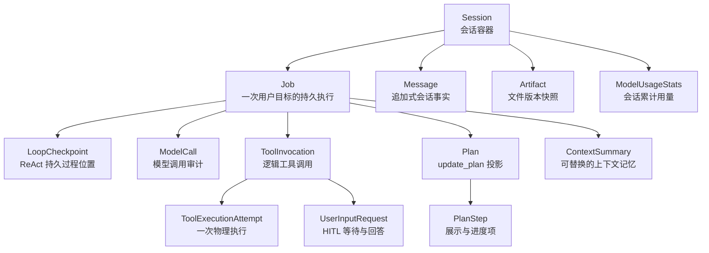

理解原则：

- Session 是边界；Job 是一次执行；Attempt 是 Job 的一次执行权周期。
- ReAct 是唯一执行循环。Plan 是 `update_plan` 工具维护的持久投影，不是外层 Plan 循环嵌套 Step 循环。
- 一个 Job 可以有多个 Job Attempt，但当前没有单独的 `agent_job_attempts` 表。Attempt 身份分布在 `agent_jobs.current_attempt_id`、Checkpoint、ToolInvocation 和 ToolExecutionAttempt 中。

## 3. Job 主状态机

### 3.1 状态定义

| 状态 | 含义 | 是否持有执行权 | 是否终态 |
| --- | --- | --- | --- |
| `created` | Job 和目标消息已提交，但尚未获得一次执行 Attempt | 否 | 否 |
| `running` | 首次执行或人工 Resume 后正在执行 ReAct | 是 | 否 |
| `waiting_user_input` | HITL 请求已持久化，等待用户回答 | 否 | 否 |
| `resuming` | 用户已回答全部待处理请求，新 Attempt 正在继续原 Job | 是 | 否 |
| `recovery_required` | 原执行者中断或超时，需要用户显式 Resume | 否 | 否 |
| `completed` | 最终回复与 completed Checkpoint 已原子提交 | 否 | 是 |
| `failed` | Runtime 判定不可继续，错误与失败清理已提交 | 否 | 是 |
| `cancelled` | 用户取消或上层显式取消 | 否 | 是 |

### 3.2 状态图

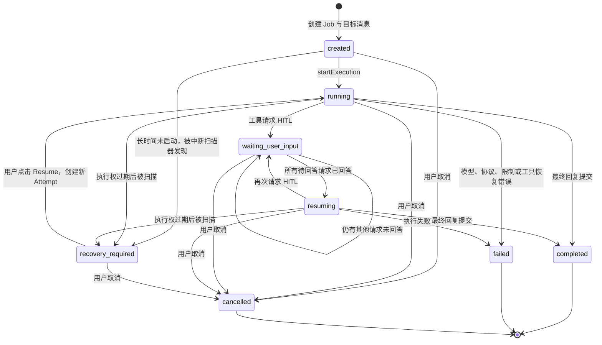

### 3.3 精确迁移表

| 起点 | 终点 | 触发入口 | 主要前置条件 | 同一事务内的重要副作用 |
| --- | --- | --- | --- | --- |
| 无 | `created` | Create Job | Session 存在；同 Session 无其他活动 Job | 插入 Job、HumanMessage；更新 Session 时间/version |
| 无 | `created` | Retry | 源 Job 为 `failed/cancelled` | 插入新 Job；复用原目标 Message，不重复写 HumanMessage；记录 `retryOfJobId` |
| 无 | `created` | Continue as new | 源 Job 为 `failed/cancelled` | 插入新 Job和新 HumanMessage；记录 `retryOfJobId` |
| `created` | `running` | JobAttemptStarter | version 匹配 | 设置 worker、Attempt、执行权到期时间；`attemptNo + 1`；追加初始 Checkpoint |
| `recovery_required` | `running` | Resume | 用户显式调用；version 匹配 | 设置新 Attempt/worker；复制最新 Checkpoint 的恢复位置；`attemptNo + 1` |
| `running/resuming` | `waiting_user_input` | `waitForUserInput` | 当前执行权仍有效；ToolInvocation 正在运行 | 插入 UserInputRequest；Invocation 进入等待；释放 Job 执行权；追加等待 Checkpoint |
| `waiting_user_input` | `waiting_user_input` | 回答其中一个请求 | 同 Job 仍有其他 pending 请求 | 请求变 answered；对应 Invocation 完成；Job 保持等待 |
| `waiting_user_input` | `resuming` | 回答最后一个请求 | request/version/clientAnswerId 合法 | 新 Attempt、新 worker 和执行权；追加 ready/tool_batch Checkpoint；随后调度 ReAct |
| `running/resuming` | `completed` | `completeWithFinalMessage` | 执行权匹配；若有 Plan，必须 completed 或 cancelled | 插入最终 AIMessage；清除执行权；追加 completed Checkpoint；更新 Session |
| `running/resuming` | `failed` | Runtime fail | 当前 worker、Attempt、version 和执行权必须匹配 | 清理 Plan/Step、Invocation、ToolExecutionAttempt、UserInputRequest；追加 failed Checkpoint |
| 任一活动状态 | `cancelled` | Cancel API | Job 仍为活动状态 | 先持久化取消与子对象清理，再 abort 本进程执行；追加 cancelled Checkpoint |
| `created/running/resuming` | `recovery_required` | InterruptedJobScanner | created 过久未启动，或 running/resuming 执行权已过期 | 清空 worker/Attempt/到期时间；保留过程事实供人工 Resume |

“活动 Job”在数据库唯一索引中的定义是：

```text
created | running | waiting_user_input | resuming | recovery_required
```

因此同一 Session 不能同时创建第二个活动 Job。Retry 和 Continue-as-new 也只能从终态 Job 发起。

### 3.4 `running` 与 `resuming` 为什么分开

- `running` 表示首次开始，或从 `recovery_required` 人工恢复。
- `resuming` 专指 HITL 已回答后继续同一个 Job。
- 当前实现不会再把 `resuming` 改回 `running`。两者在执行权刷新、完成、失败、取消、过期恢复方面接受相同处理，但语义和 UI 可以区分。
- `failed` 命令要求有效执行权，因此从当前公开链路看，它实际只可由 `running/resuming` 进入。Resume 检测到不安全工具时，也是先将 `recovery_required -> running`，再失败为 `failed`。

### 3.5 执行所有权刷新不是状态迁移

JobExecutor 只在本进程内为每个 Job 保存一个 `AbortController + completion Promise`。Job 为 `running/resuming` 时，`ExecutionOwnershipService` 周期性延长数据库中的执行权到期时间：

- 必须仍是同一个 worker 和 currentAttemptId。
- 刷新间隔必须小于所有权超时时间。
- 刷新只更新到期时间，不改变 Job status，也不增加 Job version。
- 刷新失败不会在内存中强行“续命”；后续任何带写入围栏的事务会发现执行权已失效。
- 进程退出后定时刷新自然停止，执行权过期，再由 InterruptedJobScanner 标成 recovery_required。

因此“心跳”不是一个用户可见状态，也不应通过 SSE 反复刷新卡片。

### 3.6 Job Attempt 不是 Job

一次 Job 可以经历：

```text
Attempt 1: running -> waiting_user_input
Attempt 2: resuming -> 进程崩溃 -> recovery_required
Attempt 3: running -> completed
```

Attempt 的作用是写入围栏：旧进程即使稍后返回，也不能用过时的 `attemptId + workerId + version` 覆盖新 Attempt 的结果。它不是用户可见的新任务，也不会复制完整会话。

## 4. LoopCheckpoint 状态机

LoopCheckpoint 是追加式的 ReAct 过程日志。每次迁移都插入新行，不更新旧 Checkpoint。

| phase | 含义 | `callMessageId` 规则 |
| --- | --- | --- |
| `ready_for_model` | 下一步应该调用模型 | 必须为空 |
| `tool_batch` | 某条 AIMessage 的工具批次尚未全部稳定结束 | 必须存在 |
| `waiting_user_input` | 工具批次正在等待用户输入 | 必须存在 |
| `completed` | Job 已原子完成 | 必须为空 |
| `failed` | Job 已原子失败 | 必须为空 |
| `cancelled` | Job 已原子取消 | 必须为空 |

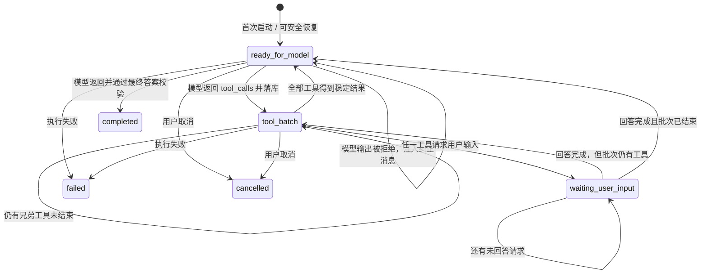

Checkpoint 中还保存：`attemptId`、`sequenceNo`、`iterationNo`、累计执行工具数和恢复元数据。恢复时读取最新一行，因此它是“下一步从哪里继续”的事实来源，而不是重新扫描消息猜测。

## 5. ToolInvocation 与 ToolExecutionAttempt

### 5.1 逻辑调用状态

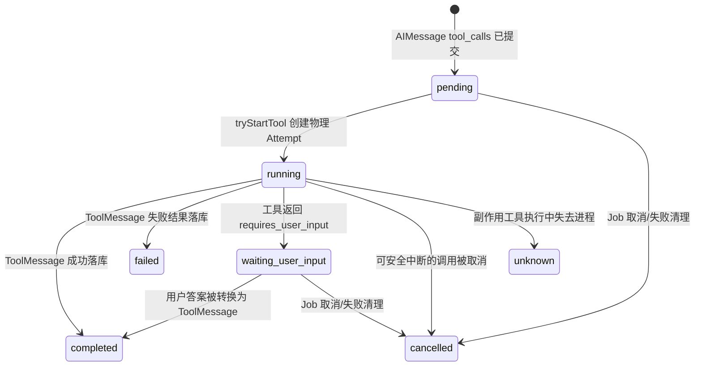

| 状态 | 可否自动再次执行 | 说明 |
| --- | --- | --- |
| `pending` | 视副作用级别，可以在新 Attempt 启动 | 尚未获得物理执行权 |
| `running` | 当前 Attempt 内不可重复启动 | 已有 ToolExecutionAttempt |
| `waiting_user_input` | 否 | 必须先回答请求 |
| `completed` | 否，直接回放结果 | 已有稳定 ToolMessage |
| `failed` | 否，直接回放失败结果 | 失败本身是稳定观察结果 |
| `unknown` | 否，必须人工处理 | 无法确认副作用是否已发生 |
| `cancelled` | 否 | 随 Job 终止或安全中断 |

### 5.2 物理执行 Attempt 状态

| 状态 | 含义 |
| --- | --- |
| `running` | 某一次工具函数正在执行 |
| `completed` | 此 Attempt 成功并提交稳定结果 |
| `failed` | 此 Attempt 返回稳定失败结果 |
| `interrupted` | 可安全重放的执行被进程中断 |
| `unknown` | 副作用工具可能已经执行，但结果未提交 |

`ToolInvocation` 解决“这次逻辑工具调用是什么”，`ToolExecutionAttempt` 解决“它实际跑了几次、每次结局是什么”。二者不能合并，否则无法区分重放和重复副作用。

### 5.3 副作用级别决定恢复策略

| `sideEffectLevel` | 中断后的默认处理 |
| --- | --- |
| `read_only` | 原 Attempt 标为 interrupted，新 Attempt 可重新执行 |
| `idempotent` | 原 Attempt 标为 interrupted，新 Attempt 可重新执行 |
| `side_effecting` | 原 Attempt 和 Invocation 标为 unknown，自动恢复被阻断 |

## 6. UserInputRequest 状态机

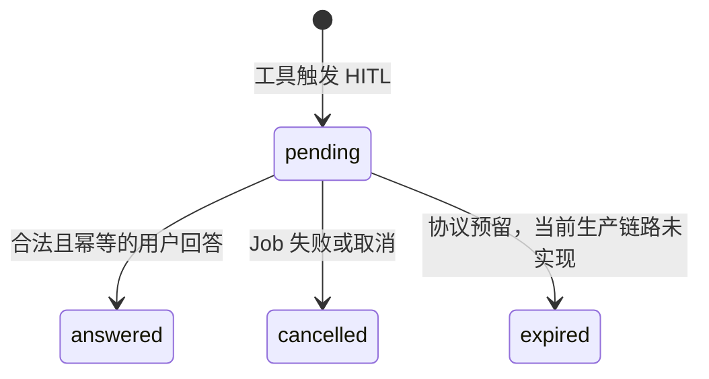

当前真实生产路径：

- `source = tool`
- `answerMode = as_tool_result`
- 用户答案会被落成 ToolMessage，使原 ToolInvocation 从 `waiting_user_input` 变为 `completed`。

`source = agent`、`answerMode = as_user_message` 和 `expired` 目前属于协议预留/测试能力，不能在产品说明中宣称已完成。

## 7. Plan 与 PlanStep 状态机

Plan 由独占工具 `update_plan` 管理，是 ReAct 的持久进度投影。

### 7.1 Plan

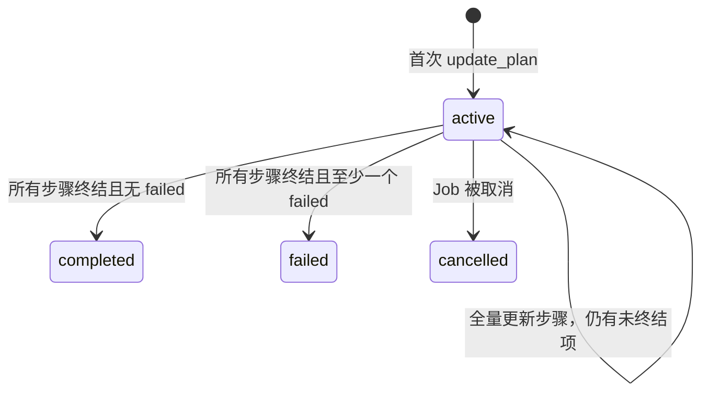

Plan 到达 `completed/failed/cancelled` 后不可再修改。特别注意：Job 的最终答案只允许 Plan 为 `completed` 或 `cancelled`；Plan `failed` 会阻止 Job 直接完成，Runtime 必须先形成明确失败结局。

### 7.2 PlanStep

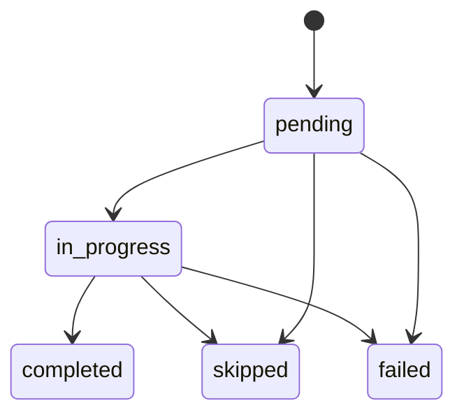

约束：

- `update_plan` 每次发送完整 Plan，不允许省略已有 Step；不再执行的 Step 必须显式标记 `skipped`。
- Step 的 key 和 ID 稳定；终态 Step 不可改变。
- 未全部终结时恰好一个 `in_progress`；全部终结后必须为零。
- Step 的摘要由模型提供，证据 Message/Artifact 由 Runtime 关联并保留。

## 8. ModelCall 的双状态

ModelCall 同时有“调用是否结束”和“输出是否被 Runtime 接受”两个维度。

### 8.1 调用状态

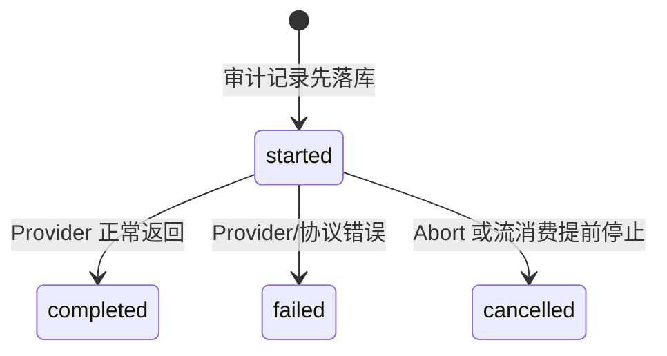

### 8.2 输出处置

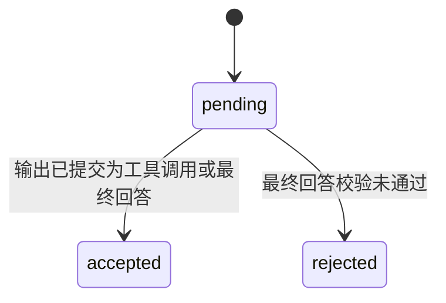

Provider 返回成功不等于输出被采用。被拒绝的输出仍保留在审计表中，但不会作为最终 Message；Runtime 追加 `ready_for_model` Checkpoint 并向模型注入纠正信息。

## 9. ContextSummary 状态机

| 状态 | 当前行为 |
| --- | --- |
| `active` | 当前规则版本、owner、purpose、summaryType 下的有效记忆 |
| `superseded` | 新摘要替换旧摘要时，旧版本保留供审计 |
| `failed` | schema/领域预留；当前压缩失败走降级，不写 failed 摘要 |

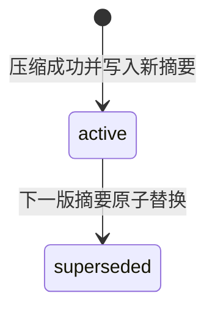

摘要不会覆盖 Message。它只改变下一次 Context 选择，原始会话事实仍在数据库中。

### 9.1 Context pressure 不是生命周期状态

每次 Context 编译会根据预测输入 Token 比例计算 `normal | watch | compact | mandatory | critical`。当前默认阈值依次为 0.4、0.55、0.75、0.9。它记录在 ModelCall 的 input manifest 中，用于决定本轮是否压缩；下一轮会重新计算，不会像 Job 状态一样做持久迁移。完整策略见 [07-context-compression-service-deep-dive.md](./07-context-compression-service-deep-dive.md)。

## 10. Session 状态机

Session 领域枚举为：

```text
active | archived
```

当前实现：

- 创建时进入 `active`。
- 没有 archive/unarchive 命令，`archived` 尚不可达。
- 删除 Session 是物理删除，不是转成 archived。数据库外键级联删除子记录，成功后再删除 workspace；HTTP 层关闭对应 SSE 连接。

因此 UI 不应把 Session 当作 running/completed 状态机。页面顶部的运行状态实际上来自该 Session 的最新 Job。

## 11. ManagedProcess：本地状态机，不是数据库状态机

schema v4 曾创建 `agent_managed_processes`，schema v5 已删除。当前进程状态来自 OS 子进程、workspace marker、日志和当前 Node.js 进程内 registry。

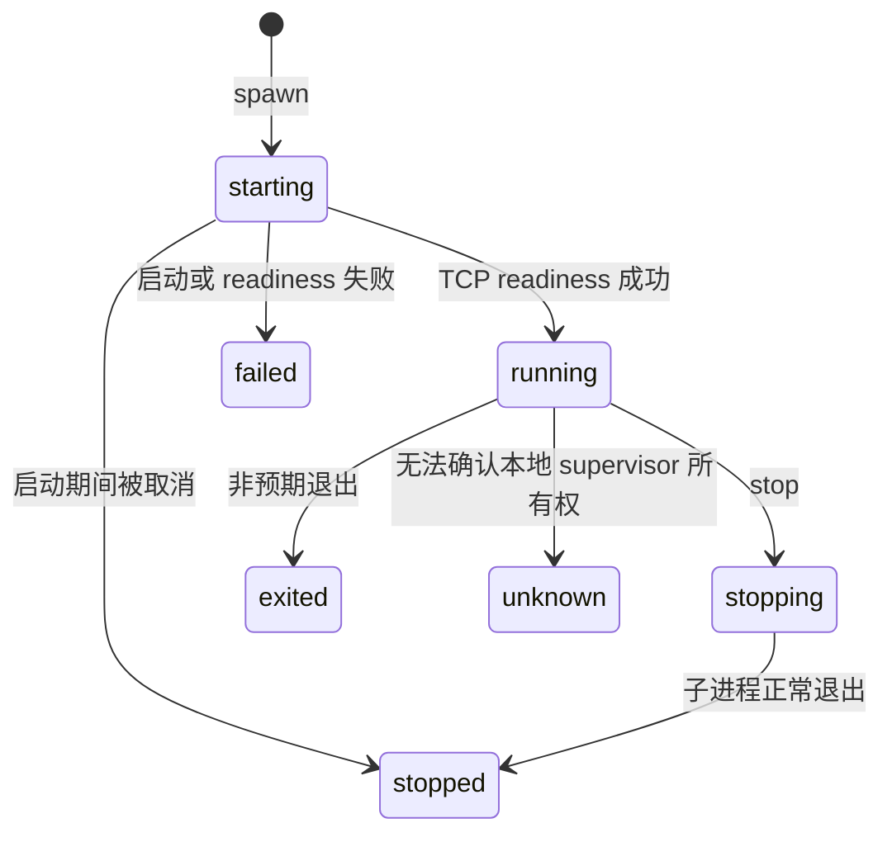

刷新页面时，ManagedProcess 的展示需要重新查询本地运行环境；不能期待 PostgreSQL 恢复它。

## 12. 哪些对象没有独立状态机

### 12.1 Message

Message 是追加式事实，类型包括：

- `user_message`
- `assistant_message`
- `tool_call`
- `tool_result`
- `system_prompt`
- `progress`
- `error_notice`
- `code_artifact`

SSE `message.delta` 是当前响应草稿，不是 Message 表的一行。最终输出被接受后，Runtime 原子插入最终 Message；输出被拒绝则发送 `message.discarded` 丢弃前端草稿。

### 12.2 Artifact

Artifact 表示某个文件的不可变版本快照。新内容产生新 revision，不在原行上维护 `running/completed`。

### 12.3 ModelUsageStats

它是 Session 维度的持久累计投影。ModelCall 完成事务按输入占上下文窗口比例计算 `normal/high/critical`：低于 0.7、达到 0.7、达到 0.9；前端只读取该投影。它仍不是业务生命周期状态机。

### 12.4 Tool exchange

前端工具卡片是从 tool-call Message、ToolInvocation、Tool-result Message 合并得到。聚合状态优先级为：

```text
unknown > waiting_user_input > running > pending > failed > cancelled > completed
```

因此数据库里没有 `tool_exchange` 表。

## 13. 跨实体提交边界

下表区分一次事务内的原子写入，也明确标注少数业务动作中的顺序事务；不能因为它们属于同一次模型循环，就假设全部在同一个 PostgreSQL 事务中。

| 业务动作 | 一次事务中一起改变的核心对象 |
| --- | --- |
| 创建任务 | Job(created) + HumanMessage + Session version |
| 启动 Attempt | Job(running) + 初始/恢复 Checkpoint |
| 模型输出被接受 | 先单独将 ModelCall output disposition 设为 accepted；随后事务提交 AIMessage(tool_call) + ToolInvocation(pending) + Checkpoint(tool_batch) |
| 开始工具 | ToolInvocation(running) + ToolExecutionAttempt(running) |
| 工具完成 | ToolExecutionAttempt terminal + ToolInvocation terminal + ToolMessage + Checkpoint(tool_batch/ready_for_model) + Artifact/Plan 证据 |
| 触发 HITL | UserInputRequest(pending) + ToolInvocation(waiting) + Job(waiting) + Checkpoint(waiting) |
| 回答 HITL | UserInputRequest(answered) + ToolInvocation(completed) + ToolMessage/HumanMessage + Job(waiting/resuming) + Checkpoint |
| 更新计划 | `plans.applyUpdate` 原子提交 Plan + PlanSteps；随后通用工具结果事务再提交 ToolMessage，证据关联由 Runtime 保留 |
| Job 完成 | final AIMessage + Job(completed) + Checkpoint(completed) + Session version |
| Job 失败/取消 | Job terminal + Plan/Steps + ToolInvocation/Attempts + pending UserInputRequest + terminal Checkpoint |
| 上下文压缩 | 旧 ContextSummary(superseded) + 新 ContextSummary(active) |

核心原则是“先写稳定事实，再发布 SSE”。前端实时 View 与刷新后的 SessionView 才能收敛到同一结果。

## 14. 全局不变量

1. 同一 Session 最多一个活动 Job。
2. 只有 `running/resuming` 可以持有 worker 和执行权到期时间；其他状态必须为空。
3. 终态 Job 必须有 `completedAtMs`，且不能再被 Resume/Cancel/Complete。
4. 旧 Attempt 不能向新 Attempt 写结果。
5. completed/failed ToolInvocation 必须关联结果 Message 和完成时间。
6. side-effecting 工具在中断后若无法确认结果，只能进入 unknown，不能自动重放。
7. 一个 Job 最多一个 Plan；Plan Step key/position 在 Plan 内唯一。
8. 同一逻辑 ModelCall 同时最多一条 started 记录。
9. 同一 ContextSummary scope 同时最多一个 active 版本。
10. 任何等待用户输入的 ToolInvocation 都必须有 pending UserInputRequest；回答必须支持 `clientAnswerId` 幂等。
11. SessionView 是刷新后的权威读模型；SSE 只增量投影已提交事实和临时 delta。

## 15. 阅读代码的建议顺序

1. 领域状态：`src/domain/job.ts`、`loop-checkpoint.ts`、`tool-invocation.ts`、`user-input-request.ts`、`plan.ts`。
2. 用户命令分支：`src/orchestration/jobs/flows/*.flow.ts`。
3. 执行所有权：`shared/job-attempt-starter.ts`、`execution-ownership.service.ts`、`interrupted-job-scanner.ts`。
4. ReAct 退出和恢复：`src/runtime/loop/agent-loop.ts`、`src/runtime/execution/react-execution.ts`。
5. 原子事务：`src/storage/postgres/commands/*.commands.ts`。
6. 数据库最终约束：`src/storage/postgres/schema-v1.ts` 到 `schema-v5.ts`。

数据库表级说明见 [09-database-table-reference.md](./09-database-table-reference.md)，HITL、Resume、Retry、Continue-as-new 的可执行手册见 [10-hitl-recovery-retry-playbook.md](./10-hitl-recovery-retry-playbook.md)。
