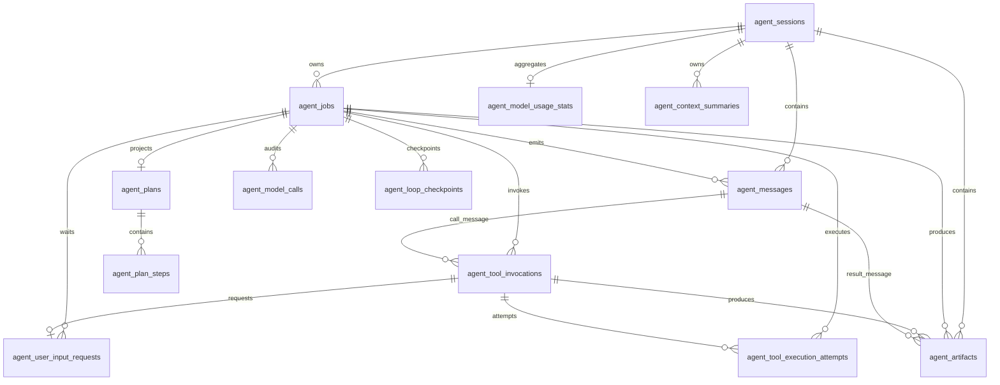
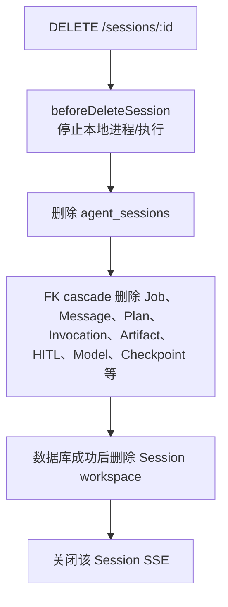

# PostgreSQL 数据库表字典与事务关系

> 更新日期：2026-07-28
> 当前 schema：v5 `local-workspace-process-supervision`
> 事实来源：`src/storage/postgres/schema-v1.ts` 至 `schema-v5.ts`、`src/storage/agent-store.ts` 和 `src/storage/postgres/commands`。

## 1. 当前数据库里究竟有哪些表

当前有效业务表共 14 张：

| # | 表 | 类型 | 主要用途 |
| --- | --- | --- | --- |
| 1 | `agent_schema_versions` | schema 元数据 | 记录每版 migration 名称、checksum 和执行时间 |
| 2 | `agent_sessions` | 聚合根 | 会话边界与列表排序 |
| 3 | `agent_jobs` | 核心状态 | 一次用户目标的持久执行与执行权 |
| 4 | `agent_plans` | 进度投影 | 一个 Job 的可见计划 |
| 5 | `agent_plan_steps` | 进度投影 | Plan 的稳定步骤 |
| 6 | `agent_messages` | 追加事实 | LangChain 消息、工具调用/结果和 UI 时间线 |
| 7 | `agent_tool_invocations` | 核心状态 | 一次逻辑工具调用及其稳定结果 |
| 8 | `agent_artifacts` | 追加事实 | 工具产出的文件版本快照 |
| 9 | `agent_user_input_requests` | HITL 状态 | 人工输入请求、答案和幂等信息 |
| 10 | `agent_context_summaries` | 版本化记忆 | 上下文压缩结果及替换链 |
| 11 | `agent_model_calls` | 审计状态 | 每次模型调用的输入、输出、usage 和处置 |
| 12 | `agent_model_usage_stats` | 聚合投影 | Session 级累计 Token 使用 |
| 13 | `agent_loop_checkpoints` | 追加过程事实 | ReAct 下一步应从哪里继续 |
| 14 | `agent_tool_execution_attempts` | 执行审计 | 逻辑工具调用的每一次物理执行 |

`agent_managed_processes` 不在当前 schema 中：v4 曾创建，v5 已删除。进程 PID、端口和存活状态属于本地操作系统，不再持久化到 PostgreSQL。

## 2. Migration 历史

| 版本 | 名称 | 变化 |
| --- | --- | --- |
| v1 | `unified-job-react-canonical` | 建立 Session、Job、Plan、Message、Tool、Artifact、HITL、Context、Model 审计等主表 |
| v2 | `durable-react-checkpoints` | 新增 LoopCheckpoint、ToolExecutionAttempt；Invocation 增加执行次数 |
| v3 | `explicit-job-recovery` | Job 新增 `recovery_required`，并纳入同 Session 活动 Job 唯一约束 |
| v4 | 本地进程持久化尝试 | 新增 `agent_managed_processes` |
| v5 | `local-workspace-process-supervision` | 删除 `agent_managed_processes`，恢复本地 OS 作为事实源 |

启动 Server 只验证 schema 是否为最新版本，不应在生产启动路径中偷偷迁移。迁移必须通过显式脚本完成。

## 3. 关系总图



## 4. 表级字典

### 4.1 `agent_schema_versions`

**作用**：migration 的不可变账本。

关键字段：

- `version`：主键，整数版本。
- `name`：唯一的人类可读迁移名。
- `checksum`：对应 SQL 的 SHA-256，用于发现历史 migration 被篡改。
- `applied_at_ms`：应用时间。

写入时机：每个 schema migration 成功事务的最后一步。运行期业务代码不应修改。

### 4.2 `agent_sessions`

**作用**：会话聚合根、workspace 边界、列表入口。

关键字段：

- `id`：`session_*`。
- `title`：可空；当前默认可显示 New task。
- `status`：`active | archived`。
- `version`：会话聚合版本；新消息/Job 完成等动作会 touch。
- `created_at_ms / updated_at_ms`：列表排序与更新时间。

当前流转：只创建 `active`；没有 archive/unarchive 命令。DELETE 是物理删除。

约束与索引：`(status, updated_at_ms desc, id)` 支持会话列表。

AgentStore：`store.sessions.create/list/get/delete/...`。

### 4.3 `agent_jobs`

**作用**：一次用户目标的生命周期、并发控制和执行所有权。

关键字段分组：

- 身份：`id`、`session_id`、`retry_of_job_id`、`client_request_id`。
- 状态：`status`、`version`。
- Attempt：`current_attempt_id`、`attempt_no`。
- 执行所有权：`lease_owner`、`lease_expires_at_ms`。
- 失败：`error_code/message/details`。
- 目标关联：`metadata.goalMessageId`。
- 时间：created/updated/started/completed。

状态：

```text
created | running | waiting_user_input | resuming |
recovery_required | completed | failed | cancelled
```

关键约束：

1. 同 Session 对活动状态建立部分唯一索引。
2. `(session_id, client_request_id)` 唯一，支持创建请求幂等。
3. `running/resuming` 当且仅当 worker 和到期时间同时存在。
4. completed/failed/cancelled 必须有 `completed_at_ms`。

重要警告：字段名仍叫 `lease_*`，语义上应理解为“执行所有权和到期时间”，不是基础设施租赁。

AgentStore：`store.jobs.*`。

### 4.4 `agent_plans`

**作用**：`update_plan` 工具维护的 Job 级进度投影。

关键字段：`session_id`、唯一 `job_id`、`title`、`goal`、`status`、`version`、完成时间。

状态：`active | completed | failed | cancelled`。

约束：`job_id unique`，所以一个 Job 最多一个 Plan；更新通过 version 做 CAS。

AgentStore：`store.plans.getByJobId/applyUpdate`。

### 4.5 `agent_plan_steps`

**作用**：Plan 内稳定、可排序、可审计的步骤。

关键字段：

- `plan_id`、`key`、`position`。
- `title/description`。
- `status`：`pending | in_progress | completed | failed | skipped`。
- `result`、错误三元组、version、metadata、时间。

约束：

- `(plan_id,key)` 唯一。
- `(plan_id,position)` 唯一。
- `result` 只能为空或 JSON object。

不是 StepRun：没有独立模型循环、Attempt 或 Step 上下文。

### 4.6 `agent_messages`

**作用**：会话和 ReAct 的追加式消息事实，是刷新后时间线和上下文重建的基础。

关键字段：

- `row_id bigserial`：真正的全局持久顺序游标。
- `id`：业务 Message ID。
- 归属：session/job/plan/plan_step/attempt/output。
- LangChain 语义：`role`、`message_type`、`content`。
- 展示：`visibility`、`channel`。
- Tool 协议：`tool_calls` 或 `tool_call_id/tool_name/tool_result`。

Message 类型与合法 role：

| message_type | role | 说明 |
| --- | --- | --- |
| `user_message` | user | 用户目标或协议允许的人类答案 |
| `assistant_message` | assistant | 最终或普通 AI 消息 |
| `tool_call` | assistant | AIMessage，必须有非空 tool_calls array |
| `tool_result` | tool | ToolMessage，必须有 tool_call_id/name/result |
| `system_prompt` | system | 必须 internal |
| `progress/error_notice/code_artifact` | assistant | UI 或内部运行事实 |

关键约束：`(job_id,output_id)` 非空时唯一，防止同一模型输出重复落成 Message。

顺序原则：使用 `row_id`，不要使用毫秒时间排序；同一毫秒内可以写入多行。

删除行为：Session/Job 删除时 cascade；Plan/Step 删除时只 set null，保留消息事实。

### 4.7 `agent_tool_invocations`

**作用**：模型生成的一次逻辑工具调用。它跨越恢复和多个物理执行 Attempt。

关键字段：

- 归属：session/job/plan/step/attempt。
- 关联：`call_message_id`、`result_message_id`。
- 协议：`tool_call_id`、`tool_name`、arguments/checksum。
- 安全：`side_effect_level`、`idempotency_key`。
- 状态、结果/错误、version、执行次数和时间。

唯一性：

- `(job_id,tool_call_id)`：模型逻辑调用唯一。
- `(job_id,idempotency_key)`：Runtime 幂等键唯一。

completed/failed 必须有结果 Message 和完成时间。`call_message_id` 与 `result_message_id` 使用 restrict，防止删除仍被工具事实引用的消息。

AgentStore：`store.execution.getToolInvocation/commitModelToolCalls/tryStartTool/commitToolResult/...`。

### 4.8 `agent_artifacts`

**作用**：文件型工具产物的不可变版本目录，不保存文件正文的业务副本。

关键字段：

- 归属：session/job/plan/step/toolInvocation/resultMessage。
- 分类：`kind=file`、`area=code|docs|artifacts|downloads`。
- 文件定位：title/file_name/logical_path/storage_path/media_type。
- 完整性：size/checksum/revision。

唯一性：

- `(session_id, logical_path, revision)`。
- `(tool_invocation_id, storage_path)`。

文件实际内容在 Session workspace，表中记录稳定索引与版本。不要把 Artifact 当进程状态或临时上传任务。

### 4.9 `agent_user_input_requests`

**作用**：HITL 请求及其回答的持久状态和幂等边界。

关键字段：

- 归属与可选 ToolInvocation。
- `source=tool|agent|recovery`。
- `answer_mode=as_tool_result|as_user_message`。
- `status=pending|answered|cancelled|expired`。
- prompt/schema/answer/answerMessage/clientAnswerId/version/时间。

关键约束：

1. tool source 必须有关联 ToolInvocation，且 answerMode 必须是 `as_tool_result`。
2. answered 必须同时有 answer、answerMessage、clientAnswerId 和 answeredAt。
3. 一个 ToolInvocation 最多一个请求。
4. `(job_id,client_answer_id)` 唯一，回答接口可以安全重试。

当前生产路径只使用 tool + as_tool_result；expired 尚无生产迁移命令。

### 4.10 `agent_context_summaries`

**作用**：保存上下文压缩的版本化记忆；不删除或覆盖原始 Message。

关键字段：

- owner：session/job + ownerId。
- purpose：conversation/job_execution。
- 规则和类型：contextRulesVersion、summaryType。
- 覆盖范围：sourceRowIdStart/End。
- 版本链：parentSummaryId、replacesSummaryId。
- 内容与审计：summary/format/token counts/model/prompt version/checksum/version。

状态：`active | superseded | failed`。

关键约束：同一 `(ownerType,ownerId,purpose,rulesVersion,summaryType)` 最多一个 active。

替换事务：先将旧 active 改成 superseded，再插入新 active。多轮压缩因此形成可审计链，而不是原地覆盖。

AgentStore：`store.context.*`。

### 4.11 `agent_model_calls`

**作用**：模型调用的完整审计和重建输入依据。

关键字段：

- 归属：session/job/attempt。
- 幂等与重试：logicalCallKey、callAttemptNo、outputId。
- 类型：`job.react | context.compress`。
- 调用状态和输出 disposition。
- provider/model/contextRulesVersion。
- `input_manifest`、完整 `input_messages`、checksum。
- max context、reserved output、estimated/actual/cache token usage。
- result、tool names、error、metadata、时间。

关键约束：

1. `(job_id,logical_call_key,call_attempt_no)` 唯一。
2. 同 Job+logicalCallKey 最多一个 started。
3. `(job_id,output_id)` 非空时唯一。
4. completed/failed/cancelled 必须有 completedAt。

ModelCall completed 只表示 provider 调用结束；输出仍可能 pending、accepted 或 rejected。

AgentStore：`store.models.*`。

### 4.12 `agent_model_usage_stats`

**作用**：避免每次 UI 请求扫描所有 ModelCall，维护 Session 级累计投影。

内容：调用次数、estimated/actual input、output、cache read/write、total、latest model/call、最新上下文占比、warningLevel、version。

主键就是 `session_id`，一对零或一。ModelCall 完成事务内 upsert。

它是可重建投影，不是账本；精确审计应回查 `agent_model_calls`。

### 4.13 `agent_loop_checkpoints`

**作用**：ReAct 循环的追加式持久位置，用于人工 Resume 后精确判断下一步。

关键字段：session/job/attempt、sequenceNo、phase、callMessageId、iterationNo、executedToolCalls、metadata、createdAt。

约束：

- `(job_id,sequence_no)` 唯一且 sequence 从 1 递增。
- tool_batch/waiting_user_input 必须有 callMessageId。
- 其他 phase 必须没有 callMessageId。

最新 Checkpoint 查询使用 `(job_id,sequence_no desc)` 索引。不要更新旧行，也不要仅靠 Message 类型推断恢复位置。

### 4.14 `agent_tool_execution_attempts`

**作用**：一次逻辑 ToolInvocation 的物理执行历史。

关键字段：invocationId/jobId/jobAttemptId、attemptNo、workerId、status、错误、开始/结束时间。

状态：`running | completed | failed | interrupted | unknown`。

约束：`(invocation_id,attempt_no)` 唯一。Job 恢复时：

- 可安全重放的旧 running Attempt -> interrupted。
- side-effecting 旧 running Attempt -> unknown。

当前实现缺口：`request_user_input` 进入 waiting、以及答案把 ToolInvocation 改为 completed 时，`user-input.commands.ts` 没有同步终结对应的 running ToolExecutionAttempt。因此数据库可能出现“Invocation 已 completed，但它的物理 Attempt 仍 running”。这是现状记录，不是目标设计；后续应补一个明确的 HITL Attempt 终结语义和事务约束。

## 5. AgentStore 与表的对应

调用方只依赖一个 `AgentStore`，按能力 scope 访问：

| Scope | 主要表 | 示例 |
| --- | --- | --- |
| `store.sessions` | sessions + 会话关联表查询 | `sessions.listMessages()` |
| `store.jobs` | jobs + 创建 Job 时的 messages/session/checkpoint | `jobs.startExecution()` |
| `store.execution` | checkpoints + invocations + attempts + messages + HITL + artifacts | `execution.commitToolResult()` |
| `store.plans` | plans + plan_steps | `plans.applyUpdate()` |
| `store.models` | model_calls + model_usage_stats + checkpoint disposition | `models.completeCall()` |
| `store.context` | context_summaries | `context.replaceSummary()` |

Scope 是业务能力边界，不等于“一张表一个 Repository”。跨表一致性必须留在一个 Store command 事务里。

## 6. 跨表事务矩阵

| Command | 读/锁 | 写入 |
| --- | --- | --- |
| `jobs.createWithUserMessage` | Session；活动 Job 唯一约束 | Job + Message + Session |
| `jobs.createRetry` | 源 Job/目标 Message；Session | 新 Job + Session，不新增 Message |
| `jobs.startExecution` | Job for update；最新 Checkpoint | Job + 新 Checkpoint |
| `jobs.renewExecutionOwnership` | Job 条件更新 | 只延长执行权，不增加 Job version |
| `execution.commitModelToolCalls` | Job 所有权；output 幂等 | AIMessage + N 个 Invocation + tool_batch Checkpoint |
| `execution.tryStartTool` | Job 所有权；Invocation for update | Invocation running + ToolExecutionAttempt running |
| `execution.commitToolResult` | Job 所有权；Invocation/Attempt | Attempt terminal + Invocation terminal + ToolMessage + Artifact + Checkpoint/Plan evidence |
| `execution.waitForUserInput` | Job/Invocation for update | Request + Invocation waiting + Job waiting + Checkpoint |
| `execution.answerUserInput` | Request/Job/Invocation for update | Answer Message + Request answered + Invocation completed + Job/Checkpoint |
| `plans.applyUpdate` | Job 所有权；Plan/Steps | Plan + 全量 Steps |
| `execution.completeWithFinalMessage` | Job/Plan；output 幂等 | final Message + Job completed + Checkpoint + Session |
| `jobs.fail/cancel` | Job for update | Job + Plan/Steps + Invocation/Attempt + Request + Checkpoint |
| `jobs.markRecoveryRequired` | Job CAS | Job recovery_required；清除执行权 |
| `models.startCall/completeCall` | Job 所有权/ModelCall | ModelCall + UsageStats |
| `context.replaceSummary` | active summary scope | 旧 summary superseded + 新 active |

如果把这些 command 拆成多个独立 Repository 调用，中途任何一步失败都会产生数据库内部自相矛盾的状态。因此代码可按表组织 SQL helper，但业务提交仍必须是原子事务。

## 7. 删除与保留

### 7.1 删除 Session



`plan_id/plan_step_id` 在 Message、Invocation、Artifact、HITL 上多使用 set null，是为了单独删除 Plan 投影时保留 Job 事实；但删除 Session/Job 会继续 cascade。

### 7.2 审计保留原则

- Retry 创建新 Job，不覆盖失败 Job。
- Continue-as-new 创建新 Job 和新 HumanMessage，不覆盖旧链路。
- ContextSummary 新版 supersede 旧版，不覆盖。
- LoopCheckpoint 和 ToolExecutionAttempt 追加，不覆盖。
- Message 和 Artifact 追加，不更新为另一个语义。

## 8. 常用只读诊断 SQL

### 8.1 查看 Session 的 Job 时间线

```sql
select id, retry_of_job_id, status, attempt_no, current_attempt_id,
       lease_owner, lease_expires_at_ms, version,
       created_at_ms, updated_at_ms, completed_at_ms,
       error_code, error_message
from agent_jobs
where session_id = $1
order by created_at_ms, id;
```

### 8.2 查看某 Job 的真实 Message 顺序

```sql
select row_id, id, attempt_id, role, message_type, channel,
       tool_call_id, tool_name, created_at_ms, content
from agent_messages
where job_id = $1
order by row_id;
```

### 8.3 查看恢复位置

```sql
select sequence_no, attempt_id, phase, call_message_id,
       iteration_no, executed_tool_calls, metadata, created_at_ms
from agent_loop_checkpoints
where job_id = $1
order by sequence_no;
```

### 8.4 查看工具逻辑调用与物理 Attempt

```sql
select i.tool_call_id, i.tool_name, i.side_effect_level,
       i.status as invocation_status, i.execution_attempt_no,
       a.attempt_no, a.job_attempt_id, a.worker_id,
       a.status as execution_status, a.started_at_ms, a.completed_at_ms
from agent_tool_invocations i
left join agent_tool_execution_attempts a on a.invocation_id = i.id
where i.job_id = $1
order by i.created_at_ms, a.attempt_no;
```

### 8.5 查看 HITL

```sql
select id, tool_invocation_id, source, answer_mode, status,
       version, client_answer_id, created_at_ms, answered_at_ms
from agent_user_input_requests
where job_id = $1
order by created_at_ms;
```

### 8.6 查看上下文摘要版本链

```sql
select id, owner_type, owner_id, purpose, summary_type, status,
       source_row_id_start, source_row_id_end,
       parent_summary_id, replaces_summary_id,
       source_token_count, summary_token_count, created_at_ms
from agent_context_summaries
where session_id = $1
order by created_at_ms;
```

### 8.7 查找真正需要人工恢复的 Job

```sql
select id, session_id, status, attempt_no, version,
       lease_owner, lease_expires_at_ms, updated_at_ms
from agent_jobs
where status = 'recovery_required'
order by updated_at_ms;
```

不要手工 UPDATE 状态来“修复”任务。恢复、回答、Retry 和 Cancel 都跨多张表，必须走 AgentStore command 或 HTTP API。

## 9. 一致性检查清单

排查异常时按以下顺序：

1. Job 是否只有一个活动行，status 和 worker/到期字段是否匹配。
2. 最新 LoopCheckpoint 是否与 Job 状态相容。
3. tool_batch 的 callMessageId 是否对应真实 tool_call Message。
4. Invocation terminal 是否有结果 Message；Attempt 是否已终结。
5. waiting Job 是否存在 pending Request 和 waiting Invocation。
6. answered Request 是否有 answer Message 和 clientAnswerId。
7. completed Job 是否有 final Message 和 completed Checkpoint。
8. Plan 是否阻止 final：存在 Plan 时只能 completed/cancelled 才允许 Job 完成。
9. started ModelCall 是否仍由活跃 Attempt 拥有；否则应由扫描器 abandon。
10. active ContextSummary 是否在每个 scope 唯一。

状态含义与图见 [08-runtime-state-machines.md](./08-runtime-state-machines.md)，故障操作流程见 [10-hitl-recovery-retry-playbook.md](./10-hitl-recovery-retry-playbook.md)。
