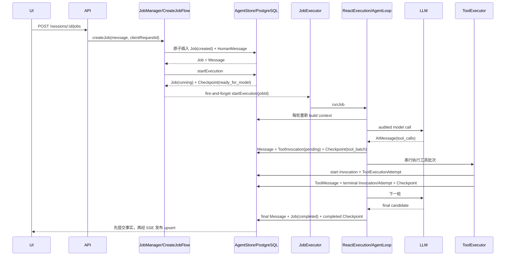
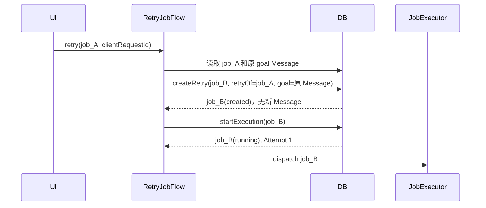
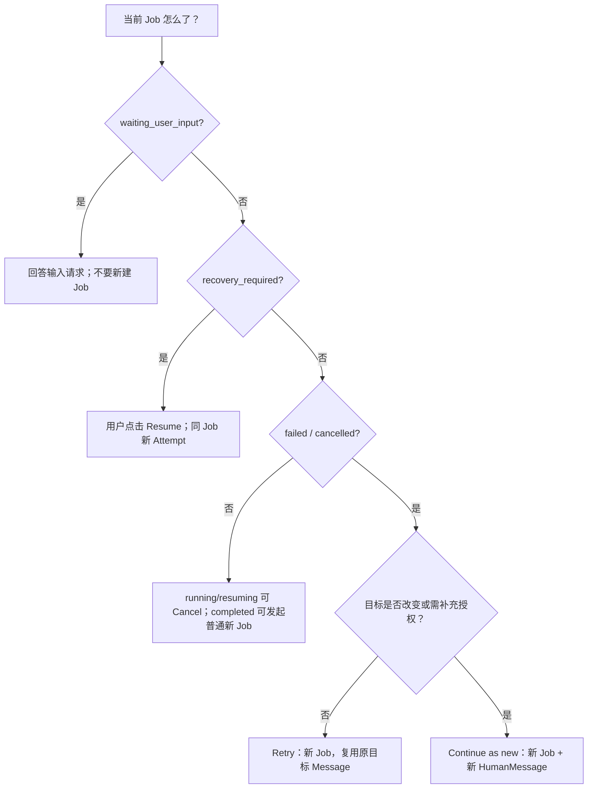

# HITL、故障恢复、Retry 与 Continue-as-new 操作手册

> 更新日期：2026-07-28
> 本文回答“遇到某种中断，应该继续哪个 Job、是否产生新 Message、是否重放工具、前后端如何配合”。
> 状态枚举见 [08-runtime-state-machines.md](./08-runtime-state-machines.md)，逐表事实见 [09-database-table-reference.md](./09-database-table-reference.md)。

## 1. 先用一张表区分五种动作

| 动作 | 适用状态 | Job 是否相同 | 是否新 Job Attempt | 是否新增 HumanMessage | 原目标如何处理 |
| --- | --- | --- | --- | --- | --- |
| 回答 HITL | `waiting_user_input` | 相同 | 回答最后一个 pending 请求时是 | 通常否；写 ToolMessage | 继续原目标 |
| Resume | `recovery_required` | 相同 | 是 | 否 | 从最新 Checkpoint 继续 |
| Retry | `failed/cancelled` | **新 Job** | 新 Job 的 Attempt 1 | **否** | 复用原目标 Message ID |
| Continue as new | `failed/cancelled` | **新 Job** | 新 Job 的 Attempt 1 | **是** | 新消息成为新目标 |
| Cancel | 任一活动状态 | 相同并终结 | 否 | 否 | 不再继续 |

最重要的判断：

- **执行者丢了，但原 Job 事实仍可恢复**：Resume。
- **原 Job 已经有明确失败/取消结局，希望原样重做**：Retry。
- **用户改变或补充目标，希望作为新一轮继续**：Continue as new。
- **Agent 明确缺少用户信息**：回答 HITL，不要创建新 Job。

## 2. HTTP 与编排入口

| 操作 | HTTP | 核心参数 | 编排分支 |
| --- | --- | --- | --- |
| 新 Job | `POST /sessions/:sessionId/jobs` | message, clientRequestId | `CreateJobFlow` |
| Cancel | `POST /jobs/:jobId/cancel` | expectedVersion | `CancelJobFlow` |
| Resume | `POST /jobs/:jobId/resume` | expectedVersion | `ResumeJobFlow` |
| Retry | `POST /jobs/:jobId/retry` | clientRequestId | `RetryJobFlow` |
| Continue | `POST /jobs/:jobId/continue-as-new` | message, clientRequestId | `ContinueAsNewJobFlow` |
| HITL Answer | `POST /user-input-requests/:requestId/answer` | expectedVersion, clientAnswerId, answer | `AnswerUserInputFlow` |

`expectedVersion` 通常防止用户在旧页面对已经变化的对象操作；`clientRequestId/clientAnswerId` 防止重复写入。Cancel 是一个有意的例外：若 version 冲突但 Job 仍为活动状态，Flow 会读取最新版并再次取消。普通 CreateJob 已实现“命中同 clientRequestId 后回读原结果”，但 Retry/Continue 当前只会由唯一约束拒绝重复请求，还没有做到等价结果回放。

## 3. 正常 Job 基线流程

先理解没有中断时的标准链路，恢复流程只是从其中某个持久点继续。



三个耐久边界：

1. 模型 tool_calls 必须先落库，再开始工具。
2. 每一个工具结果必须先落库，再执行同批下一个工具。
3. 最终 Message、Job completed 和 completed Checkpoint 必须原子提交。

## 4. HITL：触发、等待、回答、继续

### 4.1 触发条件

当前生产 HITL 由 `request_user_input` 工具触发。工具不直接永久阻塞 Node.js Promise，而是返回特殊的 `requires_user_input` 结果，AgentLoop 将其识别为暂停点。

触发前，模型产生该 ToolCall 的 AIMessage 和 ToolInvocation 已经提交。因此即使服务随后退出，系统也知道是哪个 ToolCall 在等待答案。

### 4.2 进入等待的原子事务

Runtime 调用 `store.execution.waitForUserInput()`：

1. 校验 Job 仍由当前 `workerId + attemptId` 持有。
2. 校验对应 ToolInvocation 为 running。
3. 插入 `agent_user_input_requests(pending)`。
4. ToolInvocation `running -> waiting_user_input`。
5. Job `running/resuming -> waiting_user_input`。
6. 清除 Job 的 worker 和执行权到期时间；保留 `current_attempt_id` 作为历史关联。
7. 追加 `LoopCheckpoint(waiting_user_input)`，携带 callMessageId 和 request IDs。
8. 事务提交后发布 Job、Invocation、Request SSE。

此时没有后台循环“占着等”。服务可以安全重启，前端刷新也能从 SessionView 重建输入卡片。

### 4.3 HITL 时序

```mermaid
sequenceDiagram
    participant LLM
    participant LOOP as AgentLoop
    participant TOOL as request_user_input
    participant DB
    participant UI

    LLM-->>LOOP: tool_call(request_user_input)
    LOOP->>DB: 提交 AIMessage + Invocation(pending) + tool_batch checkpoint
    LOOP->>DB: Invocation running + ToolExecutionAttempt running
    LOOP->>TOOL: invoke
    TOOL-->>LOOP: requires_user_input(prompt, schema)
    LOOP->>DB: Request(pending) + Invocation(waiting) + Job(waiting) + checkpoint
    DB-->>UI: SSE 显示输入卡片
    Note over LOOP: ReAct 本次运行退出，不占用进程
```

### 4.4 用户回答

前端提交：

```json
{
  "expectedVersion": 0,
  "clientAnswerId": "answer_由前端稳定生成",
  "answer": { "value": "用户答案" }
}
```

回答事务：

1. 按 requestId 加锁，校验 status/version。
2. 若已 answered 且 clientAnswerId 相同，直接返回原结果；不创建第二条 Message，也不再次 Resume。
3. 将答案按当前生产协议写成 ToolMessage。
4. ToolInvocation `waiting_user_input -> completed`。
5. UserInputRequest `pending -> answered`，记录 answer、answerMessageId、clientAnswerId、answeredAt。
6. 若同 Job 仍有其他 pending 请求，Job 保持 waiting。
7. 若全部回答完：Job `waiting_user_input -> resuming`，创建新 Attempt、worker 和执行权，`attemptNo + 1`。
8. 根据原工具批次是否已经结束，追加 `tool_batch` 或 `ready_for_model` Checkpoint。
9. 事务提交后，由 `AnswerUserInputFlow` 调度同一 Job 继续。

实现级注意：当前 `user-input.commands.ts` 会完成 ToolInvocation，但没有把 `request_user_input` 对应的 running ToolExecutionAttempt 一并改成 terminal。它可能在审计表中残留为 running；这不影响当前 Job 继续，但属于需要修复的持久化一致性缺口。

```mermaid
sequenceDiagram
    participant UI
    participant API
    participant FLOW as AnswerUserInputFlow
    participant DB
    participant EX as JobExecutor
    participant LOOP as AgentLoop

    UI->>API: POST /user-input-requests/:id/answer
    API->>FLOW: answer(expectedVersion, clientAnswerId)
    FLOW->>DB: answerUserInput 原子事务
    DB-->>FLOW: shouldResume + Job + Request + ToolMessage
    alt 还有 pending 请求
        FLOW-->>UI: Job 仍 waiting_user_input
    else 全部回答完成
        DB-->>FLOW: Job(resuming), new attemptId
        FLOW-->>EX: startExecution(jobId)
        EX->>LOOP: 从最新 checkpoint 继续同一 Job
    end
```

### 4.5 当前 HITL 明确边界

- 没有 pending Request 自动过期任务；`expired` 只是预留状态。
- 生产代码没有通用 `source=agent/as_user_message` 分支。
- 回答敏感输入时，SSE/View 应只发布经过投影或脱敏的内容；数据库仍保存协议所需事实。
- HITL 不是 Retry，不创建新 Job，也不复制原目标。

## 5. 服务崩溃后的恢复

### 5.1 为什么不能自动继续

服务退出后，内存中的 AbortController、Promise、工具栈和 timer 都消失。PostgreSQL 只知道上一个 worker 的执行所有权仍有一个到期时间。

如果启动时立刻自动重跑：

- 原进程可能只是网络分区，仍在执行。
- side-effecting 工具可能已成功，只是结果尚未提交。
- 自动重放可能重复发消息、覆盖文件或执行外部操作。

所以当前语义是：**发现中断 -> 标记 recovery_required -> 前端展示继续按钮 -> 用户显式 Resume**。

### 5.2 发现中断

`InterruptedJobScanner` 在 Server 启动和定时扫描时执行：

1. 找出长时间停留在 created 的 Job，或执行权已过期的 running/resuming Job。
2. 使用 Job version 做 CAS。
3. Job -> `recovery_required`。
4. 清除 currentAttemptId/worker/到期时间，保留 Message、Checkpoint、Invocation 和错误审计。
5. 将已经 started、但不再有活跃执行拥有者的 ModelCall 标为 abandoned/failed。
6. 发布 Job upsert，前端显示“继续任务”。

扫描器**不调用 Resume，也不自动执行工具**。

### 5.3 Shutdown 的特殊语义

正常关闭 Server 时，进程内执行收到 `runtime_shutdown` abort。这个原因不会把 Job 持久化为 cancelled，因为“Server 停止”不等于“用户取消任务”。Job 暂时仍可能显示 running；执行权到期后，下一次启动的扫描器将其改为 recovery_required。

### 5.4 Resume 同一 Job

```mermaid
sequenceDiagram
    participant UI
    participant API
    participant FLOW as ResumeJobFlow
    participant DB
    participant EX as JobExecutor
    participant LOOP as AgentLoop

    UI->>API: POST /jobs/:id/resume {expectedVersion}
    API->>FLOW: resumeJob
    FLOW->>DB: startExecution(recovery_required)
    DB-->>FLOW: same Job(running), new Attempt, copied checkpoint position
    FLOW->>DB: prepareToolsForRecovery
    alt 发现 side_effecting running invocation
        DB-->>FLOW: blockedInvocations
        FLOW->>DB: fail same Job(unsafe_tool_recovery)
        FLOW-->>UI: Job failed，要求人工决定后续动作
    else 所有未完成调用可安全恢复
        DB-->>FLOW: pending/terminal invocations
        FLOW-->>EX: dispatch same Job
        EX->>LOOP: 从最新 checkpoint 恢复
    end
```

Resume 的关键点：

- Job ID 不变。
- 不新增 HumanMessage。
- `attemptNo + 1`，新 `attemptId`。
- 已 completed/failed 的工具结果直接回放，不再次执行。
- read_only/idempotent 的未完成工具可以回到 pending，在新 Attempt 执行。
- side_effecting 且原状态 running 的工具变 unknown，当前策略直接阻断并使 Job `failed(unsafe_tool_recovery)`。

### 5.5 不同崩溃时点如何恢复

| 崩溃时点 | 已有持久事实 | Resume 后行为 |
| --- | --- | --- |
| Job created 后、start 前 | Job(created) + HumanMessage | 扫描为 recovery_required；新 Attempt 从 ready_for_model 开始 |
| 模型调用开始后、结果提交前 | ModelCall started；Checkpoint 仍 ready_for_model | 旧 ModelCall abandon；模型调用重新尝试 |
| tool_calls 已提交、工具未开始 | AIMessage + Invocation pending + tool_batch checkpoint | 从 pending Invocation 开始 |
| read_only/idempotent 工具执行中 | Invocation/Attempt running | 旧 Attempt interrupted；新 Attempt 重放 |
| side_effecting 工具执行中 | Invocation/Attempt running，无稳定 ToolMessage | 标 unknown；自动恢复阻断 |
| ToolMessage 已提交 | Invocation completed/failed + result Message | 直接回放稳定结果，继续兄弟工具或模型 |
| waiting_user_input | Job waiting，Request pending，无执行权 | 不需要 Resume；前端继续展示输入卡片，用户回答即可 |
| final candidate 流式输出但未提交 | SSE delta，无 final Message | 草稿不是事实；恢复后重新模型调用 |
| final Message+Job completed 已提交 | 终态事实完整 | 无需也不允许 Resume |

## 6. Retry：新 Job，复用原目标

### 6.1 何时使用

源 Job 已是 `failed` 或 `cancelled`，用户想“把原任务再做一遍”，不想把按钮操作写成新一条聊天消息。

### 6.2 数据语义

```text
旧 Job: job_A failed/cancelled
原目标消息: msg_goal_A

Retry 后:
新 Job: job_B created -> running
job_B.retryOfJobId = job_A
job_B.metadata.goalMessageId = msg_goal_A
不插入第二条 HumanMessage
```

### 6.3 时序



旧 Job、旧工具、错误和 Checkpoint 全部保留。新 Job 会构建自己的 Context，同时通过 retry source bundle 保留必要的失败背景。

## 7. Continue as new：新 Job、新用户目标

### 7.1 何时使用

源 Job 已 failed/cancelled，用户不是原样重做，而是补充约束、改写目标或告诉 Agent 如何继续。

### 7.2 数据语义

```text
旧 Job: job_A cancelled
旧目标: “写一个 React 应用”

Continue 输入: “不要只输出文档，直接在 code 目录实现并运行”

新 Job: job_C
新 HumanMessage: msg_goal_C
job_C.retryOfJobId = job_A
job_C.metadata.goalMessageId = msg_goal_C
```

这就是一轮新的对话。旧 Job 的 cancelled 卡片应该排在新 HumanMessage 之前；时间线必须按 `agent_messages.row_id` 和独立 Job 终态锚点组合，而不能把旧 Job 终态统一塞到 Session 最底部。

### 7.3 与普通新 Job 的区别

- 都写新 HumanMessage。
- Continue 额外记录 `retryOfJobId`，Context 可明确知道它承接哪次失败/取消执行。
- 只允许从 failed/cancelled 源 Job发起。

## 8. Cancel：先持久化，再中断进程

Cancel 的正确顺序：

1. `CancelJobFlow` 调用 `store.jobs.cancel()`。
2. 数据库将 Job 设为 cancelled，清理 Plan/Steps、Request、Invocation 和 ToolExecutionAttempt，并追加 cancelled Checkpoint。
3. 数据库事务提交，持久化写入围栏已经生效。
4. 调用 JobExecutor 的进程内取消，触发 AbortSignal，让模型、Shell 或工具尽快停止。
5. 发布 Job SSE；前端只会看到已经提交的 cancelled 状态。

为什么不是先 abort：若进程先被杀而数据库事务失败，UI 会看到 running，但实际上已经没人执行。持久取消先形成写入围栏，旧执行即使晚到也无法提交结果。

中断工具时：

- running side_effecting -> unknown。
- 其他 pending/running/waiting -> cancelled。
- running ToolExecutionAttempt 对应 unknown/interrupted。

Cancel 完成后用户可 Retry 或 Continue-as-new；不能 Resume cancelled Job。

Cancel 的 version 冲突处理也与其他命令不同：若第一次 CAS 失败，Flow 会重新读取 Job；已 cancelled 直接返回，仍为活动状态则用最新 version 再取消，终态 completed/failed 则拒绝。这使“停止任务”在高频状态更新期间更可靠。

## 9. ReAct 循环如何退出

| LoopResult | 触发条件 | Job 后续 |
| --- | --- | --- |
| `completed` | 模型无 tool_calls，内容非空，最终答案策略通过 | 原子提交 final Message + Job completed |
| `waiting_user_input` | 任一工具返回 requires_user_input | 原子进入 waiting，当前进程执行结束 |
| `failed` | 空输出、迭代/工具/时间限制、Plan 不合法、模型/协议/Context 错误等 | Job failed + 子状态清理 |
| `cancelled` | AbortSignal | 用户 Cancel 已先持久化；runtime_shutdown 则等待扫描恢复 |

模型产生最终文本并不立即等于 Job completed。只有 `completeWithFinalMessage` 成功，前端草稿才转成持久最终回复。

## 10. 一个完整演示案例

假设用户要求：“查询三篇资料，生成报告并写入文件”。

### 10.1 第一次执行

```text
Session: session_1 active
HumanMessage: msg_1 “查询三篇资料……”
Job: job_1 created
Attempt: attempt_1
Job: job_1 running
Checkpoint #1: ready_for_model
```

模型调用 `web_search`，结果成功：

```text
Message row 2: AI tool_call call_search
Invocation call_search: completed
ToolExecutionAttempt 1: completed
Message row 3: ToolMessage(search result)
Checkpoint: ready_for_model
```

模型随后调用 side-effecting `publish_external_report`，工具在外部服务已执行，但 Server 在保存 ToolMessage 前崩溃：

```text
Invocation call_publish: running / side_effecting
ToolExecutionAttempt 1: running
Checkpoint: tool_batch(call message)
Job: running，执行权最终过期
```

### 10.2 重启与人工恢复

```text
Scanner: job_1 -> recovery_required
UI: 显示“继续任务”
用户点击 Resume
Attempt: attempt_2
prepareToolsForRecovery:
  call_search completed -> 保持并回放
  call_publish running+side_effecting -> unknown，blocked
Job: job_1 -> failed(unsafe_tool_recovery)
```

这里不应该偷偷再次发布报告。

### 10.3 用户决策

若用户确认外部报告没有发布，可以点 Continue as new 并输入：

```text
“我确认外部系统没有报告，请重新发布，并在发布后返回链接。”
```

系统创建 `job_2 + msg_2`，`job_2.retryOfJobId=job_1`。这是一条明确授权的新目标，而不是篡改 `job_1` 的 unknown 历史。

若用户只想从头重新查询、且没有新增说明，可点 Retry：创建 `job_3`，复用 `msg_1`，不产生重复用户消息。

## 11. 前端展示规则

### 11.1 权威来源

- SSE：实时增量，包含已提交 upsert 和临时 message.delta。
- `GET /sessions/:id/view`：刷新后的权威投影。
- 两者必须使用同一实体 ID 做 upsert，不能把同一 Job 的状态变化追加成多个无关卡片。

### 11.2 操作按钮

| Job 状态 | 建议按钮 |
| --- | --- |
| created/running/resuming | Cancel |
| waiting_user_input | 显示输入表单；可 Cancel |
| recovery_required | Resume；可 Cancel |
| failed/cancelled | Retry、Continue as new |
| completed | 无执行操作；允许新一轮普通消息 |

### 11.3 时间线锚点

- HumanMessage、AIMessage、ToolCall/Result 以 Message rowId 排序。
- Plan/Job 终态卡片需要以其真实变更时间插入相应 Job 段落。
- 新 Job 的任何消息和工具都不能出现在旧 Job cancelled/failed 卡片之前。
- Retry 不新增 HumanMessage，因此 UI 应通过 Job retry 关系和状态卡解释新执行，而不是伪造一条用户消息。

## 12. 幂等与并发冲突

| 场景 | 保护键 |
| --- | --- |
| 创建网络重试 | `(sessionId, clientRequestId)`；CreateJob 可回读原结果 |
| Retry/Continue 重复提交 | `(sessionId, clientRequestId)` 拒绝第二次写入；当前不会回放原结果 |
| HITL 回答网络重试 | `(jobId, clientAnswerId)` + request version |
| 重复模型输出提交 | `(jobId, outputId)` |
| 重复逻辑模型调用 | `(jobId, logicalCallKey, callAttemptNo)`；started 部分唯一索引 |
| 重复逻辑 ToolCall | `(jobId, toolCallId)`、`(jobId,idempotencyKey)` |
| 旧进程晚写 | expectedVersion + workerId + attemptId + 未过期执行权 |
| 重复 Plan 工具调用 | toolCallId/plan version + 全量 Plan 校验 |

遇到 concurrency conflict，前端应刷新 SessionView，而不是盲目重发不同 ID 的命令。

## 13. 操作决策树



## 14. 当前已知缺口

这些是明确边界，不要在文档/UI 中包装成已实现能力：

1. 没有独立 `agent_job_attempts` 表，Attempt 的开始/结束时间不能像 ToolExecutionAttempt 一样直接逐行查询。
2. `UserInputRequest.expired` 没有生产定时迁移。
3. side-effecting unknown 当前 Resume 会失败为 `unsafe_tool_recovery`，尚无专门“确认已执行/确认未执行”的人工对账 API。
4. 工具批次当前串行执行；尚无并行工具恢复协调。
5. runtime_shutdown 后要等待执行权过期和 scanner 标记；不是立即 recovery_required。
6. Resume 只能恢复最新 Checkpoint，不支持用户选择任意历史 Checkpoint 分叉。
7. Retry/Continue 都沿用 `retryOfJobId` 字段，数据库尚未单独区分关系类型；语义由入口和是否新增目标 Message 判断。
8. HITL answer 完成 ToolInvocation 时尚未同步终结 ToolExecutionAttempt，可能留下与 Invocation 状态不一致的 running Attempt。
9. Retry/Continue 虽有 clientRequestId 唯一约束，但不像 CreateJob 一样实现冲突后的幂等结果回放。

## 15. 代码导航

| 关注点 | 代码 |
| --- | --- |
| 六个显式命令分支 | `src/orchestration/jobs/flows/*.flow.ts` |
| 统一命令入口 | `src/orchestration/jobs/job-manager.ts` |
| Attempt 启动 | `src/orchestration/jobs/shared/job-attempt-starter.ts` |
| 后台执行与进程内取消 | `src/orchestration/jobs/job-executor.ts` |
| 执行权刷新 | `shared/execution-ownership.service.ts` |
| 中断扫描 | `shared/interrupted-job-scanner.ts` |
| ReAct Loop | `src/runtime/loop/agent-loop.ts` |
| ReAct 持久执行适配 | `src/runtime/execution/react-execution.ts` |
| HITL 事务 | `src/storage/postgres/commands/user-input.commands.ts` |
| Tool/Checkpoint 事务 | `src/storage/postgres/commands/tool-invocation.commands.ts` |
| Job 事务 | `src/storage/postgres/commands/session-job.commands.ts` |
| HTTP 契约 | `src/server/http/agent.controller.ts` |

## 16. 验收用故障注入清单

每次修改恢复逻辑，至少验证：

1. created 后崩溃，重启后只变 recovery_required，不自动执行。
2. 模型调用中崩溃，started ModelCall 被 abandon，Resume 可重新调用。
3. tool_calls 提交后崩溃，pending 工具 Resume 后只执行一次。
4. read_only/idempotent running 中崩溃，旧 Attempt interrupted，新 Attempt 成功。
5. side_effecting running 中崩溃，Invocation unknown，Resume 被阻断。
6. HITL 等待期间重启，输入卡片刷新后仍存在，不需要 Resume。
7. 同 clientAnswerId 回答两次，只生成一条 ToolMessage。
8. Cancel 时先看到持久 cancelled，再停止 Shell/模型；旧 Attempt 无法晚写。
9. Retry 不产生重复 HumanMessage。
10. Continue as new 产生新 HumanMessage，且旧 Job 终态卡位于新轮次之前。
11. 两个 Tab 同时操作 expectedVersion，只有一个成功，另一个刷新 View。
12. 最终 Message 已提交后重启，不重复生成 final。
