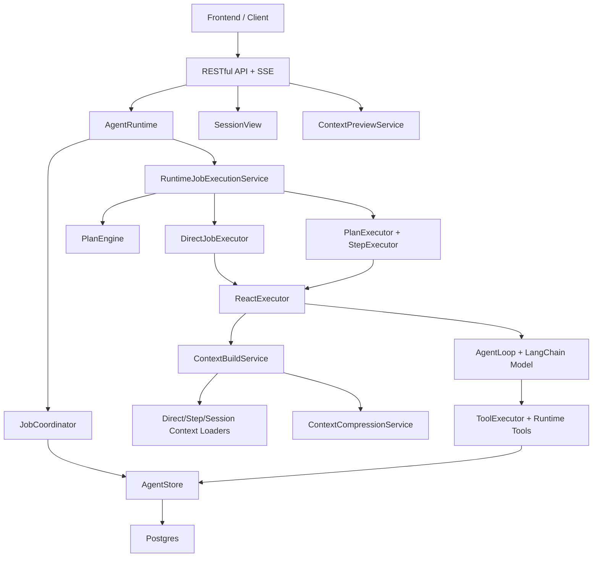

# Agent Runtime V2 架构设计总览

本文档包描述 `agent-runtime-v2` 的整体设计。它以当前代码结构为基础，覆盖运行时架构、Postgres 存储、Context 构建策略、RESTful API、前端接入 View，以及 Debug 查看 Context 的能力。

## 阅读入口

- [01-overall-architecture.md](./01-overall-architecture.md)：系统整体架构、核心模块职责、一次请求的完整生命周期。
- [02-storage-design.md](./02-storage-design.md)：Postgres 表设计、状态机、并发控制、幂等与恢复策略。
- [03-context-strategy.md](./03-context-strategy.md)：Context 物料加载、分组、bundle、摘要、token budget、压缩与审计。
- [04-restful-api-layer.md](./04-restful-api-layer.md)：HTTP API、请求/响应语义、SSE 实时事件、错误边界。
- [05-frontend-view-layer.md](./05-frontend-view-layer.md)：前端如何接入 SessionView、timeline、输入请求、流式输出和敏感信息投影。
- [06-debug-context-capability.md](./06-debug-context-capability.md)：Context Preview、ModelCall 复原、诊断字段、调试页面建议。

## 当前系统一句话

`agent-runtime-v2` 是一个持久化 Agent Runtime：用户在 Session 内创建 Job，Runtime 根据 Planner 路由到 direct 或 planned 执行，执行过程把 message、tool invocation、plan、step run、model call、context summary 全量写入 Postgres；前端通过 SessionView 和 SSE 观察进度；调试侧可以预览下一轮或历史 ModelCall 的真实 Context。

## 分层模型

## 关键设计原则

1. Session 是用户可见的会话边界，Job 是一次用户目标的执行边界。
2. Job 只能有一个 active 状态，避免同一 Session 同时执行多个目标导致上下文不确定。
3. Planned Job 拆成 Plan、PlanStep、StepRun；StepRun 是实际可重试的执行单元。
4. `agent_messages` 是时间线和模型上下文的事实源；tool call/result 必须成对投影。
5. Context 不直接从 UI 时间线拼接，而是由 Context Loader 基于存储事实重新构建。
6. 每次 ModelCall 保存 manifest、checksum、token 估算和 usage，支持事后复原和审计。
7. 前端只消费 `SessionViewV1` 和 SSE entity event，不直接理解数据库表。
8. Debug Context 是只读能力，服务调试和验收，不参与正常执行写路径。

## 当前源码对应关系

- Runtime facade：`src/orchestration/agent-runtime.ts`
- Job 协调：`src/runtime/job-coordinator.ts`
- 执行服务：`src/server/runtime/job-execution.service.ts`
- Planner：`src/planner/plan-engine.ts`
- ReAct 执行：`src/runtime/executors/react-executor.ts`
- Context：`src/runtime/context/*`、`src/runtime/loaders/*`
- 存储接口：`src/storage/agent-store.ts`
- Postgres 实现：`src/storage/postgres/*`
- HTTP 层：`src/server/http/*`
- Debug Context：`src/orchestration/context-inspection.service.ts`、`src/server/debug/*`
- 前端投影：`src/view/*`

## 建议落地顺序

1. 先稳定存储契约和状态机，保证所有执行路径都能恢复。
2. 再固定 Context v6 的规则版本、manifest 和 preview 输出。
3. 然后完善 RESTful API 和 SessionView，前端只对稳定 view contract 编程。
4. 最后补齐 Debug Context 页面、ModelCall 复原和 Context 差异对比。

