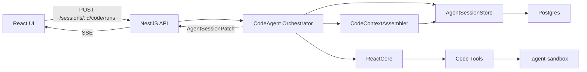
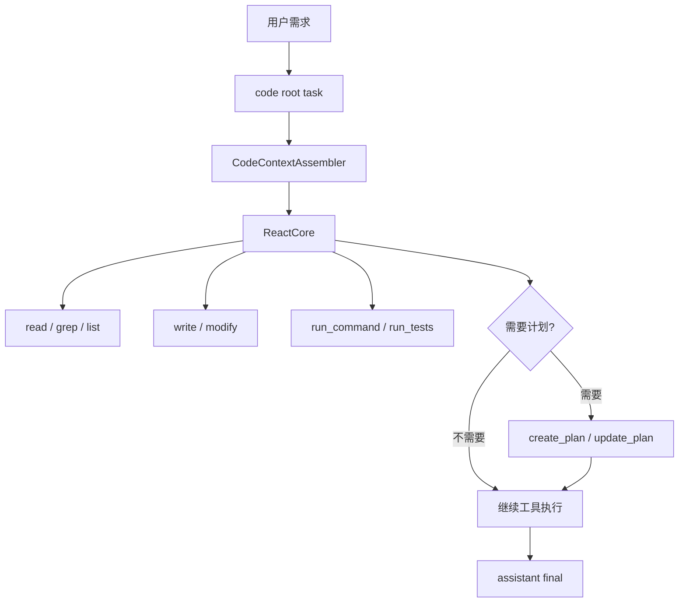
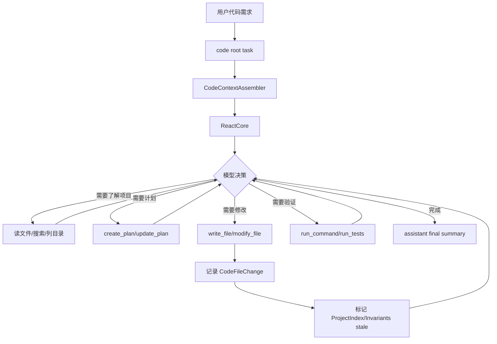

# Code Agent 编排方案

本文档描述如何在当前 `agent-runtime-v2` 上新增一个更现代的 `CodeAgent` 编排层，并从旧项目 `/Users/hanljjie/Desktop/agent/agent/src/sub-agent/coding-agent` 迁移有价值的工具、prompt 和工程经验。

核心结论：

**Code Agent 不再采用固定的 `BDD -> Architecture -> Codegen` 流水线。**

更合理的形态是：

```text
ReAct-first
Plan when needed
Design artifact only when useful
Everything persistent
Everything resumable
Tools do the real work
```

BDD 和 Architecture 可以保留为“按需计划/设计工具”，但不能成为每个 code task 的强制阶段。

## 1. 设计目标

Code Agent 要解决的是“在会话里持续生成、修改、检查、解释代码”的能力，而不是一次性生成一组文件。

必须满足：

- 接入现有 `session / task / message / patch / SSE` 体系
- 支持真实会话持久化和刷新恢复
- 支持工具调用、工具结果成对落库
- 支持 HITL 暂停和恢复
- 支持 sandbox 文件读写，不能越界访问宿主项目
- 支持上下文压缩、项目约束摘要、项目索引、真实 token usage
- 最大化 LLM prefix/KV cache 命中率
- 前端可以看到消息、工具、计划、文件产物、上下文消耗

不做：

- 不迁移旧 `CodingAgentEvent`
- 不迁移旧 `agentPauseController`
- 不迁移旧 conversation json 存储
- 不把 BDD / Architecture 作为默认强制阶段
- 不把动态 runtime 数据塞进 prompt

## 2. 总体架构



一句话：

`CodeAgent` 只负责编排、持久化、恢复、安全边界和上下文工程；真正的代码读写由 `ReactCore + Code Tools` 驱动。

## 3. 推荐目录结构

```text
agent-runtime-v2/src/
├── orchestration/
│   └── code-agent.ts
├── code-agent/
│   ├── index.ts
│   ├── prompts.ts
│   ├── types.ts
│   ├── code-context-assembler.ts
│   ├── code-context-profile.ts
│   ├── project-sandbox.ts
│   ├── project-context.ts
│   ├── requirement-clarifier.ts
│   └── plan-policy.ts
├── tools/
│   ├── code-filesystem-tools.ts
│   ├── code-command-tools.ts
│   ├── code-project-tools.ts
│   └── code-planning-tools.ts
```

说明：

- `code-agent.ts`：root task 创建、状态流转、SSE patch、恢复
- `code-context-assembler.ts`：Code Agent 专用上下文拼装
- `code-context-profile.ts`：工具集、prompt 版本、预算策略
- `project-sandbox.ts`：projectId 到本地代码目录的映射和路径安全校验
- `project-context.ts`：Project Invariants、Project Index、Working Set 生成与 stale 管理
- `plan-policy.ts`：判断是否需要创建计划或设计说明
- `code-planning-tools.ts`：`create_plan / update_plan / write_design_note`，按需使用

## 4. 旧实现迁移映射

旧目录：

```text
/Users/hanljjie/Desktop/agent/agent/src/sub-agent/coding-agent
```

| 旧模块 | 新位置 | 迁移方式 |
| --- | --- | --- |
| `index.ts` | `src/orchestration/code-agent.ts` | 迁移入口判断和结果汇总，不迁移旧事件 |
| `services/intent-classifier.ts` | 可选迁入 `plan-policy.ts` | 第一版可以不用独立分类器，让 ReAct 自行行动；复杂场景再启用轻量分类 |
| `services/requirement-clarifier.ts` | `src/code-agent/requirement-clarifier.ts` | 改成 `AgentInputRequest` |
| `workflows/fixed-workflow.ts` | 不原样迁移 | 其中的 BDD/Architecture 经验改造成可选 planning tools |
| `workflows/incremental-workflow.ts` | `project-sandbox.ts` + ReAct tools | 保留项目加载和增量修改思路 |
| `tools/fs/*` | `src/tools/code-filesystem-tools.ts` | 迁移 `read/write/modify/grep/list_symbols` |
| `tools/codegen/*` | `ReactCore + code tools` | 不再做独立 codegen pipeline |
| `tools/bdd.ts` | 可选 `write_acceptance_criteria` 工具 | 不作为默认流程 |
| `tools/architect.ts` | 可选 `write_design_note` 工具 | 不作为默认流程 |
| `types/index.ts` | `src/code-agent/types.ts` | 只迁移必要领域类型 |

明确废弃：

| 旧能力 | 新替代 |
| --- | --- |
| `CodingAgentEvent` | `AgentSessionPatch` |
| `agentPauseController` | `AgentInputRequest` |
| 固定 BDD/Architecture pipeline | Adaptive Code ReAct |
| 旧 conversation 文件 | `agent_messages` |
| 旧项目根目录写盘 | v2 sandbox |

## 5. Domain 扩展

### 5.1 Session Mode

```ts
export type AgentSessionMode =
  | 'react'
  | 'planner'
  | 'planner_react'
  | 'code';
```

### 5.2 Task Kind / Executor

```ts
export type AgentTaskKind =
  | 'react'
  | 'planner'
  | 'planner_step'
  | 'code';

export type AgentExecutorKind =
  | 'react'
  | 'planner'
  | 'code';
```

第一版不启用 `code_step`。

原因：

- Code Agent 默认是 ReAct loop，不应该把每一次工具调用或每一轮模型调用都强行建成 task。
- 工具调用本身已经由 `assistant.toolCalls + tool message` 记录，足够恢复 UI 和上下文。
- 过早引入 `code_step` 会让 `agent_tasks` 膨胀，并和 `planner_step` 的职责混淆。

后续只有在这两种场景才考虑引入 `code_step`：

- 模型调用 `create_plan` 后，需要把 plan item 映射成可独立展示/恢复的步骤。
- 未来引入多 Agent 或长任务编排，需要对子任务做独立状态管理。

因此 Phase 1 到 Phase 2 只使用：

```ts
kind = 'code'
executor = 'code'
```

### 5.3 Message Metadata

不新增 code 专用 role，继续使用：

```text
system / user / assistant / tool
```

通过 `metadata.kind` 标记语义：

```ts
type CodeMessageKind =
  | 'code_system_prompt'
  | 'code_plan'
  | 'code_design_note'
  | 'code_project_context'
  | 'code_artifact'
  | 'code_summary';
```

### 5.4 Context Snapshot Kind

当前已有 snapshot 类型：

```ts
RollingSummary
TaskSummary
ToolSummary
MemorySummary
```

Code Agent 需要补几类项目/会话上下文类型：

```ts
ConversationSummary = 'conversation_summary'
ProjectInvariants = 'project_invariants'
ProjectIndex = 'project_index'
WorkingSetSummary = 'working_set_summary'
```

语义：

- `ConversationSummary`：冻结的会话摘要，可进入 cacheable prefix
- `ProjectInvariants`：项目稳定约束，可进入 cacheable prefix
- `ProjectIndex`：项目索引，主要给检索和工具使用，不默认进入 prompt
- `WorkingSetSummary`：本轮相关文件/片段摘要，进入 suffix，不作为稳定 prefix

注意：不要把“完整项目上下文”整体视为 stable context。Code Agent 会频繁修改文件，项目状态只能做到 versioned / epoch-stable，不能当作长期稳定前缀。

## 6. 执行模型

### 6.1 默认路径：Adaptive Code ReAct



模型可以直接调用工具读文件、写文件、运行测试、修复错误。计划不是前置流程，而是模型在需要时调用的工具。

`code root task` 是第一版唯一的任务状态主体。ReAct loop 内部的模型输出、工具调用、工具结果都作为消息时间线记录，不额外创建 task。

### 6.2 什么时候需要计划

由 `plan-policy` 和系统提示共同约束：

需要计划：

- 新项目生成
- 跨多个模块修改
- 涉及数据模型、路由、状态管理、构建配置
- 用户要求先设计再实现
- 修改风险高
- 预计超过 3 个文件或 3 个执行步骤

不需要计划：

- 单文件小改
- 解释代码
- 搜索定位
- 修复简单 typo
- 样式微调
- 用户明确要求直接改

### 6.3 计划是工具，不是流程

工具：

```text
create_plan
update_plan
complete_plan_step
write_design_note
write_acceptance_criteria
```

这些工具的结果落库为普通 assistant tool call + tool result，前端从消息恢复，不额外维护第二套 UI 状态。

如果后续启用 `code_step`，它也只能由 plan tool result 驱动创建，而不是由 ReAct loop 的自然迭代次数驱动创建。

## 7. Code Agent 上下文工程

Code Agent 的上下文不能简单等于 `systemPrompt + messages`。但也不能把动态 runtime 数据塞进 prompt，否则会破坏 LLM prefix/KV cache。

`CodeContextAssembler` 不替代现有 `ContextBuilder`。它是一个 code-specific 的上下文选择器，负责挑选 prefix blocks、working set、预算和 metadata；最终的消息转换、tool call/result 成对恢复、snapshot tail 处理仍然复用现有 `ContextBuilder`。

推荐关系：

```text
CodeContextAssembler
  -> 选择 Static System Prompt / Tool Contract / Project Invariants
  -> 选择 Conversation Summary / Recent Messages
  -> 选择 Working Set
  -> 计算 token breakdown / prefix metadata
  -> 组合调用 ContextBuilder.build(...) 或 buildForModel(...)
```

最终拆成两类：

```text
LLM Context
  - Cacheable Prefix
  - Append-only Conversation Tail
  - Current User Request

Runtime Execution Context
  - sessionId
  - taskId
  - userId
  - projectId
  - sandboxRoot
  - projectRoot
  - telemetryPhase
```

`Runtime Execution Context` 不进入模型上下文，只传给编排层和工具。

### 7.1 LLM Context 结构

```text
[Cacheable Prefix]
1. Static System Prompt
2. Stable Tool Contract
3. Project Invariants
4. Frozen Conversation Summary

[Retrieved / Versioned Suffix]
5. Relevant Working Set
6. Recent Conversation Messages
7. Recent Tool Call / Tool Result Pairs

[Volatile Suffix]
8. Current User Request
```

不要进入 prompt 的内容：

```text
sessionId
taskId
rowId
当前时间
sandbox 绝对路径
phase
requestId
SSE id
trace id
数据库状态
```

模型只需要知道：

```text
所有文件路径必须是相对 project root 的路径。
只能通过工具访问文件系统。
不能访问 project root 外部文件。
```

真实路径在工具 runtime context 中处理。

### 7.2 Static System Prompt

版本化、稳定、尽量短。

```text
code-agent-system@v1
```

内容包括：

- Code Agent 行为边界
- sandbox 规则
- 工具调用规范
- 何时直接执行，何时创建计划
- 最终答复要求

不包含：

- 当前时间
- session/task id
- 用户本轮输入
- sandbox 绝对路径

### 7.3 Stable Tool Contract

工具 schema 对缓存也很敏感，所以工具集不能每轮随意变化。

建议按 profile 固定：

```text
code.query
  grep_files
  read_file
  list_files
  list_symbols

code.write
  list_files
  read_file
  grep_files
  list_symbols
  write_file
  modify_file
  run_command
  create_plan
  update_plan
  finish

code.browser
  web_search
  browse_url
  extract_page
```

同一个 profile 内保持：

- 工具顺序固定
- schema 字段顺序固定
- description 固定
- 参数命名固定

### 7.4 Project Context 分层

项目上下文不能整体叫 stable。它应该拆成四层：

```text
Project Invariants    稳定项目约束，可进入 prefix
Project Index         项目索引，给检索/工具用，不默认进 prompt
Working Set           本轮相关文件/片段，进入 suffix
Change Set            本轮已修改内容，来自 tool results / runtime state
```

#### Project Invariants

这部分相对稳定，可以进入 cacheable prefix。

内容：

```text
- framework
- language
- package manager
- source root
- path policy
- coding conventions
- stable project constraints
```

来源：

```text
agent_context_snapshots.kind = project_invariants
```

更新时机：

- 项目初始化
- 用户明确修改项目约束
- 工具修改关键配置文件后自动标记 stale
- 下一次 context build 前发现 stale，则重新生成

关键文件包括：

```text
package.json
pnpm-lock.yaml / package-lock.json / yarn.lock
tsconfig.json
vite.config.*
next.config.*
eslint.config.* / .eslintrc*
prettier.config.* / .prettierrc*
src/main.*
src/App.*
```

注意：Project Invariants 是 epoch-stable，不是永远稳定。它进入 prefix 的前提是当前 snapshot 版本没有变化。

#### Project Index

项目索引不默认进入 prompt。它主要服务：

- ContextAssembler 选择相关文件
- 工具快速定位文件
- 前端展示项目状态

内容：

```text
- file tree
- package.json summary
- route map
- symbol index
- dependency graph
- file checksums
```

来源：

```text
agent_context_snapshots.kind = project_index
```

文件写入、修改、删除后，Project Index 需要重新生成或增量更新。但它不是 cacheable prefix 的核心部分。

#### Working Set

Working Set 是本轮真正给模型看的项目内容。

例如用户说“修改登录页按钮样式”，上下文只放：

```text
- src/pages/Login.tsx 相关片段
- src/styles/login.css 相关片段
- 与按钮组件相关的 symbol 摘要
```

来源：

```text
grep_files
read_file
list_symbols
project_index retrieval
agent_context_snapshots.kind = working_set_summary
```

Working Set 进入 suffix，不进入稳定 prefix。

#### Change Set

Change Set 表示本轮工具已经改了什么：

```text
- created files
- modified files
- deleted files
- command output
- test output
```

来源是 recent tool results 和 runtime state。它不单独进入 prefix，也不需要每轮作为 project summary 重写。

### 7.5 Conversation Context

来自 `agent_messages`。

规则：

- 按 `row_id` 升序
- 历史消息不重写
- tool call/result 必须成对进入 context
- 已压缩历史用 frozen conversation summary snapshot 代替
- tail 保留最近消息

### 7.6 Current User Request

只放在末尾，作为 volatile suffix。

不要把当前需求插进 system prompt、project invariants 或 project index。

## 8. Prefix Cache 设计

目标不是自己缓存模型输出，而是让 provider 的 prefix/KV cache 最大化命中。

### 8.1 稳定前缀

```ts
const prefix = [
  staticSystemPrompt(systemPromptVersion),
  toolContract(toolProfileVersion),
  projectInvariants(projectInvariantsSnapshotId),
  conversationSnapshot(conversationSnapshotId),
];

const tail = [
  ...workingSet,
  ...recentMessagesAfterSnapshot,
  currentUserRequest,
];

const messages = [...prefix, ...tail];
```

缓存命中条件：

```text
prefixHash 不变
prefix messages 顺序不变
prefix 文本不变
tool schema 不变
```

### 8.2 Prefix 记录

第一版不单独建表，先写入 `agent_context_builds.metadata`：

```ts
metadata: {
  prefixHash,
  systemPromptVersion,
  toolProfile,
  toolContractVersion,
  projectInvariantsSnapshotId,
  projectIndexSnapshotId,
  workingSetSnapshotId,
  conversationSnapshotId,
  cacheableInputTokens,
  volatileInputTokens
}
```

后续如果需要分析跨请求缓存命中，再加表：

```sql
agent_context_prefixes (
  id text primary key,
  session_id text not null,
  project_id text,
  profile text not null,
  system_prompt_version text not null,
  tool_contract_version text not null,
  project_invariants_snapshot_id text,
  project_index_snapshot_id text,
  conversation_snapshot_id text,
  prefix_hash text not null,
  estimated_tokens int not null,
  created_at_ms bigint not null
);
```

### 8.3 Context Build Breakdown

`agent_context_builds.breakdown` 扩展：

```ts
{
  staticSystemPrompt: number,
  toolContract: number,
  projectInvariants: number,
  workingSet: number,
  conversationSummary: number,
  recentMessages: number,
  recentToolResults: number,
  currentRequest: number,
  reservedOutput: number
}
```

`runtimeContext` 不统计，因为它不进入模型输入 token。

## 9. Runtime Execution Context

工具执行需要动态数据，但这些数据不应该进入 prompt。

```ts
interface CodeRuntimeContext {
  sessionId: string;
  taskId: string;
  userId?: string;
  projectId?: string;
  sandboxRoot: string;
  projectRoot: string;
  telemetryPhase?: 'react' | 'plan' | 'edit' | 'test' | 'final';
}
```

`telemetryPhase` 只用于日志、前端状态和 debug，不允许影响：

- prompt 内容
- tool profile 选择
- 工具执行权限
- ReAct loop 是否继续

Code Agent 的行为推进应由模型输出和工具结果自然决定，而不是由显式 phase 状态机驱动。

调用工具：

```ts
tool.execute(args, runtimeContext)
```

这和 `ReactCoreToolContext` 当前结构兼容，可以先扩展：

```ts
export interface ReactCoreToolContext {
  sessionId: string;
  taskId: string;
  sandboxRoot: string;
  projectId?: string;
  projectRoot?: string;
}
```

## 10. 消息与存储设计

### 10.1 开始运行

写入：

1. `system`：Code Agent system prompt，`metadata.kind = 'code_system_prompt'`
2. `user`：用户原始需求
3. `task`：`kind = 'code'`，`executor = 'code'`

### 10.2 模型输出

流式 delta 不落库。

流式结束后写完整 assistant message：

```ts
{
  role: 'assistant',
  channel: 'normal' | 'final',
  content,
  toolCalls,
  metadata: {
    kind: 'code_assistant_output'
  }
}
```

### 10.3 工具结果

所有工具结果都写 `role = 'tool'`：

```ts
{
  role: 'tool',
  content,
  toolResult: {
    toolCallId,
    toolName,
    status,
    result,
    durationMs
  }
}
```

约束：

- assistant tool call 和 tool result 必须成对
- 不能为了 UI 单独写 tool result
- 不再写 synthetic BDD/Architecture 固定阶段消息

### 10.4 Plan / Design Note

计划只是工具调用结果：

```text
assistant tool_calls: create_plan(args)
tool result: plan json
```

如果要让前端更容易展示，可以额外在 tool result 的 `metadata.kind` 标：

```ts
metadata: {
  kind: 'code_plan',
  planId,
  status: 'created' | 'updated'
}
```

### 10.5 Artifact

文件写入后，工具结果里记录：

```ts
metadata: {
  kind: 'code_artifact',
  projectId,
  path,
  operation: 'created' | 'updated' | 'deleted',
  language,
  size,
  beforeChecksum,
  afterChecksum
}
```

每个写操作必须记录最小变更历史：

```ts
type CodeFileChange = {
  path: string;
  operation: 'created' | 'updated' | 'deleted';
  beforeChecksum?: string;
  afterChecksum?: string;
  beforeSize?: number;
  afterSize?: number;
  language?: string;
};
```

用途：

- 前端 diff / artifact 展示
- Project Index 增量更新
- 后续 rollback
- 审计 Code Agent 到底改了哪些文件
- 判断 Project Invariants 是否需要标记 stale

`write_file / modify_file / delete_file / move_file` 的 tool result 都必须包含 `changes: CodeFileChange[]`。即使工具失败，也要落 `toolResult.status = 'failed'`，并记录失败前已经完成的 partial changes。

## 11. Sandbox / 项目目录

原则：

```text
只有 Code Agent 生成/修改的代码文件放在本地 sandbox。
其他 project 元数据、上下文、索引、变更历史都必须落数据库。
```

本地 sandbox 只承担代码文件目录职责。第一版只保留 code project 目录：

```text
.agent-sandbox/
└── code-projects/
    └── {projectId}/
        └── ...真实代码文件
```

数据库必须新增 `agent_code_projects` 表，把 project 作为一等对象：

```sql
agent_code_projects (
  id text primary key,
  session_id text not null references agent_sessions(id),
  title text not null,
  status text not null,
  sandbox_relative_path text not null,
  framework text,
  language text,
  package_manager text,
  current_invariants_snapshot_id text,
  current_index_snapshot_id text,
  metadata jsonb,
  created_at_ms bigint not null,
  updated_at_ms bigint not null
);
```

说明：

- `sandbox_relative_path` 存相对路径，例如 `code-projects/{projectId}`。
- 不把宿主机绝对路径落库到 project 表。
- 绝对路径由 runtime 根据 `AGENT_SANDBOX_ROOT + sandbox_relative_path` 计算。
- `agent_messages.metadata.projectId`、`agent_tasks.metadata.projectId` 仍然保留，用于关联任务和消息。
- `agent_context_snapshots.metadata.projectId` 关联 project invariants / project index / working set。
- 不再创建长期的 `artifacts/downloads/tmp` 会话目录；需要临时文件时使用进程临时目录或后续单独设计 task-scoped tmp。

变更历史不只存在 tool result 里，也要进入数据库结构化记录。第一版可以用 `agent_messages.tool_result.result.changes` 作为事实源；如果需要高效查询，再新增：

```sql
agent_code_file_changes (
  id text primary key,
  session_id text not null references agent_sessions(id),
  project_id text not null references agent_code_projects(id),
  task_id text not null references agent_tasks(id),
  message_id text not null references agent_messages(id),
  path text not null,
  operation text not null,
  before_checksum text,
  after_checksum text,
  before_size int,
  after_size int,
  language text,
  created_at_ms bigint not null,
  metadata jsonb
);
```

第一版推荐：

```text
必须建 agent_code_projects
暂不建 agent_code_file_changes，先从 tool result 结构化读取 changes
```

## 12. 工具设计

Phase 1 直接复用的基础工具：

```text
list_files
read_file
write_file
grep_files
list_symbols
```

Phase 2 新增或增强的工具：

```text
modify_file
run_command
```

Phase 3 新增计划工具：

```text
create_plan
update_plan
finish
```

Phase 5 增强工具：

```text
delete_file
move_file
read_package_json
install_dependencies
run_tests
format_files
summarize_project
write_design_note
web_search
browse_url
```

工具约束：

- 所有路径必须是 project root 相对路径
- `run_command` 默认只能在 sandbox project root 内执行
- 第一版 `run_command` 使用白名单命令
- 所有写操作返回 `changes: CodeFileChange[]`
- Phase 1 的 `write_file` 至少返回 `path + operation`，Phase 2 再补齐 checksum/size/language
- 所有工具失败也要落 tool result，不能吞掉
- 写操作 post-hook 检测关键配置文件变化，标记 `project_invariants` / `project_index` stale

## 13. API 设计

新增：

```text
POST /sessions/:sessionId/code/runs
```

请求：

```json
{
  "input": "帮我生成一个登录页",
  "projectId": "project_xxx",
  "profile": "code.write"
}
```

响应：

```json
{
  "sessionId": "session_xxx",
  "taskId": "task_xxx",
  "status": "running"
}
```

复用：

```text
GET  /sessions/:sessionId/events
GET  /sessions/:sessionId/view
POST /sessions/:sessionId/input-requests/:requestId/answer
```

## 14. 前端接入

第一阶段：

- mode 增加 `Code`
- 发送时调用 `/code/runs`
- 消息区继续展示 user / assistant / tool
- `ToolCallBlock` 展示 code tools
- 计划通过 `create_plan/update_plan` tool result 渲染
- artifact 先展示在 Inspector 抽屉
- ContextUsage 展示新的 breakdown

第二阶段：

- Code Artifact Drawer
- 文件树
- 文件预览
- diff 预览
- 运行日志面板
- 一键下载 sandbox project

## 15. 实现分期

### Phase 1：Code ReAct MVP

- 扩展 mode/task/executor 类型
- 新增 `agent_code_projects` 表
- 第一版只启用 `kind = 'code'`，不启用 `code_step`
- 新增 `CodeAgent`
- 新增 `/sessions/:id/code/runs`
- 复用 `ReactCore`
- 接入基础工具：`list_files/read_file/write_file/grep_files/list_symbols`
- `write_file` 从 Phase 1 起就返回稳定的 `changes: CodeFileChange[]`，至少包含 `path + operation`
- 新建 session code project 时写入 `agent_code_projects`
- 所有 message/tool pair 正常落库
- 前端可发送 Code 任务并看到流式输出和工具调用
- `telemetryPhase` 只做观测，不影响 prompt 或工具权限

### Phase 2：Sandbox 写能力 + 最小上下文工程

- 增强 `write_file` 的 `changes`，补齐 before/after checksum、size、language
- 实现 `modify_file`
- 实现 `run_command` 白名单
- 写入 artifact metadata 和 before/after checksum
- 实现最小 `CodeContextAssembler`
- 组合现有 `ContextBuilder`，不重写 tool pair 恢复逻辑
- 支持 Static System Prompt / Stable Tool Contract / Project Invariants / Conversation Tail
- 实现 Project Invariants stale 标记
- Inspector 展示项目文件

### Phase 3：按需计划 + Project Index

- 实现 `create_plan/update_plan/finish`
- 前端渲染 plan tool result
- 计划状态跟随 tool result / task status
- 只有需要独立步骤状态时，才从 plan item 创建 `code_step`
- 实现 `ProjectIndex` snapshot
- 写操作后标记 Project Index stale，并在下一次 context build 前更新
- 实现 Working Set 选择入口

### Phase 4：完整 CodeContextAssembler + Prefix Cache

- 实现 cacheable prefix 拼装
- 实现 frozen conversation summary + tail
- 实现 working set token budget
- 实现 prefix hash
- context build 写入 prefix metadata
- ContextUsage 展示分层 token 消耗
- 根据模型和 profile 动态计算 token budget

### Phase 5：恢复 / HITL / 增强工具

- 需求不明确时创建 `AgentInputRequest`
- 恢复后继续同一 task
- pending request 未全部回答时不恢复 loop
- browser/search 工具
- 依赖安装
- 测试运行
- 格式化
- diff
- 项目 zip/export

## 16. 可落地性检查

### 16.1 当前架构已具备的能力

已经有：

- `AgentSessionStore`
- `agent_messages`
- `agent_tasks`
- `AgentSessionPatch`
- `ReactCore`
- tool call/result 成对恢复
- sandbox 基础能力
- `ContextBuilder`
- `agent_context_snapshots`
- `agent_context_builds`
- 真实 usage 统计链路
- 前端 snapshot + SSE reducer

所以 Phase 1 不需要推翻现有架构。

### 16.2 需要补的最小能力

必须补：

- `code` mode
- `CodeAgent` 编排入口
- code tool set
- `agent_code_projects`
- 最小 `CodeContextAssembler`
- `ProjectInvariants / ProjectIndex / WorkingSetSummary` snapshot 语义
- `modify_file/run_command`
- `list_symbols`
- `CodeFileChange` 变更追踪
- `create_plan/update_plan/finish`

可以延后：

- 独立 `agent_context_prefixes`
- 独立 `agent_code_file_changes`
- browser 自动化
- diff UI
- 依赖安装沙箱隔离
- `code_step` 子任务常态化

### 16.3 风险点

风险一：`run_command` 安全边界。

处理：

- 第一版只允许白名单命令
- cwd 固定在 sandbox project root
- 禁止绝对路径
- 设置超时和输出截断

风险二：上下文过大。

处理：

- Project Invariants 进入 prefix
- Project Index 只给检索/工具使用，不默认进 prompt
- Working Set 只放本轮相关片段
- 历史会话压缩
- tool profile 固定且分档
- 当前请求只放 suffix

风险三：计划和执行脱节。

处理：

- 计划只是工具
- 执行仍由 ReAct loop 驱动
- 每个 plan step 的状态来自后续工具结果，不单独维护第二套事实源
- 第一版不创建 `code_step`，避免任务状态和工具事件重复

风险四：前端恢复两套数据。

处理：

- 只从 `agent_messages/tasks/input_requests/context_builds` 恢复
- 不新增 UI-only 事件事实表

风险五：文件变更不可回溯。

处理：

- 所有写工具返回 `changes: CodeFileChange[]`
- 记录 before/after checksum
- 工具失败也记录 partial changes
- 后续 diff、rollback、Project Index 更新都基于这份变更历史

## 17. 最终目标形态



用户最终看到的是：

- 普通会话时间线
- Code 模式任务
- 模型自然推进的工具调用
- 按需出现的计划/设计说明
- 文件产物和运行日志
- 可恢复的任务状态
- 分层上下文消耗和真实 token usage

这版的重点是：**不要让 BDD/Architecture 变成架构包袱，让它们退回“需要时才用的工具”。**
