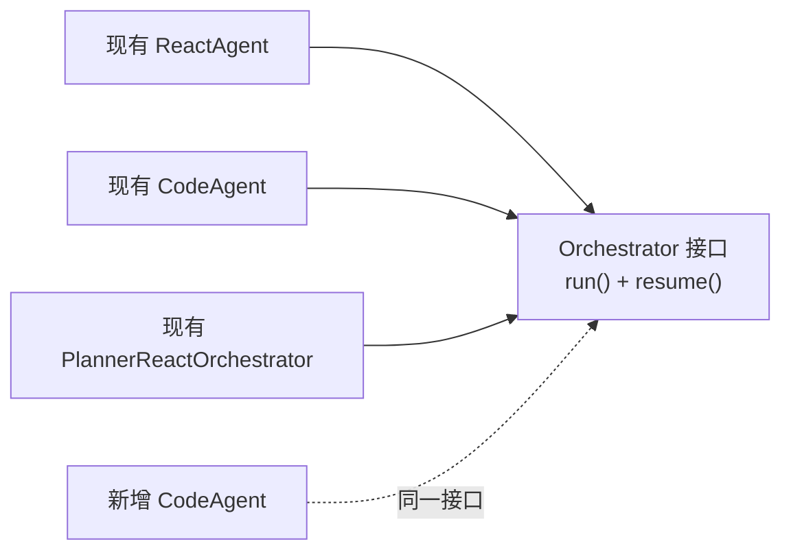
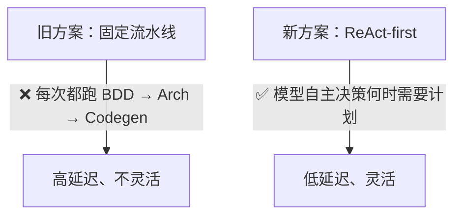
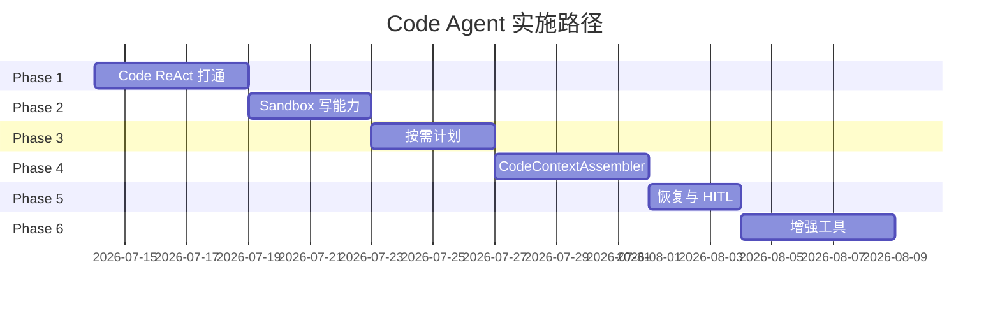

# Code Agent 编排方案设计分析报告

> 针对 [code-agent-orchestration-design-zh.md](file:///Users/hanljjie/Desktop/agent/agent-runtime-v2/docs/code-agent-orchestration-design-zh.md) 与 [agent-runtime-v2](file:///Users/hanljjie/Desktop/agent/agent-runtime-v2) 项目的融合度、合理性、扩展性评估。

---

## 一、总体评价

> [!TIP]
> **结论：方案整体设计质量很高，与现有架构的融合度非常好（约 85%），合理性和扩展性都是 OK 的。** 下面按维度详细分析。

| 维度 | 评分 | 说明 |
|------|------|------|
| 架构融合度 | ⭐⭐⭐⭐⭐ | 完全遵循现有 Orchestrator + ReactCore + Store 模式，无破坏性改动 |
| 技术合理性 | ⭐⭐⭐⭐☆ | ReAct-first + 按需 Plan 方向正确，部分细节需迭代验证 |
| 迁移可行性 | ⭐⭐⭐⭐⭐ | 渐进式分 6 期，每期独立可验证 |
| 扩展性 | ⭐⭐⭐⭐☆ | 预留了扩展点，但有 2~3 个方向值得提前考虑 |
| 文档完整度 | ⭐⭐⭐⭐⭐ | 覆盖了从架构到存储到前端到风险的完整链路 |

---

## 二、与现有架构的融合度分析

### 2.1 Orchestrator 层 — 完美契合 ✅

> [!NOTE]
> 实际代码中的命名是 `ReactAgent` 和 `CodeAgent`（而非 Orchestrator 后缀）。Planner 不再是独立 orchestrator，而是 React agent 内部可调用的工具集。接口模式保持一致：`run()` + `answerInputRequest()`。

设计方案提出的 `CodeAgent` 编排入口完全可以复用现有 [Orchestrator](file:///Users/hanljjie/Desktop/agent/agent-runtime-v2/src/orchestration/types.ts) 接口模式：



| 现有能力 | 设计方案需求 | 匹配度 |
|----------|------------|--------|
| `Orchestrator.run(input, context)` | CodeAgent 入口执行 | ✅ 完全匹配 |
| `Orchestrator.resume(context)` | Code 任务恢复 | ✅ 完全匹配 |
| `OrchestrationContext` (session, task, store, llmClient, onPatch, sandboxRoot) | CodeAgent 编排上下文 | ✅ 完全匹配 |
| `OrchestrationResult` (status, taskId, messages, usage) | CodeAgent 执行结果 | ✅ 完全匹配 |

### 2.2 ReactCore 复用 — 零改造直接可用 ✅

现有 [ReactCore](file:///Users/hanljjie/Desktop/agent/agent-runtime-v2/src/core/react-core.ts) 的执行循环（LLM call → tool execution → loop）正好是设计方案描述的 "Adaptive Code ReAct" 核心引擎。CodeAgent 只需要：

1. 准备 Code 专用 system prompt
2. 注册 Code 专用 tool set
3. 传入 `ReactCore` 执行

无需修改 ReactCore 本身的任何逻辑。

> [!NOTE]
> **ReactCore 使用 async generator 模式**（`run()` 返回 `AsyncIterable<CoreStepEvent>`），天然支持流式处理和事件驱动，Code Agent 可以直接利用此机制实现流式 delta 输出和工具调用进度推送。

### 2.3 Domain 类型扩展 — 增量式扩展 ✅

设计方案对 [types.ts](file:///Users/hanljjie/Desktop/agent/agent-runtime-v2/src/domain/types.ts) 的扩展是纯**联合类型扩展**，不会破坏现有功能：

```diff
 export type AgentSessionMode =
   | 'react'
   | 'planner'
-  | 'planner_react';
+  | 'planner_react'
+  | 'code';

 export type AgentTaskKind =
   | 'react'
   | 'planner'
-  | 'planner_step';
+  | 'planner_step'
+  | 'code'
+  | 'code_step';

 export type AgentExecutorKind =
   | 'react'
-  | 'planner';
+  | 'planner'
+  | 'code';

 export type AgentContextSnapshotKind =
   | 'RollingSummary'
   | 'TaskSummary'
   | 'ToolSummary'
-  | 'MemorySummary';
+  | 'MemorySummary'
+  | 'ConversationSummary'
+  | 'ProjectInvariants'
+  | 'ProjectIndex'
+  | 'WorkingSetSummary';
```

> [!NOTE]
> 这种 union type 扩展在 TypeScript 中是向后兼容的。现有代码中对这些类型的 switch/if 分支不会受到影响（未匹配到的新值会走 default 分支）。

### 2.4 Storage 层 — 零 Schema 改动 ✅

设计方案明确提出第一版**不新增数据库表**，完全复用现有的 6 张表：

| 现有表 | 设计方案用途 |
|--------|------------|
| `agent_sessions` | Code 会话，mode = 'code' |
| `agent_tasks` | Code 任务，kind = 'code' / 'code_step' |
| `agent_messages` | 所有 Code 消息（system/user/assistant/tool），通过 metadata.kind 区分语义 |
| `agent_input_requests` | HITL 暂停/恢复 |
| `agent_context_snapshots` | 项目快照、会话摘要 |
| `agent_context_builds` | 上下文构建记录、prefix metadata |

[AgentSessionStore](file:///Users/hanljjie/Desktop/agent/agent-runtime-v2/src/storage/agent-session-store.ts) 无需任何修改即可支持 Code Agent 的存储需求。

> [!NOTE]
> 存储层实际有两套实现：`FileSessionStore`（JSON 文件存储）和 `PostgresSessionStore`（7 张表）。两者都通过 `AgentSessionStore` 接口抽象，Code Agent 自动兼容。第 7 张表 `agent_session_token_stats` 提供了累计 token 统计，Code Agent 可以直接利用来展示 context 消耗。

### 2.5 SSE/Patch 体系 — 完全复用 ✅

设计方案明确复用 `AgentSessionPatch` 体系。现有的 patch 类型（`session_status`, `task_status`, `message_delta`, `message_complete`, `tool_call_start`, `tool_result`, `input_request`, `context_build`, `error`）已经完全覆盖 Code Agent 需要推送的所有事件。

### 2.6 API 层 — 仅新增一个路由 ✅

方案仅新增 `POST /sessions/:sessionId/code/runs`，复用现有的 events / view / input-request 路由。改动面很小。

> [!IMPORTANT]
> **NestJS DI 注意点**：当前 API 使用 NestJS 动态模块 `AgentServerModule.register()` + 6 个注入 token（`AGENT_SESSION_STORE`, `AGENT_CONTEXT_BUILDER`, `AGENT_REACT_CORE`, `AGENT_CODE_CORE`, `AGENT_SANDBOX_ROOT`, `AGENT_MODEL_NAME`）。Code Agent 需要：
> 1. 注入 `AGENT_CODE_CORE`（未配置时可复用 `AGENT_REACT_CORE`）
> 2. 在 `AgentRuntimeService` 中增加 Code Agent 的实例化分支
> 3. 在 `AgentsController` 中增加 `/code/runs` 路由
>
> 这属于常规 NestJS 扩展，不影响现有注入链路。

### 2.7 Context 层 — 需要定制但可继承 ⚠️

这是唯一需要注意的地方。现有 [ContextBuilder](file:///Users/hanljjie/Desktop/agent/agent-runtime-v2/src/context/context-builder.ts) 和 [ContextAssembler](file:///Users/hanljjie/Desktop/agent/agent-runtime-v2/src/context/context-assembler.ts) 的逻辑是通用型的，而设计方案提出的 `CodeContextAssembler` 需要更精细的分层（cacheable prefix / versioned suffix / volatile suffix）。

> [!IMPORTANT]
> **建议**：`CodeContextAssembler` 应该继承或组合现有的 `ContextAssembler`，而不是从零重写。可以通过策略模式让 `ContextBuilder.build()` 接受不同的 assembler 实现。

---

## 三、技术合理性分析

### 3.1 ReAct-first + 按需 Plan — 方向正确 ✅



**合理性论证**：
- 绝大多数编码任务（单文件修改、bug 修复、样式调整）不需要正式的 BDD/Architecture 阶段
- 只有复杂任务（新项目、跨模块重构）才需要计划
- "计划是工具不是流程"这个设计决策避免了维护第二套状态机

### 3.2 上下文工程 — 设计深思熟虑 ✅

方案对 LLM Context 和 Runtime Execution Context 的分离是非常正确的设计决策：

| 特性 | 合理性 |
|------|--------|
| sessionId/taskId 不进 prompt | ✅ 避免 cache miss，这些对模型推理无意义 |
| 相对路径代替绝对路径 | ✅ 安全 + cache 友好 |
| 项目上下文四层分离 | ✅ 精准控制 token 预算 |
| tool schema 顺序稳定 | ✅ 最大化 KV cache 命中 |
| Frozen Conversation Summary | ✅ 历史压缩 + 稳定前缀 |

### 3.3 消息设计 — 无新概念引入 ✅

复用 `system/user/assistant/tool` 四种 role，通过 `metadata.kind` 区分语义（`code_plan`, `code_artifact` 等）。这避免了：
- 前端新增 role 类型的渲染逻辑
- 存储层的 schema 变更
- 恢复逻辑的分支膨胀

### 3.4 Sandbox 安全 — 白名单策略合理 ✅

`run_command` 使用白名单 + cwd 固定 + 超时 + 输出截断，是当前阶段合理的安全边界。

### 3.5 值得商榷的细节 ⚠️

#### （1）`code_step` 子任务的定位不够清晰

方案定义了 `AgentTaskKind = 'code_step'`，但在执行模型章节没有详细说明何时创建子任务。需要明确：
- 是每个 plan step 一个 `code_step`？
- 还是每轮 ReAct loop 一个 `code_step`？
- 与 `planner_step` 的关系是什么？

> [!WARNING]
> **建议**：如果 Code Agent 默认走 ReAct（非 planner），大部分场景可能只有一个 `code` 根任务，`code_step` 可能在第一版用不到。建议 Phase 1 先只用 `code`，Phase 3 引入 plan 时再考虑 `code_step`。

#### （2）`phase` 字段的必要性

`CodeRuntimeContext.phase` 定义了 `'react' | 'plan' | 'edit' | 'test' | 'final'` 五个阶段。但既然是 ReAct-first，模型的行为阶段应该由工具调用序列自然体现，而不是靠显式 phase 状态。

> [!NOTE]
> 如果 phase 只用于监控/日志而不影响执行逻辑，那是合理的。但如果 phase 会改变工具可用性或 prompt 内容，就会与 ReAct-first 的设计理念矛盾。

#### （3）Project Invariants 的更新时机

方案说 "只有项目初始化、技术栈变化、用户明确修改项目约束时才更新"。但在 Code Agent 场景中，模型可能通过工具调用修改了 `package.json`（比如添加新依赖、改变构建工具），这时 Project Invariants 需要自动感知变化。

> [!IMPORTANT]
> **建议**：在 `write_file` / `modify_file` 工具的 post-hook 中检测关键文件变化（`package.json`, `tsconfig.json`, `.eslintrc` 等），自动触发 Project Invariants 的局部更新。

---

## 四、扩展性评估

### 4.1 已预留的扩展点 ✅

| 扩展方向 | 设计中的预留 |
|----------|------------|
| 新工具 | Tool Profile 机制，Phase 6 增强工具列表 |
| 新存储 | `agent_code_projects` 表、`agent_context_prefixes` 表预留 |
| 新模式 | `AgentSessionMode` union 扩展 |
| 新上下文 | `AgentContextSnapshotKind` union 扩展 |
| 浏览器 | `code.browser` profile 预留 |
| 前端 UI | 分两阶段渐进式扩展 |
| 跨会话项目 | 未来 `agent_code_projects` 支持 |

### 4.2 需要提前考虑的扩展方向 ⚠️

#### （1）多文件并行写入

当前设计是串行 ReAct loop（一次一个工具调用）。如果未来需要在一个 step 中同时写多个文件（比如生成一个完整的 CRUD 模块），需要考虑：
- **并行工具调用**：LLM 支持在一次 response 中返回多个 tool calls，ReactCore 当前是否串行执行？如果是，是否需要支持并行？
- **事务性写入**：多个文件写入应该是原子的还是独立的？失败时是否需要回滚？

> [!TIP]
> **建议**：当前 ReactCore 已经支持一次 response 多个 tool calls 的场景（循环处理 `toolCalls` 数组）。短期内串行执行足够，但应在设计文档中明确这个行为和未来演进方向。

#### （2）多 Agent 协作

未来可能需要 Code Agent 与其他 Agent（如 Review Agent、Test Agent）协作。当前设计是单 Agent 执行模型，如果要扩展到多 Agent，需要考虑：
- Agent 间通信协议
- 共享 workspace 的并发控制
- 任务依赖和编排

> [!NOTE]
> 这不影响当前设计的落地，但建议在 `OrchestrationContext` 中预留 `parentAgentId` 或 `collaborators` 字段。

#### （3）版本控制 / 回滚

Code Agent 会持续修改文件，但当前设计没有提到文件版本控制或回滚机制。如果用户说"撤销上一步修改"，需要有机制支持。

> [!IMPORTANT]
> **建议**：可以利用 `agent_messages` 中记录的 tool result（包含 operation 和 path）来构建变更历史。或在 sandbox 中引入轻量级 git 机制。

#### （4）Token 预算动态调整

设计方案中 `ContextConfig.maxInputTokens` 是静态配置。但不同的模型（Claude 3.5 vs GPT-4）有不同的上下文窗口，不同的任务复杂度需要不同的 token 分配策略。

> [!TIP]
> **建议**：考虑在 `CodeContextProfile` 中根据模型和任务复杂度动态计算 token 预算。

---

## 五、迁移路径评估

### 6 期分期方案评估



| 阶段 | 评估 | 风险 |
|------|------|------|
| Phase 1: Code ReAct 打通 | ✅ 最小可行，可快速验证 | 低 — 主要是类型扩展 + 新 orchestrator |
| Phase 2: Sandbox 写能力 | ✅ 合理，依赖 Phase 1 | 中 — run_command 安全需仔细测试 |
| Phase 3: 按需计划 | ✅ 正确的时机引入 | 低 — 只是工具，不是流程 |
| Phase 4: CodeContextAssembler | ⚠️ 这是最复杂的部分 | 高 — 上下文工程需大量调优 |
| Phase 5: 恢复与 HITL | ✅ 合理 | 中 — 需要覆盖边界情况 |
| Phase 6: 增强工具 | ✅ 锦上添花 | 低 |

> [!WARNING]
> **Phase 4 是关键路径**。建议将部分 Phase 4 工作（至少 Project Invariants 和 Conversation Summary）提前到 Phase 2 一起做，否则 Phase 1~3 的上下文质量会比较粗糙，影响实际体验和模型效果评估。

---

## 六、与旧项目迁移的风险评估

| 迁移项 | 风险 | 建议 |
|--------|------|------|
| 旧 `CodingAgentEvent` → `AgentSessionPatch` | 低 | 废弃正确，新体系更通用 |
| 旧 `agentPauseController` → `AgentInputRequest` | 低 | 语义一致，实现更清晰 |
| 旧固定 pipeline → ReAct | 中 | BDD/Architecture 经验不要丢，转为 prompt 和工具 |
| 旧 conversation json → `agent_messages` | 低 | 数据模型更规范 |
| 旧 fs tools → 新 code tools | 中 | 核心逻辑可迁移，接口需适配 ReactCoreTool |
| 旧 intent-classifier → plan-policy | 低 | 第一版可以不用，后续按需启用 |

---

## 七、总结与建议

### 重要补充：现有工具的复用机会

项目中已经实现了以下工具，Code Agent 可以直接复用：

| 已有工具 | 设计方案对应 | 复用策略 |
|----------|------------|----------|
| `list_files` | `list_files` | ✅ 直接复用 |
| `read_file` | `read_file` | ✅ 直接复用 |
| `write_file` | `write_file` | ✅ 直接复用 |
| `grep_files` | `grep_files` | ✅ 直接复用 |
| `browse_url` | `browse_url` | ✅ 直接复用 |
| `web_search` | `web_search` | ✅ 直接复用 |

**Phase 1 真正需要新写的工具只有**：`modify_file`、`list_symbols`、`run_command`、`create_plan`、`update_plan`、`finish`。这进一步降低了第一期的实现量。

### 总结

这份设计方案是一份**高质量的增量式架构扩展方案**。它的核心优势是：

1. **不推翻现有架构** — 完全基于 ReactAgent + ReactCore + Store 模式增量扩展
2. **ReAct-first 方向正确** — 避免了旧方案固定流水线的刚性
3. **上下文工程设计精细** — cacheable prefix / working set / volatile suffix 分层合理
4. **渐进式落地** — 6 期分步实施，每期独立可验证
5. **明确废弃边界** — 旧能力的取舍清晰

### 优先建议

| 优先级 | 建议 |
|--------|------|
| 🔴 高 | Phase 4 的核心工作（Project Invariants + Conversation Summary）提前到 Phase 2 |
| 🔴 高 | 明确 `code_step` 子任务的创建时机和生命周期 |
| 🟡 中 | 为文件变更引入轻量级版本追踪机制（至少在 metadata 中记录 before/after checksum） |
| 🟡 中 | `CodeContextAssembler` 应组合而非替代现有 `ContextAssembler` |
| 🟡 中 | `phase` 字段明确定位为监控用途，不影响执行逻辑 |
| 🟢 低 | 在 `write_file` post-hook 中自动感知 Project Invariants 变化 |
| 🟢 低 | 预留多 Agent 协作字段 |
| 🟢 低 | Token 预算动态化 |

### 最终结论

> [!TIP]
> **可以开始执行。** 方案与现有架构的融合度非常高，Phase 1 的改动量小且风险可控。建议在 Phase 1 完成后做一次端到端验证（前端发送 Code 任务 → 模型读文件 → 流式输出），确认基础链路通畅后再进入 Phase 2。
