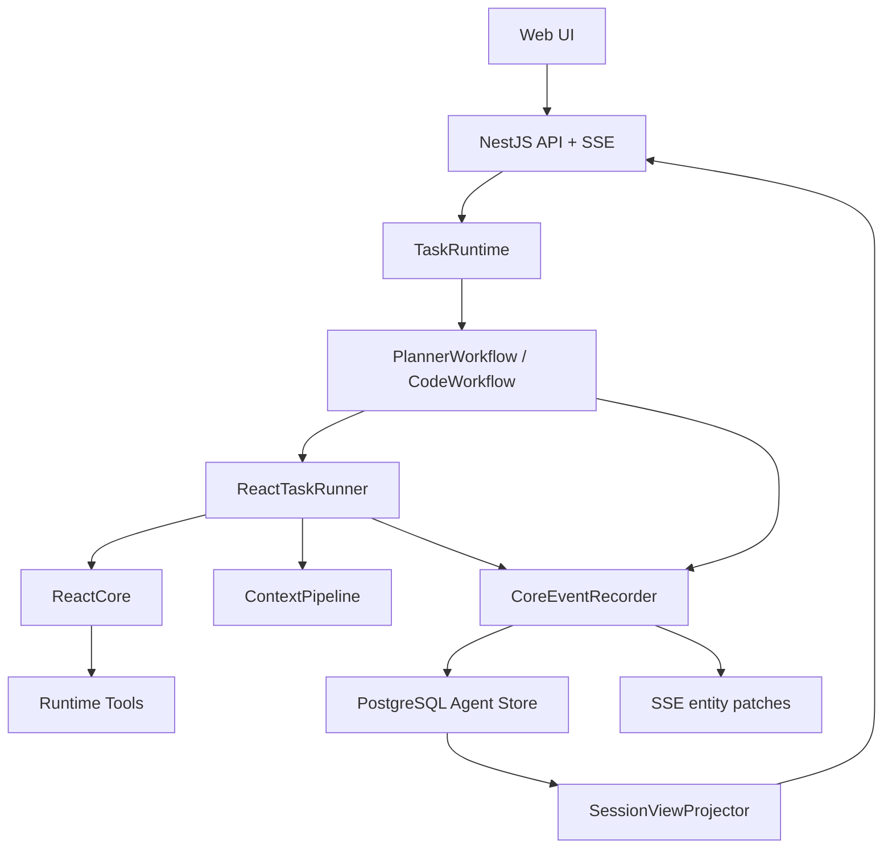
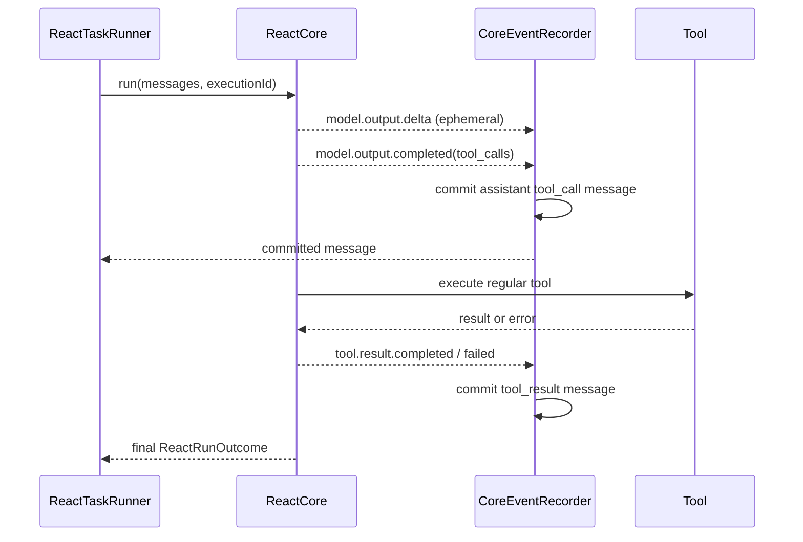
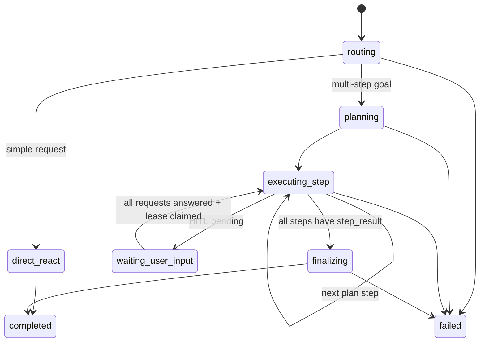

# Agent Runtime V2 目标运行时架构

## 1. 总体边界

系统分为五层，每层只有一个主职责：



### 层间规则

| 层 | 允许知道 | 禁止知道 |
| --- | --- | --- |
| `ReactCore` | LangChain messages、工具定义、工具执行结果、停止原因 | PostgreSQL、session、task、plan、SSE、UI |
| `ReactTaskRunner` | task、context、core event、执行限制 | HTTP controller、React UI 组件 |
| `PlannerWorkflow` | root task、plan、plan steps、step result | 流式 token chunk 细节、SQL |
| `TaskRuntime` | task 状态机、版本、lease、等待请求 | 模型 prompt、工具业务逻辑 |
| `CoreEventRecorder` | core event 到持久化实体的映射 | route 决策、step 业务含义 |
| `ContextPipeline` | context purpose、scope、ContextUnit、预算、snapshot | SSE/UI 布局 |
| `SessionViewProjector` | 已提交实体 | LLM、工具执行 |

## 2. 目录目标

```text
src/
  core/
    react/
      react-core.ts                 # 纯 ReAct 循环
      react-events.ts               # Core 事件和显式 outcome
      tool-call-assembler.ts        # 流式 tool args 解析
  runtime/
    task-runtime.ts                 # 状态机、CAS、lease、resume claim
    react-task-runner.ts            # 调用 ContextPipeline 和 ReactCore
    core-event-recorder.ts          # Core event -> committed entities + SSE
    execution-limits.ts             # abort、时间、迭代、工具调用限制
  planner/
    planner-workflow.ts             # direct/plan route、建 plan、推进、汇总
    planner-step-executor.ts        # 单 step 的 ReAct + step_result 校验
    planner-finalizer.ts            # 仅 plan + step_result 生成最终报告
  context/
    context-pipeline.ts             # 统一入口
    context-projector.ts            # purpose 决定候选内容
    context-units.ts                # message/tool exchange 原子单元
    context-budget.ts               # token 预算与截断
    context-assembler.ts            # ContextUnit -> LangChain messages
    snapshot-manager.ts             # scope/purpose snapshot 生命周期
  storage/
    postgres/
      schema.ts                     # clean canonical DDL + explicit reset
      postgres-agent-store.ts       # 事务和实体映射
      sql.ts                         # SQL constants / query fragments
    agent-store.ts                  # store contract
  view/
    session-view-projector.ts       # flat/grouped 统一投影
    timeline-projector.ts           # 纯函数，可被前端共享
  orchestration/
    agent-runtime.ts                # 仅 facade，组合 runtime/workflow
    code-agent.ts                   # CodeWorkflow facade
```

现有 `planner-react-agent.ts` 和 `react-agent.ts` 最终不再承担所有职责；它们应被薄 facade 替代，而不是继续向其中添加分支。

## 3. ReAct Core 的目标协议

### 3.1 输入

```ts
interface ReactRunInput {
  messages: BaseMessage[];
  executionId: string;
  outputIdFactory: () => string;
  toolContext: ReactCoreToolContext;
  limits: {
    maxIterations: number;
    maxToolCalls: number;
    deadlineMs?: number;
    signal?: AbortSignal;
  };
}
```

### 3.2 输出

```ts
type ReactRunOutcome =
  | { type: 'completed'; finalOutputId: string; content: string }
  | { type: 'waiting_user_input'; requestIds: string[] }
  | { type: 'failed'; code: 'empty_model_output' | 'max_iterations' | 'aborted' | 'model_error'; message: string }
  | { type: 'cancelled' };
```

Core 事件保留为流式副通道，但终态不能依赖“有没有 event”推断。

### 3.3 正确事件顺序



关键点：**assistant tool call 记录提交成功后，才允许工具执行。** 这既是恢复依据，也让失败重放可以做幂等判断。

### 3.4 工具执行策略

1. 将模型给出的 tool calls 分为普通工具和 HITL 工具。
2. 普通工具默认串行执行；每一个失败变为独立 `tool_result(status=failed)`，不阻止后续同轮工具。
3. HITL 工具只生成 `agent_input_requests`，不执行外部副作用。
4. 同轮有普通工具和 HITL 时：普通工具全部落结果，HITL request 全部落库，最终 outcome 为 `waiting_user_input`。
5. 流式参数解析失败时，生成一个带原始 chunk 的失败 tool result，而不是过滤掉。

## 4. PlannerWorkflow

Planner 是 root task 的内部工作流能力，不暴露一个与普通 agent 并列的“Planner Agent API”。路由仍可由模型完成，但路由结果由 runtime 持久化和执行。



### 4.1 路由

- 直接回答：创建 root task，`route_mode=direct`，由 `ReactTaskRunner` 运行。
- 规划：创建 root task，`route_mode=planned`；写 `agent_plans` 与 `agent_plan_steps`；随后创建当前 step 的 child task。
- 路由模型调用本身是 `agent_context_builds(call_purpose='planner.route')`，不是 message timeline 的 user message。

### 4.2 单 step 执行

每个 step child task：

1. 写入 internal `planner_step_input`（审计用，不进入一般 UI）。
2. ContextPipeline 使用 `purpose='planner_step'` 建上下文。
3. 调用共享 ReactTaskRunner。
4. ReAct 结束后，调用或要求模型生成结构化 `step_result`。
5. 只有 `step_result` 通过最小校验并持久化后，才以一个事务完成：step task、`agent_plan_steps`、root plan 的状态推进。

### 4.3 最终汇总

最终汇总上下文只能包含：原始目标、当前日期/时区、plan 当前版本、已完成 step 的 `step_result`。它不读取普通过程消息、失败工具结果、旧系统提示词或流式 delta。

## 5. TaskRuntime 与恢复

`AgentTaskStatus` 保持：

```ts
type AgentTaskStatus =
  | 'created'
  | 'running'
  | 'waiting_user_input'
  | 'resuming'
  | 'completed'
  | 'failed'
  | 'cancelled';
```

### 5.1 状态流转

| 当前 | 可到达 | 触发者 |
| --- | --- | --- |
| `created` | `running`, `cancelled` | 新任务被 worker claim |
| `running` | `waiting_user_input`, `completed`, `failed`, `cancelled` | core outcome / cancel |
| `waiting_user_input` | `resuming`, `cancelled` | 所有 pending input answered 后 claim |
| `resuming` | `running`, `failed`, `cancelled` | worker 重建 context 后继续 |
| `failed` | `resuming`, `cancelled` | 人工重试或取消 |
| `completed`, `cancelled` | 无 | 终态 |

### 5.2 多窗口安全恢复

`answerInputAndClaimResume` 必须在一个事务里完成：

1. `SELECT agent_input_requests ... FOR UPDATE`。
2. 只允许 `pending -> answered` 一次。
3. 查询同 task 是否仍有 pending request。
4. 若仍有 pending，只更新 waiting request ids，不恢复。
5. 若已全部回答，使用 `version` 与 lease 条件把 task 更新为 `resuming`，返回 `shouldResume=true` 给唯一 winner。
6. loser 只得到已回答/未 claim 结果，不启动新的模型循环。

lease 到期后，另一个 worker 可以接管 `running` 或 `resuming` 任务。模型供应商调用默认仍是 at-least-once；`context_builds.call_key` 用于检测可能重试的模型调用。

## 6. UI 与 SSE

### 6.1 服务端实体 patch

```ts
type SessionPatch =
  | { type: 'message.delta'; sessionId; taskId; messageId; outputId; channel; delta }
  | { type: 'message.upserted'; sessionId; message: AgentMessage }
  | { type: 'task.upserted'; sessionId; task: AgentTask }
  | { type: 'plan.upserted'; sessionId; plan: AgentPlan }
  | { type: 'plan_step.upserted'; sessionId; step: AgentPlanStep }
  | { type: 'input_request.upserted'; sessionId; request: AgentInputRequest }
  | { type: 'context_usage.updated'; sessionId; stats: AgentSessionTokenStats };
```

- `message.delta` 仅用于尚未完成的 assistant output；前端按 `(taskId, messageId, outputId)` merge。
- `message.upserted` 是完成后的全文，覆盖前端临时 buffer。
- 所有 entity patch 必须在数据库事务提交后发送。

### 6.2 GET view

`GET /sessions/:id/view` 返回：

```ts
{
  session,
  tasks,
  messages,          // flat, row_id ascending, canonical
  plans,
  planSteps,
  inputRequests,
  tokenStats,
  timeline,          // 同一份 messages 的派生投影
  cursor: { latestRowId }
}
```

`timeline` 不替代 `messages`。它只是为 UI 提供可选的 `flat` 与 `grouped_by_step` 视图；同一个纯函数在服务端与前端使用，前端可切换展示，不改变事实数据。
