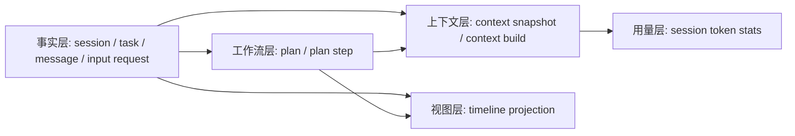

# Agent Runtime V2 存储、上下文与恢复设计

## 1. 数据分层



| 层 | 数据 | 可否删除后重建 | 目的 |
| --- | --- | --- | --- |
| 事实层 | session、task、message、input request | 不可 | 会话、恢复、审计的 source of truth |
| 工作流层 | plan、plan step | 不可 | 复杂任务的稳定推进状态 |
| 上下文层 | snapshot、context build | snapshot 可重建，build 不应删除 | 控制模型上下文与审计模型调用 |
| 视图层 | timeline | 可以 | UI 对事实层的投影 |
| 用量层 | token stats | 可以 | `context_builds` 的汇总缓存 |

## 2. 表设计

### 2.1 `agent_sessions`

一个用户可切换的会话容器。

| 字段 | 说明 |
| --- | --- |
| `id` | 会话稳定 ID |
| `mode` | `planner_react` 或 `code`；不是 runtime executor |
| `title` | 会话标题 |
| `status` | `active` / `archived` |
| `created_at_ms`、`updated_at_ms` | 列表排序与展示 |

不保存 session 内序号、运行游标或 rolling summary 指针。它们都属于其他表或可派生数据。

### 2.2 `agent_tasks`

task 是执行与恢复的 checkpoint。

| 字段 | 说明 |
| --- | --- |
| `id`、`session_id` | task 归属 |
| `parent_task_id` | root task 与 planner step child task 关系 |
| `project_id` | Code Agent 的数据库关系，不放 metadata |
| `kind` | 当前兼容 `react`、`planner`、`planner_step`、`code`；目标只保留运行语义需要的值 |
| `executor` | 选择共享 ReAct 或 Code ReAct 的执行器 |
| `phase` | `routing`、`planning`、`executing`、`finalizing` |
| `route_mode` | `direct` 或 `planned` |
| `status` | 标准 task 状态机 |
| `execution_id` | 一次 worker 运行/恢复尝试的关联 ID |
| `lease_owner`、`lease_expires_at_ms` | 多窗口、多 worker 互斥恢复 |
| `version` | optimistic concurrency control |
| `waiting_request_ids` | 当前全部等待请求；是缓存，真实状态来自 input request 行 |
| `error` | 终态错误摘要 |
| `metadata` | 仅保存非关系型扩展，如 prompt version、feature flags |

约束：

```sql
create unique index uniq_agent_tasks_active_root_per_session
  on agent_tasks(session_id)
  where parent_task_id is null
    and status in ('created', 'running', 'waiting_user_input', 'resuming');
```

这个 partial unique index 就是“同一 session 同时只允许一个 active root task”的数据库保证。它不需要 session 行锁，也不依赖浏览器客户端自觉。

### 2.3 `agent_plans` 与 `agent_plan_steps`

`agent_plans` 是 root task 的计划版本，`agent_plan_steps` 是顺序明确、可恢复的工作单元。

| 表 | 关键字段 | 规则 |
| --- | --- | --- |
| `agent_plans` | `root_task_id unique`、`version`、`status` | 一个 root task 最多一个当前 plan；计划更新增加 version |
| `agent_plan_steps` | `plan_id`、`position`、`task_id unique`、`result_message_id` | `(plan_id, position)` 唯一；每个 step 可绑定一个 child task |

`step_result` 是 `agent_messages` 中的一条 assistant 消息，`result_message_id` 指向它。它是步骤完成条件，而不是某一个工具结果的别名。

### 2.4 `agent_messages`

这是唯一的会话时间线。

| 字段 | 说明 |
| --- | --- |
| `row_id bigserial primary key` | 数据库生成的全局单调 cursor；按 `session_id, row_id` 读取即可还原会话 |
| `id` | 应用层稳定 message ID，供 SSE 及 UI merge |
| `session_id`、`task_id` | 必填归属 |
| `plan_id`、`step_id` | 可选的结构关系，供聚合、context 和索引；不从 JSON 提取 |
| `output_id` | 一个流式 assistant 输出的稳定 ID |
| `role` | `system`、`user`、`assistant`、`tool` |
| `message_kind` | 语义分类 |
| `visibility` | `ui` 或 `internal` |
| `content` | 已完成的完整文本；不写 delta |
| `tool_calls` | assistant 一次模型输出的批量 tool calls JSON |
| `tool_result` | 单个 tool result JSON |
| `metadata` | 可选的展示提示、工具运行附加信息；不承载主关系 |

`message_kind` 的稳定字典：

| kind | role | visibility 默认值 | 含义 |
| --- | --- | --- | --- |
| `message` | user / assistant | ui | 普通自然语言；step 内过程说明也使用它 |
| `tool_call` | assistant | ui | 工具调用消息，可能含多个 call |
| `tool_result` | tool | ui | 一个工具调用的完成或失败结果 |
| `system_prompt` | system | internal | 执行器系统提示词审计记录 |
| `planner_step_input` | system | internal | 当前 step 的指令审计记录 |
| `plan` | assistant | ui | 创建计划 |
| `plan_update` | assistant | ui | 更新计划 |
| `step_result` | assistant | ui | 稳定的单步骤产出 |
| `planner_final` | assistant | ui | 最终汇总 |

#### 工具配对

模型上下文中必须存在：assistant 的 `tool_calls` 与同一 call id 的 tool message。数据库并不把这两者塞进同一行：

```text
row 102  assistant / tool_call   tool_calls=[call_a, call_b]
row 103  tool      / tool_result tool_call_id=call_a
row 104  tool      / tool_result tool_call_id=call_b
```

ContextUnit builder 扫描 `tool_calls` 并按 call id 收集结果；未成对的 invocation 不能进入下一次模型调用，必须先恢复、失败化或等待 HITL。

### 2.5 `agent_input_requests`

HITL 是有状态的工具调用，不是普通 assistant 追问。

| 字段 | 说明 |
| --- | --- |
| `task_id`、`plan_id`、`step_id` | 精确归属 |
| `tool_call_id`、`tool_call_message_id` | 关联产生等待的调用 |
| `resume_mode` | `answer_as_tool_result` / `answer_as_user_input` |
| `input` | JSON schema，包括输入控件和选项 |
| `answer`、`answer_message_id` | 用户答案和它写入消息时间线的位置 |
| `status` | `pending`、`answered`、`cancelled`、`expired` |

约束：同一 task 下同一个 pending `tool_call_id` 只能有一个请求。这避免 SSE 重放或多窗口重复创建。

### 2.6 `agent_context_snapshots`

snapshot 存的是**投影后的稳定摘要**，不是原始消息备份。

| 字段 | 说明 |
| --- | --- |
| `scope_kind`、`scope_id` | `session`、`task`、`planner_step`、`code_project` 之一 |
| `purpose` | `conversation`、`task_execution`、`planner_step`、`planner_final`、`code_project` |
| `projection_version` | context 投影规则版本；规则变更不复用旧摘要 |
| `kind` | rolling、task、tool、project index 等摘要类别 |
| `source_row_id_start/end` | 摘要覆盖的事实时间线范围 |
| `base_snapshot_id`、`supersedes_snapshot_id` | 可追溯压缩链 |
| `summary` | Markdown 或 JSON 摘要 |
| token、checksum、prompt version | 质量与成本审计 |

活跃 snapshot 的唯一键是 `(scope_kind, scope_id, purpose, projection_version, kind)`，而不是“一个 session 一个 summary”。

### 2.7 `agent_context_builds`

每一次模型调用之前创建一行，之后用供应商真实 usage 补全。

| 字段 | 说明 |
| --- | --- |
| `execution_id` | 属于哪次 worker 尝试 |
| `call_key` | task 内可重试/去重键 |
| `call_purpose` | `planner.route`、`planner.step.react`、`planner.plan.finalize`、`code.react.loop` 等 |
| `status` | `started`、`completed`、`failed`、`cancelled` |
| `projection_version` | 本次 ContextPipeline 规则版本 |
| `context_manifest` | 包含哪些 unit、snapshot、工具 schema、固定前缀 hash |
| `estimated_*` | 预算决策输入 |
| `actual_*` | 模型供应商真实用量 |
| `cache_read/write_input_tokens` | 供应商提供时记录 KV/prompt cache 命中 |
| `output_id`、`result_type`、`tool_names` | 调用结果审计 |

`agent_session_token_stats` 是这张表的可重建汇总缓存。UI 展示“已用上下文”必须优先用最近一条 completed build 的 provider usage，而不是 tokenizer 模拟值。

## 3. ContextPipeline

### 3.1 输入输出

```ts
interface BuildContextInput {
  sessionId: string;
  task: AgentTask;
  purpose: AgentContextPurpose;
  executionId: string;
  model: { name: string; maxContextTokens: number; reservedOutputTokens: number };
}

interface BuiltContext {
  messages: BaseMessage[];
  manifest: ContextManifest;
  estimatedInputTokens: number;
  snapshotId?: string;
}
```

### 3.2 固定步骤


`ContextUnit` 是不可拆分的最小上下文单元：

- 一个 user message；
- 一个 assistant normal/final message；
- 一个 assistant tool-call message 加它的全部 tool-result messages；
- 一个 step_result；
- 一个 internal system message（仅该 purpose 明确允许时）。

不能在 budget 截断时只保留 tool result 或只保留 assistant tool call。

### 3.3 Planner Step 的四段上下文

每个 step 只组装以下四部分：

1. **React System Prompt**：当前执行器固定 prompt。
2. **Stable Task Context**：当前日期、时区、用户原始目标、plan 摘要、当前 step 指令。
3. **Previous Step Results**：之前已完成 step 的 `step_result`。
4. **Current Step Runtime Tail**：当前 step 已产生的 assistant/tool ContextUnit；仅用于同 step 的 tool result 继续推理和 resume。

不包含其他 step 的 raw assistant/tool 过程；不重复注入其他 step 的 ReAct system prompt。

### 3.4 最终报告上下文

```text
Planner final system prompt
+ Stable root goal / date / timezone
+ Latest plan version
+ Completed step_result units
```

没有 `Current Step Runtime Tail`，没有失败搜索、没有 intermediate thought、没有旧系统提示词。

## 4. 上下文压缩策略

### 触发条件

在 ContextPipeline budget selection 后触发，而不是由 UI 或 session 总消息数触发：

- selected ContextUnit 的估算输入 token 超过 `(maxContextTokens - reservedOutputTokens) * 0.7`；
- 当前 purpose 的 snapshot 距上次覆盖范围新增超过阈值；
- Code project index/working set 因文件变更失效。

### 压缩规则

1. 先保留固定前缀、当前用户目标、最新 step result、当前 step tail。
2. 从最老且可压缩的完整 ContextUnit 开始生成摘要。
3. 成功后事务中写 snapshot，再将旧 snapshot 标为 superseded。
4. 原 messages 永远不删除；snapshot 只是 projection cache。
5. `projection_version` 或 prompt version 变化时，旧 snapshot 不再作为 active 复用。

## 5. 初始化与迁移策略

启动路径只能做 idempotent `CREATE TABLE IF NOT EXISTS` 和 index 创建，不允许：

- `ALTER TABLE` 猜旧结构；
- 依据 metadata backfill 核心字段；
- 回填 `seq`；
- 自动 drop 表；
- 启动时改写历史会话。

提供两个明确入口：

| 入口 | 用途 |
| --- | --- |
| `initializePostgresSessionStoreSchema` | 新数据库或已处于当前 schema 的常规启动 |
| `resetPostgresSessionStoreSchema` | 仅开发/明确授权时，删除并重建全部 `agent_*` 表 |

生产 schema 升级应使用有版本号的 migration 文件；本次数据库已经清空，可以直接以 canonical schema 为 v1 基线，而不是保留旧表兼容分支。
