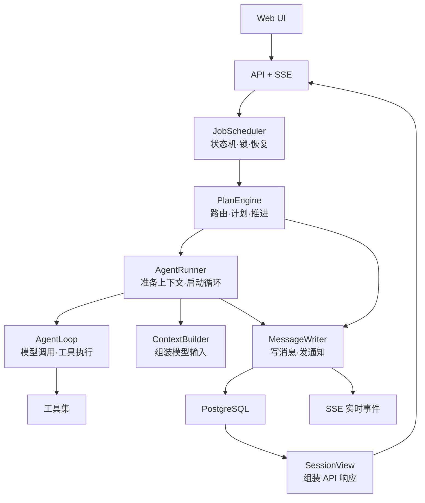
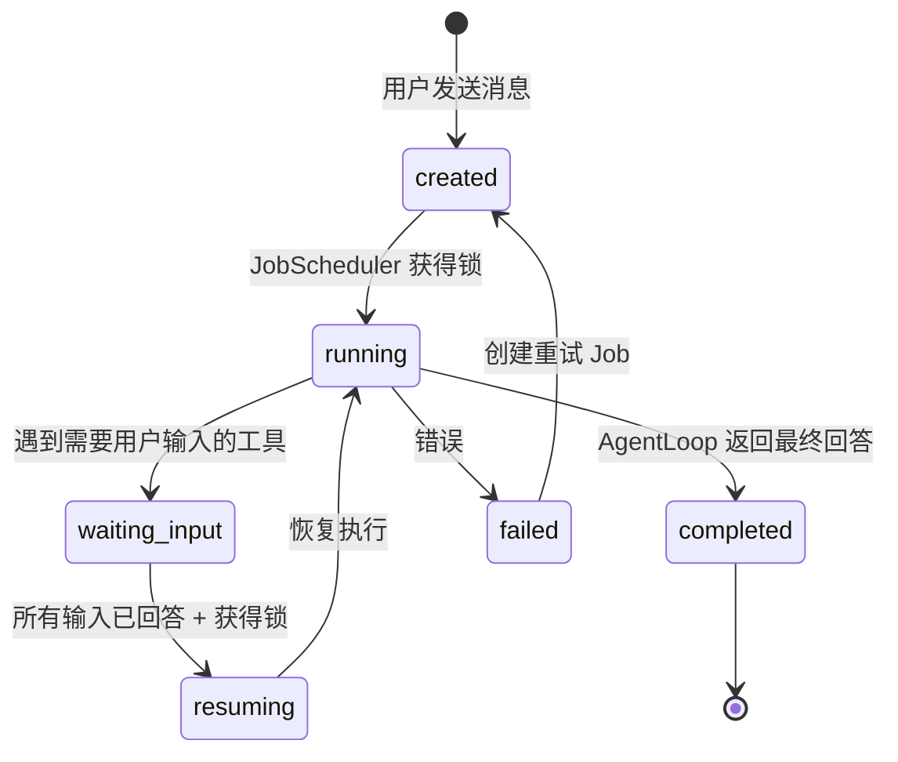

# Agent Runtime V2 命名优化方案

## 问题诊断

通读整套文档后，命名层面的不友好主要来自三个方面：

### 1. 抽象术语过多，需要"查字典"才能理解

| 当前名称 | 开发者的第一反应 |
| --- | --- |
| `root task` / `child task` | "root 和 child 是什么关系？为什么不直接叫它们是什么？" |
| `CoreEventRecorder` | "Core 是什么 Core？Event 是什么 Event？" |
| `ContextUnit` | "Unit 的单位是什么？" |
| `SessionViewProjector` | "Projector 是投影仪吗？" |
| `ReactRunOutcome` | "React 是前端的 React 还是 ReAct？" |
| `projection_version` | "投影版本？什么的投影？" |
| `scope_kind` / `scope_id` | "作用域？哪个层面的？" |

### 2. 同义词并存，增加心智负担

| 组合 | 困惑点 |
| --- | --- |
| `TaskRuntime` vs `ReactTaskRunner` | 都有 Task，谁管状态谁管执行？ |
| `ContextPipeline` vs `ContextBuilder` (现有) vs `ContextProjector` | 三个都在做"准备上下文"，边界在哪？ |
| `PlannerWorkflow` vs `PlannerStepExecutor` vs `PlannerFinalizer` | Planner 前缀重复三次，要记三个角色 |
| `execution_id` vs `call_key` vs `output_id` | 三个 ID，分别在哪一层生成、谁消费？ |

### 3. 缩写和行话堆叠

`CAS`、`lease`、`HITL`、`outbox`、`cursor`、`bigserial`、`ContextUnit`——对于不熟悉分布式系统的前后端开发者来说，这些词出现在同一份文档里会显著增加阅读阻力。

---

## 命名原则

在提出具体方案之前，先定三条原则：

> **原则 1：名字应该回答"这是什么"，而不是"它在架构图的哪个位置"**
>
> ❌ `CoreEventRecorder`（我需要知道 Core 层才能理解）
> ✅ `MessageWriter`（写消息的，一看就懂）

> **原则 2：用业务领域的词，不用解决方案领域的词**
>
> ❌ `ContextUnit`、`SessionViewProjector`、`projection_version`
> ✅ `MessageGroup`、`SessionView`、`context_rules_version`

> **原则 3：一个概念一个名字，不要有同义词**
>
> ❌ task 在不同地方意味着"用户的一次请求"、"planner 的一个步骤"、"worker 的一次执行尝试"
> ✅ 给这三个东西三个不同的名字

---

## 具体重命名方案

### 一、核心概念

这是影响最大的一层，因为这些概念会出现在代码、表名、API、文档的每个角落。

| 当前名称 | 建议名称 | 理由 |
| --- | --- | --- |
| `root task` | **`Job`** | 用户发一条消息，系统创建一个 Job 去完成。"Job"在开发者心智中就是"一件要做的事"，不需要解释 |
| `child task` (planner step 的执行) | **`StepRun`** | 这不是一个独立的"任务"，而是"执行 plan 中某个 step 的一次运行"。`StepRun` 直接表达了它的本质 |
| `task` (统称) | **`Job`** (绝大多数场景) | 只在需要区分 Job 和 StepRun 时才分开说，平时统一叫 Job |
| `execution_id` | **`attempt_id`** | "这是 Job 的第几次尝试"，比"执行 ID"更直觉 |
| `route_mode` | **`strategy`** | `strategy: 'direct' \| 'planned'`，读起来是 "这个 Job 的策略是直接回答还是做计划" |
| `phase` | **`stage`** | `stage: 'routing' \| 'planning' \| 'executing' \| 'finalizing'`，"阶段"比"相位"更日常 |
| `ContextUnit` | **`MessageGroup`** | 本质是"一组不可拆分的消息"（一个 tool call + 它的所有 result），叫 MessageGroup 更直白 |
| `step_result` | **`StepOutput`** | "步骤的输出"比"步骤的结果"更准确——它不是 boolean 的成功/失败，而是一段结构化产出 |
| `HITL` (文档中频繁出现) | **`UserInput` / 用户输入请求** | HITL 是行业缩写，但在代码和文档中直接写 "用户输入请求" 更友好 |

#### 效果对比

重命名前：
> "root task 创建 child task，child task 的 ReactRunOutcome 为 waiting_user_input 时，CoreEventRecorder 写入 HITL input request，TaskRuntime 更新 root task 的 waiting_request_ids。"

重命名后：
> "Job 为当前 plan step 创建一个 StepRun。StepRun 执行中遇到需要用户输入时，MessageWriter 写入输入请求，JobScheduler 更新 Job 的等待列表。"

---

### 二、运行时模块

| 当前名称 | 建议名称 | 一句话说明 |
| --- | --- | --- |
| `ReactCore` | **`AgentLoop`** | 模型调用 → 工具执行 → 再调模型的循环。"AgentLoop" 任何人都能猜到它在干什么。避免和前端 React 混淆 |
| `ReactTaskRunner` | **`AgentRunner`** | 负责"跑一个 Job 或 StepRun"：准备上下文 → 启动 AgentLoop → 处理结果 |
| `TaskRuntime` | **`JobScheduler`** | 管理 Job 的状态机、抢占锁、恢复。"Scheduler"比"Runtime"更精确地表达"调度和状态管理"的职责 |
| `CoreEventRecorder` | **`MessageWriter`** | 把 AgentLoop 产生的事件写入数据库、发送 SSE 通知。名字直接说"写消息" |
| `PlannerWorkflow` | **`PlanEngine`** | 路由决策、创建计划、推进步骤、触发汇总。"Engine" 比 "Workflow" 更紧凑 |
| `PlannerStepExecutor` | **`StepRunner`** | 执行单个 plan step：准备指令 → 调用 AgentRunner → 校验 StepOutput |
| `PlannerFinalizer` | **`PlanSummarizer`** | 只读取 plan + StepOutput 生成最终报告。"Summarizer" 直接说明产出 |
| `ReactRunOutcome` | **`LoopResult`** | AgentLoop 的最终结果：completed / waiting / failed / cancelled |
| `CoreStepEvent` | **`LoopEvent`** | AgentLoop 在执行过程中产生的事件流 |

---

### 三、上下文层

| 当前名称 | 建议名称 | 理由 |
| --- | --- | --- |
| `ContextPipeline` | **`ContextBuilder`** | 这就是在"构建上下文"，pipeline 暗示了多阶段处理，但开发者更熟悉 builder 模式 |
| `context-projector.ts` | **`context-filter.ts`** | 按 purpose 过滤候选消息，"filter"比"projector"直觉 |
| `context-units.ts` | **`message-groups.ts`** | 对应概念重命名 |
| `context-budget.ts` | **`token-budget.ts`** | 加上 "token" 前缀就知道是在算 token 预算 |
| `context-assembler.ts` | **`context-formatter.ts`** | 把 MessageGroup 转成 LangChain 消息格式，"formatter"更准确 |
| `snapshot-manager.ts` | **`summary-store.ts`** | snapshot 本质上是"压缩后的历史摘要"，"summary-store"直接说明存什么 |
| `projection_version` | **`context_rules_version`** | 不再需要解释"投影"是什么意思 |
| `scope_kind` / `scope_id` | **`owner_type` / `owner_id`** | "这个摘要属于谁"——session / job / step / project |
| `purpose` (context) | **`usage`** | `usage: 'conversation' \| 'step_execution' \| 'plan_summary' \| ...`——"这份上下文用在哪里" |
| `call_purpose` | **`call_type`** | `call_type: 'route' \| 'step_react' \| 'finalize' \| ...` |

---

### 四、存储层

| 当前表/字段名 | 建议名称 | 理由 |
| --- | --- | --- |
| `agent_tasks` | **`agent_jobs`** | 跟随核心概念重命名 |
| `agent_input_requests` | **`agent_user_inputs`** | 更直觉："需要用户输入的请求" |
| `agent_context_snapshots` | **`agent_summaries`** | snapshot 在 DB 语境容易和数据库快照混淆，"summaries" 直接说存的是什么 |
| `agent_context_builds` | **`agent_model_calls`** | 每行就是一次模型调用的记录。开发者看到 `model_calls` 就知道去这查模型调用历史 |
| `agent_session_token_stats` | **`agent_usage_stats`** | 更短，含义不变 |
| `context_manifest` | **`call_inputs`** | "这次模型调用的输入是什么" |
| `waiting_request_ids` | **`pending_input_ids`** | "等待中的用户输入 ID" |
| `lease_owner` / `lease_expires_at_ms` | **`locked_by` / `lock_expires_at_ms`** | "锁"比"租约"对大多数开发者更直觉 |
| `resume_mode` | **`answer_mode`** | `answer_mode: 'as_tool_result' \| 'as_user_message'`——回答以什么方式写回 |
| `message_kind` | **`message_type`** | kind 和 type 在 TS 中都常见，但 type 更主流 |

> [!NOTE]
> 表名保持 `agent_` 前缀不变——这是数据库级命名空间，避免和业务表冲突，值得保留。

---

### 五、领域字段重命名

| 当前字段 | 建议字段 | 上下文 |
| --- | --- | --- |
| `output_id` | **`stream_id`** | 一次流式输出的稳定 ID。"stream" 比 "output" 更清楚地表达"这是流式的" |
| `call_key` | **`idempotency_key`** | 直接用行业通用术语，不需要解释 |
| `result_message_id` | **`output_message_id`** | StepOutput 对应的消息 ID，跟 StepOutput 概念对齐 |
| `supersedes_snapshot_id` | **`replaces_summary_id`** | "替代了哪个旧摘要" |
| `base_snapshot_id` | **`parent_summary_id`** | "基于哪个摘要做的增量压缩" |

---

### 六、事件/Patch 类型

| 当前名称 | 建议名称 |
| --- | --- |
| `SessionPatch` | **`RealtimeEvent`** |
| `message.delta` | **`message.streaming`** |
| `message.upserted` | **`message.saved`** |
| `task.upserted` | **`job.updated`** |
| `plan.upserted` | **`plan.updated`** |
| `plan_step.upserted` | **`step.updated`** |
| `input_request.upserted` | **`input.requested`** |
| `context_usage.updated` | **`usage.updated`** |

---

## 重命名后的目录结构

```text
src/
  agent-loop/
    agent-loop.ts              # 模型调用 → 工具执行 → 循环
    loop-events.ts             # LoopEvent 定义
    loop-result.ts             # LoopResult：completed/waiting/failed/cancelled
    tool-call-parser.ts        # 流式 tool args 解析

  scheduler/
    job-scheduler.ts           # Job 状态机、锁、恢复调度
    agent-runner.ts            # 准备上下文 → 启动 AgentLoop → 处理结果
    message-writer.ts          # LoopEvent → 数据库消息 + SSE 通知
    execution-limits.ts        # 超时、最大迭代、最大工具调用

  planner/
    plan-engine.ts             # 路由 → 建计划 → 推进步骤 → 触发汇总
    step-runner.ts             # 单 step：指令 → AgentRunner → 校验 StepOutput
    plan-summarizer.ts         # plan + StepOutput → 最终报告

  context/
    context-builder.ts         # 统一入口
    context-filter.ts          # 按 usage 过滤候选消息
    message-groups.ts          # 不可拆分的消息组
    token-budget.ts            # token 预算与截断
    context-formatter.ts       # MessageGroup → LangChain 消息
    summary-store.ts           # 历史摘要的生命周期管理

  storage/
    postgres/
      schema.ts
      postgres-agent-store.ts
      sql.ts
    agent-store.ts             # store 接口

  view/
    session-view.ts            # GET /view 的数据组装
    timeline.ts                # 纯函数，flat/grouped 转换

  orchestration/
    agent-runtime.ts           # facade，组合 scheduler + planner
    code-agent.ts              # Code Agent facade
```

---

## 重命名后的架构图



---

## 重命名后的状态流转



---

## 重命名后的 Planner 流程

> "PlanEngine 路由后创建 Job。对于每个 plan step，StepRunner 创建一个 StepRun，通过 AgentRunner 启动 AgentLoop 执行。MessageWriter 写入 StepOutput。所有 step 完成后，PlanSummarizer 生成最终报告。"

---

## 完整对照速查表

| 分类 | 当前名称 | 建议名称 |
| --- | --- | --- |
| **概念** | root task | **Job** |
| | child task | **StepRun** |
| | HITL | **用户输入请求** |
| | ContextUnit | **MessageGroup** |
| | step_result | **StepOutput** |
| | execution_id | **attempt_id** |
| | route_mode | **strategy** |
| | phase | **stage** |
| **模块** | ReactCore | **AgentLoop** |
| | ReactTaskRunner | **AgentRunner** |
| | TaskRuntime | **JobScheduler** |
| | CoreEventRecorder | **MessageWriter** |
| | PlannerWorkflow | **PlanEngine** |
| | PlannerStepExecutor | **StepRunner** |
| | PlannerFinalizer | **PlanSummarizer** |
| | ContextPipeline | **ContextBuilder** |
| | SessionViewProjector | **SessionView** |
| | ReactRunOutcome | **LoopResult** |
| **表名** | agent_tasks | **agent_jobs** |
| | agent_input_requests | **agent_user_inputs** |
| | agent_context_snapshots | **agent_summaries** |
| | agent_context_builds | **agent_model_calls** |
| | agent_session_token_stats | **agent_usage_stats** |
| **字段** | lease_owner | **locked_by** |
| | lease_expires_at_ms | **lock_expires_at_ms** |
| | projection_version | **context_rules_version** |
| | scope_kind / scope_id | **owner_type / owner_id** |
| | call_purpose | **call_type** |
| | purpose (context) | **usage** |
| | call_key | **idempotency_key** |
| | message_kind | **message_type** |
| | output_id | **stream_id** |
| | waiting_request_ids | **pending_input_ids** |
| | resume_mode | **answer_mode** |
| **事件** | SessionPatch | **RealtimeEvent** |
| | message.delta | **message.streaming** |
| | message.upserted | **message.saved** |
| | task.upserted | **job.updated** |

---

## 保持不变的名称

以下名称已经足够清晰，建议保留：

| 名称 | 理由 |
| --- | --- |
| `agent_messages` | "Agent 的消息"，完美 |
| `agent_plans` / `agent_plan_steps` | "计划"和"计划步骤"，直觉 |
| `agent_sessions` | "会话"，通用 |
| `tool_calls` / `tool_result` | LLM 行业标准术语 |
| `row_id` | 数据库通用概念 |
| `version` | OCC 通用概念 |
| `signal` / `AbortSignal` | Web 标准 |
