# Agent Runtime V2 完整 Job + StepRun 架构设计

> 状态：Canonical Design Candidate
>
> 本文是 Agent Runtime V2 的统一目标设计。它保留 00–03 中“消息时间线、显式恢复、上下文投影、UI 与数据库统一”的核心方向，选择性采用 04 的命名，并吸收 05 中关于幂等、副作用、锁归属和 SSE 重连的修订。
>
> 当本文与 01–05 的目标命名、表结构或恢复语义冲突时，以本文为准。本文描述目标设计，不代表当前代码已经实现。

## 1. 设计目标

构建一套满足以下条件的 Agent Runtime：

1. 用户的每一次请求对应一个独立 `Job`。
2. 复杂 Job 可以创建 `Plan`；Plan 中每个声明式 `PlanStep` 由一个或多个 `StepRun` 执行。
3. `Job` 是唯一工作流调度与 lease 所有者；`StepRun` 是步骤级执行 checkpoint，不独立争抢工作流 lease。
4. `agent_messages` 是唯一会话事实时间线；UI、上下文和刷新恢复都从已提交实体派生。
5. ReAct 循环不感知 PostgreSQL、HTTP、SSE、Plan 或 UI，但其事件顺序必须允许外层在工具副作用前完成持久化。
6. 工具调用具备显式 invocation 状态、幂等键和副作用等级；未知副作用不得自动重放。
7. 用户输入请求是正式运行时实体；多个请求全部回答后最多恢复一次。
8. 上下文按 purpose、owner、预算和完整消息组构建，不把整个 session 无条件塞入模型。
9. 实时 UI 与刷新后的 `GET /view` 最终一致；断线重连的 MVP 采用全量 view 恢复。
10. PostgreSQL 使用 canonical schema 和版本化 migration；启动路径不猜测或改写旧结构。

## 2. 非目标

本轮设计明确不包含：

- 不引入 LangGraph 或其他完整图执行引擎。
- 不实现同一个 Job 内多个 PlanStep 并行执行。
- 不承诺外部副作用 exactly-once；系统提供可证明的 at-least-once/人工消歧边界。
- 不在首版实现持久化 SSE outbox；断线后通过全量 view 恢复。
- 不持久化模型的私有 chain-of-thought。
- 不让 FileSessionStore 模拟 PostgreSQL 的事务和并发语义。
- 不把 Code Agent 的文件内容存入 PostgreSQL；代码文件仍位于 sandbox。

## 3. Canonical 命名

### 3.1 领域实体

| 名称 | 定义 | 不是什么 |
| --- | --- | --- |
| `Session` | 用户可持续对话的容器 | 不是执行 checkpoint |
| `Job` | 用户一条目标消息触发的完整工作流 | 不是一次模型调用，也不是 PlanStep |
| `Plan` | Planned Job 的声明式步骤集合 | 不是运行时调用栈 |
| `PlanStep` | Plan 中稳定、可排序的工作单元定义 | 不是一次 worker 尝试 |
| `StepRun` | 某个 PlanStep 的一次执行实例 | 不是独立 Job，不持有工作流 lease |
| `Attempt` | worker 对 Job 或 StepRun 的一次运行/恢复尝试，由 `attempt_id` 标识 | 不单独建立 checkpoint 表 |
| `ToolInvocation` | 一个具体 tool call 的可恢复执行状态 | 不是整条 assistant tool-call message |
| `UserInputRequest` | 运行时等待用户提供值或审批的请求 | 不是普通 assistant 追问 |
| `MessageGroup` | 模型上下文中不可拆分的一组消息 | 不是数据库表 |
| `StepOutput` | StepRun 成功后产生的结构化稳定产出 | 不是任意 tool result |
| `ContextSummary` | 某个 owner + purpose 下对历史事实的压缩摘要 | 不是原始消息备份 |
| `ModelCall` | 一次真实模型请求及其上下文、结果和 usage 审计记录 | 不是 Job/StepRun checkpoint |

### 3.2 模块命名

| 模块 | 职责 |
| --- | --- |
| `AgentLoop` | 通用 ReAct 协议循环；模型调用、tool-call 轮次和显式终态 |
| `AgentRunner` | 为 Job/StepRun 准备 context、驱动 AgentLoop、消费事件 |
| `JobCoordinator` | Job 状态机、lease、恢复 claim、取消与重试协调 |
| `RuntimeEventWriter` | 将 Loop/Workflow 事件原子提交为 runtime 实体；提交后发布 SSE |
| `ToolExecutor` | 工具查找、参数校验、invocation claim、副作用策略和真实执行 |
| `PlanEngine` | route、建 Plan、选择下一步骤、推进状态、触发最终汇总 |
| `StepRunner` | 创建/恢复 StepRun、运行 AgentRunner、校验 StepOutput |
| `PlanSummarizer` | 只使用目标、最终 Plan 和 StepOutput 生成最终答案 |
| `ContextBuilder` | context 的统一构建入口 |
| `ContextFilter` | 根据 purpose/owner 选取候选事实 |
| `MessageGroupBuilder` | 构造完整 tool pair 等不可拆分上下文单元 |
| `TokenBudget` | 估算、保留、截断和压缩触发决策 |
| `ContextFormatter` | 将 MessageGroup 转换为 LangChain messages |
| `ContextSummaryManager` | ContextSummary 的创建、替换、失效和压缩链管理 |
| `SessionView` | 装配 `GET /view` canonical response |
| `TimelineBuilder` | 从 canonical entities 生成 flat/grouped timeline 的纯函数 |

### 3.3 字段命名决策

采用：

- `attempt_id`，不再使用含义宽泛的 `execution_id`。
- `strategy: direct | planned`，不再使用 `route_mode`。
- `stage`，不再使用 `phase`。
- `context_rules_version`，不再使用 `projection_version`。
- `owner_type/owner_id`，用于说明 ContextSummary 属于谁。
- `message_type`，不再使用 `message_kind`。
- `answer_mode`，不再使用 `resume_mode`。
- `logical_call_key`，表示模型调用的逻辑去重键。
- `idempotency_key`，只表示真实工具副作用的幂等键。

保留：

- `purpose`：比 `usage` 更不容易与 token usage 混淆。
- `output_id`：非流式模型输出同样需要稳定 output ID。
- `lease_owner/lease_expires_at_ms`：这是有过期语义的 lease，不是普通 mutex。
- `message.delta` 和 `*.upserted`：准确表达增量与幂等 reducer 操作。
- `input_manifest`：记录本次模型输入由哪些事实和摘要构成，不假装保存完整原始输入。

### 3.4 ID 的层级

| ID | 生成者 | 生命周期 | 用途 |
| --- | --- | --- | --- |
| `job_id` | API/runtime | 一次用户目标 | 工作流主键 |
| `step_run_id` | PlanEngine | 一次 PlanStep 执行 | 步骤 checkpoint |
| `attempt_id` | JobCoordinator | 一次 worker claim | 区分恢复/接管尝试 |
| `model_call_id` | AgentRunner | 一次 LLM 调用 | usage 与输入审计 |
| `logical_call_key` | workflow | Job 内稳定 | 模型调用重试检测 |
| `output_id` | AgentLoop | 一次模型输出 | delta 与最终文本合并 |
| `tool_call_id` | 模型或 assembler | 一个 tool call | LLM tool protocol 配对 |
| `tool_invocation_id` | RuntimeEventWriter | 一个 tool call 的运行状态 | 工具恢复与副作用审计 |
| `idempotency_key` | ToolExecutor | 一个外部副作用 | 传给支持幂等的工具/provider |
| `message_id` | RuntimeEventWriter | 一条已提交消息 | SSE entity merge |

## 4. 不可破坏的系统不变量

1. 同一 Session 同时最多一个非终态 Job。
2. Planned Job 同时最多一个 active StepRun。
3. 一个 PlanStep 同时最多一个 active StepRun；显式 retry 才创建新的 `run_no`。
4. 只有 Job 持有 lease；StepRun 不持有独立 lease。
5. `failed` Job 是终态；重试必须创建新 Job，并填写 `retry_of_job_id`。
6. assistant tool-call message 和对应 ToolInvocation 必须在工具执行前提交。
7. `side_effecting` invocation 若在执行中失联，恢复后进入 `unknown`，不得自动重放。
8. tool-call MessageGroup 必须包含该 assistant message 的全部 tool result；不完整组不得进入下一次模型调用。
9. 工具来源的 UserInputRequest 必须回填 tool result；`as_user_message` 仅允许非 tool 来源请求。
10. StepRun 只有在 StepOutput 校验并持久化后才能 completed。
11. PlanSummarizer 不能读取其他步骤的 raw runtime、失败搜索或 system prompt。
12. message delta 不落库；数据库只存完成后的消息实体。
13. 所有 SSE entity upsert 在事务 commit 后发送。
14. 所有写消息的事务先锁定 Session 行，再分配 `row_id`，保证同 Session 的 row cursor 与提交顺序一致。
15. 任何关系型主关联都必须使用列和外键，不得依赖 metadata JSON 推断。
16. metadata 只允许非关键扩展信息；运行恢复不得依赖 metadata。
17. 不持久化私有 chain-of-thought；只允许可展示的 progress summary。

## 5. 总体架构

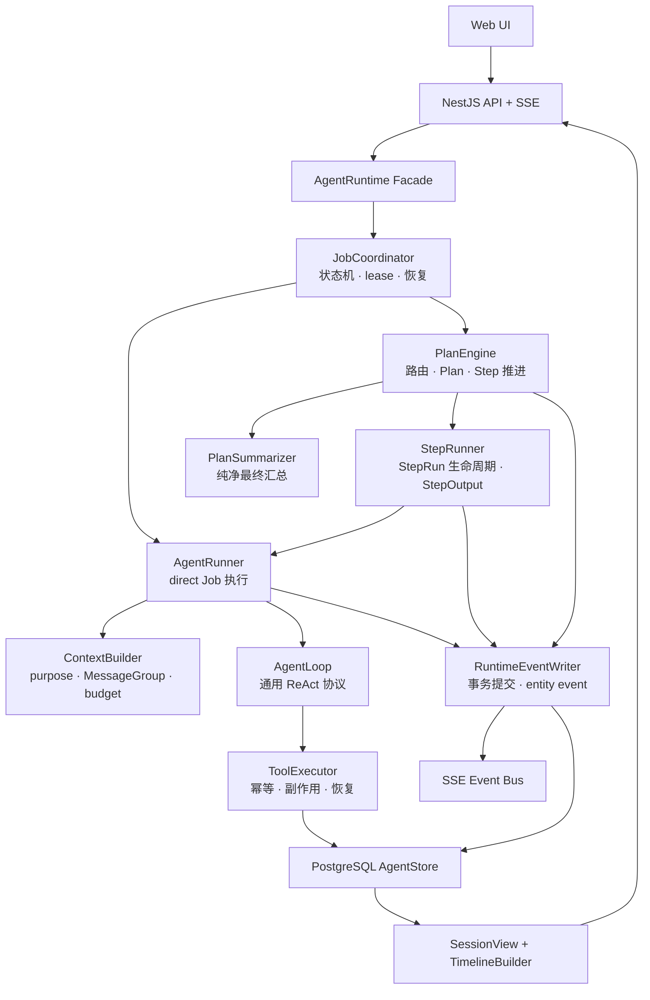

### 5.1 依赖方向

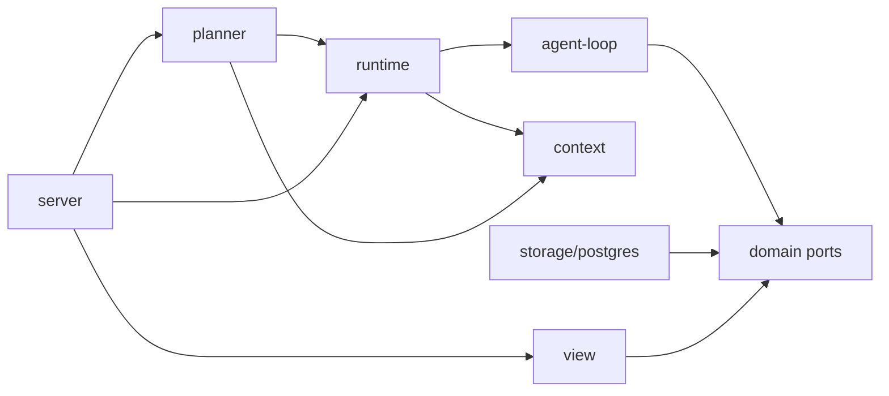

规则：

- `agent-loop` 不 import storage、server、planner、view。
- `context` 不 import server 或前端类型。
- `storage` 实现 domain port，不反向 import orchestration。
- `view` 只能读取已提交实体，不调用模型和工具。
- SSE domain contract 放在共享 domain 层，不能以 React component 状态为准。

## 6. 目标目录结构

```text
src/
  agent-loop/
    agent-loop.ts
    loop-events.ts
    loop-result.ts
    tool-call-assembler.ts
    model-port.ts

  runtime/
    agent-runner.ts
    job-coordinator.ts
    runtime-event-writer.ts
    tool-executor.ts
    execution-limits.ts
    runtime-errors.ts
    transaction-commands.ts

  planner/
    plan-engine.ts
    step-runner.ts
    step-output.ts
    plan-summarizer.ts
    planner-prompts.ts

  context/
    context-builder.ts
    context-filter.ts
    message-group-builder.ts
    token-budget.ts
    context-formatter.ts
    context-summary-manager.ts
    context-purpose.ts

  domain/
    session.ts
    job.ts
    plan.ts
    step-run.ts
    message.ts
    tool-invocation.ts
    user-input-request.ts
    context-summary.ts
    model-call.ts
    realtime-event.ts
    code-project.ts

  storage/
    agent-store.ts
    postgres/
      schema-v1.ts
      migrations.ts
      postgres-agent-store.ts
      transaction-commands.ts
      row-mappers.ts
      sql.ts

  view/
    session-view.ts
    timeline-builder.ts
    view-contract.ts

  orchestration/
    agent-runtime.ts
    code-agent.ts

  server/
    http/
    runtime/

scripts/
  reset-agent-runtime-schema.ts
  migrate-agent-runtime-schema.ts
```

## 7. 领域关系

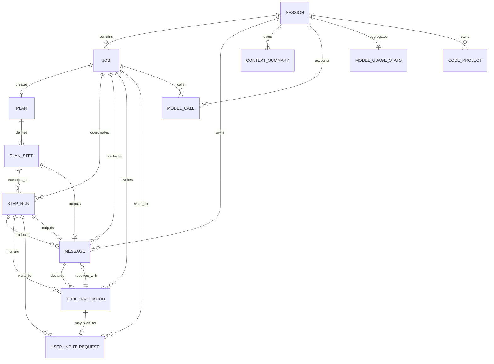

### 7.1 Job、PlanStep、StepRun 的区别

```text
Job: 用户目标的完整生命周期
  Plan: “准备做哪些步骤”的声明
    PlanStep: 第 1 步的稳定定义
      StepRun #1: 第一次正式执行
        Attempt A: worker 首次运行
        Attempt B: HITL 恢复或 lease 接管
      StepRun #2: StepRun #1 终态失败后的显式重试
```

约束：

- worker crash、HITL 恢复、lease 接管：同一个 StepRun，新的 `attempt_id` 和递增 `attempt_no`。
- StepRun 已 failed，但 Job 尚未进入终态且重试策略允许：把 PlanStep 重新置为 pending，新建 StepRun，`run_no + 1`。
- Job 已 failed：不复活原 Job，新建 Job，并通过 `retry_of_job_id` 关联。

## 8. Canonical PostgreSQL Schema V1

### 8.1 通用约定

- ID 使用应用生成的稳定 `text` ID；不得使用时间戳拼接作为唯一安全保证。
- 时间统一使用 `bigint` 毫秒字段，保持与现有 TypeScript domain 一致。
- 所有可变实体包含 `version integer`，每次成功更新 `version + 1`。
- JSONB 只存扩展或结构化 payload，不承担主关系。
- 所有生产 schema 变化通过 migration；正常启动只校验版本和必要对象存在。

### 8.2 Schema version

```sql
create table agent_schema_versions (
  version integer primary key,
  name text not null unique,
  checksum text not null,
  applied_at_ms bigint not null
);
```

启动时：

- 数据库无版本：拒绝生产启动，开发环境可显式执行 migration。
- 数据库版本低于代码：拒绝启动并提示 migration。
- 数据库版本高于代码：拒绝启动，防止旧服务写新 schema。
- checksum 不匹配：拒绝启动，禁止静默接受被修改的 migration。

### 8.3 `agent_sessions`

```sql
create table agent_sessions (
  id text primary key,
  title text,
  mode text not null check (mode in ('agent', 'code')),
  status text not null check (status in ('active', 'archived')),
  version integer not null default 0 check (version >= 0),
  created_at_ms bigint not null,
  updated_at_ms bigint not null
);

create index idx_agent_sessions_updated
  on agent_sessions(status, updated_at_ms desc, id asc);
```

Session 不保存消息 cursor、pending input cache 或 rolling summary 指针，这些均可从其他实体查询。

### 8.4 `agent_code_projects`

```sql
create table agent_code_projects (
  id text primary key,
  session_id text not null references agent_sessions(id) on delete cascade,
  title text not null,
  status text not null check (status in ('active', 'archived', 'deleted')),
  sandbox_relative_path text not null,
  framework text,
  language text,
  package_manager text,
  version integer not null default 0 check (version >= 0),
  metadata jsonb,
  created_at_ms bigint not null,
  updated_at_ms bigint not null,
  unique (session_id, sandbox_relative_path)
);

create index idx_agent_code_projects_session
  on agent_code_projects(session_id, status, updated_at_ms desc);
```

### 8.5 `agent_jobs`

```sql
create table agent_jobs (
  id text primary key,
  session_id text not null references agent_sessions(id) on delete cascade,
  project_id text references agent_code_projects(id) on delete set null,
  retry_of_job_id text references agent_jobs(id) on delete set null,
  client_request_id text,

  strategy text check (strategy is null or strategy in ('direct', 'planned')),
  stage text not null check (
    stage in ('routing', 'direct_execution', 'planning', 'step_execution', 'finalizing')
  ),
  status text not null check (
    status in (
      'created',
      'running',
      'waiting_user_input',
      'resuming',
      'completed',
      'failed',
      'cancelled'
    )
  ),

  current_attempt_id text,
  attempt_no integer not null default 0 check (attempt_no >= 0),
  lease_owner text,
  lease_expires_at_ms bigint,

  error_code text,
  error_message text,
  error_details jsonb,
  version integer not null default 0 check (version >= 0),
  metadata jsonb,

  created_at_ms bigint not null,
  updated_at_ms bigint not null,
  started_at_ms bigint,
  completed_at_ms bigint,

  check (
    (status in ('running', 'resuming'))
    = (lease_owner is not null and lease_expires_at_ms is not null)
  ),
  check (
    (status in ('completed', 'failed', 'cancelled') and completed_at_ms is not null)
    or status not in ('completed', 'failed', 'cancelled')
  )
);

create unique index uniq_agent_jobs_active_session
  on agent_jobs(session_id)
  where status in ('created', 'running', 'waiting_user_input', 'resuming');

create unique index uniq_agent_jobs_client_request
  on agent_jobs(session_id, client_request_id)
  where client_request_id is not null;

create index idx_agent_jobs_session_timeline
  on agent_jobs(session_id, created_at_ms asc, id asc);

create index idx_agent_jobs_recovery
  on agent_jobs(status, lease_expires_at_ms)
  where status in ('running', 'resuming');

create index idx_agent_jobs_project
  on agent_jobs(project_id, status, updated_at_ms desc)
  where project_id is not null;
```

说明：

- `strategy` 在 route 完成前可以为 null。
- `created` 不要求 lease；worker claim 后原子进入 `running`。
- `waiting_user_input` 不持有有效 lease，避免长时间锁死 worker。
- `resuming` 必须已由唯一 winner claim lease。
- 不保存 `pending_input_ids` 缓存；pending 状态从请求表查询，避免双写漂移。

### 8.6 `agent_plans`

```sql
create table agent_plans (
  id text primary key,
  session_id text not null references agent_sessions(id) on delete cascade,
  job_id text not null unique references agent_jobs(id) on delete cascade,
  title text not null,
  goal text not null,
  status text not null check (
    status in ('draft', 'active', 'waiting_user_input', 'completed', 'failed', 'cancelled')
  ),
  version integer not null default 0 check (version >= 0),
  metadata jsonb,
  created_at_ms bigint not null,
  updated_at_ms bigint not null,
  completed_at_ms bigint
);

create index idx_agent_plans_session
  on agent_plans(session_id, created_at_ms asc, id asc);
```

一个 Job 只有一个 canonical Plan。Plan 内容调整通过更新 Plan version、追加/更新 PlanStep 和写 `plan_updated` message 表达，不创建并行 current Plan。

### 8.7 `agent_plan_steps`

```sql
create table agent_plan_steps (
  id text primary key,
  plan_id text not null references agent_plans(id) on delete cascade,
  position integer not null check (position >= 0),
  title text not null,
  instruction text not null,
  status text not null check (
    status in ('pending', 'running', 'waiting_user_input', 'completed', 'failed', 'cancelled')
  ),
  output_message_id text,
  error_code text,
  error_message text,
  error_details jsonb,
  version integer not null default 0 check (version >= 0),
  metadata jsonb,
  created_at_ms bigint not null,
  updated_at_ms bigint not null,
  completed_at_ms bigint,
  unique (plan_id, position)
);

create index idx_agent_plan_steps_status
  on agent_plan_steps(plan_id, status, position asc);
```

`output_message_id` 在 messages 表创建后添加 deferrable FK，确保 StepOutput 与 PlanStep 同事务提交。

### 8.8 `agent_step_runs`

```sql
create table agent_step_runs (
  id text primary key,
  session_id text not null references agent_sessions(id) on delete cascade,
  job_id text not null references agent_jobs(id) on delete cascade,
  plan_id text not null references agent_plans(id) on delete cascade,
  step_id text not null references agent_plan_steps(id) on delete cascade,
  run_no integer not null check (run_no > 0),

  executor text not null check (executor in ('agent', 'code')),
  status text not null check (
    status in (
      'created',
      'running',
      'waiting_user_input',
      'resuming',
      'completed',
      'failed',
      'cancelled'
    )
  ),

  current_attempt_id text,
  attempt_no integer not null default 0 check (attempt_no >= 0),
  output_message_id text,
  error_code text,
  error_message text,
  error_details jsonb,
  version integer not null default 0 check (version >= 0),
  metadata jsonb,

  created_at_ms bigint not null,
  updated_at_ms bigint not null,
  started_at_ms bigint,
  completed_at_ms bigint,

  unique (step_id, run_no),
  check (
    (status in ('completed', 'failed', 'cancelled') and completed_at_ms is not null)
    or status not in ('completed', 'failed', 'cancelled')
  )
);

create unique index uniq_agent_step_runs_active_step
  on agent_step_runs(step_id)
  where status in ('created', 'running', 'waiting_user_input', 'resuming');

create unique index uniq_agent_step_runs_active_job
  on agent_step_runs(job_id)
  where status in ('created', 'running', 'waiting_user_input', 'resuming');

create index idx_agent_step_runs_job
  on agent_step_runs(job_id, created_at_ms asc, id asc);
```

StepRun 不包含 lease 字段。所有状态推进必须由持有 Job lease 的 worker 发起，或由回答用户输入的原子事务 claim Job lease 后发起。

### 8.9 `agent_messages`

```sql
create table agent_messages (
  row_id bigserial primary key,
  id text not null unique,
  session_id text not null references agent_sessions(id) on delete cascade,
  job_id text not null references agent_jobs(id) on delete cascade,
  plan_id text references agent_plans(id) on delete set null,
  step_id text references agent_plan_steps(id) on delete set null,
  step_run_id text references agent_step_runs(id) on delete set null,
  attempt_id text,
  output_id text,

  role text not null check (role in ('system', 'user', 'assistant', 'tool')),
  message_type text not null check (
    message_type in (
      'user_message',
      'assistant_message',
      'tool_call',
      'tool_result',
      'system_prompt',
      'plan_created',
      'plan_updated',
      'step_instruction',
      'step_output',
      'plan_final',
      'progress',
      'error_notice',
      'code_artifact'
    )
  ),
  visibility text not null check (visibility in ('ui', 'internal')),
  channel text check (channel is null or channel in ('normal', 'progress', 'final')),
  content text not null,

  tool_calls jsonb,
  tool_call_id text,
  tool_name text,
  tool_result jsonb,
  metadata jsonb,
  created_at_ms bigint not null,

  check (
    (
      message_type = 'tool_call'
      and role = 'assistant'
      and tool_calls is not null
      and jsonb_typeof(tool_calls) = 'array'
      and jsonb_array_length(tool_calls) > 0
    )
    or message_type <> 'tool_call'
  ),
  check (
    (
      message_type = 'tool_result'
      and role = 'tool'
      and tool_call_id is not null
      and tool_name is not null
      and tool_result is not null
    )
    or message_type <> 'tool_result'
  ),
  check (
    (message_type = 'user_message' and role = 'user')
    or (message_type in (
      'assistant_message',
      'tool_call',
      'plan_created',
      'plan_updated',
      'step_output',
      'plan_final',
      'progress',
      'error_notice',
      'code_artifact'
    ) and role = 'assistant')
    or (message_type in ('system_prompt', 'step_instruction') and role = 'system')
    or (message_type = 'tool_result' and role = 'tool')
  ),
  check (
    message_type <> 'system_prompt' or (role = 'system' and visibility = 'internal')
  ),
  check (
    message_type <> 'step_instruction' or (role = 'system' and visibility = 'internal')
  )
);

create index idx_agent_messages_session_cursor
  on agent_messages(session_id, row_id asc);

create index idx_agent_messages_job_cursor
  on agent_messages(job_id, row_id asc);

create index idx_agent_messages_step_run_cursor
  on agent_messages(step_run_id, row_id asc)
  where step_run_id is not null;

create index idx_agent_messages_plan_step
  on agent_messages(plan_id, step_id, row_id asc)
  where plan_id is not null;

create index idx_agent_messages_visible
  on agent_messages(session_id, visibility, row_id asc);

create unique index uniq_agent_messages_job_output
  on agent_messages(job_id, output_id)
  where output_id is not null;

alter table agent_plan_steps
  add constraint fk_agent_plan_steps_output_message
  foreign key (output_message_id) references agent_messages(id)
  deferrable initially deferred;

alter table agent_step_runs
  add constraint fk_agent_step_runs_output_message
  foreign key (output_message_id) references agent_messages(id)
  deferrable initially deferred;
```

消息规则：

- delta 不写入该表。
- tool-call assistant message 可以包含多个 tool call。
- 每个 tool result 单独一行，并通过 `tool_call_id` 与调用配对。
- `step_output` 是唯一可被 PlanSummarizer 消费的步骤产出。
- `progress` 只能存可公开的进度摘要，不得存模型私有推理。
- message_type 是受控字典；新增类型必须同时修改 domain union、DDL migration、ContextFilter 和 TimelineBuilder。

### 8.10 `agent_tool_invocations`

```sql
create table agent_tool_invocations (
  id text primary key,
  session_id text not null references agent_sessions(id) on delete cascade,
  job_id text not null references agent_jobs(id) on delete cascade,
  plan_id text references agent_plans(id) on delete set null,
  step_id text references agent_plan_steps(id) on delete set null,
  step_run_id text references agent_step_runs(id) on delete set null,
  attempt_id text not null,

  call_message_id text not null references agent_messages(id) on delete restrict,
  result_message_id text references agent_messages(id) on delete restrict,
  tool_call_id text not null,
  tool_name text not null,
  arguments jsonb not null check (jsonb_typeof(arguments) = 'object'),
  arguments_checksum text not null,

  side_effect_level text not null check (
    side_effect_level in ('read_only', 'idempotent', 'side_effecting')
  ),
  idempotency_key text not null,
  status text not null check (
    status in (
      'pending',
      'running',
      'waiting_user_input',
      'completed',
      'failed',
      'unknown',
      'cancelled'
    )
  ),

  result_payload jsonb,
  error_code text,
  error_message text,
  error_details jsonb,
  version integer not null default 0 check (version >= 0),
  metadata jsonb,

  created_at_ms bigint not null,
  started_at_ms bigint,
  completed_at_ms bigint,
  updated_at_ms bigint not null,

  unique (job_id, tool_call_id),
  unique (job_id, idempotency_key),
  check (
    (status in ('completed', 'failed') and result_message_id is not null and completed_at_ms is not null)
    or status not in ('completed', 'failed')
  )
);

create index idx_agent_tool_invocations_recovery
  on agent_tool_invocations(status, updated_at_ms)
  where status in ('pending', 'running', 'unknown', 'waiting_user_input');

create index idx_agent_tool_invocations_step_run
  on agent_tool_invocations(step_run_id, created_at_ms asc)
  where step_run_id is not null;
```

为什么必须单独建表：一条 assistant tool-call message 可能包含多个调用，它们可以分别处于 completed、waiting、failed 或 unknown。message 级 `invocation_status` 无法表达这种状态组合。

### 8.11 `agent_user_input_requests`

```sql
create table agent_user_input_requests (
  id text primary key,
  session_id text not null references agent_sessions(id) on delete cascade,
  job_id text not null references agent_jobs(id) on delete cascade,
  plan_id text references agent_plans(id) on delete set null,
  step_id text references agent_plan_steps(id) on delete set null,
  step_run_id text references agent_step_runs(id) on delete set null,
  tool_invocation_id text references agent_tool_invocations(id) on delete restrict,

  source text not null check (source in ('tool', 'agent', 'planner', 'recovery')),
  answer_mode text not null check (answer_mode in ('as_tool_result', 'as_user_message')),
  status text not null check (status in ('pending', 'answered', 'cancelled', 'expired')),

  title text,
  prompt text not null,
  input_schema jsonb not null check (jsonb_typeof(input_schema) = 'object'),
  answer jsonb,
  answer_message_id text references agent_messages(id) on delete restrict,
  client_answer_id text,

  version integer not null default 0 check (version >= 0),
  metadata jsonb,
  created_at_ms bigint not null,
  updated_at_ms bigint not null,
  answered_at_ms bigint,

  check (
    (source = 'tool' and tool_invocation_id is not null and answer_mode = 'as_tool_result')
    or source <> 'tool'
  ),
  check (
    (
      status = 'answered'
      and answer is not null
      and answer_message_id is not null
      and client_answer_id is not null
      and answered_at_ms is not null
    )
    or status <> 'answered'
  )
);

create unique index uniq_agent_user_input_tool_invocation
  on agent_user_input_requests(tool_invocation_id)
  where tool_invocation_id is not null;

create unique index uniq_agent_user_input_client_answer
  on agent_user_input_requests(job_id, client_answer_id)
  where client_answer_id is not null;

create index idx_agent_user_inputs_job_pending
  on agent_user_input_requests(job_id, status, created_at_ms asc);

create index idx_agent_user_inputs_step_run_pending
  on agent_user_input_requests(step_run_id, status, created_at_ms asc)
  where step_run_id is not null;
```

`input_schema` 的受控结构：

```ts
type UserInputSchema =
  | { type: 'text'; placeholder?: string; defaultValue?: string; maxLength?: number }
  | { type: 'single_choice'; options: Array<{ label: string; value: string }> }
  | { type: 'multi_choice'; min?: number; max?: number; options: Array<{ label: string; value: string }> }
  | { type: 'approval'; approveLabel?: string; rejectLabel?: string };
```

### 8.12 `agent_context_summaries`

```sql
create table agent_context_summaries (
  id text primary key,
  session_id text not null references agent_sessions(id) on delete cascade,
  job_id text references agent_jobs(id) on delete cascade,
  step_run_id text references agent_step_runs(id) on delete cascade,
  project_id text references agent_code_projects(id) on delete cascade,

  owner_type text not null check (
    owner_type in ('session', 'job', 'step_run', 'code_project')
  ),
  owner_id text not null,
  purpose text not null check (
    purpose in ('conversation', 'job_execution', 'step_execution', 'plan_final', 'code_execution')
  ),
  context_rules_version text not null,
  summary_type text not null check (
    summary_type in (
      'rolling',
      'job',
      'tool_history',
      'project_invariants',
      'project_index',
      'working_set'
    )
  ),
  status text not null check (status in ('active', 'superseded', 'failed')),

  source_row_id_start bigint not null,
  source_row_id_end bigint not null,
  parent_summary_id text references agent_context_summaries(id) on delete set null,
  replaces_summary_id text references agent_context_summaries(id) on delete set null,

  summary text not null,
  summary_format text not null check (summary_format in ('markdown', 'json')),
  source_message_count integer not null check (source_message_count >= 0),
  source_token_count integer,
  summary_token_count integer,
  model text,
  compression_prompt_version text not null,
  checksum text not null,
  version integer not null default 0 check (version >= 0),
  metadata jsonb,
  created_at_ms bigint not null,
  updated_at_ms bigint not null,

  check (source_row_id_start <= source_row_id_end),
  check (
    (owner_type = 'session' and owner_id = session_id and job_id is null and step_run_id is null and project_id is null)
    or (owner_type = 'job' and owner_id = job_id and job_id is not null and step_run_id is null and project_id is null)
    or (owner_type = 'step_run' and owner_id = step_run_id and step_run_id is not null and project_id is null)
    or (owner_type = 'code_project' and owner_id = project_id and project_id is not null and step_run_id is null)
  )
);

create unique index uniq_agent_context_summaries_active
  on agent_context_summaries(
    owner_type,
    owner_id,
    purpose,
    context_rules_version,
    summary_type
  )
  where status = 'active';

create index idx_agent_context_summaries_lookup
  on agent_context_summaries(
    owner_type,
    owner_id,
    purpose,
    status,
    source_row_id_end desc
  );
```

### 8.13 `agent_model_calls`

```sql
create table agent_model_calls (
  id text primary key,
  session_id text not null references agent_sessions(id) on delete cascade,
  job_id text not null references agent_jobs(id) on delete cascade,
  step_run_id text references agent_step_runs(id) on delete set null,
  attempt_id text not null,

  logical_call_key text not null,
  call_attempt_no integer not null check (call_attempt_no > 0),
  call_type text not null check (
    call_type in (
      'planner.route',
      'planner.create',
      'job.react',
      'step.react',
      'step.output_repair',
      'plan.finalize',
      'context.compress',
      'code.react'
    )
  ),
  status text not null check (status in ('started', 'completed', 'failed', 'cancelled')),

  provider text not null,
  model text not null,
  context_rules_version text not null,
  input_manifest jsonb not null,
  input_checksum text not null,
  max_context_tokens integer not null check (max_context_tokens > 0),
  reserved_output_tokens integer not null check (reserved_output_tokens >= 0),
  estimated_input_tokens integer not null check (estimated_input_tokens >= 0),

  actual_input_tokens integer,
  actual_output_tokens integer,
  actual_total_tokens integer,
  cache_read_input_tokens integer,
  cache_write_input_tokens integer,
  usage_source text not null check (
    usage_source in ('provider', 'estimated', 'mixed', 'unavailable')
  ),

  output_id text,
  result_type text,
  result_payload jsonb,
  tool_names jsonb,
  error_code text,
  error_message text,
  error_details jsonb,
  metadata jsonb,

  created_at_ms bigint not null,
  completed_at_ms bigint,

  unique (job_id, logical_call_key, call_attempt_no),
  check (
    (status in ('completed', 'failed', 'cancelled') and completed_at_ms is not null)
    or status = 'started'
  )
);

create index idx_agent_model_calls_session
  on agent_model_calls(session_id, created_at_ms desc, id asc);

create index idx_agent_model_calls_job
  on agent_model_calls(job_id, created_at_ms asc, id asc);

create index idx_agent_model_calls_step_run
  on agent_model_calls(step_run_id, created_at_ms asc, id asc)
  where step_run_id is not null;

create index idx_agent_model_calls_incomplete
  on agent_model_calls(status, created_at_ms asc)
  where status = 'started';

create unique index uniq_agent_model_calls_active_logical_call
  on agent_model_calls(job_id, logical_call_key)
  where status = 'started';
```

`logical_call_key` 示例：

```text
route
plan.create.v1
direct.react.iteration.0001
step.<stepRunId>.react.iteration.0003
step.<stepRunId>.output_repair.0001
plan.finalize.v1
summary.<ownerType>.<ownerId>.<sourceEndRowId>
```

`logical_call_key` 在逻辑调用重试期间保持稳定，`call_attempt_no` 从 1 递增。这样既能识别“同一个逻辑调用”，也能为每一次真实 provider 请求保留独立审计行。

### 8.14 `agent_model_usage_stats`

```sql
create table agent_model_usage_stats (
  session_id text primary key references agent_sessions(id) on delete cascade,
  total_model_calls integer not null default 0,
  total_estimated_input_tokens bigint not null default 0,
  total_actual_input_tokens bigint not null default 0,
  total_actual_output_tokens bigint not null default 0,
  total_cache_read_input_tokens bigint not null default 0,
  total_cache_write_input_tokens bigint not null default 0,
  total_tokens bigint not null default 0,
  latest_model_call_id text references agent_model_calls(id) on delete set null,
  latest_model text,
  latest_context_usage_ratio double precision,
  max_context_tokens integer,
  warning_level text not null check (warning_level in ('normal', 'high', 'critical')),
  version integer not null default 0 check (version >= 0),
  updated_at_ms bigint not null
);
```

这是可删除重建的缓存；真实来源始终是 `agent_model_calls`。

### 8.15 关键查询与索引验收

以下查询是 schema 验收的一部分，不能只验证“能查到数据”。测试数据至少包含 100 个 Session、每个 Session 100 个 Job、热点 Session 100,000 条 messages。

当前 active Job：

```sql
select *
from agent_jobs
where session_id = $1
  and status in ('created', 'running', 'waiting_user_input', 'resuming');
```

当前 active StepRun：

```sql
select *
from agent_step_runs
where job_id = $1
  and status in ('created', 'running', 'waiting_user_input', 'resuming');
```

锁定全部 pending input：

```sql
select *
from agent_user_input_requests
where job_id = $1 and status = 'pending'
order by id asc
for update;
```

读取 StepOutput：

```sql
select s.position, m.id, m.content, m.metadata
from agent_plan_steps s
join agent_messages m on m.id = s.output_message_id
where s.plan_id = $1 and s.status = 'completed'
order by s.position asc;
```

读取当前 StepRun tail：

```sql
select *
from agent_messages
where step_run_id = $1 and row_id > $2
order by row_id asc
limit $3;
```

每条查询使用 `EXPLAIN (ANALYZE, BUFFERS)` 固化计划：

- 禁止对 `agent_messages`、`agent_jobs`、`agent_step_runs` 做非预期 Seq Scan。
- 热点查询 planning time 与 execution time 记录为测试 artifact。
- 数据量增长 10 倍时，扫描行数应接近返回行数或索引范围，而不是接近全表行数。
- PostgreSQL 版本升级后允许绝对耗时变化，但索引命中和扫描规模不得退化。

## 9. 状态机

### 9.1 Job 状态机

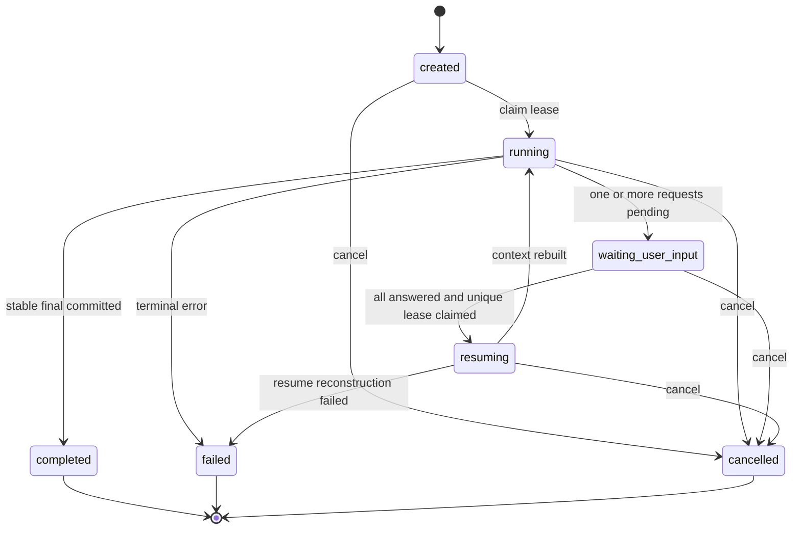

失败重试不画成 `failed -> created`，因为不是同一个 Job 状态回退，而是创建一个新的 Job：

```text
job_2.retry_of_job_id = job_1.id
```

### 9.2 Job stage

| strategy | stage | 含义 |
| --- | --- | --- |
| null | `routing` | 正在选择 direct/planned |
| direct | `direct_execution` | 通用 AgentRunner 直接执行 |
| planned | `planning` | 正在创建或校验 Plan |
| planned | `step_execution` | 正在创建/恢复 StepRun |
| planned | `finalizing` | 所有 StepOutput 完成，生成最终报告 |

### 9.3 StepRun 状态机

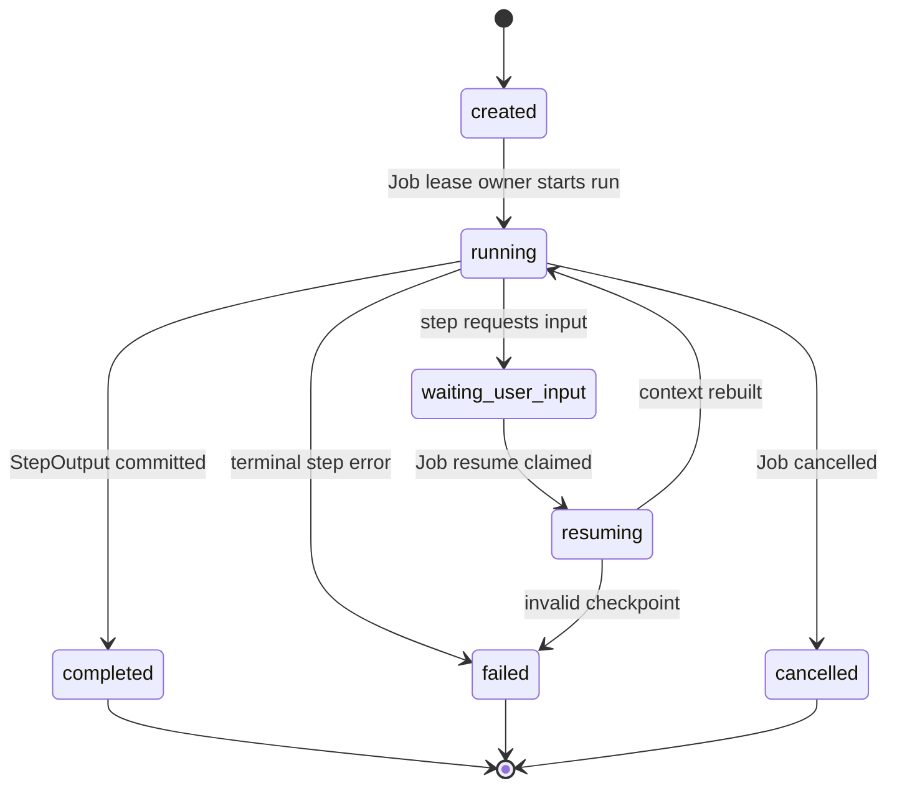

### 9.4 ToolInvocation 状态机

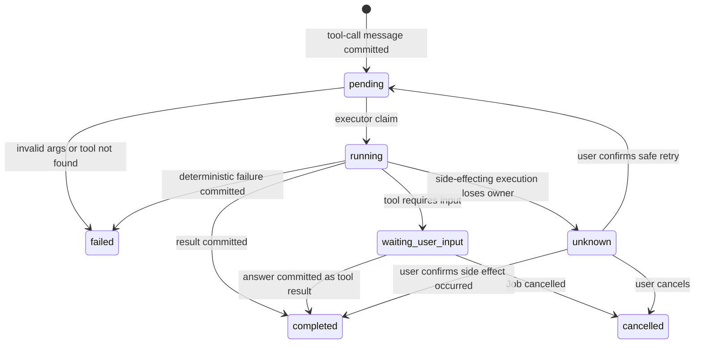

### 9.5 UserInputRequest 状态机

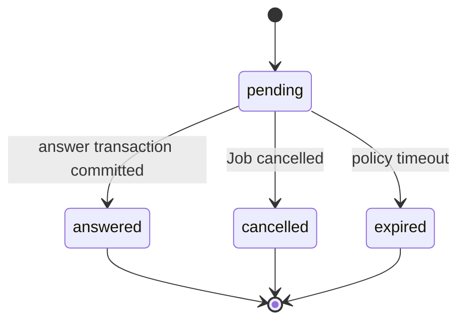

## 10. Job lease 与并发控制

### 10.1 Lease owner

只有 `agent_jobs` 保存：

```text
lease_owner
lease_expires_at_ms
current_attempt_id
attempt_no
version
```

StepRun 的任何执行都必须携带 Job 当前 `attempt_id`。Store command 校验：

```sql
where job.id = $job_id
  and job.status in ('running', 'resuming')
  and job.lease_owner = $worker_id
  and job.current_attempt_id = $attempt_id
  and job.lease_expires_at_ms > $now
```

### 10.2 Claim Job

```sql
update agent_jobs
set status = 'running',
    lease_owner = $worker_id,
    lease_expires_at_ms = $lease_until,
    current_attempt_id = $attempt_id,
    attempt_no = attempt_no + 1,
    version = version + 1,
    started_at_ms = coalesce(started_at_ms, $now),
    updated_at_ms = $now
where id = $job_id
  and version = $expected_version
  and (
    status = 'created'
    or (
      status in ('running', 'resuming')
      and lease_expires_at_ms <= $now
    )
  )
returning *;
```

返回 0 行表示 claim 失败，调用者不得继续执行模型或工具。

### 10.3 Resume claim

最后一个 pending UserInputRequest 被回答时，在同一事务内：

1. 锁定 Job。
2. 锁定属于 Job 的所有 pending request，按 ID 升序避免死锁。
3. 写入当前回答及 answer message。
4. 确认 pending 数量为 0。
5. 把 Job `waiting_user_input -> resuming`，写新 attempt/lease。
6. 把当前 StepRun `waiting_user_input -> resuming`。
7. 返回 `shouldResume=true` 给唯一成功更新 Job version 的调用者。

其他并发回答调用返回已提交实体，但 `shouldResume=false`。

### 10.4 Session message ordering

`bigserial` 本身不是事务提交顺序。所有会写 `agent_messages` 的事务必须先执行：

```sql
select id
from agent_sessions
where id = $1
for update;
```

然后才插入 messages。结果：

- 同 Session 的 message 事务串行进入临界区。
- `row_id` 在获得 Session 行锁后分配。
- 后获得较大 row_id 的事务不会早于较小 row_id 的事务提交。
- 事务 rollback 产生 row_id gap 是允许的；cursor 只要求不漏已提交行，不要求连续。

锁顺序固定为：

```text
Session -> Job -> Plan -> PlanStep -> StepRun -> ToolInvocation -> UserInputRequest
```

任何事务命令都不得反向获取这些锁。

## 11. AgentLoop 协议

### 11.1 输入

```ts
interface AgentLoopInput {
  messages: BaseMessage[];
  target: {
    sessionId: string;
    jobId: string;
    stepRunId?: string;
    attemptId: string;
  };
  tools: AgentToolDefinition[];
  toolExecutor: ToolExecutorPort;
  outputIdFactory: () => string;
  limits: {
    maxIterations: number;
    maxToolCalls: number;
    deadlineMs?: number;
    signal?: AbortSignal;
  };
}
```

### 11.2 事件

```ts
type LoopEvent =
  | {
      type: 'model.output.delta';
      outputId: string;
      channel: 'normal' | 'progress' | 'final';
      delta: string;
    }
  | {
      type: 'model.output.completed';
      outputId: string;
      content: string;
      toolCalls: AgentToolCall[];
      usage?: ProviderTokenUsage;
    }
  | {
      type: 'tool.result.completed';
      toolCallId: string;
      toolName: string;
      content: string;
      result?: unknown;
      durationMs: number;
    }
  | {
      type: 'tool.result.failed';
      toolCallId: string;
      toolName: string;
      code: string;
      message: string;
      details?: unknown;
      durationMs: number;
    }
  | {
      type: 'tool.input.required';
      toolCallId: string;
      toolName: string;
      request: ToolUserInputRequest;
    };
```

### 11.3 显式终态

```ts
type LoopResult =
  | {
      type: 'completed';
      outputId: string;
      content: string;
    }
  | {
      type: 'waiting_user_input';
      toolCallIds: string[];
    }
  | {
      type: 'failed';
      code:
        | 'empty_model_output'
        | 'max_iterations'
        | 'max_tool_calls'
        | 'deadline_exceeded'
        | 'invalid_tool_arguments'
        | 'model_error'
        | 'context_overflow';
      message: string;
      details?: unknown;
    }
  | { type: 'cancelled' };
```

Loop 返回 `toolCallIds` 而不是数据库 `requestIds`，因为 AgentLoop 不知道持久化实体 ID。AgentRunner/RuntimeEventWriter 将它们映射成 UserInputRequest。

### 11.4 AsyncGenerator 消费规则

为了拿到 generator 的 return value，AgentRunner 不使用会丢弃 return value 的简单 `for await`，而是显式迭代：

```ts
const iterator = loop.run(input);
while (true) {
  const next = await iterator.next();
  if (next.done) {
    return next.value;
  }
  await eventWriter.record(next.value, target);
}
```

`await eventWriter.record(...)` 完成前不会调用下一次 `iterator.next()`，因此 generator 暂停在 yield 处。这个 backpressure 是“先提交 tool call，再执行工具”的核心保证。

### 11.5 正确工具顺序

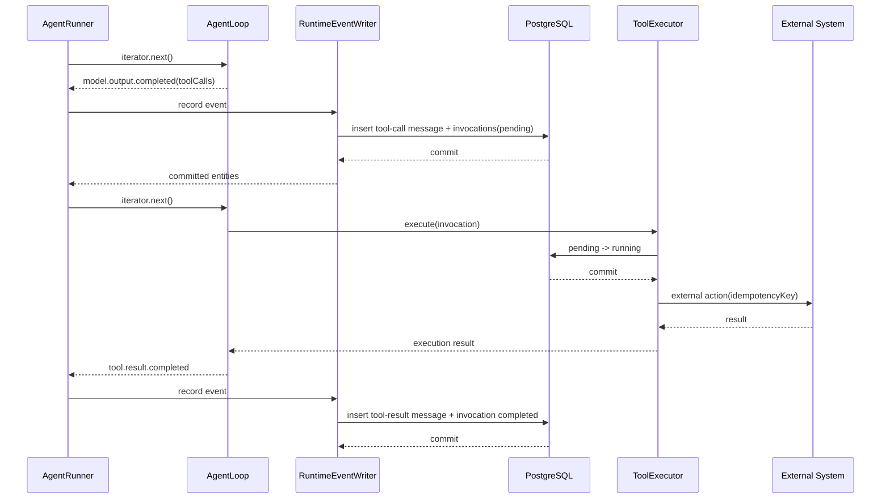

普通工具按模型给出的顺序串行执行。每个调用独立 try/catch；一个失败不会阻止同轮其他调用产生稳定结果。

### 11.6 Model output 到实体的映射

| call_type / output | 持久化结果 |
| --- | --- |
| `job.react` final | `assistant_message`，随后完成 direct Job |
| `step.react` 含 tool calls | internal/可展示的 `tool_call` message + ToolInvocation[] |
| `step.react` final candidate | 原始候选保留在 ModelCall 审计中，验证前不写 `step_output` |
| validated StepOutput | 单独写一条 `step_output` message，并原子完成 StepRun/PlanStep |
| `planner.route` | ModelCall result + Job strategy/stage，不写普通 assistant message |
| `planner.create` | Plan/PlanStep entities + `plan_created` message |
| `plan.finalize` | `plan_final` message + Job completed |
| `context.compress` | ContextSummary，不写 UI message |

StepRun 的 final candidate 在服务端缓冲；只有 StepOutput 校验成功后才向 UI 发布 committed `step_output`。这样不会出现用户先看到一段“最终步骤结果”，随后因为 schema 校验失败又被撤回。中间明确可展示的 progress summary 仍可通过 `message.delta(channel='progress')` 发送。

## 12. 工具执行与副作用恢复

### 12.1 工具契约

```ts
interface AgentToolDefinition {
  name: string;
  description: string;
  schema: JsonSchema;
  sideEffectLevel: 'read_only' | 'idempotent' | 'side_effecting';
  sensitiveArgumentPaths?: string[];
}

interface ToolExecutionContext {
  sessionId: string;
  jobId: string;
  stepRunId?: string;
  attemptId: string;
  toolInvocationId: string;
  toolCallId: string;
  idempotencyKey: string;
  sandboxRoot: string;
  projectId?: string;
  signal?: AbortSignal;
}
```

### 12.2 Crash recovery matrix

| invocation 状态 | side effect | 恢复动作 |
| --- | --- | --- |
| `pending` | 任意 | 尚未 claim，可正常执行 |
| `running` 且原 Job lease 仍有效 | 任意 | 由原 worker 继续；其他 worker 不接管 |
| `running` 且 lease 已过期 | `read_only` | 新 attempt 可重置为 pending 并重试 |
| `running` 且 lease 已过期 | `idempotent` | 使用相同 idempotency key 重试 |
| `running` 且 lease 已过期 | `side_effecting` | 原子标记 `unknown`，创建 recovery approval |
| `waiting_user_input` | 任意 | 等待 request，不执行工具 |
| `completed/failed/cancelled` | 任意 | 不重放 |

### 12.3 Unknown 副作用消歧

系统创建 approval：

```text
“上一次操作可能已经执行，但系统未能保存结果。请选择：
1. 已执行成功
2. 确认未执行，可以重试
3. 取消任务”
```

处理：

- 已执行成功：写入人工确认的 completed tool result，保留 `confirmedByUser=true`。
- 确认未执行：`unknown -> pending`，新 attempt 执行；记录用户确认。
- 取消任务：invocation cancelled，Job cancelled 或 failed，取决于业务策略。

### 12.4 流式 tool arguments

`ToolCallAssembler` 按 provider index 累积：

- ID/name 缺失：生成稳定 fallback ID，但记录 provider 原始字段。
- JSON 解析失败：不得 filter；创建 failed invocation 和失败 tool result，错误码 `invalid_tool_arguments`。
- 重复 index/name 冲突：模型调用 failed，原始 chunks 只存入受控 error details，执行前进行敏感字段清洗。

## 13. 原子事务命令集

Store 暴露领域命令，不允许 orchestration 直接拼多个通用 CRUD 模拟事务。

### 13.1 `createJobAndAppendUserMessage`

同一事务：

1. 锁 Session。
2. 插入 created Job，依赖 partial unique index 拒绝第二个 active Job。
3. 插入 `user_message`。
4. 更新 Session version/updated_at。
5. commit 后广播 job/message upsert。

### 13.2 `commitModelToolCalls`

同一事务：

1. 校验 Job lease + attempt。
2. 锁 Session。
3. 插入 assistant `tool_call` message。
4. 为其中每一个 tool call 插入独立 pending ToolInvocation。
5. 完成对应 ModelCall。
6. commit 后广播 message/invocation/model usage。

### 13.3 `commitToolResult`

同一事务：

1. 锁 ToolInvocation。
2. 校验状态为 running，或 recovery-confirmed unknown。
3. 锁 Session。
4. 插入 tool-result message。
5. invocation -> completed/failed，关联 result message。
6. commit 后广播。

### 13.4 `createInputRequestsAndMarkWaiting`

同一事务：

1. 锁 Job、PlanStep、StepRun、相关 invocations。
2. 创建全部 UserInputRequest。
3. 对应 invocation -> waiting_user_input。
4. StepRun、PlanStep、Plan、Job -> waiting_user_input。
5. 清除 Job lease；waiting 状态不占 worker。
6. commit 后广播全部 upsert。

### 13.5 `answerInputAndClaimResume`

同一事务完成回答、tool result 回填、全部 pending 检查和唯一 resume claim。它返回：

```ts
interface AnswerInputResult {
  request: UserInputRequest;
  answerMessage: AgentMessage;
  job: AgentJob;
  stepRun?: AgentStepRun;
  shouldResume: boolean;
  attemptId?: string;
}
```

### 13.6 `commitStepOutput`

同一事务：

1. 校验 Job lease/attempt。
2. 校验 StepRun 是当前 active run。
3. 锁 Session。
4. 插入 `step_output` message。
5. StepRun completed + output_message_id。
6. PlanStep completed + output_message_id。
7. 如果还有 pending step：Job 保持 running/stage=step_execution。
8. 如果全部完成：Plan completed，Job stage=finalizing。

### 13.7 `completeJobWithFinalMessage`

同一事务插入 direct assistant final 或 `plan_final`，完成 Job，清除 lease，并更新 Plan completed 状态。

### 13.8 `failJob`

同一事务：

- Job -> failed，写 error code/message/details，清除 lease。
- active StepRun/PlanStep/Plan -> failed。
- 将尚未执行的 pending invocation cancelled；running side-effecting invocation 先转 unknown，不得掩盖。
- pending UserInputRequest cancelled。

## 14. Direct Job 流程

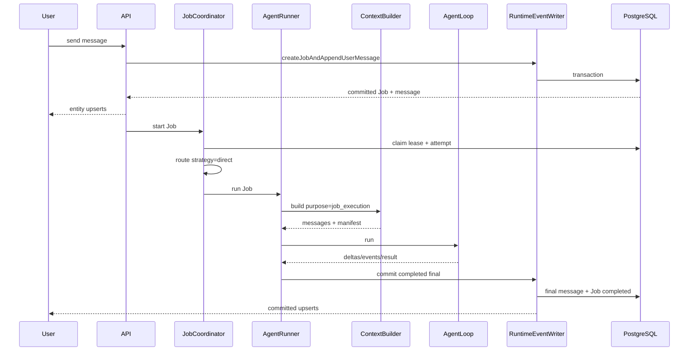

路由本身也是 ModelCall，`logical_call_key='route'`。路由 JSON 只允许：

```ts
type RouteDecision =
  | { strategy: 'direct'; reasonCode: string }
  | { strategy: 'planned'; reasonCode: string };
```

reason 只能用于审计，不直接展示模型私有推理。

## 15. Planned Job 流程

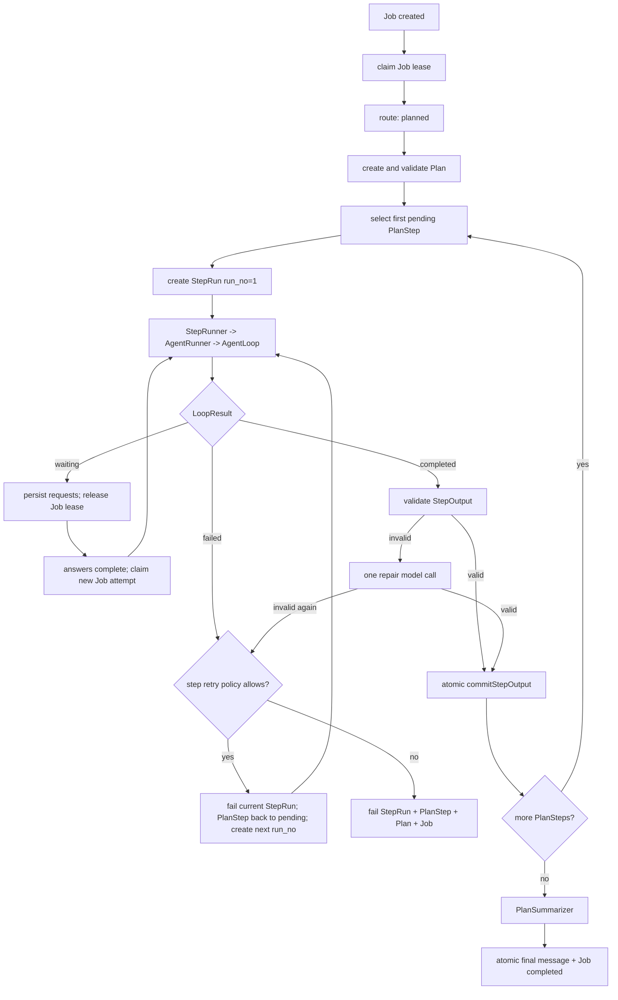

### 15.1 Plan 创建约束

- 1–20 个 PlanStep。
- position 从 0 连续递增，不允许缺口。
- 每个 instruction 必须可由一个 AgentRunner 独立执行。
- 不把“最终总结”创建为普通 PlanStep；由 PlanSummarizer 完成。
- Plan 修改必须增加 version，并写 `plan_updated` message。

### 15.2 StepRun 创建

`createStepRun` 必须校验：

- 调用者持有 Job lease。
- Job strategy=planned，stage=step_execution。
- 目标 PlanStep 是最前面的 pending/failed-retry step。
- 当前 Job 和 PlanStep 都没有 active StepRun。
- `run_no = max(existing run_no) + 1`。

步骤 retry 规则：

- 默认 `maxStepRunsPerStep=2`，可由受控 runtime 配置降低，不能由模型任意提高。
- retry 只允许发生在 Job 仍为 running、调用者仍持有 Job lease 时。
- 当前 StepRun 先原子标记 failed；PlanStep 重新置为 pending 后才能创建下一 run_no。
- 一旦 Job 已 failed/completed/cancelled，不允许在原 Job 下继续创建 StepRun。
- 用户重试终态 Job 时创建新的 Job；新 Job 可以重新生成 Plan，不复用旧 Job 的 active 状态。

### 15.3 StepOutput schema

```ts
interface StepOutputV1 {
  schemaVersion: 1;
  summary: string;
  artifacts: Array<{
    type: 'file' | 'url' | 'record' | 'text';
    ref: string;
    label?: string;
    checksum?: string;
  }>;
  evidence: Array<{
    claim: string;
    sourceMessageIds: string[];
    sourceUrls?: string[];
  }>;
  unresolved: Array<{
    description: string;
    impact: 'low' | 'medium' | 'high';
    recommendedAction?: string;
  }>;
}
```

校验：

- `summary` 非空，建议不超过 8,000 字符。
- artifact ref 必须是已知 sandbox path、受控 URL 或稳定 record ID。
- evidence 中的 message ID 必须属于同一 Job/StepRun。
- unresolved 必须显式保留，不允许 finalizer 默默当成已解决。
- 首次校验失败允许一次 `step.output_repair` ModelCall；再次失败则 StepRun failed。
- 不使用 `submit_step_result` 特殊工具；StepRunner 在代码层负责校验和提交。

### 15.4 PlanSummarizer 输入

只允许：

```text
Plan final system prompt
+ original user goal
+ current date/timezone
+ final Plan title and ordered step definitions
+ ordered validated StepOutputV1[]
```

禁止：

- 其他 StepRun 的 raw assistant/tool messages。
- 失败搜索详情。
- 旧 system prompt。
- 私有 reasoning。
- 未配对 tool result。

## 16. 多 UserInputRequest 流程

```mermaid
sequenceDiagram
  participant L as AgentLoop
  participant W as RuntimeEventWriter
  participant DB as PostgreSQL
  participant A as Browser A
  participant B as Browser B
  participant J as JobCoordinator

  L-->>W: input required call_a, call_b
  W->>DB: create 2 requests + mark waiting
  A->>DB: answer request_a transaction
  DB-->>A: shouldResume=false
  B->>DB: answer request_b transaction
  DB->>DB: pending count = 0; claim Job resume
  DB-->>B: shouldResume=true + attempt_id
  A->>DB: duplicate answer request_a
  DB-->>A: already answered; shouldResume=false
  B->>J: resume once
```

回答回填：

- tool request：answer message 必须是 role=tool/message_type=tool_result。
- agent/planner request：可以是 user_message。
- 同一 tool-call message 中所有 invocation 都完成或失败后，MessageGroup 才能进入模型。

## 17. ContextBuilder

### 17.1 输入输出

```ts
interface BuildContextInput {
  sessionId: string;
  job: AgentJob;
  stepRun?: AgentStepRun;
  attemptId: string;
  purpose:
    | 'conversation'
    | 'job_execution'
    | 'step_execution'
    | 'plan_final'
    | 'code_execution'
    | 'context_compression';
  model: {
    provider: string;
    name: string;
    maxContextTokens: number;
    reservedOutputTokens: number;
  };
  toolSchemas?: AgentToolDefinition[];
}

interface BuiltContext {
  messages: BaseMessage[];
  inputManifest: ContextInputManifest;
  estimatedInputTokens: number;
  contextRulesVersion: string;
  summaryIds: string[];
}
```

### 17.2 MessageGroup

```ts
type MessageGroup =
  | { type: 'single'; messages: [AgentMessage] }
  | {
      type: 'tool_exchange';
      callMessage: AgentMessage;
      invocations: ToolInvocation[];
      resultMessages: AgentMessage[];
    }
  | { type: 'step_output'; messages: [AgentMessage] };
```

`tool_exchange` 完整条件：

- callMessage 中每个 tool call 都有 ToolInvocation。
- 每个 invocation 是 completed/failed。
- 每个 invocation 都有对应 result message。
- result message 的 tool_call_id 与 invocation 一致。

`waiting_user_input`、`running`、`unknown` invocation 组成的 group 不得进入模型；先恢复、回答或人工消歧。

### 17.3 Purpose 允许矩阵

| message/context | conversation | job_execution | step_execution | plan_final | code_execution |
| --- | --- | --- | --- | --- | --- |
| 当前 system prompt | 条件允许 | 是 | 是 | 是 | 是 |
| 原始用户目标 | 是 | 是 | 是 | 是 | 是 |
| 历史用户/assistant 对话 | 最近窗口 | 最近窗口 | 否 | 否 | 最近窗口 |
| 当前 Job runtime tail | 否 | 是 | 否 | 否 | 是 |
| 当前 StepRun tail | 否 | 否 | 是 | 否 | 条件允许 |
| 其他 StepRun raw runtime | 否 | 否 | 否 | 否 | 否 |
| 已完成 StepOutput | 摘要化 | 条件允许 | 前序步骤 | 全部 | 条件允许 |
| Plan 定义 | 条件允许 | 条件允许 | 是 | 是 | 条件允许 |
| ContextSummary | 是 | 是 | 是 | 默认否 | 是 |
| 私有 reasoning | 否 | 否 | 否 | 否 | 否 |

### 17.4 Step execution 四段上下文

```text
1. Agent system prompt
2. Stable Job context
   - date/timezone
   - original goal
   - Plan summary
   - current PlanStep instruction
3. Previous validated StepOutput[]
4. Current StepRun complete MessageGroup tail
```

### 17.5 Token budget

```text
hardInputLimit = maxContextTokens - reservedOutputTokens
safeInputLimit = floor(hardInputLimit * 0.90)
mandatory = system + current goal + current instruction + tool schemas
optional = summaries + previous outputs + runtime tail
```

选择顺序：

1. mandatory 必须全部保留；超限直接 `context_overflow`，不得静默截断 system/tool schema。
2. 当前未完成目标和最新 StepOutput 优先。
3. 当前 StepRun tail 从新到旧选择完整 MessageGroup。
4. 历史 conversation 从新到旧选择。
5. 不得拆分 tool_exchange。

### 17.6 压缩触发

压缩根据 candidate groups，而不是已被截断的 selected groups 决定：

- candidate estimated tokens > safeInputLimit * 0.70；或
- active summary 后新增可压缩范围超过配置阈值；或
- Code project index/working set checksum 失效。

压缩调用使用独立 `purpose=context_compression`：

- 不再次触发压缩，防止递归。
- 创建独立 `agent_model_calls(call_type='context.compress')`。
- 成功后在事务中写新 summary，再 supersede 旧 summary。
- 原 messages 永不删除。
- `context_rules_version` 或 compression prompt version 变化时，旧 summary 不再 active 复用。

## 18. ModelCall 审计

每次调用模型前：

1. ContextBuilder 完成 input manifest。
2. 创建 `agent_model_calls(status=started)`。
3. 调用 provider。
4. 成功：completed + provider usage + output/result metadata。
5. 异常：failed + error code，保留 started audit。
6. 进程 crash 后遗留 started：恢复扫描将其标为 failed，`error_code='model_call_abandoned'`。若策略允许重试，使用相同 `logical_call_key` 和递增的 `call_attempt_no` 创建新 ModelCall。

`input_manifest` 至少包含：

```ts
interface ContextInputManifest {
  purpose: string;
  contextRulesVersion: string;
  systemPromptVersion: string;
  messageGroupIds: string[];
  summaryIds: string[];
  includedRowIdStart?: number;
  includedRowIdEnd?: number;
  toolSchemaChecksum?: string;
  fixedPrefixChecksum: string;
  estimatedBreakdown: {
    system: number;
    tools: number;
    summaries: number;
    messages: number;
    reservedOutput: number;
  };
}
```

manifest 保存事实引用与 checksum，不默认复制所有敏感 prompt/tool arguments。

## 19. RuntimeEventWriter 与 SSE

### 19.1 RealtimeEvent

```ts
type RealtimeEvent =
  | {
      type: 'message.delta';
      eventId: string;
      sessionId: string;
      jobId: string;
      stepRunId?: string;
      messageId: string;
      outputId: string;
      channel: 'normal' | 'progress' | 'final';
      delta: string;
    }
  | { type: 'message.upserted'; sessionId: string; message: AgentMessage }
  | { type: 'job.upserted'; sessionId: string; job: AgentJob }
  | { type: 'plan.upserted'; sessionId: string; plan: AgentPlan }
  | { type: 'plan_step.upserted'; sessionId: string; step: AgentPlanStep }
  | { type: 'step_run.upserted'; sessionId: string; stepRun: AgentStepRun }
  | { type: 'tool_invocation.upserted'; sessionId: string; invocation: ToolInvocation }
  | { type: 'user_input.upserted'; sessionId: string; request: UserInputRequest }
  | { type: 'model_usage.updated'; sessionId: string; stats: ModelUsageStats };
```

### 19.2 发布规则

- `message.delta` 是唯一允许 commit 前发送的临时事件。
- entity upsert 必须在 commit 后发送。
- 如果 commit 成功、进程在 broadcast 前崩溃，客户端通过 reconnect/full view 恢复。
- 除 message 外的所有可变实体必须包含 version；Reducer 仅接受更高 version，或相同 version 的完全相同 payload。
- message 不更新内容；重复 message upsert 按 ID 幂等覆盖临时 buffer。

### 19.3 Delta merge

前端临时 buffer key：

```text
(jobId, stepRunId|null, messageId, outputId)
```

收到对应 `message.upserted` 后：

1. 删除临时 buffer。
2. 以数据库完整 content 替换临时文本。
3. 如果迟到 delta 再到达，发现 output 已 committed，直接丢弃。

### 19.4 MVP 重连

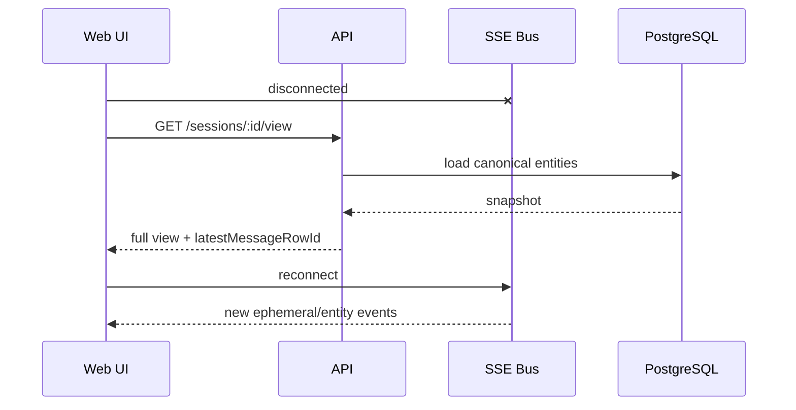

首版不使用 `Last-Event-ID` 补发非消息实体；full view 是唯一重连正确性来源。

## 20. SessionView 与 Timeline

### 20.1 View contract

```ts
interface SessionViewV1 {
  schemaVersion: 1;
  generatedAtMs: number;
  session: AgentSession;
  jobs: AgentJob[];
  plans: AgentPlan[];
  planSteps: AgentPlanStep[];
  stepRuns: AgentStepRun[];
  messages: AgentMessage[];
  toolInvocations: ToolInvocation[];
  userInputRequests: UserInputRequest[];
  modelUsage?: ModelUsageStats;
  codeProjects: AgentCodeProject[];
  timeline: {
    flat: TimelineItem[];
    groupedByStep: TimelineItem[];
  };
  cursor: {
    latestMessageRowId: number | null;
  };
}
```

默认只返回 `visibility=ui` messages。调试/审计接口必须单独授权，不得通过普通 UI query 参数意外暴露 internal prompt。

### 20.2 TimelineBuilder

TimelineBuilder 是纯函数：

```ts
buildTimeline({
  jobs,
  plans,
  planSteps,
  stepRuns,
  messages,
  toolInvocations,
  userInputRequests,
}): { flat: TimelineItem[]; groupedByStep: TimelineItem[] }
```

规则：

- flat 以 `row_id` 排序展示消息，并将 tool call/result 配为 exchange。
- grouped 先按 Job，再按 PlanStep position，再按 StepRun run_no 展示。
- PlanStep 的 loading/failed/completed 只看 PlanStep/StepRun status，不从“是否有文本”推断。
- tool invocation unknown 必须显示明确警告与 recovery approval。
- 同一纯函数 contract 在后端和前端共享；若无法共享源码，使用同一 fixture 做 contract test。

## 21. HTTP API

### 21.1 Session/Job

```text
POST   /sessions
GET    /sessions
GET    /sessions/:sessionId/view
DELETE /sessions/:sessionId

POST   /sessions/:sessionId/jobs
POST   /jobs/:jobId/cancel
POST   /jobs/:jobId/retry
GET    /sessions/:sessionId/events
```

`POST /sessions/:sessionId/jobs`：

```ts
interface CreateJobRequest {
  message: string;
  projectId?: string;
  clientRequestId: string;
}
```

`clientRequestId` 在 Session 内唯一，防止浏览器网络重试重复创建 Job。它对应 canonical schema 中的 `agent_jobs.client_request_id`，并由 `(session_id, client_request_id)` partial unique index 保证幂等。

### 21.2 User input

```text
POST /user-input-requests/:requestId/answer
```

请求携带 `expectedVersion` 和 `clientAnswerId`。`clientAnswerId` 写入 `agent_user_input_requests.client_answer_id`；重复 ID 返回第一次提交的结果，不再次 resume。

### 21.3 Retry 语义

- `POST /jobs/:id/retry`：创建新 Job，复制原目标，设置 retry_of_job_id；原 Job 不变化。
- 步骤 retry 暂不对普通 UI 公开；由受控 workflow command 创建下一 run_no。
- side-effect unknown 的重试使用 UserInputRequest approval，不走普通 Job retry。

## 22. 错误分类与恢复策略

| code | 默认 Job 结果 | 可自动重试 |
| --- | --- | --- |
| `empty_model_output` | failed | 模型策略允许时最多一次 |
| `max_iterations` | failed | 否 |
| `max_tool_calls` | failed | 否 |
| `deadline_exceeded` | failed | 新 Job/StepRun 显式重试 |
| `aborted` | cancelled | 否 |
| `model_error` | failed | provider transient policy 可有限重试 |
| `invalid_tool_arguments` | AgentLoop 可继续 | 由模型看到 failed tool result 后修正 |
| `tool_not_found` | AgentLoop 可继续 | 否 |
| `tool_failed` | AgentLoop 可继续或 StepRun failed | 由工具策略决定 |
| `tool_state_unknown` | waiting_user_input | 禁止自动重试 |
| `context_overflow` | failed | 先修正规则/压缩，不盲重试 |
| `invalid_step_output` | StepRun failed | 允许一次 repair call |
| `concurrency_conflict` | 当前 worker 停止 | 调用方刷新实体后决定 |
| `lease_lost` | 当前 worker 立即停止 | 新 owner 接管 |
| `storage_error` | 当前 attempt 停止 | 未发生副作用前可新 attempt |

任何捕获到 `lease_lost` 的 worker 都不得继续调用模型、工具或提交 final。

## 23. Code Agent 边界

- Code Job 使用 `agent_jobs.project_id` 关联 project。
- Code Agent 复用 JobCoordinator、AgentRunner、AgentLoop、ToolExecutor、ContextBuilder。
- Plan/StepRun 可用于复杂编码 Job，但通用 Agent UI 与 Code UI 保持不同路由。
- 文件、artifact、download、临时输出保留在 sandbox。
- PostgreSQL 只保存 project metadata、消息、调用、摘要、usage 和稳定 artifact ref/checksum。
- 文件工具必须校验 sandbox path，禁止路径穿越。
- project index/invariants 使用 owner_type=code_project 的 ContextSummary。

## 24. 安全与数据治理

### 24.1 敏感字段

- 启动日志不得输出 DATABASE_URL、API key 或完整 provider headers。
- ToolDefinition 声明 `sensitiveArgumentPaths`；持久化 arguments 前按路径脱敏。
- ToolExecutor 使用内存中的原始参数执行，数据库只保留脱敏 payload + checksum。
- UserInputRequest 可配置 sensitive answer；首版至少对普通 view 隐藏，生产应使用字段级加密。
- error_details 在写库前经过错误清洗，禁止直接 JSON.stringify provider request。

### 24.2 Prompt 与 reasoning

- system prompt 可 internal 持久化，用于版本审计。
- 不持久化模型私有 chain-of-thought。
- UI progress 只能是明确要求模型输出的可公开摘要。
- 普通 view 永不返回 visibility=internal。

### 24.3 保留策略

- messages、jobs、plans、step runs、tool invocations、input requests、model calls：默认随 Session 生命周期保留。
- context summaries、usage stats：可重建，但删除必须通过维护任务记录。
- sandbox 文件的保留策略独立于数据库级联删除，删除 project 时必须显式清理。

## 25. 测试策略

### 25.1 单元测试

| 模块 | 必测内容 |
| --- | --- |
| AgentLoop | 终态、事件顺序、空输出、迭代/工具限制、流式参数失败 |
| ToolCallAssembler | 多 chunk、乱序 index、invalid JSON、重复字段 |
| ToolExecutor | side effect policy、idempotency key、unknown recovery |
| JobCoordinator | 状态转换、lease claim、lease lost、failed terminal |
| StepRunner | run_no、一次 repair、StepOutput schema |
| MessageGroupBuilder | 多 tool 配对、缺失 result、等待/unknown 阻塞 |
| TokenBudget | 完整组截断、mandatory overflow、压缩触发 |
| ContextFilter | purpose 隔离、其他 StepRun raw history 排除 |
| TimelineBuilder | flat/grouped、retry StepRun、unknown tool、HITL |

### 25.2 PostgreSQL 集成测试

使用固定 Docker Compose/Testcontainers，不依赖个人机器的默认 5433 端口。必测：

1. 同 Session 第二个 active Job 被数据库拒绝。
2. 同 Step 第二个 active StepRun 被拒绝。
3. 同 Job 第二个 active StepRun 被拒绝。
4. stale version update 返回 concurrency conflict。
5. 两个 answer 并发只有一个 shouldResume=true。
6. session row lock 下 row_id 与 commit 顺序一致。
7. tool-call message 与多 invocation 同事务提交。
8. StepOutput message、StepRun、PlanStep、Plan 状态同事务提交。
9. 事务中途失败不留下半个 tool pair 或半完成 StepRun。
10. schema reset 只删除 `agent_*` 对象，不触及其他业务表。

测试 teardown 必须允许 setup 失败：

```ts
afterEach(async () => {
  if (pool) await pool.end();
  if (adminPool && schema) {
    await adminPool.query(`drop schema if exists "${schema}" cascade`);
    await adminPool.end();
  }
});
```

### 25.3 Crash fixture

必须支持在以下边界注入 crash：

```text
after_tool_call_commit
after_invocation_running_commit
after_external_side_effect
before_tool_result_commit
after_input_answer_message
before_resume_claim
after_step_output_message
before_step_status_commit
after_db_commit_before_sse
```

每个 fixture 都断言数据库状态、是否允许重试、刷新 view 和最终 UI 表现。

### 25.4 Contract/E2E

- 后端 View V1 fixture 与前端 reducer fixture 共用。
- direct final、普通 tool、tool failure isolation、多个 HITL、planned 两步、StepRun retry、unknown side effect、SSE 断线刷新全部覆盖。
- 浏览器验证临时 delta 被 committed message 覆盖。
- 浏览器双窗口验证不能创建两个 active Job。

### 25.5 非功能性基线

基于标准测试数据集测量，不在空表上宣称性能：

- 1,000 条 messages、100 个 tool exchange 的 `GET /view` P95 < 300ms。
- 1,000 条 candidate messages 的 context filter/group 构建 P95 < 500ms，不含压缩模型调用。
- 10 个并发 Session 各自持续 SSE 时，不丢失 committed state；断线后 full view 一致。
- Job claim/answer resume 并发测试运行 100 次无双 winner。
- canonical schema reset + migrate 在本地标准 PostgreSQL P95 < 5s。

## 26. 可观测性

结构化日志必须携带：

```text
session_id
job_id
step_run_id (optional)
attempt_id
model_call_id (optional)
tool_invocation_id (optional)
event_type
duration_ms
error_code (optional)
```

指标：

- active/waiting/failed Job 数。
- Job/StepRun duration。
- lease claim conflict、lease expiry、resume winner/loser。
- tool completed/failed/unknown 按 sideEffectLevel 分布。
- context token ratio、compression 次数、provider usage unavailable 比例。
- SSE connection、reconnect/full-view recovery 次数。

## 27. Schema 初始化、迁移和 reset

### 27.1 正常启动

只执行：

1. 检查 `agent_schema_versions`。
2. 校验代码支持的 schema version。
3. 不执行 ALTER/backfill/drop。

### 27.2 Migration

```text
src/storage/postgres/migrations/
  0001_job_step_run_canonical.sql
  0002_...
```

每个 migration：

- 不可修改已发布文件。
- 有稳定 checksum。
- 事务可执行时使用单事务。
- 明确 forward validation 和 rollback/restore 说明。

### 27.3 Reset

`reset-agent-runtime-schema.ts`：

- 必须要求 `--confirm-agent-runtime-reset`。
- 只 drop `agent_*` 表/索引。
- 非 development/test 环境默认拒绝。
- 不触及 users、tasks 或其他业务表。

本次已知数据库可清空，因此 canonical V1 不包含旧 metadata/seq backfill。

## 28. 交付顺序

### 阶段 0：绿色与可回滚基线

- 后端和 Web 目录分别建立 Git 基线，避免移动同级其他项目。
- 修复当前 TypeScript 语法/类型错误。
- 固定 PostgreSQL 测试容器和安全 teardown。
- 当前行为测试绿色；旧设计缺陷用显式 failing characterization 或 todo 标记，不让 CI 红色。

### 阶段 1：Canonical domain + schema

- 确认本文命名字典。
- 实现 Job、PlanStep、StepRun、ToolInvocation、UserInputRequest 等 domain types。
- 建 schema V1、migration/version check、reset。
- 先完成数据库约束和并发测试。

### 阶段 2：事务命令与 JobCoordinator

- 实现 Session 行锁、Job lease、version CAS、原子命令集。
- 跑通 Job 创建、claim、cancel、failed terminal、新 Job retry。
- 暂不接真实模型。

### 阶段 3：AgentLoop + ToolExecutor

- 修正事件顺序和显式 LoopResult。
- 加 ToolInvocation 状态和副作用恢复。
- 完成所有 crash fixture。

### 阶段 4：Direct Job + UserInput

- AgentRunner 接入 ContextBuilder 的最小 job_execution 版本。
- 跑通 direct final、普通工具、多工具失败隔离、多 UserInputRequest、唯一 resume。

### 阶段 5：完整 ContextBuilder

- MessageGroup、purpose filter、预算、ContextSummary、ModelCall usage。
- 完成 step 隔离、plan final 过滤和压缩防递归测试。

### 阶段 6：PlanEngine + StepRun

- route、Plan/PlanStep、StepRun run_no、StepOutput repair、原子完成、PlanSummarizer。
- Planned 两步、HITL resume、StepRun retry、final context 全链路通过。

### 阶段 7：SessionView + SSE + Web

- Canonical View V1、TimelineBuilder、entity version reducer、delta merge、full-view reconnect。
- 通用 UI 与 Code UI 路由分离。

### 阶段 8：清理与发布验收

- 删除旧 AgentTask/metadata relation/重复 context/view 路径。
- 全量 backend test、web build、手工双窗口 E2E、性能基线。
- 更新公开架构文档、数据库文档、故障恢复 runbook。

## 29. 最终验收清单

- [ ] 用户消息、Job 创建和首个 patch 来自同一 committed transaction。
- [ ] 同 Session 无法存在两个 active Job。
- [ ] Planned Job 同时最多一个 active StepRun。
- [ ] StepRun 不拥有 lease，所有执行都校验 Job attempt。
- [ ] tool call message + invocation 在外部工具调用前已提交。
- [ ] 一个 tool 失败不丢失同轮其他工具结果。
- [ ] side-effecting crash 进入 unknown，绝不自动重放。
- [ ] 任意数量 UserInputRequest 全部回答后只恢复一次。
- [ ] tool request 的回答始终保持 tool call/result 协议配对。
- [ ] `bigserial` cursor 不会因同 Session 事务提交乱序漏读。
- [ ] StepRun 只有在 StepOutput 持久化后 completed。
- [ ] StepRun 明确 retry 创建新的 run_no。
- [ ] failed Job retry 创建新 Job，不复活旧 Job。
- [ ] Step context 不包含其他 StepRun raw history。
- [ ] Plan final context 只包含 goal、Plan、StepOutput。
- [ ] provider usage 优先；缺失时明确显示 estimated/unavailable。
- [ ] message delta 不落库，committed message 覆盖临时 buffer。
- [ ] SSE 断线后 full view 恢复 Job、StepRun、tool、input 和 usage。
- [ ] entity version 防止旧 patch 覆盖新状态。
- [ ] 普通 View 不暴露 internal prompt 或敏感 tool arguments。
- [ ] canonical schema 有版本、checksum、显式 migration/reset。

## 30. 旧方案取舍记录

| 旧方案内容 | 本文结论 | 原因 |
| --- | --- | --- |
| 00–03 的 `root task + child task` | 采用语义，重命名并拆成 `agent_jobs + agent_step_runs` | 一个概念一张表，避免 `agent_jobs` 同时存 Job 和 StepRun |
| 04 的 `JobScheduler` | 改为 `JobCoordinator` | 当前模块协调状态/lease/恢复，但不负责通用队列优先级调度 |
| 04 的 `MessageWriter` | 改为 `RuntimeEventWriter` | 它还提交 Job、Plan、StepRun、input 和 usage，不只写 message |
| 04 的 `ContextBuilder`、`MessageGroup`、`StepOutput` | 采用 | 名称准确且降低心智成本 |
| 04 的 `purpose -> usage` | 不采用 | 会和模型 token usage 混淆 |
| 04 的 `output_id -> stream_id` | 不采用 | 非流式输出同样需要稳定 output ID |
| 04 的 `lease -> lock` | 不采用 | 过期接管语义是 lease，不是普通锁 |
| 04 的 `message.saved` | 不采用，保留 `message.upserted` | SSE 重放和 reducer 消费需要明确幂等 upsert 语义 |
| 05 的 message 级 `invocation_status` | 改为独立 `agent_tool_invocations` | 同一 assistant message 内多个 tool call 状态可能不同 |
| 05 的“AgentLoop 完全不执行工具” | 调整为 AgentLoop 只通过 `ToolExecutorPort` 编排工具 | 保留通用 ReAct 循环，同时让真实副作用和数据库位于外层实现 |
| 05 的应用层单 Session 写锁 | 改为 PostgreSQL Session 行锁 | 必须跨进程/多 worker 生效，内存 mutex 不足以保证提交顺序 |
| 05 的 failed Job 恢复 | 采用“failed 终态，新建 retry Job” | 避免旧 Job 与新 active Job 冲突 |
| 05 的 SSE MVP | 采用 full-view reconnect | 首版避免 outbox 复杂度，同时保证最终恢复正确 |
| 原方案的 FileSessionStore 兼容 | 不作为生产运行时 | 无法正确模拟事务、row lock、lease 和并发 resume |

## 31. 设计结论

本方案最终采用完整 `Job + StepRun` 模型：

- Job 表达用户目标和工作流调度边界。
- PlanStep 表达声明式工作单元。
- StepRun 表达某个步骤的可恢复执行实例和显式 retry 历史。
- Attempt 表达 worker claim，不额外创建语义重叠的 checkpoint 表。
- ToolInvocation 单独表达每个 tool call 的执行与副作用状态。
- Message 保持会话事实时间线，其他实体提供工作流、恢复、审计和视图结构。

最重要的实现顺序不是先大规模移动文件，而是先建立 schema、不变量和事务命令；在这些约束通过并发与 crash 测试后，再迁移 AgentLoop、Planner、Context 和 UI。
