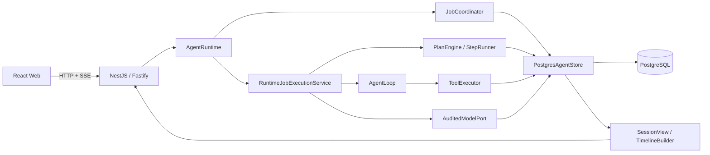

# Agent Runtime V2 实现验收与运维手册

> 本文记录 `06-完整Job-StepRun架构设计.md` 的落地入口、启动方式、验收命令和故障处置。架构与表字段定义仍以 06 为唯一设计基准。

## 1. 已落地边界

- Canonical PostgreSQL V1：Session、Job、Plan、PlanStep、StepRun、Message、ToolInvocation、UserInputRequest、ContextSummary、ModelCall、ModelUsage、CodeProject、SchemaVersion。
- 唯一工作流所有者为 Job；StepRun 是步骤执行 checkpoint，不持有独立 lease。
- Direct 与 Planned 两条执行链共用 ReAct `AgentLoop`、工具持久化协议、HITL 恢复和模型审计。
- SessionView V1 是刷新恢复的权威投影；SSE 只传 delta 与 versioned entity upsert。
- Web 已只使用 Job + StepRun 命名，不再包含 AgentTask/父子 Task 兼容模型。

## 2. 运行结构



## 3. 环境变量

| 名称 | 必需 | 默认值 | 说明 |
|---|---:|---:|---|
| `DATABASE_URL` | 是 | 无 | PostgreSQL 连接串 |
| `OPENAI_API_KEY` | 执行 Job 时 | 无 | 缺失时服务可启动，但 Job 会持久化为 failed |
| `OPENAI_MODEL` | 否 | `gpt-4.1-mini` | OpenAI-compatible model id |
| `OPENAI_BASE_URL` | 否 | 官方地址 | 兼容服务地址 |
| `PORT` | 否 | `3000` | HTTP 端口 |
| `HOST` | 否 | `127.0.0.1` | 监听地址 |
| `JOB_LEASE_MS` | 否 | `1200000` | Job lease 时长 |
| `JOB_HEARTBEAT_MS` | 否 | lease 的三分之一 | 必须小于 lease |
| `MODEL_MAX_CONTEXT_TOKENS` | 否 | `128000` | 上下文窗口 |
| `MODEL_RESERVED_OUTPUT_TOKENS` | 否 | `4096` | 输出保留预算 |

Web 使用 `VITE_AGENT_API_BASE_URL`，默认 `http://127.0.0.1:3000`。订阅优先使用原生 EventSource；不支持 EventSource 的 WebView 自动使用 Fetch streaming SSE。

## 4. 首次启动

```bash
npm install
DATABASE_URL=postgresql://... npm run schema:migrate
DATABASE_URL=postgresql://... OPENAI_API_KEY=... npm run dev:server
```

Web：

```bash
cd ../agent-runtime-v2-web
npm install
VITE_AGENT_API_BASE_URL=http://127.0.0.1:3000 npm run dev
```

服务启动只校验 schema version/checksum，不会隐式执行 migration。

## 5. Schema 操作

正常升级：

```bash
DATABASE_URL=postgresql://... npm run schema:migrate
```

开发/测试清空：

```bash
NODE_ENV=test DATABASE_URL=postgresql://... \
  npm run schema:reset -- --confirm-agent-runtime-reset
```

Reset 同时受环境与显式确认参数保护，只处理 `agent_*` 对象。生产环境不得通过设置绕过保护来代替 migration。

## 6. 验收命令

```bash
npm run typecheck
npm test
npm run test:postgres
npm run build

cd ../agent-runtime-v2-web
npm run build
```

PostgreSQL 集成测试使用端口 `55433` 的临时容器，退出时删除容器、network 和 volume。测试覆盖 Direct、两步 Planned、StepRun retry、HITL 唯一恢复、工具失败隔离、side-effect unknown、ModelCall/usage、ContextSummary replacement、SessionView 和 schema 约束。

## 7. HTTP 契约

```text
POST   /sessions
GET    /sessions
GET    /sessions/:sessionId/view
DELETE /sessions/:sessionId
POST   /sessions/:sessionId/jobs
POST   /jobs/:jobId/cancel
POST   /jobs/:jobId/retry
POST   /user-input-requests/:requestId/answer
GET    /sessions/:sessionId/events
```

所有创建 Job、retry 与回答请求都要求浏览器生成稳定的 client id。failed Job retry 创建新 Job，并通过 `retryOfJobId` 关联，绝不复活旧 Job。

## 8. 运行时恢复规则

| 现象 | 权威检查 | 处置 |
|---|---|---|
| Web 显示断线 | `GET /sessions/:id/view` | 全量覆盖 reducer，然后重连 SSE |
| Job 卡在 running | `lease_expires_at_ms`、worker 日志 | 有效 lease 等待 owner；过期后只能由 fenced recovery claim |
| ModelCall 为 started | Job 状态与 lease | 启动扫描只清理 owner 已失效的调用，不碰有效执行 |
| 工具结果未知 | ToolInvocation `unknown` | 禁止自动重放 side-effecting 工具，要求 recovery approval |
| HITL 多问题 | 全部 pending requests | 全部回答后只有一个事务 winner 将 Job 置为 resuming |
| failed Job | Job error code/details | 使用 retry API 创建新 Job |
| schema 不匹配 | `agent_schema_versions` | 停止服务，先执行显式 migration |

## 9. 发布前检查

- 后端与 Web 工作树干净，分别保留可回滚 commit。
- `npm test`、`npm run test:postgres`、两端 build 全绿。
- 用两个浏览器窗口打开同一 Session；第二窗口必须通过 full view 恢复 Job、StepRun、tool、input 与 usage。
- 断开 SSE 后刷新，committed message 必须覆盖临时 delta buffer。
- 无 API key 的 smoke test 中，Job 必须可观察地进入 failed，而不是停留在 running。
- 普通 View 不返回 internal message；敏感 tool arguments 和 sensitive HITL answer 已脱敏。
