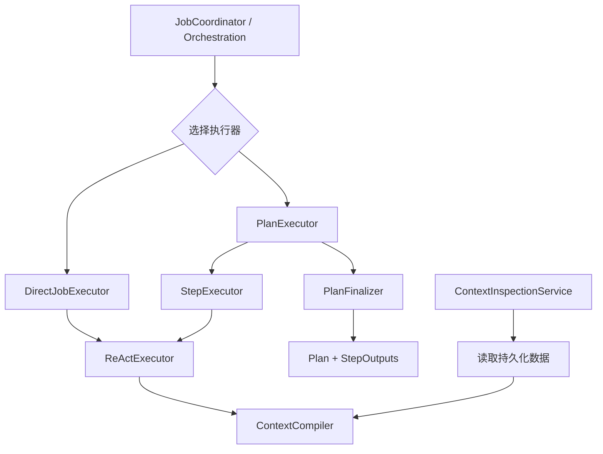
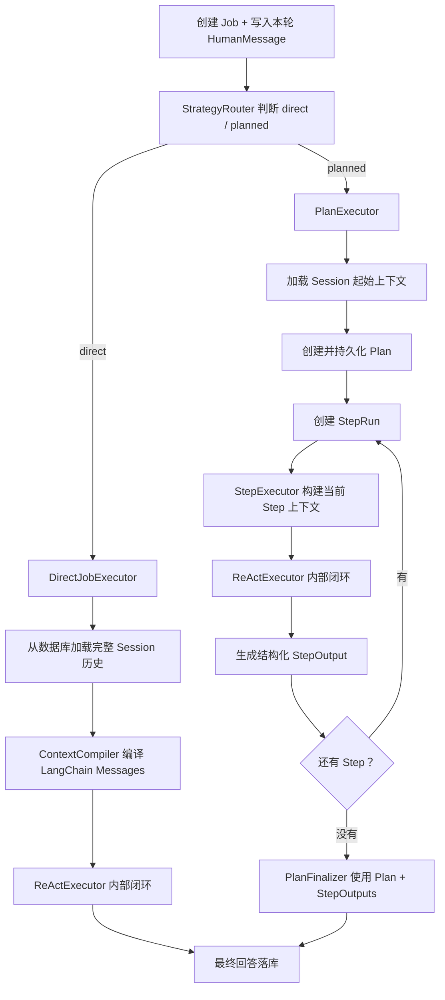

# 执行器上下文闭环重构方案

> 状态：Review Draft
>
> 范围：只重构后端内部职责与 Context 构建流程；PostgreSQL schema、HTTP、SSE、SessionView 和前端协议保持兼容。
>
> 本方案以 Direct/Planned 双执行器和 ReAct/Plan 两级闭环为基线。批准后，它将替代 `06-完整Job-StepRun架构设计.md` 中 ContextBuilder、AgentRunner、StepRunner 和 PlanSummarizer 的相关职责描述。

## 1. 重构目标

当前 `RuntimeJobExecutionService` 同时承担 Job lease、策略路由、Direct 执行、Plan 推进、Step Context、Context 压缩和模型审计组装；`ContextBuilder` 又通过 `purpose + scope` 理解 Job、StepRun、Plan Final 和压缩场景。结果是顶层编排知道过多执行细节，Context 层也反向理解 Runtime。

本次重构达成以下目标：

1. `JobExecutionService` 只负责 Job 所有权、心跳、策略路由与执行器选择。
2. `DirectJobExecutor` 负责 Direct Job 的 Session 全量上下文与 ReAct 执行。
3. `PlanExecutor` 负责 Plan 创建、PlanContext、Step 推进与 Plan Final。
4. `StepExecutor` 负责单个 StepRun 的完整上下文与 ReAct 执行。
5. `ReActExecutor` 在启动或恢复时编译初始 Context，随后在内存中追加 AIMessage 与 ToolMessage，形成局部闭环。
6. `ContextCompiler` 只做通用消息编译，不理解 Job、Plan、StepRun 或执行阶段。
7. `ContextInspectionService` 作为独立编排查询服务，按需重建 next turn、Job、StepRun 或 ModelCall Context。
8. 每个 StepRun 都携带完整 Session 基线、完整 Plan、全部历史 StepRun ReAct 消息与全部 StepOutput，不在 Loader 阶段提前丢弃信息。

## 2. 非目标与兼容边界

本次明确不做：

- 不增加、删除或修改 PostgreSQL 表和列。
- 不修改任何现有写库事务、Store 写接口、写入顺序或 payload 结构。
- 不修改 Plan、StepRun、ReAct、HITL、retry、cancel 和恢复链路的状态推进顺序。
- 不修改 RuntimeEventWriter 的事件消费、事务提交或 commit 后发布语义。
- 不修改现有 HTTP 路径和公开响应结构。
- 不修改 SSE 事件名称、payload 或 reducer 语义。
- 不修改 SessionView 和 TimelineBuilder 的公开契约。
- 不修改前端。
- 不引入 LangGraph。
- 不改变 Job、Plan、PlanStep、StepRun、ToolInvocation、UserInputRequest 的状态机。
- 不合并 Direct Job 与 Planned Job 的业务结果模型。
- 不让 Context Inspection 产生摘要、写消息或改变运行状态。

现有 `agent_context_summaries.purpose` 和 `input_manifest.purpose` 暂时保留，作为数据库兼容字段与审计标签；它们不再控制 `ContextCompiler` 的筛选逻辑。

### 2.1 不可修改的落库与执行链路

本次的“执行器拆分”只表示代码所有权调整，不表示重新设计运行链。以下顺序必须保持：

```text
创建 Job + HumanMessage
  → claim Job
  → route direct/planned
  → create Plan
  → create StepRun
  → AgentLoop 产生 ModelOutputCompleted
  → RuntimeEventWriter 先提交 assistant/tool-call message 与 ToolInvocation
  → ToolExecutor 执行工具
  → RuntimeEventWriter 提交 ToolMessage
  → 下一轮模型调用
  → commit StepOutput
  → 创建下一 StepRun 或 Plan Final
  → complete Job + final message
```

HITL 顺序保持：

```text
tool-call message 已提交
  → UserInputRequest + waiting 状态提交
  → 用户回答
  → 回填 ToolMessage / ToolInvocation
  → claim resume
  → 从同一 Job/StepRun 继续
```

不得修改：

- ID 的生成和关联方式。
- Session `row_id` 分配和排序语义。
- Job、Plan、PlanStep、StepRun、ToolInvocation、UserInputRequest、Message 的字段和值域。
- `message_type`、`visibility`、`channel`、tool protocol 字段。
- Job lease、attempt、StepRun run number 和 retry 语义。
- Store 写方法的调用顺序、事务边界和返回实体。
- SSE 必须在事务 commit 后发布的规则。
- ContextSummary 的 owner、purpose、覆盖范围和替换流程。
- AgentModelCall 当前落库字段和 InputManifest 内容结构。

允许的存储层改动仅限增加 Context Inspection 所需的只读查询方法，例如 `getModelCall(modelCallId)`；不得修改任何写方法。

## 3. 架构基线

### 3.1 模块关系



### 3.2 Job 执行链路



两张图中的职责按以下方式同时成立：DirectJobExecutor 和 StepExecutor 负责选择并加载业务 Context Source；ReActExecutor 在启动或恢复时接收该 Source、调用 ContextCompiler，并持有随后循环使用的局部 LangChain Messages。第二张图中的“加载 → 编译 → ReAct”是一次 ReAct 启动过程，不表示 JobExecutionService 直接调用 ContextCompiler。

DirectJobExecutor、PlanExecutor 和 StepExecutor 是现有逻辑的职责包装，不建立新的状态机或持久化路径。现有 JobCoordinator、PlanEngine、AgentRunner、StepRunner、AgentLoop、ToolExecutor 和 RuntimeEventWriter 的调用时序保持不变。

## 4. 职责边界

### 4.1 JobExecutionService

负责：

- 领取 Job lease。
- 启动和停止 heartbeat。
- 解析 Job 原始目标消息。
- 调用 `StrategyRouter` 选择 `direct | planned`。
- 把 Job 分发给 `DirectJobExecutor` 或 `PlanExecutor`。
- 捕获未被执行器处理的 fatal error，并在仍持有 lease 时终结 Job。

不负责：

- 不加载 Session Messages 或 ToolInvocations。
- 不调用 `ContextCompiler`。
- 不知道 StepRun Context 如何组成。
- 不创建 AgentLoop、ToolExecutor 或 AuditedChatModel。
- 不处理 Context 压缩。
- 不调用 PlanFinalizer。

### 4.2 DirectJobExecutor

负责：

- 通过 `DirectJobContextLoader` 加载 Direct Job 初始或恢复材料。
- 创建 Direct Job 使用的 ToolExecutor、模型审计包装和 ReActExecutor。
- 决定是否触发 Direct Job 的 Context 压缩。
- 消费 ReAct 终态：completed、waiting_user_input、failed、cancelled。

### 4.3 PlanExecutor

负责：

- 通过 `PlanContextLoader` 建立或恢复 `PlanExecutionContext`。
- 创建并持久化 Plan。
- 创建、恢复和推进 StepRun。
- 将当前 StepRun 交给 `StepExecutor`。
- 将已验证 StepOutput 加入 PlanExecutionContext。
- 所有 Step 完成后调用 `PlanFinalizer`。
- 保证 Plan Final 之后 Job 立即进入 completed，不再产生后续工作承诺。

### 4.4 StepExecutor

负责：

- 使用 `StepContextLoader` 从完整 PlanExecutionContext 派生当前 StepRun ContextMaterial。
- 创建 Step 使用的 ToolExecutor、模型审计包装和 ReActExecutor。
- 管理 Step 级 Context 压缩与恢复。
- 校验并提交 `StepOutputV1`。
- 失败时决定是否允许创建新的 StepRun。

### 4.5 ReActExecutor

负责：

1. 调用传入的 Context Source 获取 `ContextMaterial`。
2. 在启动或恢复时调用 `ContextCompiler` 一次。
3. 将编译后的 LangChain `BaseMessage[]` 复制为局部工作列表。
4. 每轮模型输出后追加 AIMessage。
5. 每个工具完成后追加 ToolMessage。
6. 在产生外部副作用前，先 yield 并等待外层完成持久化。
7. 返回显式终态。

正常 ReAct 循环中不重新加载整个 Session。只有初次启动、HITL 恢复、进程恢复或 Worker 接管时重新构建 Context。

### 4.6 PlanFinalizer

只消费：

```ts
interface PlanFinalInput {
  originalGoal: string;
  plan: AgentPlan;
  steps: AgentPlanStep[];
  outputs: Array<{ stepId: string; output: StepOutputV1 }>;
  currentDate: string;
  timezone: string;
}
```

PlanFinalizer 不读取 Session Context，不读取未验证的 Step 草稿，也不依赖 `ContextPurpose`。Step 的完整原始信息必须在 StepOutput 校验前被消化；Plan Final 使用有序、结构化、已验证的结果生成最终回答。

## 5. ContextCompiler

### 5.1 输入

```ts
interface ContextMaterial {
  fixedMessages: BaseMessage[];
  messageGroups: MessageGroup[];
  summaries: ContextSummaryMaterial[];
  toolSchemas: StructuredToolInterface[];
  budget: ModelContextBudget;
  audit: ContextAuditMetadata;
}

interface ContextAuditMetadata {
  purpose: string;
  contextRulesVersion: string;
  systemPromptVersion: string;
}
```

`audit.purpose` 只进入 Manifest，不参与 if/switch、筛选或优先级计算。

### 5.2 输出

```ts
interface CompiledContext {
  messages: BaseMessage[];
  manifest: AgentContextInputManifest;
  estimatedInputTokens: number;
  compression: {
    recommended: boolean;
    compressibleMessageIds: string[];
    candidateTokens: number;
    safeInputLimit: number;
  };
}
```

### 5.3 编译流水线

```text
ContextMaterial
  → 校验 MessageGroup 完整性
  → 用已存在 Summary 替换其覆盖的旧 Group
  → 构造固定消息、工具 Schema、Summary、MessageGroup 候选项
  → 应用 mustKeep 和 TokenBudget
  → 格式化为 LangChain BaseMessage[]
  → 生成 Manifest、checksum 与压缩候选
```

### 5.4 明确禁止

ContextCompiler 及其子模块不得 import：

- `AgentJob`
- `AgentPlan`
- `AgentPlanStep`
- `AgentStepRun`
- `JobExecutionService`
- `PlanExecutor`
- `StepExecutor`
- NestJS server 类型

## 6. Direct Job 完整上下文

`DirectJobContextLoader` 从数据库读取：

- 当前 Session 所有已提交、可见消息。
- 所有 ToolInvocations。
- 当前 Job 与历史 Job。
- 已存在的 Direct Job ContextSummary。
- 当前 Job 的原始目标消息。
- 当前 Job 恢复前已经提交的 ReAct 尾部。

“完整 Session 历史”表示：

- 按 `rowId` 顺序保留历史 HumanMessage、AIMessage、ToolCall、ToolMessage、Plan、StepRun 消息和 StepOutput。
- `visibility = internal` 和 `messageType = progress` 不进入模型。
- ToolCall 与全部 ToolMessage 必须组成不可拆分 MessageGroup。
- 尚未完成的流式草稿不进入 Context。
- Retry 通过原始目标消息 ID 去重，不复制相同 HumanMessage。
- Loader 不因消息属于旧 StepRun 而提前删除。

## 7. PlanExecutionContext 与 Step 完整上下文

### 7.1 PlanExecutionContext

```ts
interface PlanExecutionContext {
  sessionBaseline: MessageGroup[];
  originalGoalMessageId: string;
  plan: AgentPlan;
  steps: AgentPlanStep[];
  stepHistory: Array<{
    step: AgentPlanStep;
    runs: Array<{
      stepRun: AgentStepRun;
      reactGroups: MessageGroup[];
    }>;
    output?: StepOutputV1;
  }>;
}
```

该对象不新增数据库表。`PlanContextLoader` 使用现有 Session、Job、Plan、PlanStep、StepRun、Message 和 ToolInvocation 数据恢复。

### 7.2 防止重复

上下文分为两个不重叠区段：

```text
SessionBaseline:
  rowId <= originalGoalMessage.rowId

CurrentPlanHistory:
  jobId = currentJob.id
  且 rowId > originalGoalMessage.rowId
```

Plan 定义来自 Plan/PlanStep 实体，不再把 `plan_created` 展示消息重复当成第二份 Plan 定义。

### 7.3 每个 StepRun 的完整输入

```text
StepContext(N) =
  Runtime SystemPrompt
  + 当前时间、时区、Sandbox、Workspace 等稳定环境
  + SessionBaseline 全量可见 MessageGroup
  + Current Plan 完整定义
  + Step 1..N-1 的全部 StepRun
  + Step 1..N-1 的全部 ReAct MessageGroup
  + Step 1..N-1 的全部失败尝试和工具结果
  + Step 1..N-1 的全部已验证 StepOutput
  + 当前 Step 定义与 instruction
  + 当前 Step 历史运行尝试
  + 当前 StepRun 已提交的 ReAct 尾部
  + 当前工具 Schema
```

Loader 阶段不允许只保留 StepOutput，也不允许删除前序 StepRun 原始工具结果。

### 7.4 Token 上限

TokenBudget 不能静默丢弃当前 Plan 信息：

- 当前 Job 原始目标、Plan 定义、全部 StepRun ReAct 消息、全部 StepOutput、当前 Step 指令与当前 StepRun 尾部全部标记为 mustKeep。
- 进入当前 Planned Job 之前的旧 Session 历史允许按现有摘要机制压缩。
- 若旧 Session 历史压缩后，当前 Plan 自身仍超过模型安全输入上限，返回明确 `context_overflow`，不得悄悄删掉早期 Step 信息。

这保证“完整 Context”是可验证的不变量，而不是依赖优先级的最佳努力。

## 8. Context 压缩

压缩从 ContextCompiler 的业务流程中拆出：

```text
Executor
  → Loader.load()
  → ContextCompiler.compile()
  → 检查 compression.recommended
  → ContextCompressionService.compress()
  → Loader.reload()
  → ContextCompiler.compile()
```

所有权：

- Direct Job 压缩由 DirectJobExecutor 发起。
- StepRun 压缩由 StepExecutor 发起。
- PlanFinalizer 不经过通用 Context 压缩。
- ContextInspectionService 永远只读，只返回 `compressionRecommended`。

`ContextCompressionService` 继续使用现有 summary 表、owner、purpose 和 rules version，不改变 schema。

## 9. ContextInspectionService

### 9.1 查询契约

```ts
type ContextQuery =
  | { kind: 'next_turn'; sessionId: string }
  | { kind: 'job'; jobId: string }
  | { kind: 'step_run'; stepRunId: string }
  | { kind: 'model_call'; modelCallId: string };
```

### 9.2 服务

```ts
class ContextInspectionService {
  async inspect(query: ContextQuery): Promise<ContextSnapshot> {
    const material = await this.loadMaterial(query);
    return compileContext(material);
  }
}
```

查询路由：

```text
next_turn → SessionContextLoader
job       → DirectJobContextLoader
step_run  → StepContextLoader
model_call → ModelCallContextLoader
```

### 9.3 查询语义

`next_turn`：

- 构建下一轮正常对话将使用的 Session Context。
- 活跃 Job 存在时继续拒绝，保持现有 Context Preview 行为。
- 不包含尚未发送的输入框草稿。

`job`：

- 构建 Direct Job 的初始或恢复 Context。
- Planned Job 返回明确查询错误，调用方应改查 StepRun 或 ModelCall。

`step_run`：

- 使用与 StepExecutor 相同的 StepContextLoader。
- 返回完整 PlanExecutionContext 派生的模型输入。

`model_call`：

- 按该次调用的 InputManifest 重建历史输入。
- 使用 `inputChecksum` 校验。
- 无法精确重建时显式失败，不返回伪装成精确结果的近似 Context。

### 9.4 ModelCall 只读重建边界

本次不改变 `agent_model_calls.input_manifest` 的落库内容，也不修改 AuditedChatModel 的持久化 payload。`ModelCallContextLoader` 只能使用已经存在的 InputManifest、InputChecksum、Session Messages、ToolInvocations 和 ContextSummary 做只读重建。

当前实现对同一 ReAct 中的后续模型调用复用初始 Manifest，因此部分历史调用无法仅凭现有信息精确重建。服务必须如实表达能力边界：

- 能根据现有 Manifest 重建且 checksum 一致：返回 `exact`。
- 只能重建候选 Context 但 checksum 不一致：返回明确的 `context_snapshot_unreconstructable`。
- 不允许修改 Manifest 落库格式来提高本次重构的重建率。
- 不允许把近似结果标记为精确结果。

现有 `/sessions/:sessionId/context-preview` 继续由 `ContextPreviewService` 暴露原响应结构。它内部只做：

```ts
inspection.inspect({ kind: 'next_turn', sessionId })
  → mapToExistingContextPreviewV1()
```

## 10. 目录结构

目录按职责包组织，避免文件全部铺平：

```text
src/
  agent-loop/
    agent-loop.ts
    langchain-model.ts
    loop-events.ts
    loop-result.ts

  context/
    compiler/
      context-compiler.ts
      context-material.ts
      context-items.ts
      context-manifest.ts
      message-group-builder.ts
      context-formatter.ts
      token-budget.ts

    compression/
      context-compression-policy.ts
      context-compression-result.ts

  runtime/
    execution/
      job-execution.service.ts

      direct/
        direct-job-executor.ts
        direct-job-context-loader.ts

      planned/
        plan-executor.ts
        plan-finalizer.ts

        context/
          plan-execution-context.ts
          plan-context-loader.ts
          step-context-loader.ts

        step/
          step-executor.ts

    context/
      session-context-loader.ts
      context-compression.service.ts

    audit/
      model-call-context-loader.ts

    agent-runner.ts
    audited-chat-model.ts
    job-coordinator.ts
    runtime-event-writer.ts
    tool-executor.ts
    transaction-commands.ts

  planner/
    plan-engine.ts
    plan-summarizer.ts
    planner-prompts.ts
    step-runner.ts
    step-output.ts

  orchestration/
    context-inspection/
      context-query.ts
      context-snapshot.ts
      context-inspection.service.ts

    agent-runtime.ts
```

说明：

- `agent-loop` 保持独立 ReAct Core，不依赖 runtime、planner、storage 或 server。
- `context/compiler` 是纯函数包。
- `context/compression` 只定义压缩判断与结果；会调用模型和存储的 service 位于 runtime。
- Direct 相关文件聚合在 `runtime/execution/direct`。
- Plan/Step 的执行器和运行时 Context 聚合在 `runtime/execution/planned`；它们依赖 Job、StepRun、AgentStore 和恢复状态，因此不属于纯 Planner。
- `planner` 只承载规划算法、Prompt、StepOutput 解析及现有被冻结链路文件。现有 `plan-engine.ts` 与 `step-runner.ts` 本次不移动，避免目录调整触碰运行和落库链；新文件不得继续放入 `planner`。
- Context Inspection 聚合在 `orchestration/context-inspection`。
- JobCoordinator、RuntimeEventWriter、AgentRunner、AuditedChatModel、ToolExecutor 和 transaction commands 保持现有文件与职责，避免目录整理触碰落库主链。

## 11. 迁移阶段

### 阶段 0：锁定现有行为

增加 characterization tests，覆盖：

- Direct Job 完整 Session 顺序。
- ToolCall/ToolMessage 原子组。
- Retry 复用原目标消息。
- Direct HITL 恢复。
- Planned HITL 恢复。
- StepRun retry。
- Plan Final。
- Context Preview 公开响应。
- Context Summary 与 ModelCall 审计。
- AgentStore 写方法调用顺序与 payload shape。
- RuntimeEventWriter 在 ModelOutput、ToolCall、ToolResult、StepOutput、Plan Final 上的提交顺序。

验收：只增加测试，不改变生产行为；形成 Direct、Planned、HITL、retry 的写库调用 golden trace。

### 阶段 1：提取 ContextCompiler 包

- 创建 `context/compiler`。
- 将 MessageGroup、预算、格式化、Manifest 构建迁入子目录。
- 保留旧 `buildContext()` 作为临时适配器。
- 新旧输出执行深度相等测试。

验收：现有运行时调用方不变，全部测试通过。

### 阶段 2：实现 Context Loader

- 实现 SessionContextLoader。
- 实现 DirectJobContextLoader。
- 实现 PlanContextLoader。
- 实现 StepContextLoader。
- 实现 ModelCallContextLoader 的基础查询。
- 把 `ContextFilter` 的业务分支迁入对应 Loader。

验收：每个 Loader 可独立输出确定性的 ContextMaterial；Step Loader 测试证明包含完整 Session、Plan、所有 StepRun 和所有 StepOutput。

### 阶段 3：在现有 ReAct 边界接入初始编译

- 在现有 AgentRunner/StepRunner 调用 AgentLoop 之前接入 Context Source 与 ContextCompiler。
- 将这一既有边界命名为 ReActExecutor 职责，不重写 AgentLoop。
- 正常循环保持局部 LangChain Messages 列表。
- 保持“事件先提交、工具后执行”的 yield 顺序。
- 不修改 LoopEvent、LoopResult、RuntimeEventWriter 或 ToolExecutor。

验收：一个正常多工具 ReAct Job 只加载一次初始 Context；后续轮次不重复读取 Session。

### 阶段 4：DirectJobExecutor 归位

- 创建 DirectJobExecutor。
- 将现有 Direct Context、ToolExecutor、AuditedChatModel、AgentRunner 组装原样封装，保持调用顺序和参数不变。
- JobExecutionService 只保留 claim、heartbeat、route、dispatch。
- 不修改 AgentRunner、RuntimeEventWriter、JobCoordinator 或任何 Store 写方法。

验收：Direct、HITL、retry、cancel、工具失败语义不变。

### 阶段 5：PlanExecutor 与 StepExecutor 归位

- 创建 PlanExecutionContext 与 PlanContextLoader。
- 将现有 PlanEngine 推进循环封装为 PlanExecutor，但不改变 route、createPlan、createStepRun、commitStepOutput、finalize 的顺序。
- 将现有 StepRunner 调用包装为 StepExecutor；StepExecutor 只替换 Context 来源，不改变 StepRunner 的事件消费和落库。
- 每个 StepRun 使用完整 Context。
- PlanFinalizer 沿用现有 PlanSummarizer 输入与 completeJobWithFinalMessage 写入流程。
- 顶层不再传递 `step_execution` 或 `plan_final`。

验收：第二个及后续 Step 能看到 SessionBaseline、完整 Plan、前序成功/失败 StepRun、ToolMessage、HITL 回答和 StepOutput。

### 阶段 6：压缩职责归位

- 提取 ContextCompressionService。
- DirectJobExecutor 与 StepExecutor 分别触发压缩。
- 当前 Plan 所有数据设为 mustKeep。
- 当前 Plan 自身溢出时显式失败。
- Context Inspection 保持只读。

验收：压缩只作用于允许压缩的旧 Session 历史，不静默删除当前 Plan 数据。

### 阶段 7：ContextInspectionService

- 创建 ContextQuery、ContextSnapshot 与 ContextInspectionService。
- 接入四类 Loader。
- 将现有 ContextPreviewService 改为 `next_turn` 薄适配器。
- 不新增外部 HTTP API。

验收：现有前端 Context Preview 无变化；内部可测试 job、step_run 和 model_call 查询。

### 阶段 8：ModelCall 只读检查

- 增加 `AgentStore.getModelCall(modelCallId)` 等只读接口。
- 使用现有 InputManifest 尝试重建输入。
- 使用现有 inputChecksum 验证结果。
- 无法验证时返回 `context_snapshot_unreconstructable`。
- 不修改 AuditedChatModel、startModelCall 写入参数或 InputManifest JSON。

验收：可重建调用返回 exact；信息不足的调用明确失败；数据库中 AgentModelCall 的落库内容与当前实现一致。

### 阶段 9：删除旧职责

- 删除 `ContextFilter`。
- 删除内部 `ContextScope`。
- 删除 `compressionSourcePurpose`。
- 删除 ContextCompiler 中所有 purpose 分支。
- 将 `CONTEXT_RULES_VERSION` 移到 context manifest 模块。
- 保留数据库领域层的 AgentContextPurpose。

验收：`rg "switch.*purpose|compressionSourcePurpose|ContextScope" src/context` 无结果。

### 阶段 10：全链路验收

运行：

```bash
npm run typecheck
npm test
npm run test:postgres
npm run build
```

同时验证：

- 数据库 schema checksum 不变。
- HTTP contract tests 不变。
- SSE event dictionaries 不变。
- SessionView snapshot 不变。
- Context Preview JSON 不变。
- AgentStore 写方法调用 trace 不变。
- RuntimeEventWriter 提交 trace 不变。
- Plan、StepRun、ReAct、HITL、retry 和 cancel 的状态转换序列不变。

## 12. 测试矩阵

| 场景 | 必须证明 |
| --- | --- |
| Direct 新 Job | 能读取之前所有可见 Session 历史 |
| Direct 多轮工具 | Context 只初始化一次，ReAct 内部追加消息 |
| Direct HITL | 回答作为 ToolMessage 后恢复，不重复目标消息 |
| Planned Step 1 | 包含 SessionBaseline、Plan 与当前 Step |
| Planned Step 2 | 包含 Step 1 全部 ReAct 消息、工具结果和 StepOutput |
| Step retry | 包含同 Step 前一次失败尝试，不重复执行已知失败路径 |
| Planned HITL | 用户答案出现在当前 StepRun 完整 Context |
| Plan Final | 只使用 Plan 与全部已验证 StepOutput |
| Context overflow | 不静默丢弃当前 Plan；明确失败 |
| next_turn inspect | 与现有 Context Preview 一致 |
| job inspect | 与 DirectJobExecutor 初始 Context 一致 |
| step_run inspect | 与 StepExecutor 恢复 Context 一致 |
| model_call inspect | 能验证则返回 exact，不能验证则明确不可重建 |
| process recovery | 从持久化数据恢复出等价 Context |
| persistence trace | Store 写方法、参数 shape、事务和顺序与重构前一致 |

## 13. 风险与控制

### 13.1 完整 Step Context 增大 token 消耗

控制：只允许压缩进入当前 Plan 之前的旧 Session 历史；当前 Plan 信息不可静默裁剪。若当前 Plan 自身过大，明确失败并暴露 token breakdown。

### 13.2 文件移动造成大面积 import 变更

控制：先创建新包并通过兼容 re-export 迁移调用方，最后一个阶段再删除旧路径。每个阶段独立 typecheck 和提交。

### 13.3 Context Preview 与正式执行漂移

控制：执行器和 ContextInspectionService 复用同一个 Loader；Preview 只做公开 DTO 映射，不复制筛选逻辑。

### 13.4 ModelCall 历史记录无法精确重建

控制：不修改既有 Manifest 落库；使用现有信息校验，无法验证时明确返回不可重建，不伪造 exact 结果。

### 13.5 重构影响 durable recovery

控制：每次职责迁移前先补 HITL、lease 接管、retry 和 StepRun 恢复的 PostgreSQL 集成测试；不在同一提交中同时移动职责和改变事务语义。

## 14. 完成标准

满足以下全部条件才算完成：

1. JobExecutionService 不 import ContextCompiler、AgentLoop、StepRunner 或 PlanFinalizer。
2. DirectJobExecutor 与 StepExecutor 都通过 ReActExecutor 执行。
3. ReActExecutor 只在启动/恢复时编译 Context，正常循环使用局部 Messages。
4. ContextCompiler 不 import Job、Plan、StepRun 或 server 类型。
5. 每个 StepContext 包含完整 SessionBaseline、Plan、历史 StepRun ReAct 与 StepOutput。
6. 当前 Plan 的任何 MessageGroup 都不会被 TokenBudget 静默删除。
7. PlanFinalizer 只消费 PlanFinalInput。
8. ContextInspectionService 支持四类 ContextQuery。
9. ModelCall 重建经过 inputChecksum 验证。
10. PostgreSQL schema、HTTP、SSE、SessionView 和前端协议无变化。
11. AgentStore 写接口、RuntimeEventWriter、事务命令和写入 payload 无变化。
12. Plan、StepRun、ReAct、HITL、retry 和 cancel 的执行及落库顺序无变化。
13. typecheck、unit tests、PostgreSQL integration tests 和 build 全部通过。
