# Agent Runtime V2 总体架构总览

本文档描述当前 `agent-runtime-v2` 与 `agent-runtime-v2-web` 的实际架构状态，重点覆盖：

- 后端 runtime 分层
- 前端 UI 分层
- 前后端全链路
- 会话持久化模型
- 上下文构建与压缩
- 实时事件与 UI 收敛
- 真实 token usage 统计链路

本文以当前代码为准：

- 后端：`/Users/hanljjie/Desktop/Agent/agent-runtime-v2`
- 前端：`/Users/hanljjie/Desktop/Agent/agent-runtime-v2-web`

## 1. 总览图

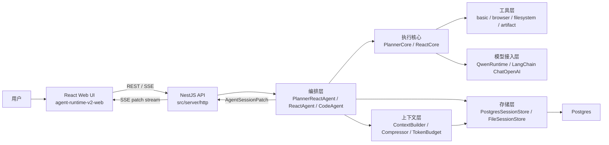

一句话概括：

`session` 是唯一长期事实源，`orchestration` 负责把 core 事件翻译成可持久化的 session 记录与可推送的 patch，前端则用 `session snapshot + patch stream` 恢复和增量渲染同一份会话。

## 2. 目录结构图

### 2.1 后端目录结构

```text
agent-runtime-v2/
├── docs/
├── src/
│   ├── context/             # ContextBuilder、压缩器、token budget
│   ├── core/
│   │   ├── planner/         # PlannerCore、route/create/final 协议
│   │   └── react/           # ReactCore、CoreStepEvent
│   ├── domain/              # Session / Task / Message / Patch / TokenUsage 等领域模型
│   ├── orchestration/       # PlannerReactAgent、ReactAgent、CodeAgent、上下文投影
│   ├── server/              # Nest HTTP、main.ts、Qwen runtime、env
│   ├── storage/             # SessionStore 抽象、Postgres/File 实现
│   ├── tools/               # 内置工具定义与 sandbox
│   └── view/                # SessionView 聚合视图
├── tests/
├── dist/
└── .agent-sandbox/
```

### 2.2 前端目录结构

```text
agent-runtime-v2-web/
├── src/
│   ├── api/                 # REST / SSE 客户端与共享类型
│   ├── components/          # 会话壳、时间线、抽屉、工具块、ContextUsage 等
│   ├── store/               # useAgentSession、sessionReducer
│   ├── App.tsx
│   ├── main.tsx
│   └── styles.css
├── design/
├── dist/
└── index.html
```

### 2.3 模块职责图

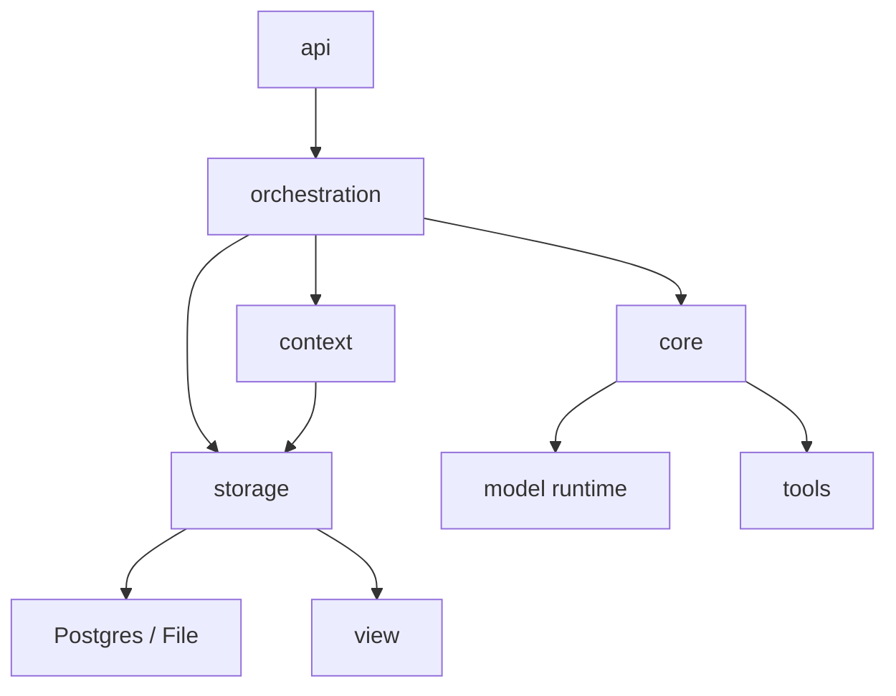

职责边界：

- `api`：暴露 HTTP/SSE，不负责业务状态机
- `orchestration`：真正的 agent 运行器，负责任务状态流转、消息落库、patch 推送
- `core`：只负责一次模型循环中的执行逻辑，不直接碰数据库
- `context`：负责把持久化消息恢复为模型上下文，并在需要时做压缩
- `storage`：负责 canonical records 的持久化与读取
- `view`：负责把 session 相关数据聚合成 UI 初始快照

## 3. 前后端全链路图

### 3.1 普通 Agent direct 链路

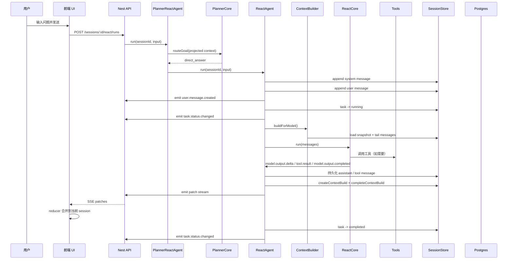

### 3.2 独立 Planner + Step ReAct 全链路

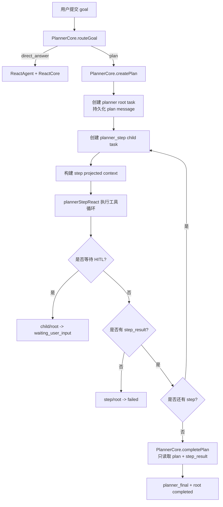

Planner 是独立编排器。真实 usage 分别记录以下模型调用：

- `planner.route`
- `planner.plan.create`
- `planner.direct.react`
- `planner.step.react`
- `planner.plan.finalize`

### 3.3 HITL 恢复链路

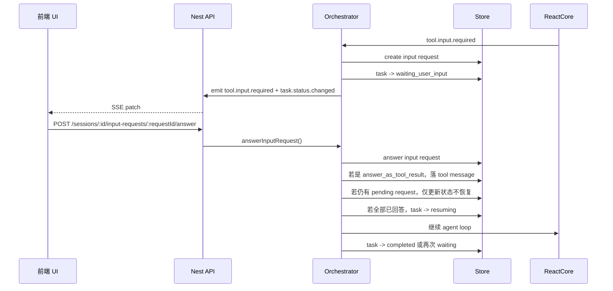

关键约束：

- 同一个 task 的多个 HITL 请求可以并行存在
- 只有所有 pending request 都 answered 后，loop 才真正 resume
- 工具调用与工具结果在模型上下文中必须成对恢复

## 4. 后端分层说明

### 4.1 `src/domain`

这是全系统的 canonical schema，定义了所有“可长期存储”和“可前后端共享”的对象。

核心对象：

- `AgentSession`
- `AgentTask`
- `AgentMessage`
- `AgentInputRequest`
- `AgentContextSnapshot`
- `AgentContextBuild`
- `AgentSessionTokenStats`
- `AgentSessionPatch`

原则：

- `session / task / message / input_request` 是事实记录
- `context_snapshot / context_build / token_stats` 是派生记录
- `patch` 是运行时事件，不是独立事实表

### 4.2 `src/core`

`core` 只关心一次 agent loop 如何推进，不关心数据库。

#### ReactCore

负责：

- 调用模型
- 解析 streaming delta
- 解析 tool call
- 执行工具
- 处理 `requires_user_input`
- 返回 `CoreStepEvent`

典型事件：

- `model.output.delta`
- `model.output.completed`
- `tool.result.completed`
- `tool.result.failed`
- `tool.input.required`

#### PlannerCore

当前只保留一种 planner 形态：独立 `PlannerCore / PlannerReactAgent` 编排。

负责：

- `routeGoal`：判断 direct answer 或 plan
- `createPlan`：生成结构化计划
- `completePlan`：基于 plan 与 step results 生成最终交付

PlannerCore 不执行工具、不写数据库。计划任务树、步骤状态和持久化由 PlannerReactAgent 管理；每个 step 由通用 ReactCore 执行。

### 4.3 `src/orchestration`

这是后端最核心的一层。

主要类：

- `ReactAgent`
- `PlannerReactAgent`
- `CodeAgent`
- `SessionEventEmitter`

职责：

- 创建 task
- 为复杂任务创建 planner root 与 planner_step children
- 维护状态机
- 写入 system / user / assistant / tool message
- 处理 HITL 恢复
- 创建 `AgentSessionPatch`
- 推送 SSE
- 记录 context usage

这一层的本质是：

`把 CoreStepEvent 翻译成“可存储的 session 记录 + 可推送的 session patch”`

### 4.4 `src/context`

当前上下文层包含三部分：

- `ContextBuilder`
- `TokenBudgetManager`
- `BasicContextCompressor`

#### ContextBuilder

负责把 `agent_messages` 恢复为真正要送给模型的 `BaseMessage[]`。

它会处理：

- system / user / assistant / tool message 的转换
- tool call 与 tool result 的成对恢复
- active snapshot + tail messages 拼接
- token 估算
- 是否触发压缩

#### TokenBudgetManager

负责：

- 根据 `maxContextTokens`
- `reservedOutputTokens`
- `minTailMessages`
- `maxSnapshotTokens`

决定是否需要压缩。

#### BasicContextCompressor

当前是一个基础实现：

- 输入：可压缩消息、历史 summary
- 输出：summary、source token count、summary token count

后续可以替换成真正的大模型压缩器。

### 4.5 `src/storage`

这一层定义 `AgentSessionStore` 抽象，并提供两套实现：

- `FileSessionStore`
- `PostgresSessionStore`

统一接口覆盖：

- session / task / message / input request
- context snapshot
- context build
- session token stats

原则：

- 上层永远面向 `AgentSessionStore`
- 是否用文件或 Postgres，对 orchestration 透明

### 4.6 `src/tools`

工具层位于 `src/tools`，当前通过 `createRuntimeTools()` 装配：

- `basic-tools`
- `artifact-tools`
- `filesystem-tools`
- `browser-tools`

工具层特征：

- 面向 `RuntimeTool` 抽象
- 通过 OpenAI-compatible function calling 暴露给模型
- 可以返回：
  - `completed`
  - `failed`
  - `requires_user_input`

sandbox 约束由 `src/tools/sandbox.ts` 负责，主要目标是：

- 为每个 session / task 提供受控工作目录
- 文件工具只在 sandbox 范围内读写
- browser / artifact / filesystem 工具共享同一套受控目录上下文

### 4.7 `src/api`

通过 NestJS 暴露服务。

当前角色：

- `SessionsController`
- `AgentsController`
- `AgentRuntimeService`
- `SseEventBus`

REST：

- `GET /sessions`
- `POST /sessions`
- `GET /sessions/:sessionId/view`
- `GET /sessions/:sessionId/context-usage`
- `POST /sessions/:sessionId/react/runs`
- `POST /sessions/:sessionId/planner-react/runs`
- `POST /sessions/:sessionId/input-requests/:requestId/answer`

SSE：

- `GET /sessions/:sessionId/events`

## 5. 前端架构说明

### 5.1 页面结构

前端入口是 [SessionShell.tsx](/Users/hanljjie/Desktop/Agent/agent-runtime-v2-web/src/components/SessionShell.tsx)。

页面分三块：

- 左侧 `SessionSidebar`
- 中间 `MessageList`
- 右侧抽屉 `WorkspacePanel`

额外状态组件：

- `ContextUsage`：展示真实上下文消耗
- `InputRequestPanel`：处理 HITL
- `ToolCallBlock`：展示工具调用与结果

### 5.2 状态管理

核心在：

- [useAgentSession.ts](/Users/hanljjie/Desktop/Agent/agent-runtime-v2-web/src/store/useAgentSession.ts)
- [sessionReducer.ts](/Users/hanljjie/Desktop/Agent/agent-runtime-v2-web/src/store/sessionReducer.ts)

前端状态来源只有两条：

1. `GET /sessions/:id/view` 的完整 session 快照
2. `SSE AgentSessionPatch` 的增量 patch

这意味着：

- 刷新页面时可以完整恢复会话
- 运行中只需要应用 patch，不需要重新发明第二套消息模型

### 5.3 前端 UI 收敛原则

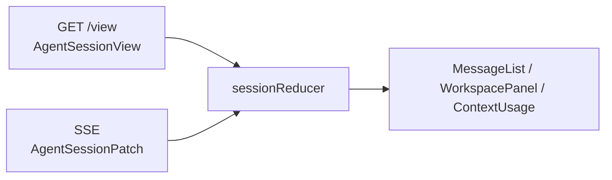

规则：

- 持久化事件直接 upsert canonical record
- `model.output.delta` 只是临时流式片段，不落库
- `model.output.completed` 到来后，用真正持久化 message 替换 provisional message
- `context.usage.updated` 直接更新 `view.tokenStats`

## 6. 会话数据模型

### 6.1 Canonical Facts

真正的会话事实源是四张主记录：

- `agent_sessions`
- `agent_tasks`
- `agent_messages`
- `agent_input_requests`

其中：

- `agent_messages` 是完整时间线
- UI 恢复、审计、上下文恢复都以它为准

### 6.2 Derived Data

派生表：

- `agent_context_snapshots`
- `agent_context_builds`
- `agent_session_token_stats`

它们的定位：

- `agent_context_snapshots`：为 context 压缩服务
- `agent_context_builds`：记录每次模型调用前构建了什么上下文，以及实际 usage
- `agent_session_token_stats`：为 UI 和会话级监控提供聚合统计

### 6.3 并发与一致性约束

当前存储层有几个非常关键的运行约束：

1. 同一个 session 同时只允许一个 active root task
2. `agent_messages` 使用数据库全局 `row_id` 排序，不再维护 session 内 `seq`
3. HITL 回答时会锁定 input request，避免重复恢复
4. task 更新使用 version / optimistic lock，避免旧状态覆盖新状态

这几条约束共同保证：

- 浏览器多窗口不会轻易把同一个会话写乱
- UI 时间线可以稳定恢复
- 上下文构建能基于 `row_id` 精准截取 tail messages

## 7. 数据表结构图

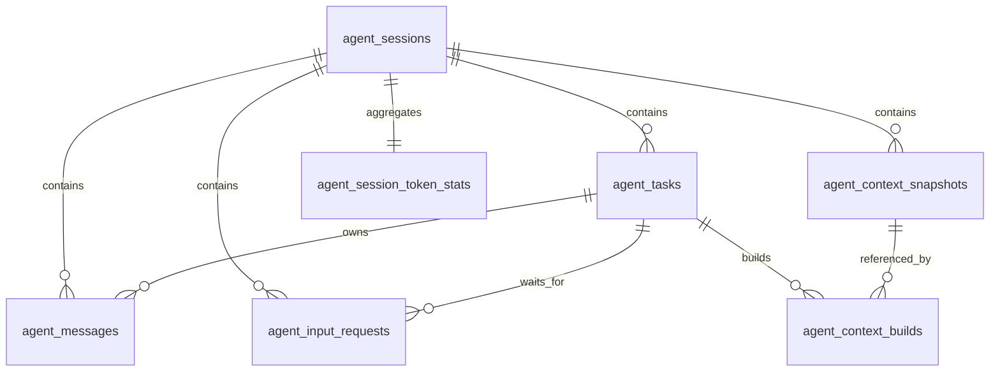

### 7.1 `agent_messages`

关键字段：

- `row_id bigint`
- `id`
- `session_id`
- `task_id`
- `role`
- `content`
- `channel`
- `tool_calls jsonb`
- `tool_result jsonb`
- `metadata jsonb`

排序规则：

- 不再使用 session 内部 `seq`
- 使用数据库全局自增 `row_id`
- 读取 session 时间线时：`where session_id = ? order by row_id asc`

### 7.2 `agent_context_snapshots`

关键字段：

- `source_row_id_start`
- `source_row_id_end`
- `summary`
- `status`
- `base_snapshot_id`
- `supersedes_snapshot_id`

含义：

- 表示“这段历史消息已经被压成了一个 summary”

### 7.3 `agent_context_builds`

关键字段：

- `session_id`
- `task_id`
- `snapshot_id`
- `model`
- `strategy`
- `estimated_input_tokens`
- `actual_input_tokens`
- `actual_output_tokens`
- `actual_total_tokens`
- `usage_source`
- `context_usage_ratio`
- `included_row_id_start`
- `included_row_id_end`
- `breakdown`

含义：

- 每次真正调用模型前，记录“这次上下文是怎么构出来的”
- 这是上下文使用分析、预算监控、后续 checkpoint 演进的基础表

### 7.4 `agent_session_token_stats`

关键字段：

- `total_model_calls`
- `total_actual_input_tokens`
- `total_actual_output_tokens`
- `total_tokens`
- `latest_context_usage_ratio`
- `warning_level`
- `latest_model`

含义：

- 会话级 token 聚合结果
- 当前前端的 `ContextUsage` 就主要消费这张聚合视图

## 8. 上下文构建与压缩链路

### 8.1 上下文构建图

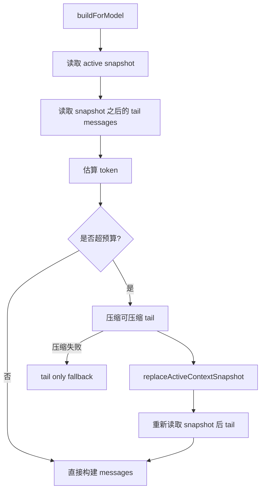

### 8.2 当前策略枚举

当前 `AgentContextBuildStrategy` 包括：

- `full`
- `snapshot_tail`
- `compressed_then_snapshot_tail`
- `tail_only_fallback`

它们分别表示：

- `full`：不使用 snapshot，直接全量 tail
- `snapshot_tail`：使用已有 snapshot 加最近 tail
- `compressed_then_snapshot_tail`：本轮先压缩，再用新的 snapshot + tail
- `tail_only_fallback`：压缩失败，只保留最小 tail

## 9. 实时事件模型

### 9.1 Patch 图

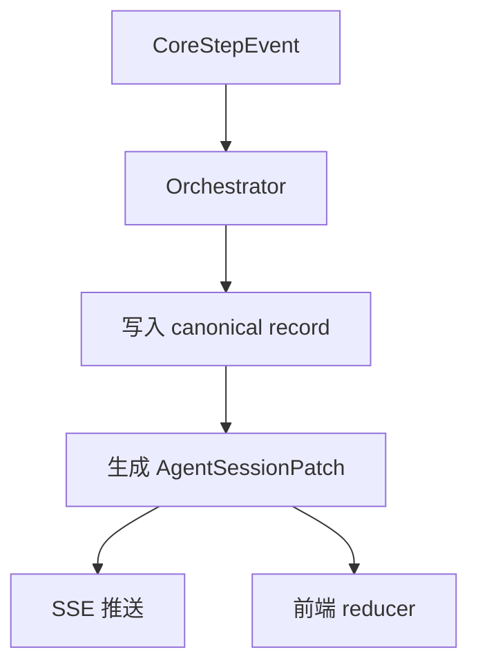

### 9.2 当前 Patch 类型

- `user.message.created`
- `planner.plan.created`
- `model.output.delta`
- `model.output.completed`
- `tool.result.completed`
- `tool.result.failed`
- `tool.input.required`
- `task.status.changed`
- `context.usage.updated`

其中只有一类是非持久化临时事件：

- `model.output.delta`

其余 patch 都对应已持久化记录或已持久化聚合结果。

## 10. 真实 Token Usage 链路

### 10.1 链路图

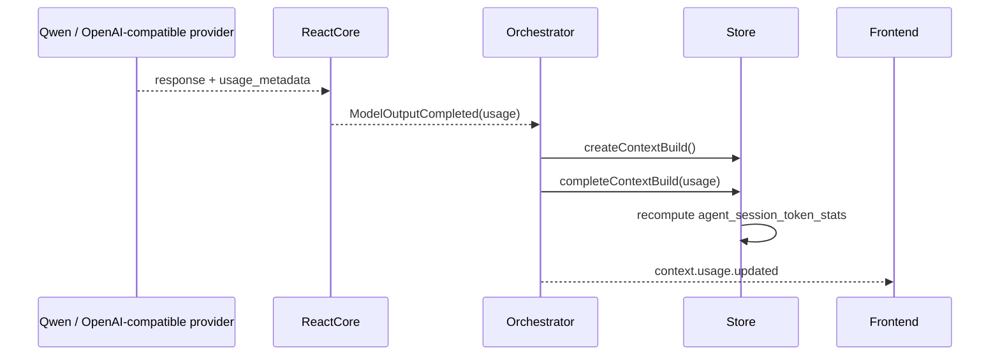

### 10.2 真实 usage 来源

当前优先读取：

- `usage_metadata`
- `response_metadata.tokenUsage`
- `response_metadata.usage`

如果 provider 没有返回 usage：

- `usageSource = unavailable`
- 仍可保留 `estimatedInputTokens`
- 但不会把模拟值伪装成真实 `actualInputTokens`

## 11. 前端展示链路

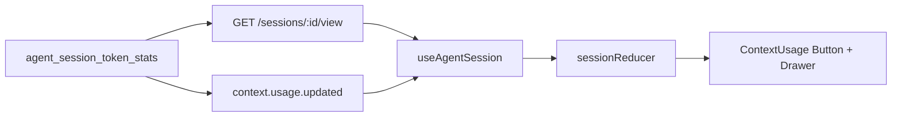

当前前端已经实现：

- 顶部 usage 胶囊
- 抽屉中的上下文统计详情
- 会话恢复时直接渲染历史统计
- 运行时通过 patch 实时刷新

## 12. 设计原则总结

### 12.1 单一事实源

会话的事实源永远是：

- `session`
- `task`
- `message`
- `input_request`

UI、context builder、恢复逻辑都围绕这套事实源展开。

### 12.2 Core 不碰存储

`core` 只负责执行，不负责：

- 数据库写入
- session id / task id 分配
- SSE 推送

这样才能把 ReactCore 复用到不同编排层。

### 12.3 编排层才知道“会话”

只有 `ReactAgent / CodeAgent` 知道：

- 当前 session 是谁
- 当前 task 是谁
- 什么时候该落消息
- 什么时候该改 task 状态
- 什么时候该发 patch

### 12.4 Snapshot 是上下文缓存，不是聊天消息

`agent_context_snapshots` 不能直接拿来当会话消息展示。

它的作用是：

- 降低上下文长度
- 帮助 ContextBuilder 构造更短的 prompt

### 12.5 TokenStats 是 UI 消费视图，不是原始事实

`agent_session_token_stats` 适合：

- UI 实时展示
- 阈值告警
- 会话级监控

但真正可审计、可追溯的数据还是：

- `agent_context_builds`

## 13. 后续扩展建议

当前架构已经具备继续演进的边界，下一步最自然的扩展点有：

1. `ContextCompressor` 替换为真正的 LLM 压缩器
2. 为 `agent_context_snapshots` 增加多种 snapshot 类型
3. 引入更完整的 checkpoint / recovery 机制
4. 在前端把 plan step 状态推进做成更强的时间线视图
5. 在 `agent_context_builds` 上做更细的成本、延迟、压缩收益分析
6. 在工具层引入更强的 browser / writing / file workflow 工具集

## 14. 当前最重要的结论

如果用一句话定义这套系统：

这是一个以 `session` 为中心、以 `orchestration` 为状态机、以 `ContextBuilder` 为模型上下文拼装器、以 `AgentSessionPatch` 为前端实时同步协议、以 `Postgres` 为长期事实存储的可恢复 Agent Runtime。
