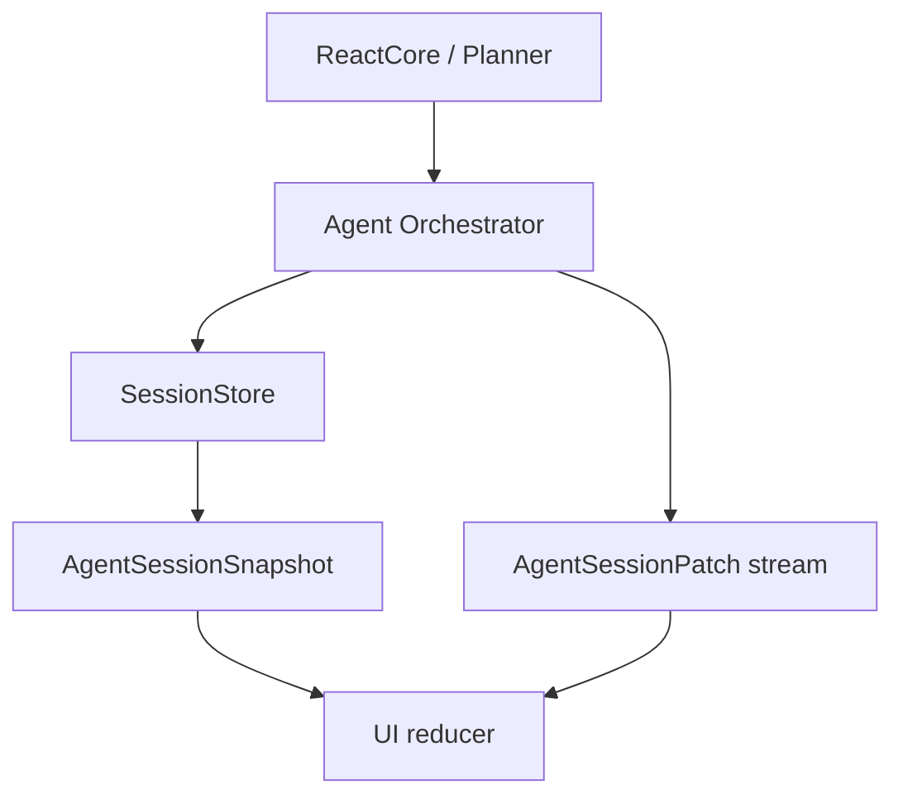

# Session Runtime Event Model

The session is the only long-lived data model. UI state is built from a session
snapshot plus session-scoped runtime events while an agent is running.

## Flow

## Session Records

Defined in `src/domain`.

These records are the canonical facts and are the objects that can be stored:

- `AgentSession`
- `AgentTask`
- `AgentMessage`
- `AgentInputRequest`

The UI should render these records from the initial session snapshot. Runtime
events that represent persisted data carry the same canonical records returned
by the storage layer, so refresh/recovery and live rendering consume the same
shape.

## AgentSessionPatch

Defined in `src/domain/patch.ts`.

Patches are session-scoped runtime events. The orchestrator creates them by
handling a core event, writing the canonical session record when persistence is
needed, and forwarding the storage-returned record to the UI:

- `AgentSessionPatchType.ModelOutputDelta`
- `AgentSessionPatchType.ModelOutputCompleted`
- `AgentSessionPatchType.UserMessageCreated`
- `AgentSessionPatchType.ToolResultCompleted`
- `AgentSessionPatchType.ToolResultFailed`
- `AgentSessionPatchType.ToolInputRequired`
- `AgentSessionPatchType.TaskStatusChanged`

User messages are persisted first, then emitted as `UserMessageCreated` with a
full `message: AgentMessage`. Tool results and completed model output follow the
same rule. Task status changes emit a full `task: AgentTask`, and HITL requests
emit the full `request: AgentInputRequest`.

Streaming deltas are the only provisional UI events. They are not persisted.
Once the stream ends, the orchestrator stores the full `AgentMessage` and emits
`ModelOutputCompleted` with `message: AgentMessage`.

## UI Rule

The UI consumes:

1. An initial snapshot from `loadSessionView`.
2. `AgentSessionPatch` updates from the running agent.

The UI reducer is scoped to one active session. For persisted events it simply
upserts the canonical record by id:

- message events upsert `patch.message`
- task events upsert `patch.task`
- HITL events upsert `patch.request`

For `ModelOutputDelta`, the reducer creates or updates a provisional assistant
message by `messageId`. The following `ModelOutputCompleted` patch replaces it
with the persisted `patch.message`, including the real `rowId` and `createdAt`.

## Runtime Events And SSE

The orchestration layer exposes `onEvent` for business integrations such as
REST APIs and Server-Sent Events. `onEvent` emits `AgentSessionPatch` directly:

- model output events
- tool result events
- HITL input request events
- task status events

Task lifecycle is represented by `TaskStatusChanged`. For example, `running`,
`waiting_user_input`, `resuming`, `completed`, and `failed` are status changes
for the task currently running inside the session.

An SSE endpoint can forward patches directly by using `patch.type` as the SSE
event name and JSON-stringifying the patch as `data`. The patch carries
`sessionId` plus the canonical record for the affected entity. Consumers should
read ids from `patch.message.id`, `patch.task.id`, or `patch.request.id` for
persisted events. `ModelOutputDelta` still carries its provisional `taskId` and
`messageId`.

## Core Execution Events

`ReactCore` uses `CoreStepEvent` internally to report model deltas, model
outputs, tool results, and HITL pauses to the orchestrator. Those events are
not persisted directly. The orchestrator handles each event once: it stores the
corresponding session record and emits the session-scoped runtime event with
the generated ids.

Streaming model output uses two ids at two different layers:

- Core events use `outputId` on `ModelOutputDelta` and the matching
  `ModelOutputCompleted`.
- Session/UI delta patches include `outputId` plus a provisional `messageId`.
  The completed patch includes `outputId` plus the persisted `message`.

There is one HITL pause source:

- `CoreStepEventType.ToolInputRequired`: a tool call paused and needs user
  input. The resulting `AgentInputRequest` includes `toolCallId` and
  `toolName`.

Model questions are ordinary assistant messages. If the model asks the user a
follow-up question in natural language, the current run completes and the next
user reply starts a new task in the same session. The runtime does not create a
pause request for natural-language model questions.

When tool calls pause for HITL, the runtime must keep OpenAI tool-call pairing
valid. For a batch of sibling tool calls, the runtime first executes the tool
calls that can complete without HITL and emits their tool results. Then it emits
all pending HITL requests from that batch. Each answered request may be
persisted immediately as a tool/user answer message, but the agent loop only
resumes after every pending request for the task has been answered. Until then,
the task remains `waiting_user_input` and exposes the pending ids through
`waitingRequestIds`.

No-tool model output is treated as the assistant's final response for that run.
The orchestrator persists the assistant message and transitions the task to
`completed`.
