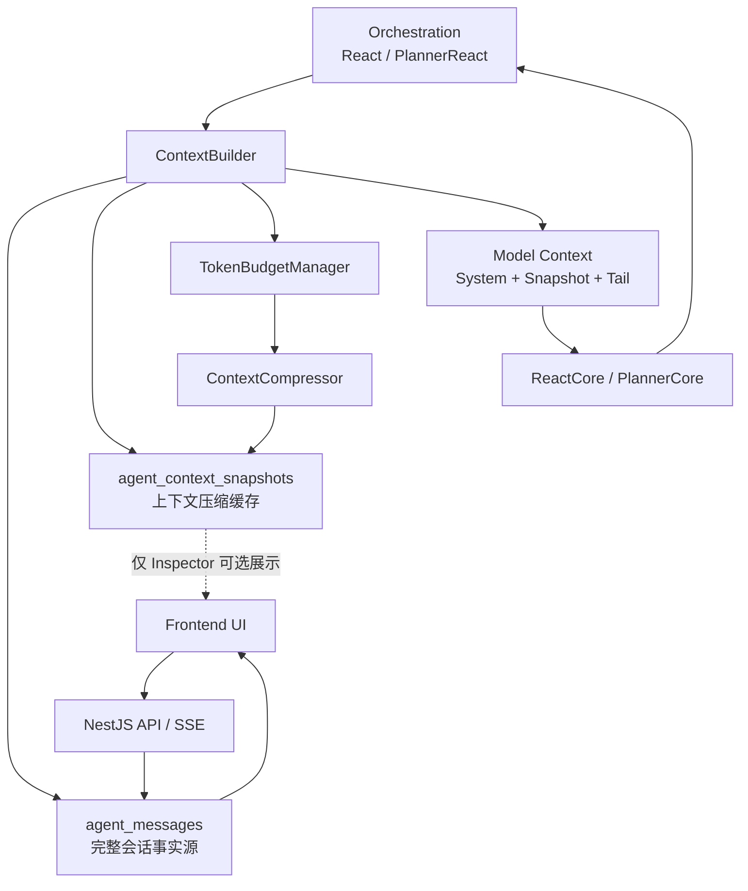
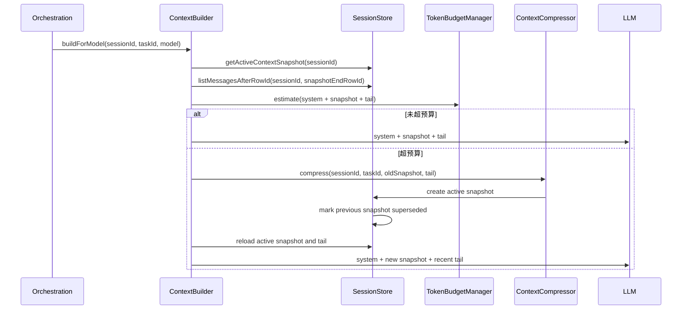
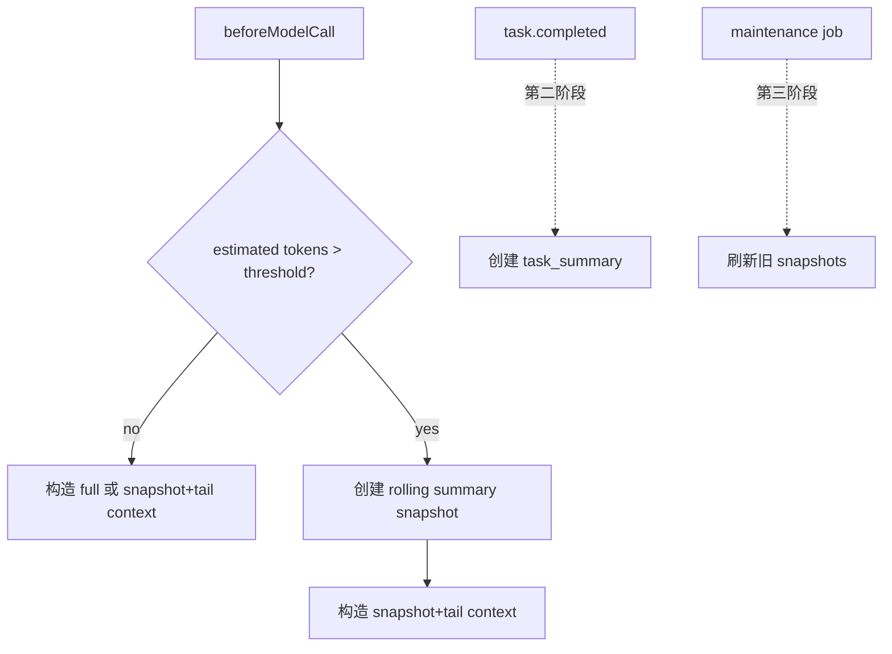

# Context Snapshots 与 Token 管理设计方案

## 目标

为 agent runtime 增加一层独立的上下文构建与压缩机制，让 **会话存储**、**前端 UI 渲染**、**模型上下文构建** 三件事彻底分开。

核心原则：

- `agent_messages` 是完整会话事实源，用于 UI、恢复、审计、回放。
- `agent_context_snapshots` 是派生出来的上下文摘要缓存，只服务于 `ContextBuilder`。
- 上下文压缩不能污染真实会话记录。
- UI 主对话永远不把 snapshot 当成一条 assistant message 展示。

## 非目标

第一版不做这些事：

- 不删除、不改写历史 `agent_messages`。
- 不把压缩摘要写回主会话流。
- 不实现长期记忆 `agent_memories`。
- 不新增独立的 planner 表。
- 不实现复杂的 tokenizer，先用近似 token 估算。

## 当前问题

目前 runtime 直接从 `agent_messages` 构造模型上下文。短会话没问题，但长会话会出现几个明显问题：

1. 会话变长后容易超过模型上下文窗口。
2. 如果把压缩摘要写回 messages，会污染 UI 和审计数据。
3. 普通对话、planner 状态、tool call/result、HITL 等内容需要不同保留策略。
4. 很难排查某次模型调用到底看到了哪些上下文。

## 总体架构



职责拆分：

- `agent_messages`：真实发生过的会话记录。
- `agent_context_snapshots`：旧上下文的压缩结果。
- `ContextBuilder`：构造模型真正看到的上下文。
- `TokenBudgetManager`：判断是否需要压缩。
- `ContextCompressor`：生成或刷新 snapshot。

## 存储设计

### 现有表：agent_messages

`agent_messages` 是唯一的 canonical message 表。排序依赖数据库分配的 `row_id`。

关键字段：

```sql
row_id bigint not null default nextval('agent_messages_row_id_seq')
id text primary key
session_id text not null references agent_sessions(id) on delete cascade
task_id text not null references agent_tasks(id) on delete cascade
role text not null
content text not null
created_at_ms bigint not null
channel text
tool_calls jsonb
tool_result jsonb
metadata jsonb
```

`row_id` 是全局递增，不是 session 内递增。读取某个 session 的时间线时，永远带上 `session_id`：

```sql
select *
from agent_messages
where session_id = $1
order by row_id asc;
```

读取某个 snapshot 之后的 tail messages：

```sql
select *
from agent_messages
where session_id = $1
  and row_id > $2
order by row_id asc;
```

### 新增表：agent_context_snapshots

```sql
create table if not exists agent_context_snapshots (
  id text primary key,

  session_id text not null references agent_sessions(id) on delete cascade,
  task_id text references agent_tasks(id) on delete set null,

  kind text not null,
  status text not null,

  source_row_id_start bigint not null,
  source_row_id_end bigint not null,

  base_snapshot_id text references agent_context_snapshots(id) on delete set null,
  supersedes_snapshot_id text references agent_context_snapshots(id) on delete set null,

  summary text not null,
  summary_format text not null default 'markdown',

  source_message_count integer not null default 0,
  source_token_count integer,
  summary_token_count integer,

  model text,
  compression_prompt_version text not null,

  checksum text,
  metadata jsonb,

  created_at_ms bigint not null,
  updated_at_ms bigint not null
);

create index if not exists idx_context_snapshots_session_active
  on agent_context_snapshots(session_id, status, source_row_id_end desc);

create index if not exists idx_context_snapshots_session_range
  on agent_context_snapshots(session_id, source_row_id_start, source_row_id_end);

create index if not exists idx_context_snapshots_task
  on agent_context_snapshots(task_id);
```

字段说明：

- `kind`：snapshot 类型。第一版只创建 `rolling_summary`。
- `status`：`active`、`superseded`、`failed`。
- `source_row_id_start`：这个 snapshot 覆盖的第一条 message 的 `row_id`。
- `source_row_id_end`：这个 snapshot 覆盖的最后一条 message 的 `row_id`。
- `base_snapshot_id`：滚动压缩时引用的上一个 snapshot。
- `supersedes_snapshot_id`：本 snapshot 替换掉的旧 active snapshot。
- `summary`：最终喂给模型的压缩摘要。
- `checksum`：可选，用来判断重复压缩或过期摘要。

约束：同一个 session 同时最多只有一个 active rolling summary。

```sql
create unique index if not exists uniq_context_snapshots_active_rolling
on agent_context_snapshots(session_id)
where kind = 'rolling_summary'
  and status = 'active';
```

### 后续可选表：agent_context_builds

这张表用于排查“某次模型调用到底用了哪些上下文”。不是 MVP 必须。

```sql
create table if not exists agent_context_builds (
  id text primary key,

  session_id text not null references agent_sessions(id) on delete cascade,
  task_id text references agent_tasks(id) on delete set null,
  snapshot_id text references agent_context_snapshots(id) on delete set null,

  included_row_id_start bigint,
  included_row_id_end bigint,

  model text,
  max_context_tokens integer not null,
  reserved_output_tokens integer not null,

  estimated_input_tokens integer,
  actual_input_tokens integer,
  actual_output_tokens integer,

  strategy text not null,
  metadata jsonb,

  created_at_ms bigint not null
);
```

`strategy` 可选值：

- `full`
- `snapshot_tail`
- `compressed_then_snapshot_tail`
- `tail_only_fallback`

## Snapshot 内容结构

第一版使用 markdown。原因是：

- 便于人工查看。
- 便于模型理解。
- 后续可以平滑升级为 JSON。

模板：

```md
## Conversation Summary

## User Goal

## User Preferences

## Completed Work

## Active Plan

## Tool Results

## Open Questions

## Constraints
```

Planner 场景下，需要保留结构化计划信息：

```md
## Active Plan
- plan_id: plan_xxx
- status: running
- current_step_id: step_2

### Steps
1. completed - ...
2. running - ...
3. pending - ...
```

工具密集型场景下，snapshot 要保留：

- 工具名。
- 关键参数。
- 关键结果。
- 来源 URL。
- 文件路径。
- 错误信息。

但不应该保留所有原始 tool payload，除非这些 payload 对当前任务仍然必要。

## Token 预算策略

新增配置：

```ts
export interface TokenBudgetConfig {
  maxContextTokens: number;
  reservedOutputTokens: number;
  compressionTriggerRatio: number;
  minTailMessages: number;
  minTailTokens: number;
  maxSnapshotTokens: number;
}
```

推荐默认值：

```ts
export const DEFAULT_TOKEN_BUDGET: TokenBudgetConfig = {
  maxContextTokens: 32000,
  reservedOutputTokens: 4000,
  compressionTriggerRatio: 0.75,
  minTailMessages: 12,
  minTailTokens: 4000,
  maxSnapshotTokens: 3000,
};
```

计算方式：

```txt
maxInputTokens = maxContextTokens - reservedOutputTokens
compressionThreshold = maxInputTokens * compressionTriggerRatio
```

第一版 token 估算可以先用近似算法：

```txt
estimatedTokens = ceil(characterCount / 3)
```

估算器必须封装在 `TokenEstimator` 后面，后续可以替换成模型专用 tokenizer。

## Context 构建流程



## 压缩选择规则

压缩只处理较旧的消息，最近 tail 必须保留。

硬规则：

1. system prompt 不能被压缩掉。
2. 当前用户输入不能被压缩掉。
3. pending HITL request 不能被压缩掉。
4. assistant `tool_calls` 与对应 tool result 必须成对保留或成对压缩。
5. 当前 planner step 状态必须以结构化方式保留。
6. failed tool result 可以被摘要，但 tool name 和 error message 必须保留。
7. 如果压缩失败，runtime 降级使用最近 tail，并记录 failed snapshot。

## 压缩触发点



MVP 只实现 `beforeModelCall`。

## Runtime 接入方式

`ReactAgent` 和 `PlannerReactAgent` 不应该再直接调用：

```ts
contextBuilder.build(messages)
```

模型调用前应该统一调用 session-aware API：

```ts
contextBuilder.buildForModel({
  sessionId,
  taskId,
  model,
  systemPrompt,
  budget,
});
```

返回值：

```ts
export interface BuiltModelContext {
  messages: BaseMessage[];
  snapshot?: AgentContextSnapshot;
  includedRowIdStart?: number;
  includedRowIdEnd?: number;
  estimatedTokens: number;
  strategy: 'full' | 'snapshot_tail' | 'compressed_then_snapshot_tail' | 'tail_only_fallback';
}
```

## UI 行为

主对话 UI 仍然只读取：

- `agent_sessions`
- `agent_tasks`
- `agent_messages`
- `agent_input_requests`

Snapshots 不作为主对话消息渲染。

未来 Inspector 抽屉可以展示：

- active snapshot 覆盖范围。
- summary token 数量。
- 压缩策略。
- 最近一次 context build。
- snapshot 原始 markdown。

这样可以保持“用户看到的会话”和“模型看到的上下文”清晰分离。

## 失败模式

### 压缩模型调用失败

写入 failed snapshot：

```txt
kind = rolling_summary
status = failed
metadata.error = ...
```

然后使用 `tail_only_fallback`。除非 tail 本身也超过模型窗口，否则 task 应继续运行。

### Snapshot 并发冲突

同一个 session 目前已经限制同时只能有一个 active root task。但 snapshot 写入仍应使用事务：

1. 读取当前 active snapshot。
2. 插入新的 active snapshot。
3. 把旧 snapshot 标记为 `superseded`。
4. 依赖 `uniq_context_snapshots_active_rolling` 防止重复 active snapshot。

### Tool Call / Tool Result 被切开

如果压缩边界切开了 assistant tool call 与对应 tool result，需要向前或向后调整边界，直到 pair 完整。

## 未来扩展

### Long-Term Memory

后续可以增加 `agent_memories`：

```sql
create table agent_memories (
  id text primary key,
  session_id text references agent_sessions(id) on delete cascade,
  user_id text,
  kind text not null,
  content text not null,
  confidence numeric,
  source_snapshot_id text references agent_context_snapshots(id) on delete set null,
  metadata jsonb,
  created_at_ms bigint not null,
  updated_at_ms bigint not null
);
```

Memory extraction 应该是 snapshot 之后的显式阶段，不放进 MVP。

### RAG / Retrieval

未来 `ContextBuilder` 可以合并：

- active snapshot
- recent tail
- retrieved file chunks
- retrieved web citations
- user memory

这些内容应该分 section 进入 context，不要全部糊成一段 summary。

### Planner 表

Planner 状态后续可以迁移到：

```txt
agent_plans
agent_plan_steps
```

这样计划更新、步骤状态推进、UI 渲染会更清楚。当前 snapshot 方案不依赖这两张表。

### Context Build 审计

MVP 之后增加 `agent_context_builds`，记录每次模型调用使用的 snapshot 和 row range。

## 测试要求

必须覆盖：

- 超过 token budget 时创建 active snapshot。
- 未超过 token budget 时不创建 snapshot。
- 新 active snapshot 会替换旧 active snapshot。
- 同一 session 只有一个 active rolling summary。
- 压缩后使用 `snapshot + tail` 构造 context。
- assistant tool call 与 tool result 不被拆开。
- 压缩失败时能降级运行。
- UI session view 不把 snapshot 当聊天消息展示。
- `row_id` 排序保持稳定。

