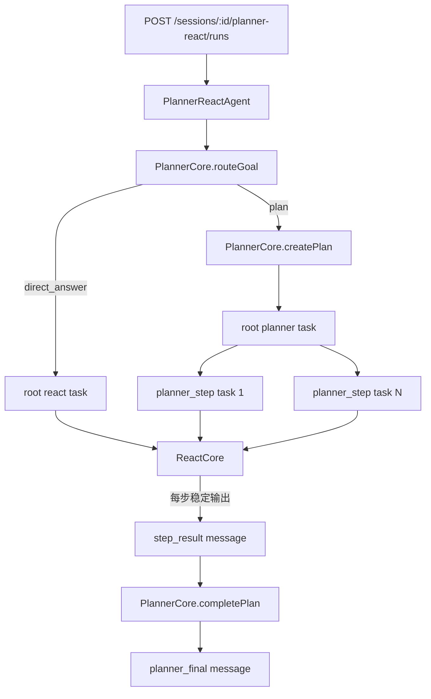
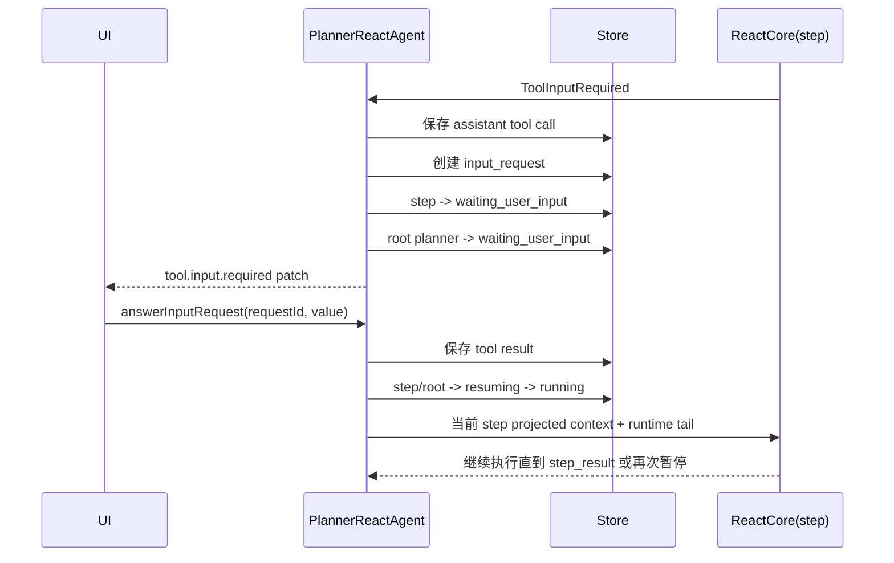

# 独立 Planner + ReAct 唯一编排设计

## 1. 目标

普通 Agent 只保留一条运行入口：`PlannerReactAgent`。

- 简单请求由 Planner 路由后直接交给一次普通 ReAct task。
- 复杂请求由 Planner 生成计划，再由编排层逐个创建并推进 `planner_step` task。
- 每个 step 内部仍由通用 `ReactCore` 执行工具循环。
- Code Agent 保持独立，不进入本次改造。
- 删除让 ReAct 模型自行调用 `create_plan / update_plan / set_plan_step_status` 的 planner-as-tool 路径。

核心边界是：Planner 决定任务结构和步骤推进，ReAct 只负责执行一个明确目标。`ReactCore` 不读取计划、不改变计划状态，也不负责创建子任务。

## 2. 唯一架构



### 2.1 模块职责

| 模块 | 职责 | 不负责 |
| --- | --- | --- |
| `PlannerCore` | 路由、创建结构化计划、基于 step results 生成最终答案 | 会话持久化、任务状态、工具执行 |
| `PlannerReactAgent` | 创建任务树、持久化消息、推进步骤、HITL 暂停与恢复、发送 UI patch | 具体模型协议、工具实现 |
| `ReactCore` | 执行单个 ReAct loop，产出 core events | session/task/plan 状态 |
| `PlannerContextProjection` | 为 route/create/step/final 构建目的明确的 LangChain messages | 直接写数据库 |
| `AgentSessionStore` | 保存 session、task、message、input request、context usage | 编排决策 |

## 3. 任务树与数据归属

### 3.1 简单请求

```text
session
└── task(kind=react, executor=react)
    ├── user message
    ├── assistant/tool runtime messages
    └── assistant final message
```

路由判断本身作为一次内部模型调用记录到 `agent_context_builds`，但不额外创建 UI task，不向 `agent_messages` 写一份可见的“路由回答”。

### 3.2 复杂请求

```text
session
└── root task(kind=planner, executor=planner)
    ├── user goal
    ├── plan message
    ├── child task(kind=planner_step, executor=react, stepId=step_1)
    │   ├── internal step input
    │   ├── assistant/tool runtime messages
    │   └── step_result
    ├── child task(kind=planner_step, executor=react, stepId=step_2)
    │   └── ...
    └── planner_final
```

`parentTaskId` 建立 root 与 step 的关系，`task.metadata.stepId` 建立 step task 与计划步骤的关系。UI 可按 `taskId/parentTaskId/stepId` 聚合，也可以按 `rowId` 平铺。

计划本身继续作为 `agent_messages` 中的结构化 assistant message 保存：

- `messageKind = plan`
- `visibility = ui`
- `metadata.plan` 保存计划快照
- 计划更新时新增 `plan_update` message，不覆盖历史消息

## 4. 运行流程

### 4.1 新任务

1. API 只创建/调用 `PlannerReactAgent`。
2. 编排器校验同一 session 没有另一个 active root task。
3. `PlannerCore.routeGoal()` 返回 `direct_answer` 或 `plan`。
4. `direct_answer`：创建一个 `react` root task，执行普通 ReAct。
5. `plan`：创建 `planner` root task，调用 `createPlan()` 并持久化 plan message。
6. 编排器顺序推进 plan steps；每个 step 创建独立 `planner_step` child task。
7. step 内由 `ReactCore` 循环执行，编排器把 core events 原样映射成当前 step task 的 session messages/patches。
8. step 必须产出 `step_result` 后才能标记 completed 并推进下一步。
9. 所有 step 完成后，`PlannerCore.completePlan()` 只读取用户目标、plan 与 step results，生成唯一 `planner_final`。
10. root planner task 标记 completed。

### 4.2 Step 完成协议

Planner step 使用内部工具 `submit_step_result`，但该工具只在 step execution 的 tool set 中注入。

- 普通 runtime tools 不暴露 `submit_step_result`。
- 模型调用 `submit_step_result({ summary, evidence, artifacts })` 后，工具结果保持 OpenAI tool call/tool result 配对。
- 编排层把结构化结果另存为 `messageKind = step_result` 的 assistant message。
- 只有存在有效 `step_result`，step task 才能进入 `completed`。
- 单纯得到某个普通工具结果或模型停止输出，不代表 step 完成。

## 5. HITL 暂停与恢复

暂停归属当前 `planner_step` child task，而不是丢失整个计划状态。



恢复时通过 `request.taskId` 定位 child step task，通过 `parentTaskId` 定位 planner root，通过 `task.metadata.stepId` 定位计划步骤。只有当前 step 的所有 pending input requests 都已回答，才重新进入 ReAct loop。

进程重启后不依赖内存中的 generator 或 promise。恢复所需状态全部来自数据库：task tree、plan message、current step runtime tail、input requests 和 tool result。

## 6. Context Projection

持久化 timeline 是完整审计日志，但传给 LangChain 的 messages 必须按调用目的投影，不能直接吞完整 session。

### 6.1 Route Context

- Planner router system prompt
- 当前日期/时区
- 当前用户输入
- 必要的可见会话摘要

不包含历史 ReAct system prompt、工具调用和 step runtime。

### 6.2 Plan Create Context

- Planner system prompt
- 当前日期/时区
- 用户原始目标
- 必要的可见会话摘要

### 6.3 Step ReAct Context

- 单份 ReAct system prompt
- 当前日期/时区
- 用户原始目标
- 当前 plan 摘要
- 已完成 steps 的 `step_result`
- 当前 step instruction
- 当前 step runtime tail（仅恢复及 tool call/result 连续性需要）

不得包含其他 steps 的 system prompt、assistant 过程消息、tool calls 或 tool results。

### 6.4 Final Context

- Planner final system prompt
- 用户原始目标
- plan
- 按 step 顺序排列的 `step_result`

最终汇总不读取 raw step runtime，避免把失败搜索、模型自我修正和中间错误混入交付结果。

## 7. API 与入口

普通 Agent 的服务端入口统一为：

```text
POST /sessions/:sessionId/planner-react/runs
```

兼容期内 `POST /react/runs` 可以转发到同一 `PlannerReactAgent`，但不能实例化另一种 agent。前端普通 Agent 页面只调用一个接口。

HITL 回答入口保持：

```text
POST /sessions/:sessionId/input-requests/:requestId/answer
```

服务层根据 input request 对应 task 的 `kind` 决定恢复方式：

- `planner_step`：恢复 `PlannerReactAgent` 的当前 step。
- `react`：恢复 `PlannerReactAgent` 的 direct ReAct task。
- `code`：交给 `CodeAgent`。

## 8. 删除范围

以下能力从普通 Runtime 工具集中删除：

- `create_plan`
- `update_plan`
- `set_plan_step_status`
- `createPlannerTools()`
- `ReactAgent` 中解析 planner tool result、复制 plan message、查找 running plan step 的代码
- 系统提示词中“Planner 是工具能力”的说明

以下能力保留：

- `submit_step_result`，但只注入 planner step execution
- `request_user_input`
- 通用浏览器、文件、artifact、基础工具
- plan/plan_update/step_result/planner_final 等持久化消息类型与 UI projection

## 9. 错误处理

- Router 返回非法结构：root task 失败，不默认猜测为计划任务。
- Planner 返回空步骤或重复 step id：拒绝计划并标记 root failed。
- Step ReAct 无事件结束：step failed，root failed。
- Step 没有 `step_result` 就退出：step failed，不推进下一步。
- 普通工具失败：作为 tool result 回填，允许当前 step 的 ReAct 自我修正。
- HITL 等待：不是失败，不推进步骤，也不触发 final synthesis。
- Final synthesis 失败：steps 保持 completed，root planner 标记 failed，允许从 finalization 阶段恢复，不能重跑已完成 steps。

## 10. 测试边界

必须覆盖：

1. 简单请求只创建一个 `react` root task，不创建 planner/step task。
2. 复杂请求创建一个 planner root 和按计划数量创建 step children。
3. 每个 step 只有在持久化 `step_result` 后才 completed。
4. Step context 不泄漏其他 steps 的 runtime messages。
5. Final context 只包含 plan 与 step results。
6. Step 内多个工具调用保持 assistant tool calls 与所有 tool results 配对。
7. Step HITL 后 root/child 同时 waiting，回答全部请求后恢复同一个 step。
8. 进程重启式恢复只依赖 store 状态。
9. 一个 session 同时只能有一个 active root task。
10. 普通 runtime tools 不再包含 planner-as-tool 三个工具。
11. UI view 可同时返回平铺 timeline 与按 planner step 聚合的 projection。
12. 全量 build、unit tests、Postgres store tests 与 HTTP tests 通过。

## 11. 最终目录边界

```text
src/
├── core/
│   ├── react/
│   └── planner/
│       └── planner-core.ts
├── orchestration/
│   ├── planner-react-agent.ts
│   ├── planner-context-projection.ts
│   ├── react-agent.ts
│   └── code-agent.ts
├── tools/
│   ├── planner-step-tools.ts
│   └── ...general/code tools
├── storage/
├── context/
├── view/
└── server/
```

`ReactAgent` 继续作为可复用的单任务编排单元存在，但普通 Agent HTTP 入口不直接选择它；`PlannerReactAgent` 在 direct 模式下复用相同的 ReAct 持久化协议，在 plan 模式下管理 task tree。

## 12. 验收标准

- 项目中不存在 `create_plan/update_plan/set_plan_step_status` 的运行时注册和处理逻辑。
- 普通 Agent 请求全部进入 `PlannerReactAgent`。
- `PlannerReactAgent` 仍支持 direct answer，不会强制所有请求创建 plan。
- 复杂任务的 plan、step 状态、step 内消息/tool calls、HITL 和 final output 均可持久化并在刷新后恢复。
- Planner create/step/final 的 LangChain messages 符合本规格的 projection contract。
- 不修改 `ReactCore` 的 planner 特定逻辑；`ReactCore` 仍是通用执行循环。
