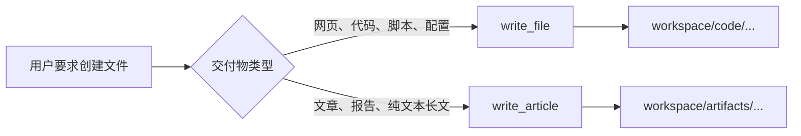

# Workspace 工具路由边界设计

## 背景

当前 `write_article` 支持 HTML，且描述包含 document；`write_file` 只描述为通用文件写入。模型因此可能把“创建 HTML 网页”误判为文章产物，将文件写入 `workspace/artifacts`，而不是通过文件系统工具写入 `workspace/code`。

## 目标

- 网页、应用、脚本和其他源代码始终通过 `write_file` 写入 Session sandbox。
- `write_article` 只负责非代码的长文本产物。
- Direct Job 与 Planned Job 使用相同的工具路由规则。
- 不根据 `projectId` 创建独立工作区；继续使用 Session 共享的分类 workspace。

## 工具边界

### `write_file`

- 负责 HTML、CSS、JavaScript、TypeScript、配置、脚本及其他代码文件。
- 代码交付物使用 `code/` 下的 workspace 相对路径，例如 `code/index.html`。
- 继续由 `resolveWorkspacePath` 校验路径，禁止绝对路径和越过 Session sandbox。
- 仍可按显式需求写入 `docs/`、`artifacts/`、`downloads/` 或 `tmp/`，但代码类任务默认并强制使用 `code/`。

### `write_article`

- 只负责文章、报告和纯文本长文。
- 输出位置保持为 `workspace/artifacts`。
- 格式收紧为 `markdown | text`，移除 `html`，从 Schema 层消除网页代码的语义重叠。
- 描述明确声明：不得用于网页、源代码或可执行项目文件。

## 提示词规则

新增一条可复用的 workspace 工具路由指令，并同时用于：

1. Direct Job 的正式执行系统提示词。
2. Planned Job 的 Step 执行系统提示词。
3. Planner 的计划生成提示词。

规则内容：网页、应用、脚本和源代码必须使用文件系统工具，并写入 `code/`；`write_article` 只用于非代码长文本。

由于系统提示词语义发生变化，运行时系统提示词版本从 `runtime-system-v1` 提升为 `runtime-system-v2`，保证 Context manifest 和模型调用审计能识别规则版本。

## 执行流程

## 错误处理

- 模型若仍向 `write_article` 传入 `format: html`，LangChain Schema 校验将产生 `invalid_tool_arguments`。
- 该失败按“工具执行前失败”持久化为匹配的 ToolMessage，工具不会被执行。
- ReAct loop 可以读取错误并改用 `write_file`，不会升级为存储故障或直接破坏 Job。

## 测试与验收

- 工具清单测试确认 `write_article` 的格式枚举不再包含 `html`。
- 工具描述测试确认两个工具的代码/文档边界清晰且不重叠。
- `write_article` 的 Markdown 写入测试继续通过。
- `write_file` 写入 `code/index.html`，并验证文件确实位于当前 Session 的 sandbox workspace。
- Context/系统提示词测试确认 Direct 与 Step 执行都包含相同路由规则，版本为 `runtime-system-v2`。
- 完整单元测试、PostgreSQL 集成测试、TypeScript 构建全部通过。

## 非目标

- 不增加新的 `write_code` 工具。
- 不按任务动态删减工具列表。
- 不改变 Session workspace 的目录结构。
- 不迁移或改写历史上已经生成的 artifact 文件。
