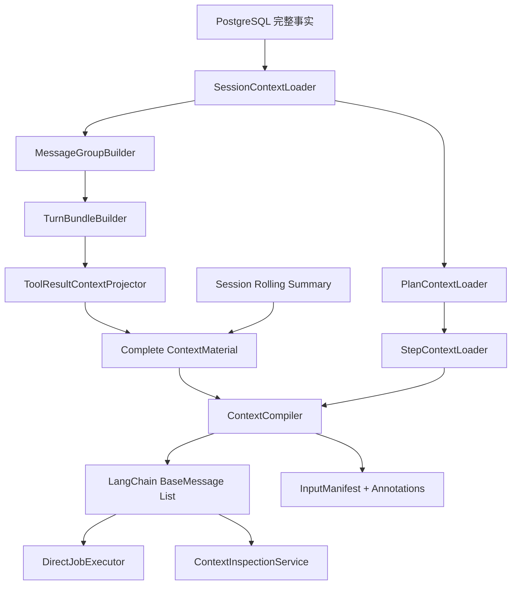

# 完整 Session + Plan Context 设计（修订版）

## 1. 结论

Runtime 必须把“完整持久化事实”和“每次发送给模型的活跃上下文”分开：

- PostgreSQL 永久保存完整 Session、Job、Plan、PlanStep、StepRun、Message、ToolInvocation、StepOutput、PlanFinal 和 ModelCall。
- Context Loader 每次从数据库加载完整事实，不提前丢数据。
- Context Projector 将事实组织为有语义的 MessageGroup 和连续 TurnBundle。
- Context Compiler 只发送固定运行上下文、旧历史摘要、最近完整 TurnBundle 和当前输入。
- 原始工具结果留在数据库；模型可见 ToolMessage 有独立 Token 限额。
- Context Preview 展示与正式模型调用相同的 LangChain Messages 和选择依据。

目标结构：

```text
固定运行上下文
+ Session Rolling Summary（可选）
+ 最近若干个完整 TurnBundle
+ 当前 HumanMessage
```

这不是“永远把数据库所有数据逐字发送给模型”。完整指数据库事实和 ContextMaterial 完整；活跃模型输入必须在连续语义边界上压缩。

## 2. 设计依据与取舍

### 2.1 Codex 可借鉴部分

Codex 使用 Thread → Turn → Item 组织持久历史，Plan、命令执行和文件修改都是可独立消费的 Item；历史压缩会生成 replacement history，并重新注入当前有效的初始上下文。它还为工具输出提供独立 Token 限制。

可借鉴：

- Turn 是压缩和保留的连续边界。
- 固定指令与会话历史分离，压缩后重新注入。
- 工具输出单独限额，不等待整个上下文溢出。
- compaction 是显式事件，可观测。

不直接照搬：Codex 的本地压缩更偏向保留用户消息与摘要，适合连续编码任务，但不能满足本 Runtime 对 Plan/StepRun 的精确追问与审计需求。

### 2.2 OpenCode 可借鉴部分

OpenCode 的压缩策略接近“较早 head 摘要 + 最近完整 tail turns”，并可选裁剪较旧的 completed tool output。

可借鉴：

- 保留最近完整 Turn，而不是从历史中零散选消息。
- 工具输出裁剪发生在完整 Session 压缩之前。
- 摘要是持久事实的一种投影，原始消息仍可恢复。

不直接照搬：OpenCode 的 Message/Part 模型没有本 Runtime 的独立 Job、Plan、PlanStep、StepRun 和结构化 StepOutput，不能只依赖自由文本摘要。

### 2.3 本 Runtime 的最终选择

使用四层结构：

```text
Database Facts
  → MessageGroup
  → TurnBundle
  → Compiled LangChain Messages
```

数据库实体负责恢复和审计；MessageGroup 保证 Tool 协议原子性；TurnBundle 保证对话与 Planned Job 的连续性；Compiler 负责预算与格式化。

## 3. 冻结边界

本次不修改：

- 数据库 schema；
- Plan、PlanStep、StepRun、Message、ToolInvocation 的现有落库字段；
- createPlan → createStepRun → ReAct → commitStepOutput → finalize 的顺序；
- RuntimeEventWriter 和 SSE 事件类型、事件提交顺序；
- PlanFinalizer 只消费 original goal、final Plan 和 validated StepOutputs 的规则；
- LangChain 作为 Message、ToolCall、ToolMessage、ModelProvider 和 invoke/stream 桥接层。

允许修改：

- 只读 Loader 查询范围；
- Context 内部类型和投影；
- InputManifest JSON 字段；
- ContextSummary 的现有 JSON/metadata 内容；
- Context Preview 调试 DTO；
- Context rules version。

## 4. Context 类型边界

### 4.1 下一轮普通对话 / Direct Job

```text
Runtime Policy SystemMessage
Runtime Environment SystemMessage（存在时）
Session Rolling Summary（存在时）
最近完整 TurnBundle[]
当前 Job HumanMessage（正式执行时位于最后）
```

`next_turn` 预览不包含尚未提交的输入框草稿。Direct Job 的正式输入必须等于 `next_turn` 历史前缀加上已经落库的当前 HumanMessage。

### 4.2 StepRun 执行

```text
Step Runtime SystemMessage
Runtime Environment SystemMessage
Current Immutable PlanDefinition SystemMessage
Session Baseline Summary（存在时）
最近完整历史 TurnBundle[]
当前 Planned Job 原始 HumanMessage
当前 Plan 已产生的完整 StepExecutionBundle[]
Current Step Instruction SystemMessage（最后一条）
```

当前 Plan 的历史 `plan_created` AIMessage 不重复加入当前 Plan 执行上下文；当前 PlanDefinition 作为执行控制信息放在 SystemMessage。此前已完成 Planned Job 的 PlanDefinition 仍属于历史 AIMessage。

### 4.3 Plan Final

```text
Plan Finalizer SystemMessage
Original HumanMessage
Immutable Final PlanDefinition
按 PlanStep.position 排序的全部 validated StepOutput
```

PlanFinalizer 不加载原始网页正文、工具结果、未验证草稿或普通 Session 历史。

### 4.4 ModelCall Inspection

根据 `agent_model_calls.context_rules_version` 选择对应投影版本，再使用 InputManifest 和 InputChecksum 验证。不能用最新规则伪装重建旧调用。

## 5. 完整数据库事实

`SessionContextLoader` 读取：

```text
listSessionJobs
listSessionMessages
listSessionToolInvocations
listSessionPlans
listSessionPlanSteps
listJobStepRuns（对 Session 内 Job 并行读取）
listActiveContextSummaries(session, conversation, rulesVersion)
```

返回：

```ts
interface SessionContextFacts {
  jobs: AgentJob[];
  messages: AgentMessage[];
  invocations: AgentToolInvocation[];
  plans: AgentPlan[];
  steps: AgentPlanStep[];
  stepRuns: AgentStepRun[];
  summaries: AgentContextSummary[];
  blocked: BlockedMessageGroup[];
}
```

Loader 只读取、排序、建立索引和验证外键关系，不做 Token 选择，不生成摘要，不调用模型。

## 6. MessageGroup：最小协议原子单元

```ts
type MessageGroup =
  | SingleMessageGroup
  | ToolExchangeGroup
  | PlanDefinitionGroup
  | StepOutputGroup
  | PlanFinalGroup;
```

### 6.1 SingleMessageGroup

普通 HumanMessage、AIMessage、用户可见错误等单消息事实。

### 6.2 ToolExchangeGroup

```ts
interface ToolExchangeGroup {
  id: `tool_exchange:${string}`;
  type: 'tool_exchange';
  callMessage: AgentMessage;
  invocations: AgentToolInvocation[];
  resultMessages: AgentMessage[];
  refs: RuntimeRefs;
}
```

约束：

- 一个 AI tool_call message 与该消息中的全部 ToolCall/ToolResult 一起选择或一起丢弃。
- completed/failed ToolInvocation 必须有匹配 ToolMessage。
- pending/running/waiting 的工具组不能进入下一轮普通上下文。
- ToolMessage 即使被内容裁剪也不能被删除。

### 6.3 PlanDefinitionGroup

```ts
interface PlanDefinitionGroup {
  id: `plan_definition:${string}`;
  type: 'plan_definition';
  anchorMessage: AgentMessage;
  plan: AgentPlan;
  steps: AgentPlanStep[];
}
```

它锚定 `plan_created.row_id`，但模型可见内容从 `agent_plans + agent_plan_steps` 构造，不只使用 plan_created.content，也不依赖可能过时的 metadata.steps。

### 6.4 StepOutputGroup

```ts
interface StepOutputGroup {
  id: `step_output:${string}`;
  type: 'step_output';
  message: AgentMessage;
  plan: AgentPlan;
  step: AgentPlanStep;
  stepRun: AgentStepRun;
  output: StepOutputV1;
}
```

`output` 必须来自 `message.metadata.structuredOutput` 并通过现有 `parseStepOutput()`；不能从自由文本 content 重新猜测。

### 6.5 PlanFinalGroup

```ts
interface PlanFinalGroup {
  id: `plan_final:${string}`;
  type: 'plan_final';
  message: AgentMessage;
  plan: AgentPlan;
}
```

## 7. TurnBundle：上下文选择原子单元

TokenBudget 不再直接从 Session 历史里逐个挑 MessageGroup，而是选择完整 TurnBundle。

```ts
type TurnBundle = DirectTurnBundle | PlannedTurnBundle;

interface TurnBundleBase {
  id: string;
  sessionId: string;
  rootJobId: string;
  jobIds: string[];
  terminal: boolean;
  sourceRowIdStart: number;
  sourceRowIdEnd: number;
  groups: MessageGroup[];
}

interface DirectTurnBundle extends TurnBundleBase {
  type: 'direct_turn';
}

interface PlannedTurnBundle extends TurnBundleBase {
  type: 'planned_turn';
  planId: string;
}
```

### 7.1 DirectTurnBundle

```text
HumanMessage
零到多个 ToolExchangeGroup / AssistantMessage
最终 AIMessage 或用户可见错误
```

### 7.2 PlannedTurnBundle

```text
Original HumanMessage
Immutable PlanDefinitionGroup

Step 1 ToolExchangeGroup[]
Step 1 StepOutputGroup

Step 2 ToolExchangeGroup[]
Step 2 StepOutputGroup

...

PlanFinalGroup 或用户可见失败结果
```

### 7.3 Retry lineage

一个 retry chain 形成一个逻辑 TurnBundle：

- `rootJobId` 是最早的非 retry Job。
- `jobIds` 按 retry 顺序记录全部尝试。
- Human goal 只保留 `goalMessageId` 指向的 canonical 消息。
- 可保留先前失败尝试的用户可见错误和必要工具结果。
- 不重复相同 logical goal。
- 不能按 content 文本去重；两个内容相同但由用户分别发送的消息是两个独立 TurnBundle。

### 7.4 连续性约束

- Bundle 内的 groups 按 anchor rowId 排序。
- Bundle 只能整体进入活跃上下文、整体进入摘要源或整体被覆盖。
- 未终态的当前 Bundle 始终整体 mustKeep，不能进入 Session summary。
- 不允许保留 Step 1 和 Step 4、同时丢弃 Step 2/3。
- 不允许在 ToolCall/ToolResult、Step 工具历史/StepOutput、Plan/PlanFinal 中间建立摘要边界。

## 8. 模型可见的稳定内容

DashScope 通过 OpenAI-compatible LangChain provider 调用。为避免 provider 对自定义字段兼容不一致，模型语义使用稳定 JSON 字符串；调试字段通过 annotation 单独返回。

### 8.1 Immutable PlanDefinition

```json
{
  "kind": "plan_definition",
  "schemaVersion": 1,
  "id": "plan_1",
  "title": "调查并撰写报告",
  "goal": "调查萧山机场 UFO 事件并写报告",
  "steps": [
    {
      "id": "step_1",
      "position": 0,
      "title": "收集资料",
      "instruction": "搜索可靠信息来源"
    }
  ]
}
```

模型可见 PlanDefinition 不包含 `plan.status`、`step.status`、`currentStepId`、`runNo` 等可变状态。原因：状态在后续执行中会变化，使用当前数据库状态无法精确重建历史 ModelCall。

动态状态只存在于：

- 当前 Step Instruction；
- StepOutput/PlanFinal 事实；
- Preview annotation；
- UI View。

### 8.2 Step ToolCall

```ts
new AIMessage({
  content: canonicalJson({
    kind: 'step_tool_call',
    planId,
    stepId,
    stepRunId,
    position,
    title,
    assistantContent: originalContent,
  }),
  tool_calls: originalToolCalls,
});
```

非 Step 工具调用保留原始 content。ToolCall 参数始终使用 LangChain 原生 `tool_calls`。

### 8.3 StepOutput

```json
{
  "kind": "step_output",
  "schemaVersion": 1,
  "planId": "plan_1",
  "stepId": "step_1",
  "stepRunId": "run_1",
  "position": 0,
  "title": "收集资料",
  "output": {
    "summary": "已完成资料收集",
    "artifacts": [],
    "evidence": [],
    "unresolved": []
  }
}
```

### 8.4 PlanFinal

```json
{
  "kind": "plan_final",
  "schemaVersion": 1,
  "planId": "plan_1",
  "answer": "最终回复原文"
}
```

## 9. ToolResult Context Projection

### 9.1 三份形态

```text
数据库 ToolResult     完整、不可变、用于恢复与 UI 详情
View ToolResult       可按需分页或展开完整内容
Model ToolMessage     受 toolOutputTokenLimit 控制
```

### 9.2 默认限额

新增 ContextModelBudget 配置：

```ts
interface ContextModelBudget {
  provider: string;
  name: string;
  maxContextTokens: number;
  reservedOutputTokens: number;
  toolOutputTokenLimit: number;       // 默认 8_000
  minRecentTurnBundles: number;       // 默认 2
  compressionTriggerRatio: number;    // 默认 0.70
}
```

单个 ToolResult 超过 `toolOutputTokenLimit` 时，数据库不变，Model ToolMessage 使用确定性 envelope：

```json
{
  "truncated": true,
  "originalEstimatedTokens": 32000,
  "checksum": "sha256:...",
  "head": "保留内容前 60%",
  "tail": "保留内容后 40%",
  "artifactRef": "可选的完整内容引用"
}
```

规则：

1. 先按字符边界生成 head/tail，再按统一 Token estimator 校验不超限。
2. `tool_call_id`、tool name 和 ToolMessage 始终保留。
3. HITL answer、文件写入收据、事务 commit 结果等关键小输出可配置 `retain: full`。
4. 保护策略是 Context 配置，不修改 LangChain Tool 定义。
5. InputManifest 记录发生过 model-facing truncation 的 result message id。

## 10. Session Rolling Summary

现有 `agent_context_summaries` 已支持：

```text
owner_type = session
owner_id = session_id
purpose = conversation
summary_type = rolling
summary_format = json
```

不新增表。

### 10.1 Summary JSON

```ts
interface SessionRollingSummaryV1 {
  schemaVersion: 1;
  sourceBundleIds: string[];
  goals: string[];
  activeConstraints: string[];
  conversationDecisions: Array<{
    topic: string;
    decision: string;
  }>;
  completedPlans: Array<{
    plan: ImmutablePlanDefinition;
    stepOutputs: StepOutputV1[];
    artifacts: Array<{ type: string; ref: string; label?: string }>;
    finalAnswer?: string;
    unresolved: Array<{
      description: string;
      impact: string;
      recommendedAction: string;
    }>;
  }>;
  failedAttempts: Array<{
    rootJobId: string;
    errorCode?: string;
    summary: string;
  }>;
  openIssues: string[];
}
```

### 10.2 Summary source

- 只选择完整且连续的历史 TurnBundle 前缀。
- 当前 TurnBundle 永不进入 Session rolling summary。
- 至少保留最近 `minRecentTurnBundles` 个完成态 Bundle 原文；如果预算不够则尽量保留最近一个。
- 固定 Runtime Policy、Environment、Tool Schema、当前时间、权限规则不进入 summary source。
- PlannedTurn 的摘要优先使用 PlanDefinition、validated StepOutputs、Artifacts、PlanFinal；原始工具结果只用于补充 StepOutput 没有覆盖的事实，并先应用 ToolResult context limit。
- 新 rolling summary 覆盖旧 summary 和新的连续 Bundle 前缀，写入 parent/replaces 关系。

### 10.3 触发条件

任一满足则建议压缩：

- candidate context 超过 safe input limit 的 70%；
- 可压缩历史 Bundle 数达到配置阈值；
- 单个旧 PlannedTurnBundle 经过 ToolResult 裁剪后仍显著占用上下文。

压缩失败时保留旧 active summary，不覆盖为失败内容；正式 Job 根据剩余预算继续选择最近 Bundle，仍超限则返回明确 `context_overflow`。

## 11. 固定上下文重新注入

以下内容在每次正式构建时重新生成：

```text
Runtime System Prompt
当前时间与时区
Sandbox / Workspace
Tools schema
权限与运行规则
当前 Step Instruction
```

它们不属于 Session 历史，不能进入 rolling summary，也不能被旧 summary 复制。这样避免出现“新规则 + 摘要里的旧规则”重复或冲突。

Context fixedPrefix checksum 基于本次实际注入内容计算。

## 12. ContextCompiler 选择算法

### 12.1 输入

```ts
interface ContextMaterial {
  fixedMessages: ContextFixedMessage[];
  trailingMessages?: ContextFixedMessage[];
  fixedPrefix: Record<string, unknown>;
  summaries: ContextSummaryMaterial[];
  bundles: ContextBundleMaterial[];
  toolSchemas: StructuredToolInterface[];
  model: ContextModelBudget;
  audit: ContextAudit;
  compression: ContextCompressionPolicy;
}
```

### 12.2 编译顺序

1. 格式化 fixed messages。
2. 计算 Tool Schema Token。
3. 格式化 active Session summary。
4. 对 Bundle 内 ToolResult 应用 model-facing output limit。
5. 将每个 Bundle 完整格式化成 BaseMessage[]。
6. 按最终 model-visible content 估算 Token。
7. 必选当前 Bundle、当前目标、当前 Plan/Step 控制上下文。
8. 从最新向前选择完整 Bundle，优先达到 `minRecentTurnBundles`。
9. 已由 summary 覆盖的旧 Bundle 不再重复加入。
10. 添加 trailing current instruction。
11. 生成 messages、annotations、manifest 和 compression recommendation。

禁止按 Bundle 内 MessageGroup priority 零散选取。

### 12.3 单 Bundle 超限

处理顺序：

1. ToolResult deterministic truncation；
2. 如果是已完成旧 Bundle，生成 Job/Session summary 后重新编译；
3. 重新编译完整当前 Bundle；
4. 当前 Bundle 的必保留内容仍超过 hard input limit 时抛出 `context_overflow`，不得静默丢失 Step 或协议消息。

## 13. Formatter 与 Annotation

```ts
interface FormattedContextMessage {
  message: BaseMessage;
  annotation: {
    semanticType: ContextSemanticType;
    bundleId?: string;
    jobId?: string;
    planId?: string;
    stepId?: string;
    stepRunId?: string;
    sourceMessageId?: string;
    toolResultTruncated?: boolean;
  };
}
```

annotation 与 messages 按 index 对齐，但不进入 provider payload、`BaseMessage.toDict()` 或 InputChecksum。

格式化映射：

```text
PlanDefinitionGroup → AIMessage(canonical immutable plan JSON)
ToolExchangeGroup   → AIMessage(tool_calls) + ToolMessage[]
StepOutputGroup     → AIMessage(canonical StepOutput JSON)
PlanFinalGroup      → AIMessage(canonical PlanFinal JSON)
SingleGroup         → HumanMessage / AIMessage / SystemMessage
```

Token 估算必须针对格式化后的 BaseMessage，而不是原始短 `plan_created.content`。

## 14. InputManifest 与可观测性

扩展现有 JSON 类型，不修改数据库列：

```ts
interface AgentContextInputManifest {
  purpose: string;
  contextRulesVersion: string;
  systemPromptVersion: string;
  messageGroupIds: string[];
  summaryIds: string[];
  selectedBundleIds?: string[];
  summarizedBundleIds?: string[];
  truncatedToolResultMessageIds?: string[];
  includedRowIdStart?: number;
  includedRowIdEnd?: number;
  toolSchemaChecksum?: string;
  fixedPrefixChecksum: string;
  estimatedBreakdown: {
    system: number;
    tools: number;
    summaries: number;
    messages: number;
    reservedOutput: number;
  };
}
```

Context Preview 返回：

- 模型实际收到的 type/content/toolCalls/toolCallId；
- 与消息对齐的 semanticType/runtimeRefs；
- selected/summarized Bundle；
- ToolResult truncation 标记与 checksum；
- Summary 覆盖 rowId/bundle 范围；
- Token breakdown。

Preview 不单独复制 Context 选择逻辑。

## 15. v5 / v6 精确重建

新规则版本：

```text
job-step-run-context-v6
```

- v6 PlanDefinition 只包含不可变字段，避免 Plan/Step 状态更新破坏 checksum。
- v6 ModelCall 使用新的 Bundle/Manifest/Formatter。
- v5 ModelCall 使用保留的 legacy v5 group formatter/projection。
- 未知版本返回 `context_snapshot_unreconstructable`。
- 不修改已有 ModelCall、InputManifest 或 InputChecksum。

## 16. 数据流



## 17. 错误处理

- `plan_context_incomplete`：plan_created 找不到 Plan/PlanStep。
- `step_context_incomplete`：StepOutput 找不到 Step/StepRun/structured output。
- `incomplete_message_group`：ToolCall/ToolResult 不完整。
- `turn_bundle_incomplete`：Job 的逻辑 Turn 无法形成连续 Bundle。
- `context_summary_invalid`：rolling summary schema/checksum 无效。
- `context_snapshot_unreconstructable`：历史 rules version 无法精确重建。
- `context_overflow`：必保留 Bundle 在裁剪后仍超过 hard limit。

Preview 对构建错误返回明确 RuntimeError。正式执行遇到残缺 Plan/Step/Tool 协议时 Job 失败，不能基于残缺历史继续回答。

## 18. 预计代码边界

```text
src/runtime/context/
  message-group-builder.ts          MessageGroup 与 tool 原子配对
  turn-bundle-builder.ts            Direct/Planned/Retry Bundle
  tool-result-context-projector.ts  model-facing ToolResult 限额
  context-formatter.ts              Group → BaseMessage + annotation
  context-compiler.ts               Bundle 选择与最终 Token 预算
  context-material.ts               Facts/Bundle/annotation 类型
  context-compression.service.ts    Job/Step 压缩公共能力
  session-compression.service.ts    Session rolling summary

src/runtime/loaders/
  session-context-loader.ts
  direct-job-context-loader.ts
  plan-context-loader.ts
  step-context-loader.ts
  model-call-context-loader.ts

src/orchestration/
  context-inspection.service.ts

src/server/debug/
  context-preview-contract.ts
  context-preview.service.ts

tests/
  message-group-builder.test.ts
  turn-bundle-builder.test.ts
  tool-result-context-projector.test.ts
  context-loaders.test.ts
  context-inspection.service.test.ts
  context-preview.service.test.ts
  postgres-agent-store.test.ts
```

Projector、Bundler 和 Compiler 必须留在 `runtime/context`，不能回到 planner 或 orchestration。

## 19. 测试与验收

### 19.1 MessageGroup

- 多 ToolCall AIMessage 与全部 ToolMessage 原子配对。
- completed/failed 工具进入；未终态工具阻断下一轮上下文。
- PlanDefinition 使用数据库 Plan/Steps，不只使用标题。
- StepOutput 使用 validated structured output。

### 19.2 TurnBundle

- 普通 Direct Job 形成 DirectTurnBundle。
- Planned Job 形成 Human → Plan → Steps → Final 的完整 PlannedTurnBundle。
- Bundle 内按 rowId，Bundle 间按起始 rowId。
- Retry chain 只有一个 canonical Human goal。
- 两条内容相同的独立 HumanMessage 不被误去重。

### 19.3 Token 与压缩

- 不允许从 Bundle 中间选择 MessageGroup。
- 最近两个完成 TurnBundle 在预算允许时完整保留。
- 旧完整 Bundle 前缀生成 SessionRollingSummaryV1。
- fixed context 不进入 summary source。
- summary 覆盖的 Bundle 不重复发送。
- 单 ToolResult 超限后仍保留匹配 ToolMessage。
- truncation head/tail/checksum 确定性一致。

### 19.4 Context Preview

- 当前萧山机场 Session 显示一个包含 8 个 Step 的完整 PlanDefinition。
- Preview 显示完整最近 PlannedTurnBundle。
- Preview 显示 selected/summarized Bundle 与 truncated ToolResult。
- Preview BaseMessage content 与正式调用一致。
- 活跃 Job 期间继续拒绝 Preview。

### 19.5 正式调用

- `next_turn.messages` 是下一次 Direct Job 去掉当前 HumanMessage 后的精确前缀。
- StepRun 看到 immutable PlanDefinition、前序完整 StepExecutionBundle 和最后的 current instruction。
- PlanFinal 仍只看到 goal、PlanDefinition、validated StepOutputs。
- v5/v6 ModelCall 分别精确重建并匹配 checksum。

### 19.6 PostgreSQL

- Session rolling summary 使用现有 `agent_context_summaries`。
- Summary 的 source row 范围落在完整 Bundle 边界。
- 新 summary 正确 supersede/replace 旧 summary。
- Context Preview 不新增或更新任何数据库行。
- 不修改 Plan/Step/ReAct 的事务与数据。

## 20. 完成定义

- 普通对话能追问此前 Planned Job 的 Plan、Step、Tool、Artifact 和 Final。
- 最近历史完整，不出现 Step 1 + Step 4 的稀疏上下文。
- 较早历史通过结构化 Session summary 保留目标、约束、Plan、StepOutput、Artifact 和未解决事项。
- 原始工具结果完整持久化，模型上下文不会被单次大输出击穿。
- 固定运行规则每轮重新注入，不被摘要复制。
- Preview 与正式调用使用同一套 Loader、Bundler、Projector 和 Compiler。
- ModelCall 精确重建不受 Plan/Step 动态状态变化影响。
- ContextCompiler 不理解 Job/Plan/Step 业务分支，只处理 ContextMaterial 和完整 Bundle。
- 数据库 schema、落库事务、Plan/Step/ReAct 执行链与 SSE 保持不变。

## 21. 对标来源

- Codex Thread/Turn/Item、Plan item 与事件生命周期：<https://github.com/openai/codex/blob/main/codex-rs/app-server/README.md>
- Codex compaction replacement history 与 initial context reinjection：<https://github.com/openai/codex/blob/main/codex-rs/core/src/compact.rs>
- Codex context/tool output 配置：<https://github.com/openai/codex/blob/main/codex-rs/core/config.schema.json>
- OpenCode compaction 配置：<https://opencode.ai/docs/config/>
- OpenCode recent tail selection、summary 和 tool pruning：<https://github.com/anomalyco/opencode/blob/dev/packages/opencode/src/session/compaction.ts>
