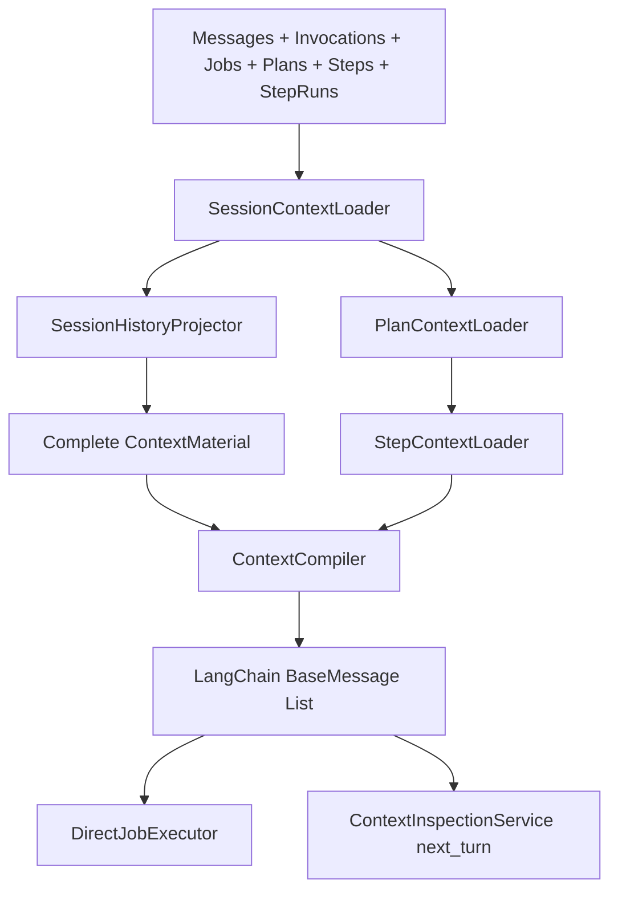

# 完整 Session + Plan Context 设计

## 1. 目标

当同一个 Session 同时包含普通对话、Direct Job、Planned Job、StepRun、工具调用、HITL、文件产物和后续追问时，正式模型调用与 Context Preview 必须从同一套已提交数据库事实构建出确定性的 LangChain Message List。

本次优化解决当前缺陷：`plan_created` 虽然进入了 Session Context，但 `ContextFormatter` 只发送 `message.content`，模型只能看到 Plan 标题；`agent_plans`、`agent_plan_steps` 和 `plan_created.metadata.steps` 中的完整 Plan 没有进入下一轮普通对话上下文。

目标结果：

1. 普通 HumanMessage、AIMessage 按真实会话顺序保留。
2. Planned Job 保留完整 Plan、全部 PlanStep、Step 工具链、StepOutput 和 PlanFinal。
3. ToolCall 与 ToolMessage 继续遵守 LangChain 原生协议并保持原子配对。
4. Context Material 在 TokenBudget 之前完整，不在 Loader 阶段提前丢失 Plan 或 Step 数据。
5. Context Preview 与正式 Direct Job 使用同一套 Session 历史投影。
6. StepExecutor 继续使用完整 Plan 和完整历史 StepRun 闭环。
7. 不修改数据库 schema、落库事务、Plan/Step/ReAct 执行顺序或 SSE 事件结构。

## 2. 不采用的方案

### 2.1 将整个 Planned Job 合并成一条 AIMessage

优点是 Token 少、实现简单。缺点是 ToolCall/ToolMessage 协议被压平，模型无法继续可靠引用工具结果，也无法回答某个 Step 的执行细节。不采用。

### 2.2 将 Planned Job 历史提升成 SystemMessage

优点是结构醒目。缺点是历史执行事实会被误解释成当前系统指令，旧 Plan 可能覆盖当前用户目标。不采用。

### 2.3 推荐：按真实时序展开语义分组

数据库事实先组成 `PlanSnapshotGroup`、`ToolExchangeGroup`、`StepOutputGroup` 和 `PlanFinalGroup`，再由纯格式化层转换为标准 LangChain Messages。Plan 在 Session 历史中是 Agent 已经作出的执行决策，因此格式化为 AIMessage；只有正在执行的当前 Plan 才作为 StepExecutor 的 SystemMessage 控制信息。

## 3. 三种 Context 的边界

### 3.1 下一轮普通对话 / Direct Job

```text
Runtime SystemMessage
Runtime Environment SystemMessage（存在时）
完整 Session History
当前 Job HumanMessage（正式执行时存在且位于历史尾部）
```

`next_turn` 调试查询不包含尚未提交的输入框草稿。Direct Job 正式执行比 `next_turn` 多当前已落库的 HumanMessage，其余历史前缀必须深度一致。

### 3.2 StepRun 执行

```text
Step Runtime SystemMessage
Runtime Environment SystemMessage（存在时）
Current Execution Plan SystemMessage
完整 Session Baseline
当前 Planned Job 的原始 HumanMessage
此前及当前 StepRun 的完整 ReAct / Tool / StepOutput 历史
Current Step Instruction SystemMessage（最后一条）
```

当前 Plan 使用 SystemMessage，因为它是本次 StepExecutor 的执行控制信息。当前 Plan 的 `plan_created` 历史 AIMessage不得重复加入；此前已完成 Job 的 PlanSnapshot 仍属于 Session Baseline。

### 3.3 Plan Final

```text
Plan Finalizer SystemMessage
原始 HumanMessage
完整最终 Plan
按 PlanStep.position 排序的全部已验证 StepOutput
```

PlanFinalizer 不重新读取未验证草稿、原始网页正文或任意工具结果，只消费原始目标、最终 Plan 与已经提交的结构化 StepOutput。

## 4. Session History 的标准时序

一个同时包含普通问答、Planned Job 和后续追问的 Session，模型输入必须遵循：

```text
SystemMessage       Runtime 基础规则
SystemMessage       当前时间、时区、Sandbox、Workspace 等稳定环境

HumanMessage        普通问题
AIMessage           普通回答

HumanMessage        Planned Job 原始目标
AIMessage           完整 ExecutionPlan

AIMessage           Step 1 ToolCall
ToolMessage         Step 1 ToolResult
AIMessage           Step 1 StepOutput

AIMessage           Step 2 ToolCall
ToolMessage         Step 2 ToolResult
AIMessage           Step 2 StepOutput

...                 后续全部 Step

AIMessage           PlanFinal
HumanMessage        后续追问或当前 Direct Job 目标
```

排序规则：

1. Runtime fixed messages 始终位于最前。
2. Session 历史以 `agent_messages.row_id ASC` 为主时间线。
3. PlanSnapshot 锚定对应 `plan_created.row_id`，不追加到 Session 尾部。
4. ToolCall 与全部对应 ToolResult 是不可拆分的原子组。
5. StepOutput 必须位于该 StepRun 已提交工具交换之后。
6. PlanFinal 必须位于该 Plan 全部 StepOutput 之后。
7. 后续普通 HumanMessage 必须位于 PlanFinal 之后。
8. 不使用 `created_at_ms` 在不同实体之间重新排序；相同业务时刻以消息 `row_id` 决定可见顺序。

## 5. 语义分组

扩展 `MessageGroup`，让 Loader/Projector 表达业务语义，Compiler 不查询数据库：

```ts
type MessageGroup =
  | SingleMessageGroup
  | ToolExchangeGroup
  | PlanSnapshotGroup
  | StepOutputGroup
  | PlanFinalGroup;

interface PlanSnapshotGroup {
  id: `plan_snapshot:${string}`;
  type: 'plan_snapshot';
  anchorMessage: AgentMessage;
  plan: AgentPlan;
  steps: AgentPlanStep[];
}

interface StepOutputGroup {
  id: `step_output:${string}`;
  type: 'step_output';
  message: AgentMessage;
  plan: AgentPlan;
  step: AgentPlanStep;
  stepRun?: AgentStepRun;
}

interface PlanFinalGroup {
  id: `plan_final:${string}`;
  type: 'plan_final';
  message: AgentMessage;
  plan: AgentPlan;
}
```

`ToolExchangeGroup` 保留当前 LangChain tool protocol，同时增加只读的 Plan/Step/StepRun 关联信息，供格式化工具调用的 model-visible content 和 Debug DTO 使用。

## 6. 模型可见的结构化内容

DashScope 使用 OpenAI-compatible 桥接。为避免依赖 provider 对自定义 `name`、`additional_kwargs` 或任意 content block 的兼容性，语义对象使用稳定 JSON 字符串作为 AIMessage.content；ToolCall 仍放在原生 `AIMessage.tool_calls`，ToolResult 仍使用原生 ToolMessage。

### 6.1 PlanSnapshot AIMessage

```json
{
  "kind": "execution_plan",
  "schemaVersion": 1,
  "id": "plan_1",
  "title": "调查并撰写报告",
  "goal": "调查萧山机场 UFO 事件并写报告",
  "status": "completed",
  "steps": [
    {
      "id": "step_1",
      "position": 0,
      "title": "收集资料",
      "instruction": "搜索可靠信息来源",
      "status": "completed"
    }
  ]
}
```

Plan 状态和 Step 状态来自 `agent_plans`、`agent_plan_steps` 的当前持久化事实，不依赖创建时 metadata 的旧快照。

### 6.2 Step ToolCall AIMessage

```ts
new AIMessage({
  content: canonicalJson({
    kind: 'step_tool_call',
    planId,
    stepId,
    stepRunId,
    stepPosition,
    stepTitle,
    assistantContent: originalCallMessage.content,
  }),
  tool_calls: originalToolCalls,
});
```

非 Step 工具调用维持原始 content，不增加 Plan 包装。ToolMessage.content 保留数据库中的实际工具结果，避免改变工具返回语义；它通过紧邻的 AIMessage.tool_calls 与 Step 关联。

### 6.3 StepOutput AIMessage

```json
{
  "kind": "step_output",
  "schemaVersion": 1,
  "planId": "plan_1",
  "stepId": "step_1",
  "stepRunId": "run_1",
  "runNo": 1,
  "position": 0,
  "title": "收集资料",
  "status": "completed",
  "output": {
    "summary": "已完成资料收集",
    "artifacts": [],
    "evidence": [],
    "unresolved": []
  }
}
```

`output` 必须来自已提交 `message.metadata.structuredOutput` 并通过现有 `parseStepOutput()` 校验；不能重新从 content 猜测。

### 6.4 PlanFinal AIMessage

```json
{
  "kind": "plan_final",
  "schemaVersion": 1,
  "planId": "plan_1",
  "status": "completed",
  "answer": "最终回复原文"
}
```

PlanFinal 的 Markdown 回答作为 JSON 字符串的 `answer` 原样保留。Artifact 的权威来源仍是 StepOutput；不从 Markdown 文本再次解析。

## 7. Debug Preview Contract

Context Preview 必须展示模型实际收到的 `type/content/toolCalls/toolCallId`，并可额外返回不会发送给 provider 的调试关联：

```ts
interface ContextPreviewMessage {
  index: number;
  type: 'system' | 'human' | 'ai' | 'tool';
  semanticType?:
    | 'runtime_policy'
    | 'runtime_environment'
    | 'user_message'
    | 'assistant_message'
    | 'execution_plan'
    | 'tool_call'
    | 'tool_result'
    | 'step_output'
    | 'plan_final';
  content: unknown;
  toolCalls?: ContextPreviewToolCall[];
  toolCallId?: string;
  runtimeRefs?: {
    jobId?: string;
    planId?: string;
    stepId?: string;
    stepRunId?: string;
  };
}
```

实际 BaseMessage.content 是 provider-safe 字符串。Preview 使用 `CompiledContext.messageAnnotations[index]` 添加 semanticType/runtimeRefs，不从文本猜测关联。它可以在确认 content 属于本 Runtime 的 canonical envelope 后，额外把解析结果放入 `decodedContent`；不得把解析后的 DTO 冒充成模型实际 content。

## 8. Loader、Projector 与 Compiler 职责

### 8.1 SessionContextLoader

扩展只读 Store 依赖：

```text
listSessionJobs
listSessionMessages
listSessionToolInvocations
listSessionPlans
listSessionPlanSteps
listJobStepRuns（对 Session 内 Planned Job 并行读取）
```

返回完整 `SessionContextFacts`：

```ts
interface SessionContextFacts {
  jobs: AgentJob[];
  messages: AgentMessage[];
  invocations: AgentToolInvocation[];
  plans: AgentPlan[];
  steps: AgentPlanStep[];
  stepRuns: AgentStepRun[];
  groups: MessageGroup[];
  blocked: BlockedMessageGroup[];
}
```

Loader 只读取和建立索引，不做 Token 选择。

### 8.2 SessionHistoryProjector

新增纯投影器：

```ts
class SessionHistoryProjector {
  project(facts: SessionContextFacts): MessageGroup[];
}
```

职责：

1. 普通消息维持 SingleMessageGroup。
2. 将 `plan_created` SingleMessageGroup 替换为 PlanSnapshotGroup。
3. 为 StepOutputGroup 关联 Plan、PlanStep、StepRun 和 structured output。
4. 将 `plan_final` 替换为 PlanFinalGroup。
5. 为 ToolExchangeGroup 增加 Step 关联。
6. 以原始 anchor rowId 排序。
7. 如果 Message 声称存在 Plan/Step 关联但实体缺失，抛出确定性 Context 错误，不降级成只有标题的 Plan。

### 8.3 ContextFormatter

只把 MessageGroup 转换成 LangChain Messages，不读取 Store：

```text
PlanSnapshotGroup → AIMessage(canonical plan JSON)
ToolExchangeGroup → AIMessage(tool_calls) + ToolMessage[]
StepOutputGroup   → AIMessage(canonical step output JSON)
PlanFinalGroup    → AIMessage(canonical plan final JSON)
SingleGroup       → HumanMessage / AIMessage / SystemMessage
```

Formatter 返回模型消息及与其按 index 对齐的只读 annotation：

```ts
interface FormattedContextMessage {
  message: BaseMessage;
  annotation: {
    semanticType: ContextSemanticType;
    jobId?: string;
    planId?: string;
    stepId?: string;
    stepRunId?: string;
  };
}
```

annotation 不进入 `BaseMessage.toDict()`、provider payload 或 input checksum，只供 Preview 和调试 UI 使用。ToolCall 与多个 ToolMessage 展开时，每条 LangChain Message 都获得自己的 annotation。

### 8.4 ContextCompiler

继续保持纯函数，只负责：

- fixed/trailing message 顺序；
- Tool Schema Token 计数；
- MessageGroup 原子选择；
- summary 覆盖；
- TokenBudget；
- InputManifest 与 checksum。

Compiler 不增加任何 `if job.strategy === 'planned'` 分支。

Token 估算必须基于 Formatter 已经生成的最终 model-visible content，而不能继续只对原始 `AgentMessage.content` 做估算。否则 `plan_created.content` 只有短标题，但格式化后的完整 Plan 可能包含数千 Token，预算会严重低估。

```ts
const formatted = formatter.formatGroup(group);
const estimatedTokens = formatted.reduce(
  (total, item) => total + estimateBaseMessageTokens(item.message),
  0
);
```

`CompiledContext` 增加与 messages 等长的 `messageAnnotations`；ModelCall checksum 仍只计算实际发送的 `messages.map(toDict)`。

## 9. 正式执行与 Preview 共用关系



`next_turn` 与 Direct Job 的历史前缀必须由同一个 Loader + Projector 生成，禁止 Context Preview 单独复制 Plan 展开逻辑。

## 10. 完整性与过滤规则

### 10.1 必须包含

- 已提交的普通 HumanMessage、AIMessage；
- 完整 Plan 和全部 PlanStep；
- completed/failed 的完整 ToolCall/ToolResult；
- HITL 的 request_user_input ToolCall/ToolResult；
- 全部已提交 StepOutput；
- PlanFinal；
- 用户可见的失败结果；
- Artifact 引用；
- Retry 后唯一的逻辑用户目标和有效执行链。

### 10.2 必须过滤

- SSE `message.delta`；
- `job.upserted` 等 UI 状态事件；
- `progress` 临时消息；
- 历史 Planner/Step 的内部 System Prompt；
- 输入框草稿；
- 没有匹配 ToolResult 的残缺 ToolCall；
- Retry 产生的重复逻辑目标消息。

Retry 去重不能按 content 文本判断。必须使用 message id、Job retry lineage 和持久化 goalMessageId；两个内容相同但由用户分别发送的 HumanMessage 必须保留两条。

## 11. TokenBudget 与压缩

“完整”分成两个层次：

1. `ContextMaterial` 始终从数据库加载完整事实。
2. `CompiledContext` 在模型窗口足够时完整输出；窗口不足时按语义优先级选择或摘要。

保留优先级：

1. 当前 HumanMessage；
2. 当前完整 Plan；
3. 当前 Step 指令；
4. 当前 Plan 全部已验证 StepOutput；
5. 当前 PlanFinal；
6. 最近普通对话；
7. 原始 ToolCall/ToolResult；
8. 更早普通对话。

即使触发压缩，也不能把 Plan 降级成只有标题。最小可保留形态是完整 Plan 骨架、全部已验证 StepOutput、PlanFinal 和相关 ContextSummary。当前 Plan 的原始 StepRun history 在 StepExecutor 内仍按既定要求标记 mustKeep。

## 12. Context Rules 版本兼容

结构化 Plan 投影会改变模型实际输入和 InputChecksum，因此必须把新调用升级到 `job-step-run-context-v6`。

历史 `agent_model_calls` 的 v5 精确重建不能使用 v6 Formatter。`ContextInspectionService` 查询 `model_call` 时根据已记录 `contextRulesVersion` 选择：

- v6：使用新的完整语义投影；
- v5：使用保留的 legacy v5 formatter/projection；
- 未知版本：返回 `context_snapshot_unreconstructable`。

不得为了兼容历史调用修改已有 ModelCall、InputManifest 或 checksum。

## 13. 错误处理

新增稳定的只读构建错误：

- `plan_context_incomplete`：plan_created 找不到 Plan 或 PlanStep；
- `step_context_incomplete`：StepOutput 找不到对应 Step/StepRun 或 structured output；
- `incomplete_message_group`：ToolCall/ToolResult 不完整，沿用现有错误；
- `context_snapshot_unreconstructable`：历史 rules version 无法精确重建。

Context Preview 返回明确的 409/422 风格 RuntimeError，不静默输出不完整 Plan。正式执行遇到同类错误时 Job 失败并记录 error code，不能让模型基于残缺历史继续回答。

## 14. 数据库与运行链冻结边界

本次不修改：

- `agent_plans`、`agent_plan_steps`、`agent_step_runs`、`agent_messages` 表；
- createPlan、createStepRun、commitStepOutput、finalize 的事务顺序；
- RuntimeEventWriter/SSE 事件类型与发送顺序；
- ReActExecutor 的 ToolCall/ToolResult 落库协议；
- PlanFinalizer 的输入来源和完成事务。

所有新增行为都是已落库实体的只读 Context 投影。

## 15. 测试与验收

### 15.1 Unit

1. Session 同时包含普通问答、完整 Plan、三个 Step、失败工具、成功工具、HITL、StepOutput、PlanFinal 和后续追问。
2. PlanSnapshot AIMessage 包含全部 Step 的 id/position/title/instruction/status。
3. ToolCall/ToolResult 保持原生 LangChain 配对。
4. StepOutput envelope 使用 metadata.structuredOutput，不从 content 猜测。
5. PlanFinal 位于全部 StepOutput 之后，后续 HumanMessage 位于 PlanFinal 之后。
6. 相同输入重复构建得到深度相等结果，输入对象不被修改。
7. 缺失 Plan/Step/structured output 时确定性失败。
8. Retry lineage 不重复 HumanMessage，也不误删两条内容相同的独立用户消息。

### 15.2 Context Preview

1. 当前萧山机场 Session 的 Preview 必须出现一个 execution_plan，包含 8 个 PlanStep。
2. Preview 的模型可见 content 与正式 BaseMessage.content 一致。
3. Preview 可以额外展示 semanticType/runtimeRefs，但这些字段不发送给 provider。
4. 活跃 Job 期间继续拒绝 Preview。

### 15.3 正式执行一致性

1. 对同一完成态 Session，`next_turn.messages` 是下一次 Direct Job context 去除当前 HumanMessage 后的精确前缀。
2. StepRun context 包含完整 Current Plan、全部前序 StepRun ReAct/tool 数据和 StepOutput，当前 Step instruction 位于最后。
3. PlanFinal context 仍只包含 original goal、final Plan、validated StepOutputs。

### 15.4 PostgreSQL 集成

1. 使用真实 `agent_plans/agent_plan_steps` 数据覆盖过时或不完整的 plan_created metadata。
2. 多个 Planned Job 在同一 Session 中各自锚定到正确 plan_created rowId。
3. 不产生任何新增或更新数据库行。
4. v5 ModelCall 仍能按 legacy 路径精确重建；v6 ModelCall checksum 匹配。

## 16. 预计文件边界

```text
src/runtime/context/
  message-group-builder.ts       扩展语义 Group 与 anchor/message helpers
  session-history-projector.ts   纯 Plan/Step 历史投影
  context-formatter.ts           Group → BaseMessage + annotation
  context-compiler.ts            最终消息 Token 估算、选择与 manifest
  context-material.ts            完整 facts/material/annotation 类型

src/runtime/loaders/
  session-context-loader.ts      加载完整 Session 数据集
  direct-job-context-loader.ts   复用完整 Session History
  plan-context-loader.ts         当前 Planned Job 完整上下文
  step-context-loader.ts         当前 Step 执行上下文
  model-call-context-loader.ts   v5/v6 精确重建

src/orchestration/
  context-inspection.service.ts  next_turn/job/step_run/model_call 查询编排

src/server/debug/
  context-preview-contract.ts    semanticType/runtimeRefs/decodedContent
  context-preview.service.ts     BuiltContext → Debug DTO

tests/
  context-loaders.test.ts
  context-inspection.service.test.ts
  context-preview.service.test.ts
  postgres-agent-store.test.ts
```

如果实现时不需要修改某个文件，不为对齐清单制造空改动；不得把 Projector 放回 orchestration 或 planner。

## 17. 完成定义

- 下一轮普通对话可以看到完整 Planned Job，而不是只有 Plan 标题。
- 用户追问某个 Step、工具来源、Artifact 或最终结论时，模型能从同一 Session Context 找到对应事实。
- Context Preview 和正式调用不再有 Plan 展开差异。
- ContextCompiler 仍是纯函数。
- 数据库、落库事务、Plan/Step/ReAct 执行链和 SSE 均未改变。
